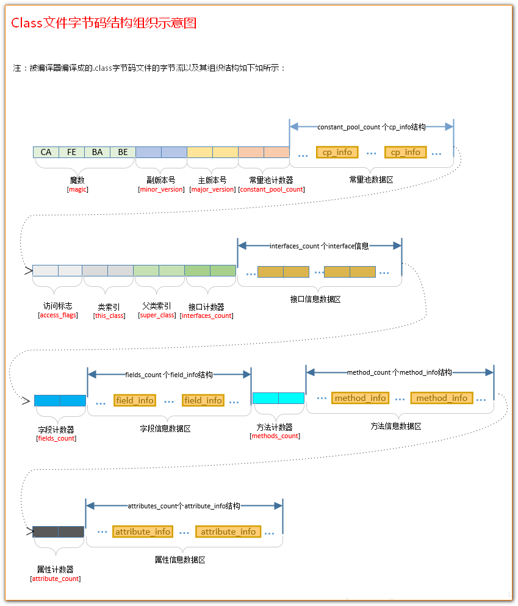

## 类文件结构
魔数：class 文件标志。

文件版本：高版本的 Java 虚拟机可以执行低版本编译器生成的 Class 文件，但是低版本的 Java 虚拟机不能执行高版本编译器生成的 Class 文件。

常量池：存放字面量和符号引用。字面量类似于Java的常量，如字符串，声明为final的常量值等。符号引用包含三类：类和接口的全限定名，方法的名称和描述符，字段的名称和描述符。

```java
ClassFile {
    u4             magic; //Class 文件的标志
    u2             minor_version;//Class 的小版本号
    u2             major_version;//Class 的大版本号
    u2             constant_pool_count;//常量池的数量
    cp_info        constant_pool[constant_pool_count-1];//常量池
    u2             access_flags;//Class 的访问标记
    u2             this_class;//当前类
    u2             super_class;//父类
    u2             interfaces_count;//接口
    u2             interfaces[interfaces_count];//一个类可以实现多个接口
    u2             fields_count;//Class 文件的字段属性
    field_info     fields[fields_count];//一个类会可以有个字段
    u2             methods_count;//Class 文件的方法数量
    method_info    methods[methods_count];//一个类可以有个多个方法
    u2             attributes_count;//此类的属性表中的属性数
    attribute_info attributes[attributes_count];//属性表集合
}
```





## 类加载的过程(new产生对象)

类的加载指的是将类的class文件中的二进制数据读入到内存中，将其放在运行时数据区的方法区内，然后在堆区创建一个java.lang.Class对象，用来封装类在方法区内的数据结构。类的加载的最终产品是位于堆区中的Class对象，Class对象封装了类在方法区内的数据结构，并且向Java程序员提供了访问方法区内的数据结构的接口。


### 加载

类加载过程的一个阶段：通过一个类的完全限定查找此类字节码文件，并利用字节码文件创建一个Class对象。

1. 通过全类名获取定义此类的二进制字节流
2. 将字节流所代表的静态存储结构转换为方法区的运行时数据结构
3. 在内存中生成一个代表该类的 Class 对象,作为方法区这些数据的访问入口
### 验证
确保Class文件的字节流中包含的信息符合虚拟机规范，保证这些信息被当作代码运行后不会危害虚拟机自身的安全。主要包括四种验证：文件格式验证，元数据验证，字节码验证，符号引用验证。


### 准备
为类变量分配内存并设置类变量初始值的阶段。此阶段进行内存分配的仅包括类变量，不包括实例变量和final修饰的static（因为final在编译的时候就会分配了），实例变量会在对象实例化时随着对象一块分配在 Java 堆中。
### 解析
虚拟机将常量池内的符号引用替换为直接引用的过程。符号引用用于描述目标，直接引用直接指向目标的地址。
### 初始化
初始化阶段，Java虚拟机才真正开始执行类中编写的Java程序代码。


## main方法执行过程

```java
public class App {
    public static void main(String[] args) {
        Student s = new Student("tyson");
        s.getName();
    }
}

class Student {
    public String name;

    public Student(String name) {
        this.name = name;
    }

    public String getName() {
        return this.name;
    }
}
```

执行main方法的步骤如下:

1. 编译好 App.java 后得到 App.class 后，执行 App.class，系统会启动一个 JVM 进程，从 classpath 路径中找到一个名为 App.class 的二进制文件，将 App 的类信息加载到运行时数据区的方法区内，这个过程叫做 App 类的加载
2. JVM 找到 App 的主程序入口，执行main方法
3. 这个main中的第一条语句为 Student student = new Student("tysoo") ，就是让 JVM 创建一个Student对象，但是这个时候方法区中是没有 Student 类的信息的，所以 JVM 马上加载 Student 类，把 Student 类的信息放到方法区中
4. 加载完 Student 类后，JVM 在堆中为一个新的 Student 实例分配内存，然后调用构造函数初始化 Student 实例，这个 Student 实例持有 **指向方法区中的 Student 类的类型信息** 的引用
5. 执行student.getName();时，JVM 根据 student 的引用找到 student 对象，然后根据 student 对象持有的引用定位到方法区中 student 类的类型信息的方法表，获得 getName() 的字节码地址。
6. 执行sayName()


## 内存泄露解决
1、释放无用对象的引用
2、调整优化jvm配置

- 设置-xms和-xmx等
- 设置newSize和maxNewSize相等
- 设置heapSize和permGen space

## 可达性分析
通过GC Root对象为起点，从这些节点向下搜索，搜索所走过的路径叫引用链，当一个对象到GC Root没有任何的引用链相连时，说明这个对象是不可用的。

## 线上频繁fullgc/oom
大对象过多；参数设置不好，minor gc清理不掉内存，每次minor gc都会引发full gc；年轻代空间不足，需要回收老年代释放内存

## 双亲委派模型
一个类加载器收到一个类的加载请求时，它首先不会自己尝试去加载它，而是把这个请求委派给父类加载器去完成，这样层层委派，因此所有的加载请求最终都会传送到顶层的启动类加载器中，只有当父类加载器反馈自己无法完成这个加载请求时，子加载器才会尝试自己去加载。


双亲委派模型的好处：即防止内存中出现多份同样的字节码。
如果没有双亲委派模型而是由各个类加载器自行加载的话，如果用户编写了一个java.lang.Object的同名类并放在ClassPath中，多个类加载器都去加载这个类到内存中，系统中将会出现多个不同的Object类，那么类之间的比较结果及类的唯一性将无法保证。

## gc分类
minor gc: 从新生代空间（Eden和survivor区域）回收内存
major gc: 清理老年代
full gc: 清理整个堆空间

当Eden空间满了之后，会触发Minor GC的操作，存活下来的对象移动到Survivor0区。Survivor0区满后触发 Minor GC，就会将存活对象移动到Survivor1区，此时还会把from和to两个指针交换，这样保证了一段时间内总有一个survivor区为空且to所指向的survivor区为空。经过多次的 Minor GC后仍然存活的对象（这里的存活判断是15次，对应到虚拟机参数为 -XX:MaxTenuringThreshold 。为什么是15，因为HotSpot会在对象投中的标记字段里记录年龄，分配到的空间仅有4位，所以最多只能记录到15）会移动到老年代。老年代是存储长期存活的对象的，占满时就会触发我们最常听说的Full GC，期间会停止所有线程等待GC的完成。

当老年区执行了full gc之后仍然无法进行对象保存的操作，就会产生OOM，这时候就是虚拟机中的堆内存不足，原因可能会是堆内存设置的大小过小，这个可以通过参数-Xms、-Xms来调整。也可能是代码中创建的对象大且多，而且它们一直在被引用，导致垃圾收集无法收集它们。


## Full GC触发条件
1.年老代（Tenured）被写满
2.持久代（Perm）被写满
3.System.gc()被显式调用

## 垃圾回收算法
1. 标记清除算法

   标记清除算法就是分为“标记”和“清除”两个阶段。标记出所有需要回收的对象，标记结束后统一回收。

2. 复制清除算法(专门用于处理年轻代垃圾的)

   

3. 标记整理算法(年老代)

   复制算法在对象存活率高的时候会有一定的效率问题，标记过程仍然与“标记-清除”算法一样，但后续步骤不是直接对可回收对象进行清理，而是让所有存活的对象都向一端移动，然后直接清理掉边界以外的内存。

4. 分类收集算法

   根据各个年代的特点采用最适当的收集算法。在新生代中，每次垃圾收集时都发现有大批对象死去，只有少量存活，那就选用复制算法，只需要付出少量存活对象的复制成本就可以完成收集。而老年代中因为对象存活率高、没有额外空间对它进行分配担保，就必须使用“标记-清理”或者“标记-整理”算法来进行回收。

## 可作为GC Roots的对象
虚拟机栈(栈帧中的本地变量表)中引用的对象
方法区中类静态属性引用的对象
方法区中常量引用的对象
本地方法栈中JNI（Native方法）引用的对象

## 什么情况触发类加载

## jvm相关工具，jvm调优

## jvm堆内存泄露时怎么定位到导致内存泄露的代码

## 收集器

## 什么对象会进入老年代？

## jvm内存模型

## 堆栈区别

## Java怎么进行垃圾回收