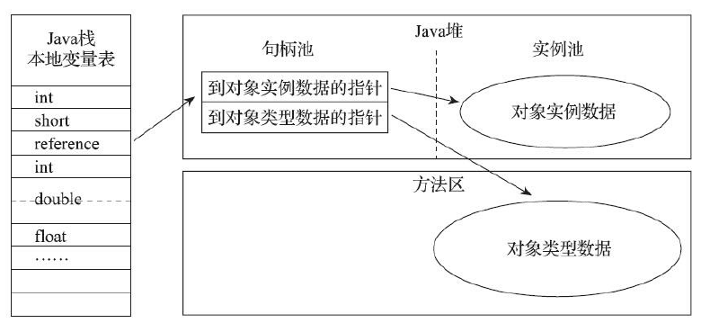
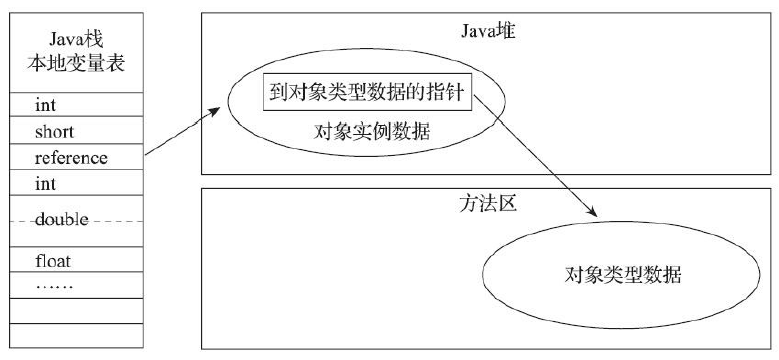

<!-- START doctoc generated TOC please keep comment here to allow auto update -->
<!-- DON'T EDIT THIS SECTION, INSTEAD RE-RUN doctoc TO UPDATE -->


- [内存模型](#%E5%86%85%E5%AD%98%E6%A8%A1%E5%9E%8B)
  - [程序计数器](#%E7%A8%8B%E5%BA%8F%E8%AE%A1%E6%95%B0%E5%99%A8)
  - [虚拟机栈](#%E8%99%9A%E6%8B%9F%E6%9C%BA%E6%A0%88)
  - [本地方法栈](#%E6%9C%AC%E5%9C%B0%E6%96%B9%E6%B3%95%E6%A0%88)
  - [堆](#%E5%A0%86)
  - [方法区](#%E6%96%B9%E6%B3%95%E5%8C%BA)
  - [运行时常量池](#%E8%BF%90%E8%A1%8C%E6%97%B6%E5%B8%B8%E9%87%8F%E6%B1%A0)
  - [直接内存](#%E7%9B%B4%E6%8E%A5%E5%86%85%E5%AD%98)
  - [对象的访问定位](#%E5%AF%B9%E8%B1%A1%E7%9A%84%E8%AE%BF%E9%97%AE%E5%AE%9A%E4%BD%8D)
- [类文件结构](#%E7%B1%BB%E6%96%87%E4%BB%B6%E7%BB%93%E6%9E%84)
- [类加载的过程](#%E7%B1%BB%E5%8A%A0%E8%BD%BD%E7%9A%84%E8%BF%87%E7%A8%8B)
  - [加载](#%E5%8A%A0%E8%BD%BD)
  - [验证](#%E9%AA%8C%E8%AF%81)
  - [准备](#%E5%87%86%E5%A4%87)
  - [解析](#%E8%A7%A3%E6%9E%90)
  - [初始化](#%E5%88%9D%E5%A7%8B%E5%8C%96)
- [main方法执行过程](#main%E6%96%B9%E6%B3%95%E6%89%A7%E8%A1%8C%E8%BF%87%E7%A8%8B)
- [对象创建过程](#%E5%AF%B9%E8%B1%A1%E5%88%9B%E5%BB%BA%E8%BF%87%E7%A8%8B)
- [双亲委派模型](#%E5%8F%8C%E4%BA%B2%E5%A7%94%E6%B4%BE%E6%A8%A1%E5%9E%8B)
- [gc分类](#gc%E5%88%86%E7%B1%BB)
  - [堆结构](#%E5%A0%86%E7%BB%93%E6%9E%84)
- [堆内存分配策略](#%E5%A0%86%E5%86%85%E5%AD%98%E5%88%86%E9%85%8D%E7%AD%96%E7%95%A5)
  - [对象优先在 eden 区分配](#%E5%AF%B9%E8%B1%A1%E4%BC%98%E5%85%88%E5%9C%A8-eden-%E5%8C%BA%E5%88%86%E9%85%8D)
  - [大对象直接进入老年代](#%E5%A4%A7%E5%AF%B9%E8%B1%A1%E7%9B%B4%E6%8E%A5%E8%BF%9B%E5%85%A5%E8%80%81%E5%B9%B4%E4%BB%A3)
  - [长期存活的对象将进入老年代](#%E9%95%BF%E6%9C%9F%E5%AD%98%E6%B4%BB%E7%9A%84%E5%AF%B9%E8%B1%A1%E5%B0%86%E8%BF%9B%E5%85%A5%E8%80%81%E5%B9%B4%E4%BB%A3)
- [对象死亡](#%E5%AF%B9%E8%B1%A1%E6%AD%BB%E4%BA%A1)
  - [引用计数法](#%E5%BC%95%E7%94%A8%E8%AE%A1%E6%95%B0%E6%B3%95)
  - [可达性分析](#%E5%8F%AF%E8%BE%BE%E6%80%A7%E5%88%86%E6%9E%90)
    - [可作为GC Roots的对象](#%E5%8F%AF%E4%BD%9C%E4%B8%BAgc-roots%E7%9A%84%E5%AF%B9%E8%B1%A1)
  - [引用](#%E5%BC%95%E7%94%A8)
    - [强引用](#%E5%BC%BA%E5%BC%95%E7%94%A8)
    - [软引用](#%E8%BD%AF%E5%BC%95%E7%94%A8)
    - [弱引用](#%E5%BC%B1%E5%BC%95%E7%94%A8)
    - [虚引用](#%E8%99%9A%E5%BC%95%E7%94%A8)
  - [无用的常量](#%E6%97%A0%E7%94%A8%E7%9A%84%E5%B8%B8%E9%87%8F)
  - [无用的类](#%E6%97%A0%E7%94%A8%E7%9A%84%E7%B1%BB)
- [垃圾回收算法](#%E5%9E%83%E5%9C%BE%E5%9B%9E%E6%94%B6%E7%AE%97%E6%B3%95)
  - [标记清除算法](#%E6%A0%87%E8%AE%B0%E6%B8%85%E9%99%A4%E7%AE%97%E6%B3%95)
  - [复制清除算法](#%E5%A4%8D%E5%88%B6%E6%B8%85%E9%99%A4%E7%AE%97%E6%B3%95)
  - [标记整理算法](#%E6%A0%87%E8%AE%B0%E6%95%B4%E7%90%86%E7%AE%97%E6%B3%95)
  - [分类收集算法](#%E5%88%86%E7%B1%BB%E6%94%B6%E9%9B%86%E7%AE%97%E6%B3%95)
- [垃圾回收器](#%E5%9E%83%E5%9C%BE%E5%9B%9E%E6%94%B6%E5%99%A8)
  - [Serial 收集器](#serial-%E6%94%B6%E9%9B%86%E5%99%A8)
  - [ParNew 收集器](#parnew-%E6%94%B6%E9%9B%86%E5%99%A8)
  - [Parallel Scavenge 收集器](#parallel-scavenge-%E6%94%B6%E9%9B%86%E5%99%A8)
  - [Serial Old 收集器](#serial-old-%E6%94%B6%E9%9B%86%E5%99%A8)
  - [Parallel Old 收集器](#parallel-old-%E6%94%B6%E9%9B%86%E5%99%A8)
  - [CMS 收集器](#cms-%E6%94%B6%E9%9B%86%E5%99%A8)
  - [G1收集器](#g1%E6%94%B6%E9%9B%86%E5%99%A8)
- [Full GC触发条件](#full-gc%E8%A7%A6%E5%8F%91%E6%9D%A1%E4%BB%B6)
- [线上频繁fullgc/oom](#%E7%BA%BF%E4%B8%8A%E9%A2%91%E7%B9%81fullgcoom)
- [内存泄露解决](#%E5%86%85%E5%AD%98%E6%B3%84%E9%9C%B2%E8%A7%A3%E5%86%B3)

<!-- END doctoc generated TOC please keep comment here to allow auto update -->

## 内存模型

Java 虚拟机在执行 Java 程序的过程中会把它管理的内存划分成若干个不同的数据区域。


### 程序计数器

程序计数器主要有两个作用：

1. 当前线程所执行的字节码的行号指示器，通过改变它实现代码的流程控制，如：顺序执行、选择、循环、异常处理。
2. 在多线程的情况下，程序计数器用于记录当前线程执行的位置，从而当线程被切换回来的时候能够知道该线程上次运行到哪儿了。

程序计数器是唯一一个不会出现 `OutOfMemoryError` 的内存区域，它的生命周期随着线程的创建而创建，随着线程的结束而死亡。

### 虚拟机栈

Java 虚拟机栈是由一个个栈帧组成，而每个栈帧中都拥有：局部变量表、操作数栈、动态链接、方法出口信息。每一次函数调用都会有一个对应的栈帧被压入 Java 栈，每一个函数调用结束后，都会有一个栈帧被弹出。

局部变量表是用于存放方法参数和方法内定义的局部变量。

每个栈帧都包含一个指向运行时常量池中该栈所属方法的符号引用，在方法调用过程中，会进行动态连接，将这个符号引用转化为直接引用。

- 部分符号引用在类加载阶段(解析)的时候就转化为直接引用，这种转化为静态链接
- 部分符号引用在运行期间转化为直接引用，这种转化为动态连接

Java 虚拟机栈也是线程私有的，每个线程都有各自的 Java 虚拟机栈，而且随着线程的创建而创建，随着线程的死亡而死亡。Java 虚拟机栈会出现两种错误：`StackOverFlowError` 和 `OutOfMemoryError`。

### 本地方法栈

虚拟机栈为虚拟机执行 Java 方法 （也就是字节码）服务，而本地方法栈则为虚拟机使用到的 Native 方法服务。

本地方法被执行的时候，在本地方法栈也会创建一个栈帧，用于存放该本地方法的局部变量表、操作数栈、动态链接、出口信息。

### 堆

此内存区域的唯一目的就是存放对象实例，几乎所有的对象实例以及数组都在这里分配内存。Java 堆是垃圾收集器管理的主要区域，因此也被称作GC 堆。

Java 堆可以细分为：新生代（Eden 空间、From Survivor、To Survivor 空间）和老年代。进一步划分的目的是更好地回收内存，或者更快地分配内存。

### 方法区

方法区与 Java 堆一样，是各个线程共享的内存区域，它用于存储已被虚拟机加载的类信息、常量、静态变量、即时编译器编译后的代码等数据。虽然 Java 虚拟机规范把方法区描述为堆的一个逻辑部分，但是它却有一个别名叫做 Non-Heap（非堆），目的应该是与 Java 堆区分开来。

方法区和永久代的关系很像 Java 中接口和类的关系，类实现了接口，而永久代就是 HotSpot 虚拟机对虚拟机规范中方法区的一种实现方式。

JDK 1.8 的时候，方法区（HotSpot 的永久代）被彻底移除了（JDK1.7 就已经开始了），取而代之是元空间，元空间使用的是直接内存。

为什么要将永久代 (PermGen) 替换为元空间 (MetaSpace) 呢?

整个永久代有一个 JVM 本身设置固定大小上限，无法进行调整，而元空间使用的是直接内存，受本机可用内存的限制，虽然元空间仍旧可能溢出，但是比原来出现的几率会更小。

### 运行时常量池

运行时常量池是方法区的一部分，用于存放各种字面量、符号引用和符号引用翻译出来的直接引用。

### 直接内存

直接内存并不是虚拟机运行时数据区的一部分，也不是虚拟机规范中定义的内存区域，但是这部分内存也被频繁地使用。而且也可能导致 OutOfMemoryError 错误出现。

本机直接内存的分配不会受到 Java 堆的限制，但是会受到本机总内存大小以及处理器寻址空间的限制。

NIO的Buffer提供了DirectBuffer，可以直接访问系统物理内存，避免堆内内存到堆外内存的数据拷贝操作，提高效率。DirectBuffer直接分配在物理内存中，并不占用堆空间，其可申请的最大内存受操作系统限制，不受最大堆内存的限制。

直接内存的读写操作比堆内存快，可以提升程序I/O操作的性能。通常在I/O通信过程中，会存在堆内内存到堆外内存的数据拷贝操作，对于需要频繁进行内存间数据拷贝且生命周期较短的暂存数据，都建议存储到直接内存。

### 对象的访问定位

Java 程序通过栈上的 reference 数据来操作堆上的具体对象。对象的访问方式由虚拟机实现而定，目前主流的访问方式有使用句柄和直接指针两种：

1. 如果使用句柄的话，那么 Java 堆中将会划分出一块内存来作为句柄池，reference 中存储的就是对象的句柄地址，而句柄中包含了对象实例数据与类型数据各自的具体地址信息。使用句柄来访问的最大好处是 reference 中存储的是稳定的句柄地址，在对象被移动时只会改变句柄中的实例数据指针，而 reference 本身不需要修改。

   

2. 直接指针。reference 中存储的直接就是对象的地址。对象包含到对象类型数据的指针，通过这个指针可以访问对象类型数据。使用直接指针访问方式最大的好处就是访问对象速度快，它节省了一次指针定位的时间开销，虚拟机hotspot主要是使用直接指针来访问对象。

   


## 类文件结构

Class 文件结构：

```java
ClassFile {
    u4             magic; //Class 文件的标志
    u2             minor_version;//Class 的小版本号
    u2             major_version;//Class 的大版本号
    u2             constant_pool_count;//常量池的数量
    cp_info        constant_pool[constant_pool_count-1];//常量池
    u2             access_flags;//Class 的访问标记
    u2             this_class;//当前类
    u2             super_class;//父类
    u2             interfaces_count;//接口
    u2             interfaces[interfaces_count];//一个类可以实现多个接口
    u2             fields_count;//Class 文件的字段属性
    field_info     fields[fields_count];//一个类会可以有个字段
    u2             methods_count;//Class 文件的方法数量
    method_info    methods[methods_count];//一个类可以有个多个方法
    u2             attributes_count;//此类的属性表中的属性数
    attribute_info attributes[attributes_count];//属性表集合
}
```

魔数：class 文件标志。

文件版本：高版本的 Java 虚拟机可以执行低版本编译器生成的 Class 文件，但是低版本的 Java 虚拟机不能执行高版本编译器生成的 Class 文件。

常量池：存放字面量和符号引用。字面量类似于Java的常量，如字符串，声明为final的常量值等。符号引用包含三类：类和接口的全限定名，方法的名称和描述符，字段的名称和描述符。

访问标志：识别一些类或者接口层次的访问信息，包括：这个 Class 是类还是接口，是否为 public 或者 abstract 类型，如果是类的话是否声明为 final 等等。

当前类索引this_class：类索引用于确定这个类的全限定名。

属性表集合：在 Class 文件，字段表，方法表中都可以携带自己的属性表集合，以用于描述某些场景专有的信息。与 Class 文件中其它的数据项目要求的顺序、长度和内容不同，属性表集合的限制稍微宽松一些，不再要求各个属性表具有严格的顺序，并且只要不与已有的属性名重复，任何人实现的编译器都可以向属性表中写 入自己定义的属性信息，Java 虚拟机运行时会忽略掉它不认识的属性。


## 类加载的过程

类的加载指的是将类的class文件中的二进制数据读入到内存中，将其放在运行时数据区的方法区内，然后在堆区创建一个对象，这个对象封装了类在方法区内的数据结构，并且提供了访问方法区内的类信息的接口。


### 加载

类加载过程的一个阶段：通过一个类的完全限定查找此类字节码文件，并利用字节码文件创建一个Class对象。

1. 通过全类名获取定义此类的二进制字节流
2. 将字节流所代表的静态存储结构转换为方法区的运行时数据结构
3. 在内存中生成一个代表该类的 Class 对象，作为方法区这些数据的访问入口
### 验证
确保Class文件的字节流中包含的信息符合虚拟机规范，保证这些信息被当作代码运行后不会危害虚拟机自身的安全。主要包括四种验证：文件格式验证，元数据验证，字节码验证，符号引用验证。


### 准备
为类变量分配内存并设置类变量初始值的阶段。此阶段进行内存分配的仅包括类变量，不包括实例变量和final修饰的static变量（因为final在编译的时候就会分配了），实例变量会在对象实例化时随着对象一块分配在 Java 堆中。
### 解析
虚拟机将常量池内的符号引用替换为直接引用的过程。符号引用用于描述目标，直接引用直接指向目标的地址。
### 初始化
初始化阶段，Java虚拟机才真正开始执行类中编写的Java程序代码。


## main方法执行过程

```java
public class App {
    public static void main(String[] args) {
        Student s = new Student("tyson");
        s.getName();
    }
}

class Student {
    public String name;

    public Student(String name) {
        this.name = name;
    }

    public String getName() {
        return this.name;
    }
}
```

执行main方法的步骤如下:

1. 编译好 App.java 后得到 App.class 后，执行 App.class，系统会启动一个 JVM 进程，从 classpath 路径中找到一个名为 App.class 的二进制文件，将 App 的类信息加载到运行时数据区的方法区内，这个过程叫做 App 类的加载
2. JVM 找到 App 的主程序入口，执行main方法
3. 这个main中的第一条语句为 `Student student = new Student("tysoo") `，就是让 JVM 创建一个Student对象，但是这个时候方法区中是没有 Student 类的信息的，所以 JVM 马上加载 Student 类，把 Student 类的信息放到方法区中
4. 加载完 Student 类后，JVM 在堆中为一个新的 Student 实例分配内存，然后调用构造函数初始化 Student 实例，这个 Student 实例持有 **指向方法区中的 Student 类的类型信息** 的引用
5. 执行student.getName();时，JVM 根据 student 的引用找到 student 对象，然后根据 student 对象持有的引用定位到方法区中 student 类的类型信息的方法表，获得 getName() 的字节码地址。
6. 执行getName()


## 对象创建过程

1. 类加载检查

   虚拟机遇到一条 new 指令时，首先将去检查这个指令的参数是否能在常量池中定位到这个类的符号引用，并且检查这个符号引用代表的类是否已被加载过、解析和初始化过。如果没有，那必须先执行相应的类加载过程。

2. 分配内存

   在类加载检查通过后，接下来虚拟机将为新生对象分配内存。对象所需的内存大小在类加载完成后便可确定，为对象分配空间的任务等同于把一块确定大小的内存从 Java 堆中划分出来。

3. 初始化零值

   分配到的内存空间都初始化为零值（不包括对象头），这一步操作保证了对象的实例字段在 Java 代码中可以不赋初始值就直接使用，程序能访问到这些字段的数据类型所对应的零值。

4. 设置对象头

   Hotspot 虚拟机的对象头包括两部分信息，第一部分用于存储对象自身的运行时数据（哈希码、GC 分代年龄、锁状态标志等等），另一部分是类型指针，即对象指向它的类元数据的指针，虚拟机通过这个指针来确定这个对象是那个类的实例。

5. 执行init方法

   按照Java代码进行初始化。


## 双亲委派模型
一个类加载器收到一个类的加载请求时，它首先不会自己尝试去加载它，而是把这个请求委派给父类加载器去完成，这样层层委派，因此所有的加载请求最终都会传送到顶层的启动类加载器中，只有当父类加载器反馈自己无法完成这个加载请求时，子加载器才会尝试自己去加载。


双亲委派模型的好处：即防止内存中出现多份同样的字节码。
如果没有双亲委派模型而是由各个类加载器自行加载的话，如果用户编写了一个java.lang.Object的同名类并放在ClassPath中，多个类加载器都去加载这个类到内存中，系统中将会出现多个不同的Object类，那么类之间的比较结果及类的唯一性将无法保证。


## gc分类

minor gc: 从新生代空间（Eden和survivor区域）回收内存
major gc: 清理老年代
full gc: 清理整个堆空间

- **新生代 GC（Minor GC）**:指发生新生代的的垃圾收集动作，Minor GC 非常频繁，回收速度一般也比较快。
- **老年代 GC（Major GC/Full GC）**:指发生在老年代的 GC，出现了 Major GC 经常会伴随至少一次的 Minor GC（并非绝对），Major GC 的速度一般会比 Minor GC 的慢 10 倍以上。

### 堆结构


当Eden空间满了之后，会触发Minor GC的操作，存活下来的对象移动到Survivor0区。Survivor0区满后触发 Minor GC，就会将存活对象移动到Survivor1区，此时还会把from和to两个指针交换，这样保证了一段时间内总有一个survivor区为空且to所指向的survivor区为空。


每经过一次 minor gc， 对象的年龄会加1，Hotspot遍历所有对象时，按照年龄从小到大进行累积，当累积的某个年龄大小超过了survivor区的一半时，取这个年龄和MaxTenuringThreshold中更小的一个值，作为新的晋升年龄阈值，年龄超过这个值的对象，会移动到老年代。老年代是存储长期存活的对象的，占满时就会触发我们最常听说的Full GC，期间会停止所有线程等待GC的完成。

当老年区执行了full gc之后仍然无法进行对象保存的操作，就会产生OOM，这时候就是虚拟机中的堆内存不足，原因可能会是堆内存设置的大小过小，这个可以通过参数-Xms、-Xmx来调整。也可能是代码中创建的对象大且多，而且它们一直在被引用，导致垃圾收集无法收集它们。


## 堆内存分配策略

在 run configuration 的 vm options 添加`-XX:+PrintGCDetails`可以查看 gc 信息。

### 对象优先在 eden 区分配

大多数情况下，对象在新生代中 eden 区分配。当 eden 区没有足够空间进行分配时，虚拟机将发起一次 Minor GC。

### 大对象直接进入老年代

大对象就是需要大量连续内存空间的对象（比如：字符串、数组）。为了避免为大对象分配内存时由于分配担保机制带来的复制而降低效率。

### 长期存活的对象将进入老年代

通过参数 `-XX:MaxTenuringThreshold` 可以设置对象进入老年代的年龄阈值。对象在 Survivor 中每经过一次 MinorGC，年龄就增加 1 岁，当它的年龄增加到一定程度，就会被晋升到老年代中。


## 对象死亡

堆中几乎放着所有的对象实例，对堆垃圾回收前的第一步就是要判断那些对象已经死亡（即不能再被任何途径使用的对象）。


### 引用计数法

给对象中添加一个引用计数器，每当有一个地方引用它，计数器就加 1；当引用失效，计数器就减 1；任何时候计数器为 0 的对象就是不可能再被使用的。

这种方法很难解决对象之间相互循环引用的问题。

```java
public class ReferenceCountingGc {
    Object instance = null;
	public static void main(String[] args) {
		ReferenceCountingGc objA = new ReferenceCountingGc();
		ReferenceCountingGc objB = new ReferenceCountingGc();
		objA.instance = objB;
		objB.instance = objA;
		objA = null;
		objB = null;
	}
}
```

### 可达性分析

通过GC Root对象为起点，从这些节点向下搜索，搜索所走过的路径叫引用链，当一个对象到GC Root没有任何的引用链相连时，说明这个对象是不可用的。


#### 可作为GC Roots的对象

虚拟机栈(栈帧中的本地变量表)中引用的对象
方法区中类静态属性引用的对象
方法区中常量引用的对象
本地方法栈中JNI（Native方法）引用的对象

### 引用

引用分为强引用、软引用、弱引用、虚引用四种。

在程序设计中一般很少使用弱引用与虚引用，使用软引用的情况较多，这是因为软引用可以加速 JVM 对垃圾内存的回收速度，可以维护系统的运行安全，防止内存溢出（OutOfMemory）等问题的产生。

#### 强引用

垃圾回收器绝不会回收它。当内存空间不足，Java 虚拟机宁愿抛出 OutOfMemoryError 错误，使程序异常终止，也不会靠随意回收具有强引用的对象来解决内存不足问题。

#### 软引用

如果内存空间足够，垃圾回收器就不会回收它，如果内存空间不足了，就会回收这些对象的内存。只要垃圾回收器没有回收它，该对象就可以被程序使用。软引用可用来实现内存敏感的高速缓存。

#### 弱引用

在垃圾回收器线程扫描它所管辖的内存区域的过程中，一旦发现了只具有弱引用的对象，不管当前内存空间足够与否，都会回收它的内存。不过，由于垃圾回收器是一个优先级很低的线程， 因此不一定会很快发现那些只具有弱引用的对象。

#### 虚引用

虚引用并不会决定对象的生命周期。如果一个对象仅持有虚引用，那么它就和没有任何引用一样，在任何时候都可能被垃圾回收。**虚引用主要用来跟踪对象被垃圾回收的活动**。

### 无用的常量

运行时常量池主要回收的是废弃的常量。假如在常量池中存在字符串 "abc"，如果当前没有任何 String 对象引用该字符串常量的话，就说明常量 "abc" 就是废弃常量，如果这时发生内存回收的话而且有必要的话，"abc" 就会被系统清理出常量池。

### 无用的类

需要同时满足下面 3 个条件才能算是 “无用的类” ：

- 该类所有的实例都已经被回收，也就是 Java 堆中不存在该类的任何实例。
- 加载该类的 ClassLoader 已经被回收。
- 该类对应的 java.lang.Class 对象没有在任何地方被引用，无法在任何地方通过反射访问该类的方法。

虚拟机可以对满足上述 3 个条件的无用类进行回收，但不一定被回收。


## 垃圾回收算法
### 标记清除算法

标记清除算法就是分为“标记”和“清除”两个阶段。标记出所有需要回收的对象，标记结束后统一回收所有被标记的对象。这种垃圾回收算法效率较低，并且会产生大量不连续的空间碎片。

### 复制清除算法

半区复制，用于新生代垃圾回收。将内存分为大小相同的两块，每次使用其中的一块。当这一块的内存使用完后，就将还存活的对象复制到另一块去，然后再把使用的空间一次清理掉。

特点：实现简单，运行高效，但可用内存缩小为了原来的一半，浪费空间。

### 标记整理算法

根据老年代的特点提出的一种标记算法，标记过程仍然与“标记-清除”算法一样，但后续步骤不是直接对可回收对象进行清理，而是让所有存活的对象都向一端移动，然后直接清理掉边界以外的内存。

### 分类收集算法

根据各个年代的特点采用最适当的收集算法。在新生代中，每次垃圾收集时都发现有大批对象死去，只有少量存活，那就选用复制算法，只需要付出少量存活对象的复制成本就可以完成收集。而老年代中因为对象存活率高、没有额外空间对它进行分配担保，就必须使用“标记-清理”或者“标记-整理”算法来进行回收。


## 垃圾回收器

### Serial 收集器

单线程收集器，使用一条垃圾收集线程去完成垃圾收集工作，在进行垃圾收集工作的时候必须暂停其他所有的工作线程（ "Stop The World" ），直到它收集结束。


特点：简单高效，没有线程交互的开销，收集效率高。需暂停所有的工作线程，用户体验不好。

### ParNew 收集器

Serial 收集器的多线程版本，除了使用多线程进行垃圾收集外，其余行为（控制参数、收集算法、回收策略等等）和 Serial 收集器完全一样。


除了 Serial 收集器外，只有它能与 CMS 收集器配合工作。

### Parallel Scavenge 收集器

新生代收集器，基于复制清除算法实现的收集器。吞吐量优先收集器，也是能够并行收集的多线程收集器。Parallel Scavenge 收集器关注点是吞吐量（高效率的利用 CPU）。CMS 等垃圾收集器关注点更多的是用户线程的停顿时间（提高用户体验）。所谓吞吐量就是 CPU 中用于运行用户代码的时间与 CPU 总消耗时间的比值。 Parallel Scavenge 收集器提供了很多参数供用户找到最大吞吐量。

### Serial Old 收集器

Serial 收集器的老年代版本，它同样是一个单线程收集器。它主要有两大用途：一种用途是在 JDK1.5 以及以前的版本中与 Parallel Scavenge 收集器搭配使用，另一种用途是作为 CMS 收集器的后备方案。

### Parallel Old 收集器

Parallel Scavenge 收集器的老年代版本。使用多线程和“标记-整理”算法。在注重吞吐量以及 CPU 资源的场合，都可以优先考虑 Parallel Scavenge 收集器和 Parallel Old 收集器。

### CMS 收集器

Concurrent Mark Sweep，目的是获取最短回收停顿时间，注重用户体验。第一款真正意义上的并发收集器，它第一次实现了让垃圾收集线程与用户线程（基本上）同时工作。

基于标记清除算法实现，垃圾收集整个过程分为四个步骤：

- **初始标记：** stw暂停所有的其他线程，记录直接与 gc root 直接相连的对象，速度很快 ；
- **并发标记：** 从gc roots的直接关联对象开始遍历整个对象图的过程，这个过程耗时较长但是不需要停顿用户线程；
- **重新标记：** 重新标记阶段就是为了修正并发标记期间因为用户程序继续运行而导致标记产生变动的那一部分对象的标记记录，这个阶段的停顿时间一般会比初始标记阶段的时间稍长，远远比并发标记阶段时间短；此阶段也会stw。
- **并发清除：** 开启用户线程，同时 GC 线程开始对未标记的区域做清扫。


由于在整个过程中耗时最长的并发标记和并发清除阶段中，垃圾收集器线程都可以与用户线程一起工作，所以从总体上来说，CMS收集器的内存回收过程是与用户线程一起并发执行的。

主要优点：并发收集，低停顿。缺点：标记清除算法导致收集结束有大量空间碎片。

### G1收集器

目标：在延迟可控的情况下获得尽可能高的吞吐量，在不同应用场景中追求吞吐量和延迟之间的最佳平衡。

G1不再坚持固定大小以及固定数量的分代区域划分，而是把连续的Java堆划分为多个大小相等的独立区域（Region），每一个Region都可以根据需要，扮演新生代的Eden空间、Survivor空间，或者老年代空间。Region中还有一类特殊的Humongous区域，专门用来存储大对象。G1认为只要大小超过了一个Region容量一半的对象即可判定为大对象。新生代和老年代不再是固定的了，它们都是一系列区域（不需要连续）的动态集合。

G1 收集器在后台维护了一个优先级列表（回收所获得的空间大小和回收所需时间的比值），每次根据允许的收集时间，优先选择回收价值最大的 Region。

G1 收集器的运作大致分为以下几个步骤：

- 初始标记
- 并发标记
- 最终标记
- 筛选回收


## Full GC触发条件

1.年老代（Tenured）被写满
2.持久代（Perm）被写满
3.System.gc()被显式调用


## 线上频繁fullgc/oom

大对象过多；参数设置不好，minor gc清理不掉内存，每次minor gc都会引发full gc；年轻代空间不足，需要回收老年代释放内存


## 内存泄露解决

1、释放无用对象的引用
2、调整优化jvm配置

- 设置-xms和-xmx等
- 设置newSize和maxNewSize相等
- 设置heapSize和permGen space


