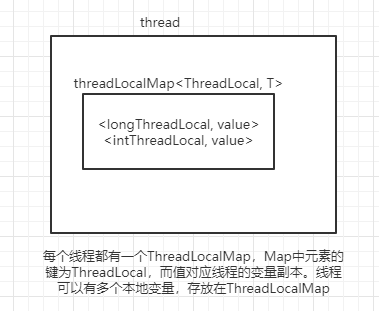
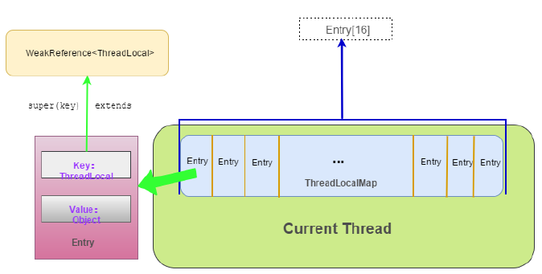

<!-- START doctoc generated TOC please keep comment here to allow auto update -->
<!-- DON'T EDIT THIS SECTION, INSTEAD RE-RUN doctoc TO UPDATE -->


- [Java概述](#java%E6%A6%82%E8%BF%B0)
  - [Java的特点](#java%E7%9A%84%E7%89%B9%E7%82%B9)
  - [JKD和JRE](#jkd%E5%92%8Cjre)
    - [JDK](#jdk)
    - [JRE](#jre)
- [Java基础语法](#java%E5%9F%BA%E7%A1%80%E8%AF%AD%E6%B3%95)
  - [基本数据类型](#%E5%9F%BA%E6%9C%AC%E6%95%B0%E6%8D%AE%E7%B1%BB%E5%9E%8B)
  - [包装类型](#%E5%8C%85%E8%A3%85%E7%B1%BB%E5%9E%8B)
    - [包装类缓存](#%E5%8C%85%E8%A3%85%E7%B1%BB%E7%BC%93%E5%AD%98)
  - [String](#string)
    - [String拼接](#string%E6%8B%BC%E6%8E%A5)
  - [关键字](#%E5%85%B3%E9%94%AE%E5%AD%97)
    - [static](#static)
      - [静态变量](#%E9%9D%99%E6%80%81%E5%8F%98%E9%87%8F)
      - [静态方法](#%E9%9D%99%E6%80%81%E6%96%B9%E6%B3%95)
      - [静态代码块](#%E9%9D%99%E6%80%81%E4%BB%A3%E7%A0%81%E5%9D%97)
      - [静态内部类](#%E9%9D%99%E6%80%81%E5%86%85%E9%83%A8%E7%B1%BB)
    - [final](#final)
    - [this](#this)
    - [super](#super)
  - [object常用方法](#object%E5%B8%B8%E7%94%A8%E6%96%B9%E6%B3%95)
    - [toString](#tostring)
    - [equals](#equals)
    - [hashCode](#hashcode)
    - [clone](#clone)
      - [浅拷贝](#%E6%B5%85%E6%8B%B7%E8%B4%9D)
      - [深拷贝](#%E6%B7%B1%E6%8B%B7%E8%B4%9D)
    - [getClass](#getclass)
    - [wait](#wait)
    - [notity](#notity)
    - [equals()和hashcode()的关系](#equals%E5%92%8Chashcode%E7%9A%84%E5%85%B3%E7%B3%BB)
    - [==和equals区别](#%E5%92%8Cequals%E5%8C%BA%E5%88%AB)
- [面向对象](#%E9%9D%A2%E5%90%91%E5%AF%B9%E8%B1%A1)
  - [面向对象特性](#%E9%9D%A2%E5%90%91%E5%AF%B9%E8%B1%A1%E7%89%B9%E6%80%A7)
    - [多态怎么实现](#%E5%A4%9A%E6%80%81%E6%80%8E%E4%B9%88%E5%AE%9E%E7%8E%B0)
  - [类与对象](#%E7%B1%BB%E4%B8%8E%E5%AF%B9%E8%B1%A1)
  - [属性](#%E5%B1%9E%E6%80%A7)
  - [方法](#%E6%96%B9%E6%B3%95)
    - [普通方法](#%E6%99%AE%E9%80%9A%E6%96%B9%E6%B3%95)
    - [构造方法](#%E6%9E%84%E9%80%A0%E6%96%B9%E6%B3%95)
  - [方法重载](#%E6%96%B9%E6%B3%95%E9%87%8D%E8%BD%BD)
  - [方法重写](#%E6%96%B9%E6%B3%95%E9%87%8D%E5%86%99)
  - [初始化顺序](#%E5%88%9D%E5%A7%8B%E5%8C%96%E9%A1%BA%E5%BA%8F)
- [接口和抽象类](#%E6%8E%A5%E5%8F%A3%E5%92%8C%E6%8A%BD%E8%B1%A1%E7%B1%BB)
  - [抽象类](#%E6%8A%BD%E8%B1%A1%E7%B1%BB)
  - [接口](#%E6%8E%A5%E5%8F%A3)
  - [接口与抽象类区别](#%E6%8E%A5%E5%8F%A3%E4%B8%8E%E6%8A%BD%E8%B1%A1%E7%B1%BB%E5%8C%BA%E5%88%AB)
- [反射](#%E5%8F%8D%E5%B0%84)
  - [Class类](#class%E7%B1%BB)
  - [Field类](#field%E7%B1%BB)
  - [Method类](#method%E7%B1%BB)
- [泛型](#%E6%B3%9B%E5%9E%8B)
  - [泛型类](#%E6%B3%9B%E5%9E%8B%E7%B1%BB)
  - [泛型接口](#%E6%B3%9B%E5%9E%8B%E6%8E%A5%E5%8F%A3)
  - [泛型方法](#%E6%B3%9B%E5%9E%8B%E6%96%B9%E6%B3%95)
- [Exception](#exception)
  - [Throwable](#throwable)
  - [常见的Exception](#%E5%B8%B8%E8%A7%81%E7%9A%84exception)
  - [关键字](#%E5%85%B3%E9%94%AE%E5%AD%97-1)
- [IO流](#io%E6%B5%81)
  - [InputStream 和 OutputStream](#inputstream-%E5%92%8C-outputstream)
  - [Reader 和 Writer](#reader-%E5%92%8C-writer)
  - [字符流和字节流的转换](#%E5%AD%97%E7%AC%A6%E6%B5%81%E5%92%8C%E5%AD%97%E8%8A%82%E6%B5%81%E7%9A%84%E8%BD%AC%E6%8D%A2)
  - [同步异步](#%E5%90%8C%E6%AD%A5%E5%BC%82%E6%AD%A5)
  - [阻塞非阻塞](#%E9%98%BB%E5%A1%9E%E9%9D%9E%E9%98%BB%E5%A1%9E)
  - [BIO](#bio)
  - [NIO](#nio)
  - [AIO](#aio)
  - [BIO/NIO/AIO区别](#bionioaio%E5%8C%BA%E5%88%AB)
- [ThreadLocal](#threadlocal)
  - [原理](#%E5%8E%9F%E7%90%86)
  - [内存泄漏](#%E5%86%85%E5%AD%98%E6%B3%84%E6%BC%8F)
  - [使用场景](#%E4%BD%BF%E7%94%A8%E5%9C%BA%E6%99%AF)
- [线程安全类](#%E7%BA%BF%E7%A8%8B%E5%AE%89%E5%85%A8%E7%B1%BB)
- [常见操作](#%E5%B8%B8%E8%A7%81%E6%93%8D%E4%BD%9C)
  - [排序](#%E6%8E%92%E5%BA%8F)
  - [数组操作](#%E6%95%B0%E7%BB%84%E6%93%8D%E4%BD%9C)
  - [拷贝](#%E6%8B%B7%E8%B4%9D)
    - [数组拷贝](#%E6%95%B0%E7%BB%84%E6%8B%B7%E8%B4%9D)
    - [对象拷贝](#%E5%AF%B9%E8%B1%A1%E6%8B%B7%E8%B4%9D)
  - [序列化](#%E5%BA%8F%E5%88%97%E5%8C%96)
    - [什么情况下需要序列化？](#%E4%BB%80%E4%B9%88%E6%83%85%E5%86%B5%E4%B8%8B%E9%9C%80%E8%A6%81%E5%BA%8F%E5%88%97%E5%8C%96)
    - [如何实现序列化](#%E5%A6%82%E4%BD%95%E5%AE%9E%E7%8E%B0%E5%BA%8F%E5%88%97%E5%8C%96)
    - [serialVersionUID](#serialversionuid)
  - [遍历](#%E9%81%8D%E5%8E%86)
    - [fast-fail](#fast-fail)
    - [fail-safe](#fail-safe)
    - [移除集合元素](#%E7%A7%BB%E9%99%A4%E9%9B%86%E5%90%88%E5%85%83%E7%B4%A0)

<!-- END doctoc generated TOC please keep comment here to allow auto update -->

# Java概述

## Java的特点

**Java是一门面向对象的编程语言。**面向对象和面向过程是一种软件开发思想。

- 面向过程就是分析出解决问题所需要的步骤，然后用函数按这些步骤实现，使用的时候依次调用就可以了。面向对象是把构成问题事务分解成各个对象，分别设计这些对象，然后将他们组装成有完整功能的系统。面向过程只用函数实现，面向对象是用类实现各个功能模块。

  例如五子棋，面向过程的设计思路就是首先分析问题的步骤：
  1、开始游戏，2、黑子先走，3、绘制画面，4、判断输赢，5、轮到白子，6、绘制画面，7、判断输赢，8、返回步骤2，9、输出最后结果。
  把上面每个步骤用分别的函数来实现，问题就解决了。

- 而面向对象的设计则是从另外的思路来解决问题。整个五子棋可以分为：
  1、黑白双方
  2、棋盘系统，负责绘制画面
  3、规则系统，负责判定诸如犯规、输赢等。
  黑白双方负责接受用户的输入，并告知棋盘系统棋子布局发生变化，棋盘系统接收到了棋子的变化的信息就负责在屏幕上面显示出这种变化，同时利用规则系统来对棋局进行判定。

**Java具有平台独立性和移植性。**

- Java有一句口号：Write once, run anywhere，一次编写、到处运行。这也是Java的魅力所在。而实现这种特性的正是Java虚拟机JVM。已编译的Java程序可以在任何带有JVM的平台上运行。你可以在windows平台编写代码，然后拿到linux上运行。只要你在编写完代码后，将代码编译成.class文件，再把class文件打成Java包，这个jar包就可以在不同的平台上运行了。

**Java具有稳健性。**

- Java是一个强类型语言，它允许扩展编译时检查潜在类型不匹配问题的功能。Java要求显式的方法声明，它不支持C风格的隐式声明。这些严格的要求保证编译程序能捕捉调用错误，这就导致更可靠的程序。
- 异常处理是Java中使得程序更稳健的另一个特征。异常是某种类似于错误的异常条件出现的信号。使用try/catch/finally语句，程序员可以找到出错的处理代码，这就简化了出错处理和恢复的任务。

## JKD和JRE

JDK和JRE是Java开发和运行工具，其中JDK包含了JRE，而JRE是可以独立安装的。

### JDK

Java Development Kit，JAVA语言的软件工具开发包，是整个JAVA开发的核心，它包含了JAVA的运行（JVM+JAVA类库）环境和JAVA工具。

### JRE

JRE（Java Runtime Environment，Java运行环境）：包含JVM标准实现及Java核心类库。JRE是Java运行环境，并不是一个开发环境，所以没有包含任何开发工具（如编译器和调试器）。

JRE是运行基于Java语言编写的程序所不可缺少的运行环境。也是通过它，Java的开发者才得以将自己开发的程序发布到用户手中，让用户使用。

# Java基础语法

## 基本数据类型

- byte，8bit
- char，16bit
- short，16bit
- int，32bit
- float，32bit
- long，64bit
- double，64bit
- boolean，只有两个值：true、false，可以使⽤用 1 bit 来存储，但是具体⼤小没有明确规定。

## 包装类型

基本类型都有对应的包装类型，基本类型与其对应的包装类型之间的赋值通过自动装箱与拆箱完成。

```java
Integer x = 1; // 装箱 调⽤ Integer.valueOf(1)
int y = x; // 拆箱 调⽤了 X.intValue()
```

### 包装类缓存

使用Integer.valueOf(i)生成Integer，如果 -128 <= i <= 127，则直接从cache取对象返回，不会创建新的对象，避免频繁创建包装类对象。

```java
    public static Integer valueOf(int i) {
        if (i >= IntegerCache.low && i <= IntegerCache.high)
            return IntegerCache.cache[i + (-IntegerCache.low)];
        return new Integer(i);
    }
```

## String

String是final类，不可被继承。

### String拼接

字符串拼接可以使用String用+做拼接，也可以使用StringBuilder和StringBuffer实现，三种方式对比：

- 底层都是char数组实现的

- 字符串拼接性能：StringBuilder > StringBuffer > String
- String 是字符串常量，一旦创建之后该对象是不可更改的，用+对String做拼接操作，实际上是先通过建立StringBuilder，然后调用append()做拼接操作，所以在大量字符串拼接的时候，会频繁创建StringBuilder，性能较差。
- StringBuilder和StringBuffer的对象是字符串变量，对变量进行操作就是直接对该对象进行修改（修改char[]数组），所以速度要比String快很多。
- 在线程安全上，StringBuilder是线程不安全的，而StringBuffer是线程安全的，StringBuffer中很多方法带有synchronized关键字，可以保证线程安全。

## 关键字

### static

static可以用来修饰类的成员方法、类的成员变量。

#### 静态变量

static变量也称作静态变量，静态变量和非静态变量的区别是：静态变量被所有的对象所共享，在内存中只有一个副本，它当且仅当在类初次加载时会被初始化。而非静态变量是对象所拥有的，在创建对象的时候被初始化，存在多个副本，各个对象拥有的副本互不影响。

以下例子，age为非静态变量，则p1打印结果是：`Name:zhangsan, Age:10`；若age使用static修饰，则p1打印结果是：`Name:zhangsan, Age:12`，因为static变量在内存只有一个副本。

```java
public class Person {
    String name;
    int age;
    
    public String toString() {
        return "Name:" + name + ", Age:" + age;
    }
    
    public static void main(String[] args) {
        Person p1 = new Person();
        p1.name = "zhangsan";
        p1.age = 10;
        Person p2 = new Person();
        p2.name = "lisi";
        p2.age = 12;
        System.out.println(p1);
        System.out.println(p2);
    }
    /**Output
     * Name:zhangsan, Age:10
     * Name:lisi, Age:12
     *///~
}
```

#### 静态方法

static方法一般称作静态方法。静态方法不依赖于任何对象就可以进行访问，通过类名即可调用静态方法。

```java
public class Utils {
    public static void print(String s) {
        System.out.println("hello world: " + s);
    }

    public static void main(String[] args) {
        Utils.print("程序员大彬");
    }
}
```

#### 静态代码块

静态代码块只会在类加载的时候执行一次。以下例子，startDate和endDate在类加载的时候进行赋值。

```java
class Person  {
    private Date birthDate;
    private static Date startDate, endDate;
    static{
        startDate = Date.valueOf("2008");
        endDate = Date.valueOf("2021");
    }

    public Person(Date birthDate) {
        this.birthDate = birthDate;
    }
}
```

#### 静态内部类

**在静态方法里**，使用⾮静态内部类依赖于外部类的实例，也就是说需要先创建外部类实例，才能用这个实例去创建非静态内部类。⽽静态内部类不需要。

```java
public class OuterClass {
    class InnerClass {
    }
    static class StaticInnerClass {
    }
    public static void main(String[] args) {
        // 在静态方法里，不能直接使用OuterClass.this去创建InnerClass的实例
        // 需要先创建OuterClass的实例o，然后通过o创建InnerClass的实例
        // InnerClass innerClass = new InnerClass();
        OuterClass outerClass = new OuterClass();
        InnerClass innerClass = outerClass.new InnerClass();
        StaticInnerClass staticInnerClass = new StaticInnerClass();

        outerClass.test();
    }
    
    public void nonStaticMethod() {
        InnerClass innerClass = new InnerClass();
        System.out.println("nonStaticMethod...");
    }
}
```


### final

1. **基本数据**类型用final修饰，则不能修改，是常量；**对象引用**用final修饰，则引用只能指向该对象，不能指向别的对象，但是对象本身可以修改。

2. final修饰的方法不能被子类重写

3. final修饰的类不能被继承。


### this

 `this.属性名称`指访问类中的成员变量，可以用来区分成员变量和局部变量。如下代码所示，`this.name`访问类Person当前实例的变量。

```java
/**
 * @description:
 * @author: 程序员大彬
 * @time: 2021-08-17 00:29
 */
public class Person {
    String name;
    int age;

    public Person(String name, int age) {
        this.name = name;
        this.age = age;
    }
}
```

`this.方法名称`用来访问本类的方法。以下代码中，`this.born()`调用类 Person 的当前实例的方法。

```java
/**
 * @description:
 * @author: 程序员大彬
 * @time: 2021-08-17 00:29
 */
public class Person {
    String name;
    int age;

    public Person(String name, int age) {
        this.born();
        this.name = name;
        this.age = age;
    }

    void born() {
    }
}
```


### super

super 关键字用于在子类中访问父类的变量和方法。 

```java
class A {
    protected String name = "大彬";

    public void getName() {
        System.out.println("父类:" + name);
    }
}

public class B extends A {
    @Override
    public void getName() {
        System.out.println(super.name);
        super.getName();
    }

    public static void main(String[] args) {
        B b = new B();
        b.getName();
    }
    /**
     * 大彬
     * 父类:大彬
     */
}
```

在子类B中，我们重写了父类的getName()方法，如果在重写的getName()方法中我们要调用父类的相同方法，必须要通过super关键字显式指出。

## object常用方法

Java面试经常会出现的一道题目，Object的常用方法。下面给大家整理一下。

object常用方法有：toString()、equals()、hashCode()、clone()等。

### toString

默认输出对象地址。

```java
public class Person {
    private int age;
    private String name;

    public Person(int age, String name) {
        this.age = age;
        this.name = name;
    }

    public static void main(String[] args) {
        System.out.println(new Person(18, "程序员大彬").toString());
    }
    //output
    //me.tyson.java.core.Person@4554617c
}
```

可以重写toString方法，按照重写逻辑输出对象值。

```java
public class Person {
    private int age;
    private String name;

    public Person(int age, String name) {
        this.age = age;
        this.name = name;
    }

    @Override
    public String toString() {
        return name + ":" + age;
    }

    public static void main(String[] args) {
        System.out.println(new Person(18, "程序员大彬").toString());
    }
    //output
    //程序员大彬:18
}
```

### equals

默认比较两个引用变量是否指向同一个对象（内存地址）。

```java
public class Person {
    private int age;
    private String name;

    public Person(int age, String name) {
       this.age = age;
       this.name = name;
    }

    public static void main(String[] args) {
        String name = "程序员大彬";
        Person p1 = new Person(18, name);
        Person p2 = new Person(18, name);

        System.out.println(p1.equals(p2));
    }
    //output
    //false
}
```

可以重写equals方法，按照age和name是否相等来判断：

```java
public class Person {
    private int age;
    private String name;

    public Person(int age, String name) {
        this.age = age;
        this.name = name;
    }

    @Override
    public boolean equals(Object o) {
        if (o instanceof Person) {
            Person p = (Person) o;
            return age == p.age && name.equals(p.name);
        }
        return false;
    }

    public static void main(String[] args) {
        String name = "程序员大彬";
        Person p1 = new Person(18, name);
        Person p2 = new Person(18, name);

        System.out.println(p1.equals(p2));
    }
    //output
    //true
}
```

### hashCode

将与对象相关的信息映射成一个哈希值，默认的实现hashCode值是根据内存地址换算出来。

```java
public class Cat {
    public static void main(String[] args) {
        System.out.println(new Cat().hashCode());
    }
    //out
    //1349277854
}
```

### clone

java赋值是复制对象引用，如果我们想要得到一个对象的副本，使用赋值操作是无法达到目的的。Object对象有个clone()方法，实现了对

象中各个属性的复制，但它的可见范围是protected的。

```java
protected native Object clone() throws CloneNotSupportedException;
```

所以实体类使用克隆的前提是：

-  实现Cloneable接口，这是一个标记接口，自身没有方法，这应该是一种约定。调用clone方法时，会判断有没有实现Cloneable接口，没有实现Cloneable的话会抛异常CloneNotSupportedException。
-  覆盖clone()方法，可见性提升为public。

```java
public class Cat implements Cloneable {
    private String name;

    @Override
    protected Object clone() throws CloneNotSupportedException {
        return super.clone();
    }

    public static void main(String[] args) throws CloneNotSupportedException {
        Cat c = new Cat();
        c.name = "程序员大彬";
        Cat cloneCat = (Cat) c.clone();
        c.name = "大彬";
        System.out.println(cloneCat.name);
    }
    //output
    //程序员大彬
}
```

#### 浅拷贝

拷⻉对象和原始对象的引⽤类型引用同⼀个对象。

以下例子，Cat对象里面有个Person对象，调用clone之后，克隆对象和原对象的Person引用的是同一个对象，这就是浅拷贝。

```java
public class Cat implements Cloneable {
    private String name;
    private Person owner;

    @Override
    protected Object clone() throws CloneNotSupportedException {
        return super.clone();
    }

    public static void main(String[] args) throws CloneNotSupportedException {
        Cat c = new Cat();
        Person p = new Person(18, "程序员大彬");
        c.owner = p;

        Cat cloneCat = (Cat) c.clone();
        p.setName("大彬");
        System.out.println(cloneCat.owner.getName());
    }
    //output
    //大彬
}
```

#### 深拷贝

拷贝对象和原始对象的引用类型引用不同的对象。

以下例子，在clone函数中不仅调用了super.clone，而且调用Person对象的clone方法（Person也要实现Cloneable接口并重写clone方法），从而实现了深拷贝。可以看到，拷贝对象的值不会受到原对象的影响。

```java
public class Cat implements Cloneable {
    private String name;
    private Person owner;

    @Override
    protected Object clone() throws CloneNotSupportedException {
        Cat c = null;
        c = (Cat) super.clone();
        c.owner = (Person) owner.clone();//拷贝Person对象
        return c;
    }

    public static void main(String[] args) throws CloneNotSupportedException {
        Cat c = new Cat();
        Person p = new Person(18, "程序员大彬");
        c.owner = p;

        Cat cloneCat = (Cat) c.clone();
        p.setName("大彬");
        System.out.println(cloneCat.owner.getName());
    }
    //output
    //程序员大彬
}
```

### getClass

返回此 Object 的运行时类，常用于java反射机制。

```java
public class Person {
    private String name;

    public Person(String name) {
        this.name = name;
    }

    public static void main(String[] args) {
        Person p = new Person("程序员大彬");
        Class clz = p.getClass();
        System.out.println(clz);
        //获取类名
        System.out.println(clz.getName());
    }
    /**
     * class com.tyson.basic.Person
     * com.tyson.basic.Person
     */
}
```

### wait

当前线程调用对象的wait()方法之后，当前线程会释放对象锁，进入等待状态。等待其他线程调用此对象的notify()/notifyAll()唤醒或者等待超时时间wait(long timeout)自动唤醒。线程需要获取obj对象锁之后才能调用 obj.wait()。

### notity

obj.notify()唤醒在此对象上等待的单个线程，选择是任意性的。notifyAll()唤醒在此对象上等待的所有线程。

> LockSupport.park()/LockSupport.parkNanos(long nanos)/LockSupport.parkUntil(long deadlines)，用于阻塞当前线程。对比obj.wait()方法，不需要获得锁就可以让线程进入等待状态，需要通过LockSupport.unpark(Thread thread)唤醒。

### equals()和hashcode()的关系

equals与hashcode的关系：
1、如果两个对象调用equals比较返回true，那么它们的hashCode值一定要相同；
2、如果两个对象的hashCode相同，它们并不一定相同。

hashcode方法主要是用来提升对象比较的效率，先进行hashcode()的比较，如果不相同，那就不必在进行equals的比较，这样就大大减少了equals比较的次数，当比较对象的数量很大的时候能提升效率。

之所以重写equals()要重写hashcode()，是为了保证equals()方法返回true的情况下hashcode值也要一致，如果重写了equals()没有重写hashcode()，就会出现两个对象相等但hashcode()不相等的情况。这样，当用其中的一个对象作为键保存到hashMap、hashTable或hashSet中，再以另一个对象作为键值去查找他们的时候，则会查找不到。

### ==和equals区别

- 对于基本数据类型，==比较的是他们的值。基本数据类型没有equal方法；

- 对于复合数据类型，==比较的是它们的存放地址(是否是同一个对象)。equals()默认比较地址值，重写的话按照重写逻辑去比较。

# 面向对象

## 面向对象特性

面向对象四大特性：封装，继承，多态，抽象

- 封装就是将类的信息隐藏在类内部，不允许外部程序直接访问，而是通过该类的方法实现对隐藏信息的操作和访问。 良好的封装能够减少耦合。
- 继承是从已有的类中派生出新的类，新的类继承父类的属性和行为，并能扩展新的能力，大大增加程序的重用性和易维护性。在Java中是单继承的，也就是说一个子类只有一个父类。
- 多态是同一个行为具有多个不同表现形式的能力。在不修改程序代码的情况下改变程序运行时绑定的代码。
  实现多态的三要素：继承、重写、父类引用指向子类对象。
  静态多态性：通过重载实现，相同的方法有不同的參数列表，可以根据参数的不同，做出不同的处理。
  动态多态性：在子类中重写父类的方法。运行期间判断所引用对象的实际类型，根据其实际类型调用相应的方法。
- 抽象。把客观事物用代码抽象出来。

### 多态怎么实现

Java提供了编译时多态和运行时多态两种多态机制。编译时多态通过重载实现，根据传入参数不同调用不同的方法。运行时多态通过重写来实现，在子类中重写父类的方法，运行期间判断所引用对象的实际类型，根据其实际类型调用相应的方法。	

## 类与对象

**类class**对一类事物的描述，是抽象的、概念上的定义。类的结构包括属性和方法。

```java
public class Person {
    //属性
    private int age;
    private String name;

    //构造方法
    public Person(int age, String name) {
        this.age = age;
        this.name = name;
    }
}
```

对象是实际存在的该类事物的个体，也称为实例。

```java
public class Person {
    private int age;
    private String name;

    public Person(int age, String name) {
        this.age = age;
        this.name = name;
    }

    public static void main(String[] args) {
       //p为对象
       Person p = new Person(18, "程序员大彬");
    }
}
```

在Java中，万物皆对象，一切事物都可以看做对象。上述代码通过new关键字，创建了Person对象，p为对象的引用，p指向所创建的Person对象的内存地址。

## 属性

属性用来描述对象的状态信息，通常以变量的形式进行定义。变量分为成员变量和局部变量。

在类中，方法体之外定义的变量称为成员变量：

- 成员变量定义在类中，在整个类中都可以被访问
- 成员变量分为类变量和实例变量，实例变量存在于每个对象所在的堆内存中。实例变量要创建对象后才能访问。
- 成员变量有默认初始化值
- 成员变量的权限修饰符可以指定

定义在方法内，代码块内的变量称为局部变量：

- 局部变量存在于栈内存中
- 局部变量作用范围结束，变量的内存空间回自动释放
- 局部变量没有默认值，每次必须显示初始化
- 局部变量声明时不指定权限修饰符

## 方法

描述的是对象的动作信息，方法也称为函数。

### 普通方法

普通通方法的语法结构：

```java
[修饰符列表] 返回值类型  方法名(形参列表){
	//方法体
}
```

定义方法可以将功能代码进行封装。便于该功能进行复用。方法只有被调用才会被执行。

### 构造方法

构造方法是一种比较特殊的方法，通过构造方法可以创建对象以及初始化实例变量。实例变量没有手动赋值的时候，系统会赋默认值。

```java
public class Person {
    //属性
    private int age;
    private String name;

    //构造方法
    public Person(int age, String name) {
        this.age = age;
        this.name = name;
    }
}
```

## 方法重载

同个类中的多个方法可以有相同的方法名称，但是有不同的参数列表，这就称为方法重载。参数列表又叫参数签名，包括参数的类型、参数的个数、参数的顺序，只要有一个不同就叫做参数列表不同。

重载是面向对象的一个基本特性。

```java
public class OverrideTest {
    void setPerson() { }
    
    void setPerson(String name) {
        //set name
    }
    
    void setPerson(String name, int age) {
        //set name and age
    }
}
```

## 方法重写

方法的重写描述的是父类和子类之间的。当父类的功能无法满足子类的需求，可以在子类对方法进行重写。

方法重写时， 方法名与形参列表必须一致。

如下代码，Person为父类，Student为子类，在Student中重写了dailyTask方法。

```java
public class Person {
    private String name;
    
    public void dailyTask() {
        System.out.println("work eat sleep");
    }
}


public class Student extends Person {
    @Override
    public void dailyTask() {
        System.out.println("study eat sleep");
    }
}
```

## 初始化顺序

Java中类初始化顺序：

1. 静态属性，静态代码块。
2. 普通属性，普通代码块。
3. 构造方法。

```java
public class LifeCycle {
    // 静态属性
    private static String staticField = getStaticField();

    // 静态代码块
    static {
        System.out.println(staticField);
        System.out.println("静态代码块初始化");
    }

    // 普通属性
    private String field = getField();

    // 普通代码块
    {
        System.out.println(field);
        System.out.println("普通代码块初始化");
    }

    // 构造方法
    public LifeCycle() {
        System.out.println("构造方法初始化");
    }

    // 静态方法
    public static String getStaticField() {
        String statiFiled = "静态属性初始化";
        return statiFiled;
    }

    // 普通方法
    public String getField() {
        String filed = "普通属性初始化";
        return filed;
    }

    public static void main(String[] argc) {
        new LifeCycle();
    }

    /**
     *      静态属性初始化
     *      静态代码块初始化
     *      普通属性初始化
     *      普通代码块初始化
     *      构造方法初始化
     */
}
```

# 接口和抽象类

Java中接口和抽象类的定义语法分别为interface与abstract关键字。

## 抽象类

首先了解一下抽象方法。抽象方法是一种特殊的方法：它只有声明，而没有具体的实现。抽象方法的格式为：

```java
abstract void method();
```

抽象方法必须用abstract关键字进行修饰。如果一个类含有抽象方法，则称这个类为抽象类，抽象类必须在类前用abstract关键字修饰。因为抽象类中含有未实现的方法，所以不能用抽象类创建对象。

抽象类的特点：

- 抽象类不能被实例化只能被继承；
- 包含抽象方法的一定是抽象类，但是抽象类不一定含有抽象方法；
- 抽象类中的抽象方法的修饰符只能为public或者protected，默认为public。

## 接口

接口对行为的抽象。在Java中，定一个接口的形式如下：

```java
public interface InterfaceName {
}
```

接口中可以含有变量和方法。

**接口的特点：**

- 接口中的变量会被隐式指定为public static final类型，而方法会被隐式地指定为public abstract类型；
- 接口中的方法必须是抽象方法，所有的方法不能有具体的实现；
- 一个类可以实现多个接口。

**接口的用处**

接口是对行为的抽象，通过接口可以实现不相关类的相同行为。通过接口可以知道一个类具有哪些行为特性。

## 接口与抽象类区别

- 语法层面上
  1）抽象类可以有方法实现，而接口的方法中只能是抽象方法；
  2）抽象类中的成员变量可以是各种类型的，接口中的成员变量只能是public static final类型；
  3）接口中不能含有静态代码块以及静态方法，而抽象类可以有静态代码块和静态方法；
  4）一个类只能继承一个抽象类，而一个类却可以实现多个接口。

- 设计层面上的区别
  1）抽象层次不同。抽象类是对整个类整体进行抽象，包括属性、行为，但是接口只是对类行为进行抽象。继承抽象类是一种"是不是"的关系，而接口实现则是 "有没有"的关系。如果一个类继承了某个抽象类，则子类必定是抽象类的种类，而接口实现则是具备不具备的关系，比如鸟是否能飞。
  2） 继承抽象类的是具有相似特点的类，而实现接口的却可以不同的类。

  门和警报的例子：

  ```java
  class AlarmDoor extends Door implements Alarm {
      //code
  }
  
  class BMWCar extends Car implements Alarm {
      //code
  }
  ```

# 反射

Java反射就是在运行状态中，对于任意一个类，都能够知道这个类的所有属性和方法；对于任意一个对象，都能够调用它的任意方法和属性，并且能改变它的属性。

作用：可以更灵活的编写代码，代码可以在运行时装配，无需在组件之间进行源代码链接，降低代码的耦合度；还有动态代理的实现等。需要注意的是反射使用不当会造成很高的资源消耗！

## Class类

在Java中，每定义一个Java class实体都会产生一个Class对象。这个Class对象用于表示这个类的类型信息。

获取Class对象的三种方式：

```java
//1、通过对象调用 getClass() 方法来获取,通常应用在：比如你传过来一个 Object
//  类型的对象，而我不知道你具体是什么类，用这种方法
　　Person p1 = new Person();
　　Class c1 = p1.getClass();

//2、直接通过 类名.class 的方式得到,该方法最为安全可靠，程序性能更高
//  这说明任何一个类都有一个隐含的静态成员变量 class
　　Class c2 = Person.class;

//3、通过 Class 对象的 forName() 静态方法来获取，用的最多，
//   但可能抛出 ClassNotFoundException 异常
　　Class c3 = Class.forName("com.ys.reflex.Person");
```

Class 类提供了一些方法，可以获取成员变量、成员方法、接口、超类、构造方法：

```java
　　getName()：获得类的完整名字。
　　getFields()：获得类的public类型的属性。
　　getDeclaredFields()：获得类的所有属性。包括private 声明的和继承类
　　getMethods()：获得类的public类型的方法。
　　getDeclaredMethods()：获得类的所有方法。包括private 声明的和继承类
　　getMethod(String name, Class[] parameterTypes)：获得类的特定方法，name参数指定方法的名字，parameterTypes 参数指定方法的参数类型。
　　getConstructors()：获得类的public类型的构造方法。
　　getConstructor(Class[] parameterTypes)：获得类的特定构造方法，parameterTypes 参数指定构造方法的参数类型。
　　newInstance()：通过类的不带参数的构造方法创建这个类的一个对象。
```

## Field类

Field提供了类和接口中字段的信息，通过Field类可以动态访问这些字段。下图是Field类提供的一些方法。


## Method类

Method类位于 java.lang.reflect 包中，主要用于在程序运行状态中，动态地获取方法信息。

Method类常用的方法：

1. getAnnotation(Class<T> annotationClass)：如果该方法对象存在指定类型的注解，则返回该注解，否则返回null。
2. getName()：返回方法对象名称。
3. isAnnotationPresent(Class<? extends Annotation> annotationClass)：如果该方法对象上有指定类型的注解，则返回true，否则为false。
4. getDeclaringClass ()：返回该方法对象表示的方法所在类的Class对象。
5. getParameters()：返回一个参数对象数组，该数组表示该方法对象的所有参数。
6. getReturnType()：返回一个Class对象，该Class对象表示该方法对象的返回对象，会擦除泛型。

# 泛型

泛型的本质是参数化类型，也就是说所操作的数据类型被指定为一个参数。编译时会进行类型擦除。在泛型使用过程中，操作的数据类型被指定为一个参数，这种参数类型可以用在类、接口和方法中，分别被称为泛型类、泛型接口、泛型方法。

## 泛型类

泛型类型用于类的定义中，被称为泛型类。通过泛型可以完成对一组类的操作对外开放相同的接口。最典型的就是各种容器类，如：List、Set、Map。

泛型类示例：

```java
//此处T可以随便写为任意标识，常见的如T、E、K、V等形式的参数常用于表示泛型
//在实例化泛型类时，必须指定T的具体类型
public class Generic<T>{ 
    //key这个成员变量的类型为T,T的类型由外部指定  
    private T key;

    public Generic(T key) { //泛型构造方法形参key的类型也为T，T的类型由外部指定
        this.key = key;
    }

    public T getKey(){ //泛型方法getKey的返回值类型为T，T的类型由外部指定
        return key;
    }
}
```

泛型类的使用：

```java
@Slf4j
public class GenericTest {
    public static void main(String[] args) {
        //泛型的类型参数只能是类类型（包括自定义类），不能是简单类型
        //传入的实参类型需与泛型的类型参数类型相同，即为Integer.
        Generic<Integer> genericInteger = new Generic<Integer>(666);

        //传入的实参类型需与泛型的类型参数类型相同，即为String.
        Generic<String> genericString = new Generic<String>("程序员大彬");
        log.info("泛型测试: key is {}", genericInteger.getKey());
        log.info("泛型测试: key is {}", genericString.getKey());
    }

    /**
     * output
     * 23:51:55.519 [main] INFO com.tyson.generic.GenericTest - 泛型测试: key is 666
     * 23:51:55.526 [main] INFO com.tyson.generic.GenericTest - 泛型测试: key is 程序员大彬
     */
}
```

## 泛型接口

泛型接口与泛型类的定义及使用基本相同。

```java
//定义一个泛型接口
public interface Generator<T> {
    public T next();
}
```

## 泛型方法

泛型类，是在实例化类的时候指明泛型的具体类型；泛型方法，是在调用方法的时候指明泛型的具体类型 。

```java
@Slf4j
public class GenericMethod {

    /**
     * 泛型方法的基本介绍
     * @param t 传入的泛型实参
     * @return T 返回值为T类型
     * 说明：
     *     1）public 与 返回值中间<T>非常重要，可以理解为声明此方法为泛型方法。
     *     2）只有声明了<T>的方法才是泛型方法，泛型类中的使用了泛型的成员方法并不是泛型方法。
     *     3）<T>表明该方法将使用泛型类型T，此时才可以在方法中使用泛型类型T。
     *     4）与泛型类的定义一样，此处T可以随便写为任意标识，常见的如T、E、K、V等形式的参数常用于表示泛型。
     */
    public <T> void genericMethod(T t) {
        log.info(t.toString());
    }

    public static void main(String[] args) {
        GenericMethod genericMethod = new GenericMethod();
        genericMethod.genericMethod("程序员大彬");
        genericMethod.genericMethod(666);
    }

    /**
     * output
     * 23:59:11.906 [main] INFO com.tyson.generic.GenericMethod - 程序员大彬
     * 23:59:11.912 [main] INFO com.tyson.generic.GenericMethod - 666
     */
}
```


# Exception

在 JAVA 语言中，将程序执行中发生的不正常情况称为异常。异常是程序经常会出现的情况，发现错误的最佳时机是在编译阶段，也就是运行程序之前。

所有异常都继承了 Throwable。

## Throwable

Throwable类是Error和Exception的父类，只有继承于Throwable的类或者其子类才能被抛出。Throwable分为两类：


- Error：JVM 无法解决的严重问题，如栈溢出（StackOverflowError）、内存溢出（OOM）等。程序无法处理的错误。

  栈溢出：如下代码递归调用main，最终会抛出StackOverflowError。

  ```java
  public class Test {
      public static void main(String[] args) {
          main(args);
      }
      /**
       * Exception in thread "main" java.lang.StackOverflowError
       */
  }
  ```

  内存溢出OOM：下面的代码中，新建了一个数组，数组长度是 1G，又因为是 Integer 包装类型，一个元素占 4 个字节，所以，这个数组占用内存 4GB。最后，堆内存空间不足，抛出了 OOM。

  ```java
  public class Test {
      public static void main(String[] args) {
          Integer[] arr = new Integer[1024 * 1024 * 1024];
      }
      /**
       * Exception in thread "main" java.lang.OutOfMemoryError: Java heap space
       */
  }
  ```

- Exception：其它因编程错误或偶然的外在因素导致的一般性问题。可以在代码中进行处理。如：空指针异常、数组下标越界等。

unchecked exception包括RuntimeException和Error类，其他所有异常称为检查（checked）异常。

运行时异常和非运行时异常（checked）的区别：

1. RuntimeException由程序错误导致，应该修正程序避免这类异常发生。
2. checked Exception由具体的环境（读取的文件不存在或文件为空或sql异常）导致的异常。必须进行处理，不然编译不通过，可以catch或者throws。

## 常见的Exception

常见的RuntimeException：

```java
ClassCastException //类型转换异常
IndexOutOfBoundsException //数组越界异常
NullPointerException //空指针
ArrayStoreException //数组存储异常
NumberFormatException //数字格式化异常
ArithmeticException //数学运算异常
```

unchecked Exception：

```
NoSuchFieldException //反射异常，没有对应的字段
ClassNotFoundException //类没有找到异常
IllegalAccessException //安全权限异常，可能是反射时调用了private方法
```

## 关键字

- **throw**：用于抛出一个具体的异常对象。

- **throws**：用在方法签名中，用于声明该方法可能抛出的异常。子类方法抛出的异常范围更加小，或者根本不抛异常。

- **try**：用于监听。将可能抛出异常的代码放在try语句块之中，当try语句块内发生异常时，异常就被抛出。
- **catch**：用于捕获异常。
- **finally**：finally语句块总是会被执行。它主要用于回收在try块里打开的资源（如数据库连接、网络连接和磁盘文件）。

如下代码示例，除以0抛出异常，发生异常之后的代码不会执行，直接跳到catch语句块执行，最后执行finally语句块。

```java
public class ExceptionTest {
    public static void main(String[] args) {
        try {
            int i = 1 / 0;
            System.out.println(i + 1);
        } catch (Exception e) {
            System.out.println(e.getMessage());
        } finally {
            System.out.println("run finally...");
        }
    }
    /**
     * / by zero
     * run finally...
     */
}
```


# IO流

Java IO流的核心就是对文件的操作，对于字节 、字符类型的输入和输出流。IO流主要分为两大类，字节流和字符流。字节流可以处理任何类型的数据，如图片，视频等，字符流只能处理字符类型的数据。


> 图片参考：[Java io学习整理](https://zhuanlan.zhihu.com/p/25418336)

## InputStream 和 OutputStream 

InputStream 用来表示那些从不同数据源产生输入的类。这些数据源包括：1.字节数组；2.String 对象；3.文件；4.管道；5.一个由其他种类的流组成的序列。

InputStream 类有一个抽象方法：`abstract int read()`，这个方法将读入并返回一个字节，或者在遇到输入源结尾时返回-1。

OutputStream 决定了输出所要去的目标：字节数组、文件或管道。OutputStream 的 `abstract void write(int b)` 可以向某个输出位置写出一个字节。

read() 和 write() 方法在执行时都将阻塞，等待数据被读入或者写出。

常用的字节流有FileInputStream、FileOutputStream、ObjectInputStream、ObjectOutputStream。

## Reader 和 Writer

字符流是由通过字节流转换得到的，转化过程耗时，而且容易出现乱码问题。I/O 流提供了一个直接操作字符的接口，方便我们平时对字符进行流操作。如果音频文件、图片等媒体文件用字节流比较好，如果涉及到字符的话使用字符流比较好。

```java
abstract int read();
abstract void write(char c);
```

## 字符流和字节流的转换

InputStreamReader：字节到字符的转换，可对读取到的字节数据经过指定编码转换成字符。

OutputStreamWriter：字符到字节的转换，可对读取到的字符数据经过指定编码转换成字节。

## 同步异步

同步：发出一个调用时，在没有得到结果之前，该调用就不返回。

异步：在调用发出后，被调用者返回结果之后会通知调用者，或通过回调函数处理这个调用。

## 阻塞非阻塞

阻塞和非阻塞关注的是线程的状态。

阻塞调用是指调用结果返回之前，当前线程会被挂起。调用线程只有在得到结果之后才会恢复运行。

非阻塞调用指在不能立刻得到结果之前，该调用不会阻塞当前线程。

> 举个例子，理解下同步、阻塞、异步、非阻塞的区别：
>
> 同步就是烧开水，要自己来看开没开；异步就是水开了，然后水壶响了通知你水开了（回调通知）。阻塞是烧开水的过程中，你不能干其他事情，必须在旁边等着；非阻塞是烧开水的过程里可以干其他事情。

## BIO

同步阻塞I/O模式，数据的读取写入必须阻塞在一个线程内等待其完成。


## NIO

NIO是一种同步非阻塞的I/O模型，在Java 1.4 中引入了 NIO 框架，对应 java.nio 包，提供了 Channel , Selector，Buffer等抽象。


NIO与IO区别:

- IO是面向流的，NIO是面向缓冲区的；
- IO流是阻塞的，NIO流是不阻塞的;
- NIO有选择器，而IO没有。

Buffer：Buffer用于和Channel交互。从Channel中读取数据到Buffer里，从Buffer把数据写入到Channel。

Channel：NIO 通过Channel（通道） 进行读写。通道是双向的，可读也可写，而流的读写是单向的。无论读写，通道只能和Buffer交互。

Selector：使用更少的线程来就可以来处理通道了，相比使用多个线程，避免了线程上下文切换带来的开销。

## AIO

异步非阻塞 IO。异步 IO 是基于事件和回调机制实现的，也就是应用操作之后会直接返回，不会堵塞在那里，当后台处理完成，操作系统会通知相应的线程进行后续的操作。

## BIO/NIO/AIO区别

同步阻塞IO : 用户进程发起一个IO操作以后，必须等待IO操作的真正完成后，才能继续运行。

同步非阻塞IO: 客户端与服务器通过Channel连接，采用多路复用器轮询注册的Channel。提高吞吐量和可靠性。用户进程发起一个IO操作以后，可做其它事情，但用户进程需要轮询IO操作是否完成，这样造成不必要的CPU资源浪费。

异步非阻塞IO: 非阻塞异步通信模式，NIO的升级版，采用异步通道实现异步通信，其read和write方法均是异步方法。用户进程发起一个IO操作，然后立即返回，等IO操作真正的完成以后，应用程序会得到IO操作完成的通知。类比Future模式。


# ThreadLocal
线程本地变量。当使用ThreadLocal维护变量时，ThreadLocal为每个使用该变量的线程提供独立的变量副本，所以每一个线程都可以独立地改变自己的副本，而不会影响其它线程。

## 原理

每个线程都有一个ThreadLocalMap(ThreadLocal内部类)，Map中元素的键为ThreadLocal，而值对应线程的变量副本。



调用threadLocal.set()-->调用getMap(Thread)-->返回当前线程的ThreadLocalMap<ThreadLocal, value>-->map.set(this, value)，this是ThreadLocal

```java
public void set(T value) {
    Thread t = Thread.currentThread();
    ThreadLocalMap map = getMap(t);
    if (map != null)
        map.set(this, value);
    else
        createMap(t, value);
}

ThreadLocalMap getMap(Thread t) {
    return t.threadLocals;
}

void createMap(Thread t, T firstValue) {
    t.threadLocals = new ThreadLocalMap(this, firstValue);
}
```
调用get()-->调用getMap(Thread)-->返回当前线程的ThreadLocalMap<ThreadLocal, value>-->map.getEntry(this)，返回value

```java
    public T get() {
        Thread t = Thread.currentThread();
        ThreadLocalMap map = getMap(t);
        if (map != null) {
            ThreadLocalMap.Entry e = map.getEntry(this);
            if (e != null) {
                @SuppressWarnings("unchecked")
                T result = (T)e.value;
                return result;
            }
        }
        return setInitialValue();
    }
```

threadLocals的类型ThreadLocalMap的键为ThreadLocal对象，因为每个线程中可有多个threadLocal变量，如longLocal和stringLocal。

```
public class ThreadLocalDemo {
    ThreadLocal<Long> longLocal = new ThreadLocal<>();

    public void set() {
        longLocal.set(Thread.currentThread().getId());
    }
    public Long get() {
        return longLocal.get();
    }

    public static void main(String[] args) throws InterruptedException {
        ThreadLocalDemo threadLocalDemo = new ThreadLocalDemo();
        threadLocalDemo.set();
        System.out.println(threadLocalDemo.get());

        Thread thread = new Thread(() -> {
            threadLocalDemo.set();
            System.out.println(threadLocalDemo.get());
        }
        );

        thread.start();
        thread.join();

        System.out.println(threadLocalDemo.get());
    }
}
```
ThreadLocal 并不是用来解决共享资源的多线程访问的问题，因为每个线程中的资源只是副本，并不共享。因此ThreadLocal适合作为线程上下文变量，简化线程内传参。

## 内存泄漏

每个Thread都有⼀个ThreadLocalMap的内部属性，map的key是ThreaLocal，定义为弱引用，value是强引用类型。GC的时候会⾃动回收key，而value的回收取决于Thread对象的生命周期。一般会通过线程池的方式复用Thread对象节省资源，这也就导致了Thread对象的生命周期比较长，这样便一直存在一条强引用链的关系：Thread --> ThreadLocalMap-->Entry-->Value，随着任务的执行，value就有可能越来越多且无法释放，最终导致内存泄漏。



解决⽅法：每次使⽤完ThreadLocal就调⽤它的remove()⽅法，手动将对应的键值对删除，从⽽避免内存泄漏。

```java
currentTime.set(System.currentTimeMillis());
result = joinPoint.proceed();
Log log = new Log("INFO",System.currentTimeMillis() - currentTime.get());
currentTime.remove();
```

## 使用场景

ThreadLocal 适用场景：每个线程需要有自己单独的实例，且需要在多个方法中共享实例，即同时满足实例在线程间的隔离与方法间的共享。比如Java web应用中，每个线程有自己单独的 Session 实例，就可以使用ThreadLocal来实现。


# 线程安全类

线程安全：代码段在多线程下执行和在单线程下执行能获得一样的结果。
线程安全类：线程安全的类其方法是同步的，每次只能有一个线程访问，效率较低。
- vector：比arraylist多了个同步化机制，效率较低
- stack：堆栈类，继承自vector
- hashtable：hashtable不允许插入空值，hashmap允许
- enumeration：枚举，相当于迭代器
- StringBuffer

Iterator和Enumeration的重要区别：
- Enumeration为vector/hashtable等类提供遍历接口，Iterator为ArrayList/HashMap提供遍历接口。
- Enumeration只能读集合中的数据，不能删除。
- Enumeration是先进后出，而Iterator是先进先出。
- Enumeration不支持fast-fail机制，不会抛ConcurrentModificationException。


# 常见操作

## 排序

数组

```java
Arrays.sort(jdArray, (int[] jd1, int[] jd2) -> {return jd1[0] - jd2[0];});
```


## 数组操作

数组遍历

```java
Arrays.asList(array).stream().forEach(System.out::println);
```

数组排序

```java
Arrays.sort(players,(String s1,String s2)->(s1.compareTo(s2)));
```

集合转数组：

```java
//List --> Array
List<Integer> list = new ArrayList<>();
list.add(1);
Integer[] arr = list.toArray(new Integer[list.size()]);
```

数组转集合：

```java
//Array --> List
String[] array = {"java", "c"};
List<String> list = Arrays.asList(array);
```

该方法存在一定的弊端，返回的list是Arrays里面的一个静态内部类(数组的视图)，对list的操作会反映在原数组上，而且list是定长的，不支持add、remove操作。

该ArrayList并非java.util.ArrayList，而是 java.util.Arrays.ArrayList.ArrayList<T>(T[])，该类并未实现add、remove方法，因此在使用时存在局限性。

代替方案：

```java
List<String> list = new ArrayList<String>(Arrays.asList(array));
```


## 拷贝

### 数组拷贝

```java
System.arraycopy(Object src, int srcPos, Object dest, int desPos, int length)
Arrays.copyOf(originalArr, length) //length为拷贝的长度
Arrays.copyOfRange(originalArr, from, to); //from包含，to不包含
```

二维数组拷贝：

```java
int[][] arr = {{1, 2},{3, 4}};
int[][] newArr = new int[2][2];
for(int i = 0; i < arr.length; i++) {
    newArr[i] = arr[i].clone();
}
```

### 对象拷贝

实现对象克隆有两种方式：

1. 实现Cloneable接口并重写Object类中的clone()方法；

2. 实现Serializable接口，通过对象的序列化和反序列化实现克隆，可以实现真正的深度克隆。

实现cloneable接口，重写clone方法。

```java
public class Dog implements Cloneable {
    private String id;
    private String name;

    public Dog(String id, String name) {
        this.id = id;
        this.name = name;
    }

    // 省略 getter 、 setter 以及 toString 方法

    @Override
    public Dog clone() throws CloneNotSupportedException {
        Dog dog = (Dog) super.clone();

        return dog;
    }
}
```

使用：

```java
Dog dog1 = new Dog("1", "Dog1");
Dog dog2 = dog1.clone();

dog2.setName("Dog1 changed");

System.out.println(dog1); // Dog{id='1', name='Dog1'}
System.out.println(dog2); // Dog{id='1', name='Dog1 changed'}
```

如果一个类引用了其他类，引用的类也需要实现cloneable接口，比较麻烦。可以将所有的类都实现Serializable接口，通过序列化反序列化实现对象的深度拷贝。

## 序列化

序列化：把内存中的对象转换为字节序列的过程称为对象的序列化。

### 什么情况下需要序列化？

当你想把的内存中的对象状态保存到一个文件中或者数据库中时候；
当你想在网络上传送对象的时候；

### 如何实现序列化

实现Serializable接口即可。序列化的时候（如objectOutputStream.writeObject(user)），会判断user是否实现了Serializable（obj instanceof Serializable），如果对象没有实现Serializable接口，在序列化的时候会抛出NotSerializableException异常。

### serialVersionUID

serialVersionUID 是 Java 为每个序列化类产生的版本标识，可用来保证在反序列时，发送方发送的和接受方接收的是可兼容的对象。类的serialVersionUID的默认值完全依赖于Java编译器的实现。当完成序列化之后，此时对对象进行修改，由编译器生成的serialVersionUID会改变，这样反序列化的时候会报错。可以在序列化对象中添加 serialVersionUID，固定版本号，这样即便序列化对象做了修改，版本都是一致的，就能进行反序列化了。

## 遍历

### fast-fail

fast-fail是Java集合的一种错误机制。当多个线程对同一个集合进行操作时，就有可能会产生fast-fail事件。
例如：当线程a正通过iterator遍历集合时，另一个线程b修改了集合的内容，此时modCount（记录集合操作过程的修改次数）会加1，不等于expectedModCount，那么线程a访问集合的时候，就会抛出ConcurrentModificationException，产生fast-fail事件。边遍历边修改集合也会产生fast-fail事件。

解决方法：

- 使用Colletions.synchronizedList方法或在修改集合内容的地方加上synchronized。这样的话，增删集合内容的同步锁会阻塞遍历操作，影响性能。
- 使用CopyOnWriteArrayList来替换ArrayList。在对CopyOnWriteArrayList进行修改操作的时候，会拷贝一个新的数组，对新的数组进行操作，操作完成后再把引用移到新的数组。

### fail-safe

fail-safe允许在遍历的过程中对容器中的数据进行修改。因为采用安全失败机制的集合容器，在遍历时不是直接在集合内容上访问的，而是先copy原有集合内容，在拷贝的集合上进行遍历。

由于迭代时是对原集合的拷贝的值进行遍历，所以在遍历过程中对原集合所作的修改并不能被迭代器检测到，所以不会触发`ConcurrentModificationException`。

java.util.concurrent包下的容器都是安全失败的，可以在多线程下并发使用。常见的的使用fail-safe方式遍历的容器有`ConcerrentHashMap`和`CopyOnWriteArrayList`等。

fail-safe机制有两个问题：（1）需要复制集合，产生大量的无效对象，内存开销大；（2）不能访问到修改后的内容 。

### 移除集合元素

遍历时安全的移除集合中的元素，要使用遍历器Iterator和iterator.remove()方法。next()必须在remove()之前调用。

```
ArrayList<String> list = new ArrayList<String>(Arrays.asList("a","b","c","d"));
Iterator<String> iter = list.iterator();
while(iter.hasNext()){
        String s = iter.next();
        if(s.equals("a")){
            iter.remove();
    }
}
```


