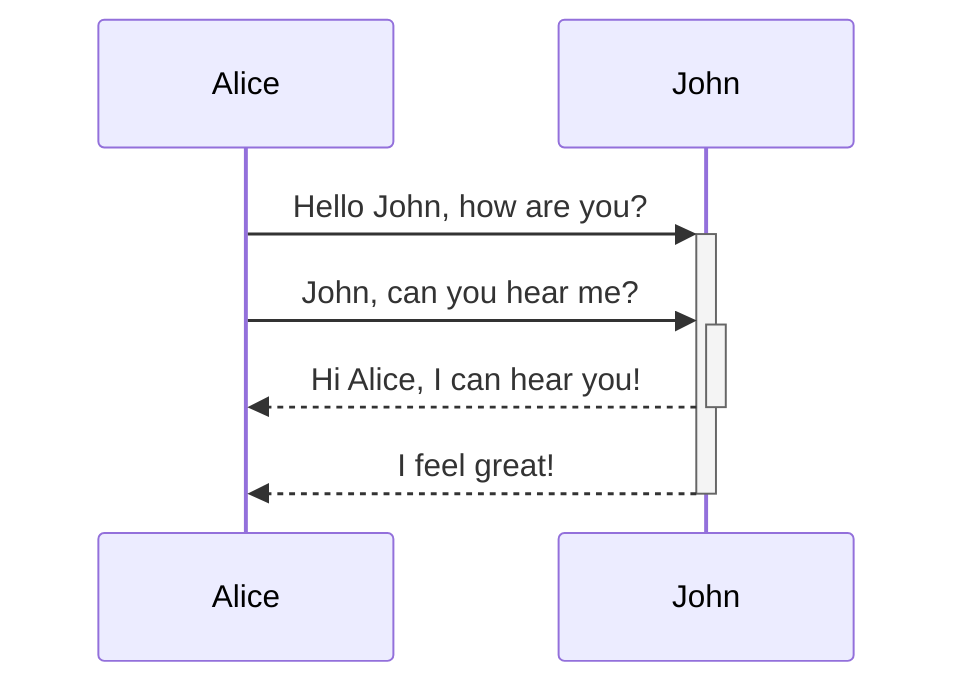

11月23日，Typora 正式发布 1.0 版本，正式版开始收费了，定价14.99美元。不过，Beta版本还是可以继续免费使用的。

作为 Typora 的重度用户，今天给大家介绍一下这款 Markdown 神器。

##  简介

Typora 是一款**支持实时预览的 Markdown 文本编辑器**。

##  特点

1. **所见即所得**。输入`Markdown`标记后，会即时渲染成相应格式。大部分的`Markdown`编辑器都是一半是编辑窗口，一半是预览窗口，而Typora合二为一，更为简洁。
2. **支持 LaTeX 语法**。
3. **支持图床功能**。
4. **定制化主题**。


##  Markdown

Markdown是一种**轻量级标记语言**，排版语法简洁，让使用者更多地关注内容本身而非排版。

**基础语法**：


**代码高亮**：输入 ``` 后并输入语言名，换行，开始写代码，Typora 会自动实现代码高亮的效果（如下图）。


##  图床

Typora 里的图片是链接到本地图片的，如果将文档同步到其他平台，图片链接会失效。可以使用图床来保证文档在分享后图片仍能正常显示。

我使用的是PicGo图床工具，具体配置方法如下：

1、下载 PicGo：`https://github.com/Molunerfinn/PicGo/releases`

2、选择图床，设置相关参数。PicGo 支持多个图床平台，如七牛、阿里云OSS等。


3、设置 PicGo server。


4、打开 Typora 中的「文件-偏好设置-图像」选项，配置上传服务为 PicGo 和 PicGo 的路径。


配置完成之后，当你在 Typora 中插入本地图片时，PicGo 会自动将图片上传图床并使用 Markdown 语法替换图片地址。

##  LaTeX

Typora 支持 LaTeX 语法，可以往文档插入数学公式。

数学公式有两种形式： inline 和 display。

- **inline（行间公式）**：在正文插入数学公式，用`$...$` 将公式括起来
- **display（块间公式）** ：独立排列的公式，用 `$$...$$`将公式括起来，默认显示在行中间

**常用语法**：


下面举几个例子：

**分段函数**：
```
$$
f(n)=
	\begin{cases}
		n/2, & \text{if $n$ is even}\\
		3n+1,& \text{if $n$ is odd}
	\end{cases}
$$
```


**矩阵**：
```
$$
X=\left|
	\begin{matrix}
		x_{11} & x_{12} & \cdots & x_{1d}\\
		x_{21} & x_{22} & \cdots & x_{2d}\\
		\vdots & \vdots & \ddots & \vdots \\
		x_{11} & x_{12} & \cdots & x_{1d}\\
	\end{matrix}
\right|
$$
```


**偏导数和微分：**
```
$$
\frac{\partial z}{\partial x_1} + \frac{\partial z}{\partial x_2} \\
\frac{\mathrm{d}z}{\mathrm{d}x_1}+\frac{\mathrm{d}z}{\mathrm{d}x_2}
$$
```


##  目录

markdown文档生成目录，我使用过的两种方法：

1、在文章开始使用`[TOC]` 将自动在文章生成目录。

- 某些平台（如掘金）不支持

2、使用插件 doctoc 生成目录（页内超链接）。

- 需要执行命令`doctoc xxx.md`生成目录。如果修改了标题，需要再次执行命令更新目录

使用 doctoc 生成目录的步骤：

1. 安装 doctoc，`npm install doctoc`
2. 在文档当前目录执行`doctoc xxx.md`命令，即可生成标题

##  定制化主题

在 Typora 中 CSS 被称为「主题」，但其本质仍是 CSS 文件。可以在 `文件 - 偏好设置 - 主题 - 打开主题文件夹` 看到这些 CSS 文件。

可以自定义修改 CSS 文件，生成新的主题。


## Mermaid

`Mermaid`是一个用于画流程图、状态图、时序图、甘特图的库，使用 JavaScript 进行本地渲染，广泛集成于许多 Markdown 编辑器中。Typora也支持`Mermaid`语法。

下面举几个例子。

**流程图**：


**时序图**：




##  导入导出

Typora 支持导入和导出的文件格式：`html`、`pdf`、`docx`、`epub`和`latex`等。其中导出`docx`、`epub`和`latex`需要安装 `Pandoc` 插件。

##  其他功能

**打字机模式**：使得你所编辑的那一行永远处于屏幕正中。

**专注模式**：使你正在编辑的那一行保留颜色，而其他行的字体呈灰色。


码字不易，如果觉得对你有帮助，可以**点个赞**鼓励一下！

我是 程序员大彬，专注Java后端硬核知识分享，欢迎大家关注~


