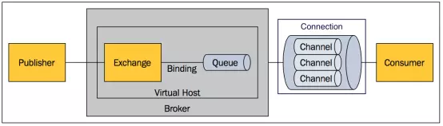
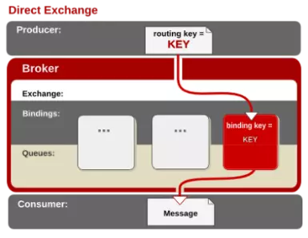
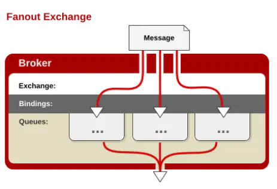
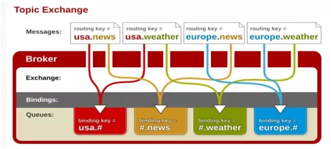

## 简介

RabbitMQ是一个由erlang开发的AMQP（Advanced Message Queue ）。消息队列是一种应用间的异步协作机制。

Message：由消息头和消息体组成。消息体是不透明的，而消息头则由一系列的可选属性组成，这些属性包括routing-key、priority、delivery-mode（指出该消息可能需要持久性存储）等。

Publisher：消息的生产者。

Exchange：接收消息并将路由到一个或多个Queue。

Binding：通过Binding将Exchange和Queue关联，这样Exchange就知道如何将消息准确的推送到Queue中去。

Queue：存储消息，队列的特性是先进先出。一个消息可投入一个或多个队列。消息一直在队列里面，等待消费者消费。

Virtual host：每个 vhost 本质上就是一个 mini 版的 RabbitMQ 服务器，拥有自己的队列、交换器、绑定和权限机制。vhost 是 AMQP 概念的基础，必须在连接时指定，RabbitMQ 默认的 vhost 是 / 。当多个不同的用户使用同一个RabbitMQ server提供的服务时，可以划分出多个vhost，每个用户在自己的vhost创建exchange和queue。

Broker：消息队列服务器实体。

### 什么时候使用MQ

对于一些不需要立即生效的操作，可以拆分出来，异步执行，使用消息队列实现。

以常见的订单系统为例，用户点击下单按钮之后的业务逻辑可能包括：扣减库存、生成相应单据、发红包、发短信通知。这种场景下就可以用 MQ ，在下单的主流程（比如扣减库存、生成相应单据）完成之后发送一条消息到 MQ 让主流程快速完结，而由另外的单独线程拉取MQ的消息（或者由 MQ 推送消息），当发现 MQ 中有发红包或发短信之类的消息时，执行相应的业务逻辑。

## Exchange 类型

Exchange分发消息时根据类型的不同分发策略不同，目前共四种类型：direct、fanout、topic、headers 。headers 匹配 AMQP 消息的 header 而不是路由键，此外 headers 交换器和 direct 交换器完全一致，但性能差很多，目前几乎用不到了。

Exchange规则。

| 类型名称 | 类型描述                                                     |
| -------- | ------------------------------------------------------------ |
| fanout   | 把所有发送到该Exchange的消息路由到所有与它绑定的Queue中      |
| direct   | Routing Key==Binding Key                                     |
| topic    | 我这里自己总结的简称模糊匹配                                 |
| headers  | Exchange不依赖于routing key与binding key的匹配规则来路由消息，而是根据发送的消息内容中的headers属性进行匹配。 |

### direct

消息中的路由键（routing key）如果和 Binding 中的 binding key 一致， 交换器就将消息发到对应的队列中。它是完全匹配、单播的模式。

### fanout

每个发到 fanout 类型交换器的消息都会分到所有绑定的队列上去。fanout 类型转发消息是最快的。

### topic

通过模式匹配分发消息，路由键和某个模式匹配成功，则将消息发送到相应的队列。routing key和binding key都是句点号“. ”分隔的字符串，binding key中可以存在两种特殊字符“*”与“#”，用于做模糊匹配，其中“\*”用于匹配一个单词，“#”用于匹配多个单词。

### headers

headers类型的Exchange不依赖于routing key与binding key的匹配规则来路由消息，而是根据发送的消息内容中的headers属性进行匹配。

[参考：RabbitMQ](https://www.jianshu.com/p/79ca08116d57)

## 消息丢失

[RabbitMQ系列之怎么确保消息不丢失](https://www.debug8.com/java/t_50678.html)

消息丢失从三个方面来解决：生产者开启发送确认、消费者开启消息确认和持久化。

### 生产者开启发送确认

生产者发送消息到队列，无法确保发送的消息成功的分配到队列中。

解决方法：开启消息发送确认，通过 ConfirmCallback 接口 和 ReturnCallback 接口 来保障。

ConfirmCallback 确认消息是否正确到达 Exchange 中。

ReturnCallback 消息没有正确到达队列时触发回调，如果正确到达队列不执行。

### 消费者开启消息确认

可能消费者收到消息还没来得及处理服务就宕机了，导致消息丢失。

解决方法：消费端开启消息确认（ACK），将消息设置为手动确认。默认情况下消息消费者是自动 ack消息的，自动确认会在消息发送给消费者后立即确认，这样存在丢失消息的可能。

### 持久化

如果RabbitMQ服务异常导致重启，将会导致消息丢失。RabbitMQ提供了持久化的机制，将内存中的消息持久化到硬盘上，即使重启RabbitMQ，消息也不会丢失。

消息持久化需要满足以下条件：

1. Exchange设置持久化。将交换机的属性数据存储在磁盘上，当 MQ 的服务器发生意外或关闭之后，在重启 RabbitMQ 时不需要重新手动或执行代码去创建交换机了，交换机会自动被创建。
2. Queue设置持久化。将队列的元数据保存在磁盘上，防止数据丢失。
3. 发送消息设置持久化发送。