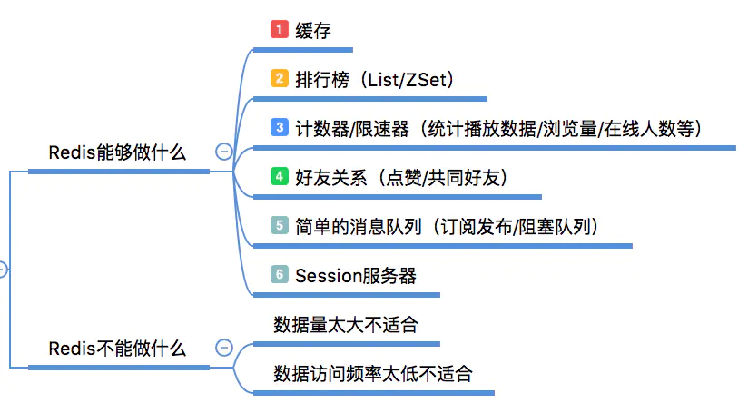
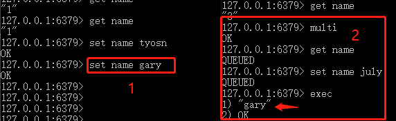
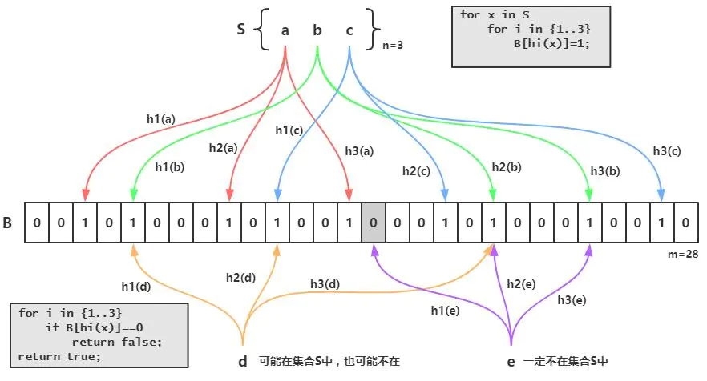

<!-- START doctoc generated TOC please keep comment here to allow auto update -->
<!-- DON'T EDIT THIS SECTION, INSTEAD RE-RUN doctoc TO UPDATE -->


- [简介](#%E7%AE%80%E4%BB%8B)
  - [优缺点](#%E4%BC%98%E7%BC%BA%E7%82%B9)
  - [应用场景](#%E5%BA%94%E7%94%A8%E5%9C%BA%E6%99%AF)
  - [启动与停止](#%E5%90%AF%E5%8A%A8%E4%B8%8E%E5%81%9C%E6%AD%A2)
- [数据类型](#%E6%95%B0%E6%8D%AE%E7%B1%BB%E5%9E%8B)
  - [字符串类型](#%E5%AD%97%E7%AC%A6%E4%B8%B2%E7%B1%BB%E5%9E%8B)
    - [SET和SETEX](#set%E5%92%8Csetex)
    - [keys和scan](#keys%E5%92%8Cscan)
    - [expire](#expire)
    - [type](#type)
  - [散列类型](#%E6%95%A3%E5%88%97%E7%B1%BB%E5%9E%8B)
  - [列表类型](#%E5%88%97%E8%A1%A8%E7%B1%BB%E5%9E%8B)
  - [集合类型](#%E9%9B%86%E5%90%88%E7%B1%BB%E5%9E%8B)
  - [有序集合类型](#%E6%9C%89%E5%BA%8F%E9%9B%86%E5%90%88%E7%B1%BB%E5%9E%8B)
- [排序](#%E6%8E%92%E5%BA%8F)
- [事务](#%E4%BA%8B%E5%8A%A1)
  - [WATCH命令](#watch%E5%91%BD%E4%BB%A4)
- [消息队列](#%E6%B6%88%E6%81%AF%E9%98%9F%E5%88%97)
  - [优先级队列](#%E4%BC%98%E5%85%88%E7%BA%A7%E9%98%9F%E5%88%97)
  - [发布/订阅模式](#%E5%8F%91%E5%B8%83%E8%AE%A2%E9%98%85%E6%A8%A1%E5%BC%8F)
  - [延时队列](#%E5%BB%B6%E6%97%B6%E9%98%9F%E5%88%97)
- [持久化](#%E6%8C%81%E4%B9%85%E5%8C%96)
  - [RDB方式](#rdb%E6%96%B9%E5%BC%8F)
  - [AOF方式](#aof%E6%96%B9%E5%BC%8F)
- [集群](#%E9%9B%86%E7%BE%A4)
  - [主从复制](#%E4%B8%BB%E4%BB%8E%E5%A4%8D%E5%88%B6)
  - [同步机制](#%E5%90%8C%E6%AD%A5%E6%9C%BA%E5%88%B6)
  - [读写分离](#%E8%AF%BB%E5%86%99%E5%88%86%E7%A6%BB)
  - [从数据库持久化](#%E4%BB%8E%E6%95%B0%E6%8D%AE%E5%BA%93%E6%8C%81%E4%B9%85%E5%8C%96)
  - [哨兵](#%E5%93%A8%E5%85%B5)
- [缓存穿透](#%E7%BC%93%E5%AD%98%E7%A9%BF%E9%80%8F)
- [缓存雪崩](#%E7%BC%93%E5%AD%98%E9%9B%AA%E5%B4%A9)
- [缓存击穿](#%E7%BC%93%E5%AD%98%E5%87%BB%E7%A9%BF)
- [LUA脚本](#lua%E8%84%9A%E6%9C%AC)
- [分布式锁](#%E5%88%86%E5%B8%83%E5%BC%8F%E9%94%81)
- [Redisson](#redisson)
- [pipeline](#pipeline)

<!-- END doctoc generated TOC please keep comment here to allow auto update -->


## 简介
Redis是一个高性能的key-value数据库。Redis对数据的操作都是原子性的。

### 优缺点

优点：

1. 基于内存操作，单线程避免线程切换开销及多线成的竞争问题，速度快。单线程是指在处理网络请求（一个或多个redis客户端连接）的时候只有一个线程来处理，在Redis Server运行的时候肯定是不止一个线程的。
2. 支持多种数据类型，包括String、Hash、List、Set、ZSet等
3. 支持持久化。Redis支持RDB和AOF两种持久化机制，持久化功能有效地避免数据丢失问题。

缺点：

对join或其他结构化查询的支持就比较差

非关系型数据库适用场景：

1. 数据高并发的读写
2. 海量数据的读写
3. 对扩展性要求高的数据

关系型数据库适用场景：

1. 存储结构化数据，如用户的帐号、地址。
2. 数据需要做结构化查询，复杂查询
3. 要求事务性、一致性

### 应用场景

缓存热点数据。

计算器，利用Redis中原子性的自增操作，可以统计类似用户点赞数、用户访问数等，这类操作如果用MySQL，频繁的读写会带来相当大的压力。

限速器，比较典型的使用场景是限制某个用户访问某个API的频率，常用的有抢购时，防止用户疯狂点击带来不必要的压力。

好友关系，利用集合的一些命令，比如求交集、并集、差集等。可以方便搞定一些共同好友、共同爱好之类的功能。

简单消息队列，不要求高可靠的情况下，可以使用Redis自身的发布/订阅模式或者List来实现一个队列，实现异步操作。



### 启动与停止

**启动**

切换目录到redis下，运行:
`redis-server redis.windows.conf`

若配置了环境变量，可直接运行`redis-server`

新打开一个窗口，切换到redis目录下并运行（配置了环境变量可直接运行）
`redis-cli -h 127.0.0.1 -p 6379`

>Linux下通过配置文件redis.conf设置deamonize yes允许后台进程，开启redis-server后控制台仍然可以接收输入。requirepass可以设置密码。

**停止**

`redis-cli SHUTDOWN`


## 数据类型

Redis支持五种数据类型：

- string（字符串）
- hash（哈希）
- list（列表）
- set（集合）
- zset(sorted set)

### 字符串类型
常用命令：set, get, incr, incrby, desr, keys, append, strlen

- 赋值和取值
```
SET name tyson
GET name
```
- 递增数字
```
INCR num       //若键值不是整数时，则会提示错误。
INCRBY num 2   //增加指定整数
DESR num       //递减数字
INCRBY num 2.7 //增加指定浮点数
```
- 其他

`keys list*` 列出匹配的key 

`APPEND name " dai"` 追加值 

`STRLEN name` 获取字符串长度 

`MSET name tyson gender male` 同时设置多个值 

`MGET name gender` 同时获取多个值 

`GETBIT name 0` 获取0索引处二进制位的值

`FLUSHDB` 删除当前数据库所有的key 

`FLUSHALL` 删除所有数据库中的key  

#### SET和SETEX

`SET KEY value`：只有两个参数

`SETEX key seconds value`：比SET多了seconds参数，相当于`SET KEY value` + `EXPIRE KEY seconds`。如果key 已经存在，SETEX将覆盖旧值。

#### keys和scan

redis的单线程的。keys指令会导致线程阻塞一段时间，直到执行完毕，服务才能恢复。`scan`指令可以无阻塞的提取出指定模式的key列表，但是会有一定的重复概率，需要在客户端去重，整体所花费的时间会比直接用keys指令长。

scan命令用于迭代当前数据库中的数据库键：`SCAN cursor [MATCH pattern] [COUNT count]`

命令解释：scan 游标 MATCH <返回和给定模式相匹配的元素> count 每次迭代所返回的元素数量

eg：`scan 0 match * count 10`

SCAN相关命令包括SSCAN 命令、HSCAN 命令和 ZSCAN 命令，分别用于集合、哈希键及有序集合。

#### expire

```
SET password 666
EXPIRE password 5
TTL password //查看键的剩余生存时间，-1为永不过期

SETEX password 60 123abc //SETEX可以在设置键的同时设置它的生存时间
```

EXPIRE时间单位是秒，PEXPIRE时间单位是毫秒。在键未过期前可以重新设置过期时间，过期之后则键被销毁。

#### type

TYPE 命令用于返回 key 所储存的值的类型。

```
127.0.0.1:6379> type NEWBLOG
list
```

### 散列类型

常用命令：hset, hget, hmset, hmget, hgetall, hdel, hkeys, hvals

- 赋值和取值
```
HSET car price 500
HGET car price
```
同时设置获取多个字段的值
```
HMSET car price 500 name BMW
HMGET car price name
HGETALL car
```

`HSETNX car price 400 //当字段不存在时赋值，HSETNX是原子操作，不存在竞态条件`

-  增加数字
`HINCRBY person score 60`
- 删除字段
`HDEL car price`
- 其他
```
HKEYS car //获取key
HVALS car //获取value
HLEN car  //长度
```

### 列表类型
常用命令：lpush, rpush, lpop, rpop, lrange, lrem

**添加和删除元素**

```
LPUSH numbers 1
RPUSH numbers 2 3
LPOP numbers
RPOP numbers
```

**获取列表片段**

```
LRANGE numbers 0 2
LRANGE numbers -2 -1 //支持负索引 -1是最右边第一个元素
LRANGE numbers 0 -1
```

**向列表插入值**

首先从左到右寻找值为pivot的值，向列表插入value
```
LINSERT numbers AFTER 5 8 //往5后面插入8
LINSERT numbers BEFORE 6 9 //往6前面插入9
```

**删除元素**

`LTRIM numbers 1 2` 删除索引1到2以外的所有元素

LPUSH常和LTRIM一起使用来限制列表的元素个数，如保留最近的100条日志
```
LPUSH logs $newLog
LTRIM logs 0 99
```

**删除列表指定的值** 

`LREM key count value`

   1. count < 0, 则从右边开始删除前count个值为value的元素
   2. count > 0, 则从左边开始删除前count个值为value的元素
   3. count = 0, 则删除所有值为value的元素 `LREM numbers 0 2`

**其他**

```
LLEN numbers       //获取列表元素个数
LINDEX numbers -1  //返回指定索引的元素，index是负数则从右边开始计算
LSET numbers 1 7   //把索引为1的元素的值赋值成7
```

### 集合类型
> 常用命令：sadd, srem, smembers, scard, sismember, sdiff

集合中不能有相同的元素。

**增加/删除元素**
```
SADD letters a b c
SREM letters c d
```

**获取元素**
```
SMEMBERS letters
SCARD letters   //获取集合元素个数
```

**判断元素是否在集合中**
`SISMEMBER letters a`

**集合间的运算**
```
SDIFF setA setB  //差集运算
SINTER setA setB //交集运算
SUNION setA setB //并集运算
```
*三个命令都可以传进多个键 `SDIFF setA setB setC`*

**其他**

`SDIFFSTORE result setA setB` 进行集合运算并将结果存储

`SRANDMEMBER key count` 
>随机获取集合里的一个元素，count大于0，则从集合随机获取count个不重复的元素，count小于0，则随机获取的count个元素有些可能相同。

`SPOP letters`

### 有序集合类型
常用命令：zadd, zrem, zscore, zrange

Zset(sorted set)是string类型的有序集合。zset 和 set 一样也是string类型元素的集合，且不允许重复的成员。不同的是每个元素都会关联一个double类型的分数。redis正是通过分数来为集合中的成员进行排序。
zset的成员是唯一的,但分数(score)却可以重复。

**有序集合和列表相同点：**

1. 都是有序的；
2. 都可以获得某个范围内的元素。

**有序集合和列表不同点：**

1. 列表基于链表实现，获取两端元素速度快，访问中间元素速度慢；
2. 有序集合基于散列表和跳跃表实现，访问中间元素时间复杂度是OlogN；
3. 列表不能简单的调整某个元素的位置，有序列表可以（更改元素的分数）；
4. 有序集合更耗内存。

**增加/删除元素**

```
ZADD scoreboard 89 Tom 78 Sophia
ZADD scoreboard 85.5 Tyson      //支持双精度浮点数
ZREM scoreboard Tyson
ZREMRANGEBYRANK scoreboard 0 2  //按照排名范围删除元素
ZREMRANGEBYSCORE scoreboard (80 100 //按照分数范围删除元素，"("代表不包含
```

**获取元素分数**

`ZSCORE scoreboard Tyson`

**获取排名在某个范围的元素列表**
```
ZRANGE scoreboard 0 2
ZRANGE scoreboard 1 -1  //-1表示最后一个元素
ZRANGE scoreboard 0 -1 WITHSCORES  //同时获得分数
```
*ZRANGE命令时间复杂度是Olog(n+m)， n是有序集合元素个数，m是返回元素个数*

**获取指定分数范围的元素**
```
ZRANGEBYSCORE scoreboard 80 100
ZRANGEBYSCORE scoreboard 80 (100  //不包含100
ZRANGEBYSCORE scoreboard (60 +inf LIMIT 1 3 //获取分数高于60的从第二个人开始的3个人
```

**增加某个元素的分数**

`ZINCRBY scoreboard 10 Tyson`

**其他**

```
ZCARD scoreboard          //获取集合元素个数
ZCOUNT scoreboard 80 100  //指定分数范围的元素个数
ZRANK scoreboard Tyson    //按从小到大的顺序获取元素排名
ZREVRANK scoreboard Tyson //按从大到小的顺序获取元素排名
```

## 排序
```
LPUSH myList 4 8 2 3 6
SORT myList DESC
```
```
LPUSH letters f l d n c
SORT letters ALPHA
```
**BY参数**
```
LPUSH list1 1 2 3
SET score:1 50
SET score:2 100
SET score:3 10
SORT list1 BY score:* DESC
```
**GET参数**

GET参数命令作用是使SORT命令的返回结果是GET参数指定的键值。

`SORT tag:Java:posts BY post:*->time DESC GET post:*->title GET post:*->time GET #`
>GET #返回文章ID。

**STORE参数**

`SORT tag:Java:posts BY post:*->time DESC GET post:*->title STORE resultCache`

`EXPIRE resultCache 10 //STORE结合EXPIRE可以缓存排序结果`

## 事务
事务的原理是将一个事务范围内的若干命令发送给Redis，然后再让Redis依次执行这些命令。

事务的生命周期：

1. 使用MULTI开启一个事务
2. 在开启事务的时候，每次操作的命令将会被插入到一个队列中，同时这个命令并不会被真的执行

3. EXEC命令进行提交事务


DISCARD：放弃事务，即该事务内的所有命令都将取消

一个事务范围内某个命令出错不会影响其他命令的执行，不保证原子性：

```
127.0.0.1:6379> multi
OK
127.0.0.1:6379> set a 1
QUEUED
127.0.0.1:6379> set b 1 2
QUEUED
127.0.0.1:6379> set c 3
QUEUED
127.0.0.1:6379> exec
1) OK
2) (error) ERR syntax error
3) OK
```

事务里的命令执行时会读取最新的值：



### WATCH命令

WATCH命令可以监控一个或多个键，一旦其中有一个键被修改，之后的事务就不会执行（类似于乐观锁）。执行EXEC命令之后，就会自动取消监控。

```
127.0.0.1:6379> watch name
OK
127.0.0.1:6379> set name 1
OK
127.0.0.1:6379> multi
OK
127.0.0.1:6379> set name 2
QUEUED
127.0.0.1:6379> set gender 1
QUEUED
127.0.0.1:6379> exec
(nil)
127.0.0.1:6379> get gender
(nil)
```
UNWATCH：取消WATCH命令对多有key的监控，所有监控锁将会被取消。


## 消息队列
使用一个列表，让生产者将任务使用LPUSH命令放进列表，消费者不断用RPOP从列表取出任务。

BRPOP和RPOP命令相似，唯一的区别就是当列表没有元素时BRPOP命令会一直阻塞住连接，直到有新元素加入。
`BRPOP queue 0  //0表示不限制等待时间`

### 优先级队列

`BLPOP queue:1 queue:2 queue:3 0`
*如果多个键都有元素，则按照从左到右的顺序取元素*

### 发布/订阅模式

```
PUBLISH channel1 hi
SUBSCRIBE channel1
UNSUBSCRIBE channel1 //退订通过SUBSCRIBE命令订阅的频道。
```

`PSUBSCRIBE channel?*` 按照规则订阅
`PUNSUBSCRIBE channel?*` 退订通过PSUBSCRIBE命令按照某种规则订阅的频道。其中订阅规则要进行严格的字符串匹配，`PUNSUBSCRIBE *`无法退订`channel?*`规则。

缺点：在消费者下线的情况下，生产的消息会丢失。

### 延时队列

使用sortedset，拿时间戳作为score，消息内容作为key，调用zadd来生产消息，消费者用`zrangebyscore`指令获取N秒之前的数据轮询进行处理。


## 持久化
Redis支持两种方式的持久化，一种是RDB的方式，一种是AOF的方式。前者会根据指定的规则定时将内存中的数据存储在硬盘上，而后者在每次执行完命令后将命令记录下来。一般将两者结合使用。

### RDB方式
RDB 是 Redis 默认的持久化方案。在指定的时间间隔内，执行指定次数的写操作，将内存中的数据写入到磁盘中，在指定目录下生成一个dump.rdb文件。Redis 重启会通过加载dump.rdb文件恢复数据。

RDB持久化的过程：

- 创建一个子进程；
- 父进程继续接收并处理客户端的请求，而子进程开始将内存中的数据写进硬盘的临时文件；
- 当子进程写完所有数据后会用该临时文件替换旧的RDB文件。

Redis启动时会读取RDB快照文件，将数据从硬盘载入内存。通过RDB方式的持久化，一旦Redis异常退出，就会丢失最近一次持久化以后更改的数据。

触发RDB快照：

1. 根据配置规则进行自动快照，如`SAVE 300 10`,300秒内至少有10个键被修改则进行快照；
2. 用户执行SAVE或BGSAVE命令。SAVE命令执行快照的过程会阻塞所有来自客户端的请求，应避免在生产环境使用这个命令。BGSAVE命令可以在后台异步进行快照操作，快照的同时服务器还可以继续响应客户端的请求，因此需要手动执行快照时推荐使用BGSAVE命令；
3. 执行FLUSHALL命令，清空数据库所有数据，当没有定义自动快照条件时，执行FLUSHALL命令则不会进行快照；
4. 执行复制（replication）时。当设置了主从复制后，Redis会在复制初始化时进行自动快照。

### AOF方式
默认情况下Redis没有开启AOF（append only file）方式的持久化，可以通过appendonly参数启用`appendonly yes`。开启AOF方式持久化后每执行一条会更改Redis的数据的命令，Redis就会将该命令写进硬盘中的AOF文件。由于操作系统的缓存机制，数据并没有真正的写进硬盘，而是进入了系统的硬盘缓存。默认情况下系统每30秒会执行一次同步操作。为了防止硬盘缓存数据丢失，可以在Redis写入AOF文件后主动要求系统将硬盘缓存同步到硬盘上。可以通过`appendfsync`参数设置同步的时机。

```
appendfsync always //每次写入aof文件都会执行同步，最安全最慢
appendfsync everysec  //保证了性能也保证了安全
appendfsync no //由操作系统决定何时进行同步操作
```


## 集群

### 主从复制

redis的复制功能是支持多个数据库之间的数据同步。主数据库可以进行读写操作，当主数据库的数据发生变化时会自动将数据同步到从数据库。从数据库一般是只读的，它会接收主数据库同步过来的数据。一个主数据库可以有多个从数据库，而一个从数据库只能有一个主数据库。

```
redis-server //启动Redis实例作为主数据库 
redis-server --port 6380 --slaveof  127.0.0.1 6379  //启动另一个实例作为从数据库 
slaveof 127.0.0.1 6379
SLAVEOF NO ONE //停止接收其他数据库的同步并转化为主数据库。
```

### 同步机制

第一次同步的时候，从数据库启动后会向主数据库发送SYNC命令。主数据库接收到命令后开始在后台保存快照（RDB持久化过程），并将保存快照过程接收到的命令缓存起来。当快照完成后，Redis会将快照文件和缓存的命令发送到从数据库。从数据库接收到后，会载入快照文件并执行缓存的命令。以上过程称为复制初始化。复制初始化完成后，主数据库每次收到写命令就会将命令同步给从数据库，从而实现主从数据库数据的一致性。

### 读写分离

通过redis的复制功能可以实现数据库的读写分离，提高服务器的负载能力。主数据库主要进行写操作，而从数据库负责读操作。很多场景下对数据库的读频率大于写，当单机的Redis无法应付大量的读请求时，可以通过复制功能建立多个从数据库节点，主数据库负责写操作，从数据库负责读操作。这种一主多从的结构很适合读多写少的场景。

### 从数据库持久化

持久化的操作比较耗时，为了提高性能，可以建立一个从数据库，并在从数据库进行持久化，同时在主数据库禁用持久化。

### 哨兵Sentinel

当master节点奔溃时，可以手动将slave提升为master，继续提供服务。

- 首先，从数据库使用`SLAVE NO ONE`将从数据库提升为主数据库继续服务；
- 启动奔溃的主数据库，通过`SLAVEOF`命令将其设置为新的主数据库的从数据库，即可将数据同步过来。

通过哨兵机制可以自动切换主从节点。哨兵是一个独立的进程，用于监控redis实例的是否正常运行，其原理是通过发送命令到redis服务器，等待Redis服务器响应，通过响应内容可以获取Redis实例的运行状态。

客户端连接redis的时候，先连接哨兵，哨兵会告诉客户端主redis的地址，然后客户端连接上redis并进行后续的操作。当主节点宕机的时候，哨兵监测到主节点宕机，会重新推选出某个表现良好的从节点成为新的主节点，然后通过发布订阅模式通知其他的从服务器，修改配置文件，让它们切换主机。

```java
/**
 * 测试Redis哨兵模式
 * @author liu
 */
public class TestSentinels {
    @SuppressWarnings("resource")
    @Test
    public void testSentinel() {
        JedisPoolConfig jedisPoolConfig = new JedisPoolConfig();
        jedisPoolConfig.setMaxTotal(10);
        jedisPoolConfig.setMaxIdle(5);
        jedisPoolConfig.setMinIdle(5);
        // 哨兵信息
        Set<String> sentinels = new HashSet<>(Arrays.asList("192.168.11.128:26379",
                "192.168.11.129:26379","192.168.11.130:26379"));
        // 创建连接池
        JedisSentinelPool pool = new JedisSentinelPool("mymaster", sentinels,jedisPoolConfig,"123456");
        // 获取客户端
        Jedis jedis = pool.getResource();
        // 执行两个命令
        jedis.set("mykey", "myvalue");
        String value = jedis.get("mykey");
        System.out.println(value);
    }
}
```


## 缓存穿透

缓存穿透是指查询一个一定不存在的数据，由于缓存是不命中时被动写的，如果从DB查不到数据则不写入缓存，这将导致这个不存在的数据每次请求都要到DB去查询，失去了缓存的意义。在流量大时，可能DB就挂掉了。

1. 缓存空值，不会查数据库
2. 采用布隆过滤器，将所有可能存在的数据哈希到一个足够大的bitmap中，查询不存在的数据会被这个bitmap拦截掉，从而避免了对DB的查询压力。

布隆可以看成数据库的缩略版，用来判定是否存在值。启动的时候过滤器是要全表扫描的，数据库数据发生变化的时候会更新布隆过滤器。

布隆过滤器的原理：当一个元素被加入集合时，通过K个散列函数将这个元素映射成一个位数组中的K个点，把它们置为1。查询时，将元素通过散列函数映射之后会得到k个点，如果这些点有任何一个0，则被检元素一定不在，直接返回，不查询redis；如果都是1，则查询元素很可能存在，就会去查询redis。




## 缓存雪崩

缓存雪崩是指在我们设置缓存时采用了相同的过期时间，导致缓存在某一时刻同时失效，请求全部转发到DB，DB瞬时压力过重挂掉。

解决方法：在原有的失效时间基础上增加一个随机值，使得过期时间分散一些。

## 缓存击穿

缓存击穿：大量的请求同时查询一个 key 时，此时这个key正好失效了，就会导致大量的请求都落到数据库。缓存击穿是查询缓存中失效的 key，而缓存穿透是查询不存在的 key。

解决方法：加互斥锁（redis.setnx()），第一个请求的线程可以拿到锁，拿到锁的线程查询到了数据之后设置缓存，其他的线程获取锁失败会等待50ms然后重新到缓存取数据，这样便可以避免大量的请求落到数据库。

```java
public String get(key) {
      String value = redis.get(key);
      if (value == null) { //代表缓存值过期
          //设置3min的超时，防止del操作失败的时候，下次缓存过期一直不能load db
		  if (redis.setnx(key_mutex, 1, 3 * 60) == 1) {  //代表设置成功
               value = db.get(key);
                      redis.set(key, value, expire_secs);
                      redis.del(key_mutex);
              } else {  //这个时候代表同时候的其他线程已经load db并回设到缓存了，这时候重试获取缓存值即可
                      sleep(50);
                      get(key);  //重试
              }
          } else {
              return value;      
          }
 }
```

SETNX：只有不存在的时候才设置，可以利用它来实现锁的效果。


## LUA脚本

Redis 通过 LUA 脚本创建具有原子性的命令： 当lua脚本命令正在运行的时候，不会有其他脚本或 Redis 命令被执行。这个特性有助于Redis对并发数据一致性的支持。

eval 命令使用内置的 Lua 解释器，对 Lua 脚本进行求值。

```
//第一个参数是lua脚本，第二个参数是键名参数个数，剩下的是键名参数和附加参数
> eval "return {KEYS[1],KEYS[2],ARGV[1],ARGV[2]}" 2 key1 key2 first second
1) "key1"
2) "key2"
3) "first"
4) "second"
```

应用场景：限制接口访问频率。

在Redis维护一个接口访问次数的键值对，key是接口名称，value是访问次数。每次访问接口时，会执行以下操作：

- 通过aop拦截接口的请求，对接口请求进行计数，每次进来一个请求，相应的接口count加1，存入redis。
- 如果是第一次请求，则会设置count=1，并设置过期时间。因为这里set()和expire()组合操作不是原子操作，所以引入lua脚本，实现原子操作，避免并发访问问题。
- 如果给定时间范围内超过最大访问次数，则会抛出异常。

```java
private String buildLuaScript() {
    return "local c" +
        "\nc = redis.call('get',KEYS[1])" +
        "\nif c and tonumber(c) > tonumber(ARGV[1]) then" +
        "\nreturn c;" +
        "\nend" +
        "\nc = redis.call('incr',KEYS[1])" +
        "\nif tonumber(c) == 1 then" +
        "\nredis.call('expire',KEYS[1],ARGV[2])" +
        "\nend" +
        "\nreturn c;";
}

String luaScript = buildLuaScript();
RedisScript<Number> redisScript = new DefaultRedisScript<>(luaScript, Number.class);
Number count = redisTemplate.execute(redisScript, keys, limit.count(), limit.period());
```


## 分布式锁

使用setnx来争抢锁，抢到之后，再用expire给锁加一个过期时间防止锁忘记了释放。使用 lua 脚本保证 setnx 和 expire 原子性执行。


## Redisson

基于`Redis`实现了各种分布式环境下的常用功能。除了提供基本的Redis功能，还提供了其他的服务，如远程调用、分布式锁、MQ、分布式的对象和容器等。


## pipeline

redis客户端执行一条命令分4个过程： 发送命令－〉命令排队－〉命令执行－〉返回结果。使用Pipeline可以批量请求，批量返回结果，执行速度比逐条执行要快。

使用pipeline组装的命令个数不能太多，不然数据量过大，增加客户端的等待时间，还可能造成网络阻塞，可以将大量命令的拆分多个小的pipeline命令完成。

原生批命令(mset, mget)与Pipeline对比：

1. 原生批命令是原子性，pipeline是非原子性。

2. 原生批命令一命令多个key, 但pipeline支持多命令。