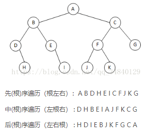

<!-- START doctoc generated TOC please keep comment here to allow auto update -->
<!-- DON'T EDIT THIS SECTION, INSTEAD RE-RUN doctoc TO UPDATE -->


- [单例模式](#%E5%8D%95%E4%BE%8B%E6%A8%A1%E5%BC%8F)
- [Java8](#java8)
- [树的遍历](#%E6%A0%91%E7%9A%84%E9%81%8D%E5%8E%86)
  - [前序遍历](#%E5%89%8D%E5%BA%8F%E9%81%8D%E5%8E%86)
  - [后序遍历](#%E5%90%8E%E5%BA%8F%E9%81%8D%E5%8E%86)

<!-- END doctoc generated TOC please keep comment here to allow auto update -->

## 单例模式

双重检查锁定：

```java
public class Singleton {  
    private static volatile Singleton instance = null;  //volatile
    private Singleton(){}  
    public static Singleton getInstance() {  
        if (instance == null) {  
            synchronized (Singleton.class) {  
                if (instance == null) {
                    instance = new Singleton();  
                }  
            }  
        }  
        return instance;  
    }  
}  
```

静态内部类：

```java
public class InstanceFactory {
    private static class InstanceHolder {
        public static Instance instance = new Instance();
    }
    public static Instance getInstance() {
        return InstanceHolder.instance ;　　// 这里将导致InstanceHolder类被初始化
    }
}
```


## Java8

排序：

```java
stringCollection
    .stream()
    .sorted()
    .filter((s) -> s.startsWith("a"))
    .forEach(System.out::println);

// "aaa1", "aaa2"

list.stream().sorted(Comparator.comparing(Student::getAge).reversed());
list.stream().sorted(Comparator.comparing(Student::getAge));
```

过滤：

```java
stringCollection
    .stream()
    .sorted()
    .filter((s) -> s.startsWith("a"))
    .forEach(System.out::println);

// "aaa1", "aaa2"
```


## 树的遍历



### 前序遍历

```java
class Solution {
    public List<Integer> preorderTraversal(TreeNode root) {
        List<Integer> result = new ArrayList<>();
        if(root == null) {
            return result;
        }
        
        Stack<TreeNode> s = new Stack<>();
        s.push(root);
        while(!s.isEmpty()) {
            TreeNode node = s.pop();
            result.add(node.val);
            if(node.right != null) {
                s.push(node.right);//先压右，再压左
            }
            if(node.left != null) {
                s.push(node.left);
            }
        }
        
        return result;
    }
}
```

### 后序遍历

[三种遍历方式模板](https://leetcode-cn.com/problems/binary-tree-postorder-traversal/solution/mo-fang-di-gui-zhi-bian-yi-xing-by-sonp/)

使用 null 作为标志位，访问到 null 说明此次递归调用结束。

```java
class Solution {
    public List<Integer> postorderTraversal(TreeNode root) {
        List<Integer> res = new LinkedList<>();
        if (root == null) {
            return res;
        }

        Stack<TreeNode> stack = new Stack<>();
        stack.push(root);
        while (!stack.isEmpty()) {
            root = stack.pop();
            if (root != null) {
                stack.push(root);//最后访问
                stack.push(null);
                if (root.right != null) {
                    stack.push(root.right);
                }
                if (root.left != null) {
                    stack.push(root.left);
                }
            } else { //值为null说明此次递归调用结束，将节点值存进结果
                res.add(stack.pop().val);
            }
        }

        return res;
    }
}
```


## 排序

### 冒泡排序

```java
    public void bubbleSort(int[] arr) {
        if (arr == null) {
            return;
        }
        boolean flag;
        for (int i = arr.length - 1; i > 0; i--) {
            flag = false;
            for (int j = 0; j < i; j++) {
                if (arr[j] > arr[j + 1]) {
                    int tmp = arr[j];
                    arr[j] = arr[j + 1];
                    arr[j + 1] = tmp;
                    flag = true;
                }
            }
            if (!flag) {
                return;
            }
        }
    }
```

### 插入排序

```java
    public void insertSort(int[] arr) {
        if (arr == null) {
            return;
        }
        for (int i = 1; i < arr.length; i++) {
            int tmp = arr[i];
            int j = i;
            for (; j > 0 && tmp < arr[j - 1]; j--) {
                arr[j] = arr[j - 1];
            }
            arr[j] = tmp;
        }
    }
```

### 选择排序

```java
    public void selectionSort(int[] arr) {
        if (arr == null) {
            return;
        }
        for (int i = 0; i < arr.length - 1; i++) {
            for (int j = i + 1; j < arr.length; j++) {
                if (arr[i] > arr[j]) {
                    int tmp = arr[i];
                    arr[i] = arr[j];
                    arr[j] = tmp;
                }
            }
        }
    }
```

### 快速排序

```java
    public void quickSort(int[] arr) {
        if (arr == null) {
            return;
        }
        quickSortHelper(arr, 0, arr.length - 1);
    }
    private void quickSortHelper(int[] arr, int left, int right) {
        if (left > right) {
            return;
        }
        int tmp = arr[left];
        int i = left;
        int j = right;
        while (i < j) {
            while (i < j && arr[j] >= tmp) {
                j--;
            }
            while (i < j && arr[i] <= tmp) {
                i++;
            }
            if (i < j) {
                int tmp1 = arr[i];
                arr[i] = arr[j];
                arr[j] = tmp1;
            } else {
                break;
            }
        }

        arr[left] = arr[j];
        arr[j] = tmp;

        quickSortHelper(arr, left, i - 1);
        quickSortHelper(arr, i + 1, right);
    }
```

### 归并排序

```java
public class MergeSort {
    public void mergeSort(int[] arr) {
        if (arr == null || arr.length == 0) {
            return;
        }
        int[] tmpArr = new int[arr.length];
        mergeSort(arr, tmpArr, 0, arr.length - 1);
    }

    private void mergeSort(int[] arr, int[] tmpArr, int left, int right) {
        if (left < right) {
            int mid = (left + right) >> 1;
            mergeSort(arr, tmpArr, left, mid);
            mergeSort(arr, tmpArr, mid + 1, right);
            merge(arr, tmpArr, left, mid, right);
        }
    }

    private void merge(int[] arr, int[] tmpArr, int left, int mid, int right) {
        int i = left;
        int j = mid + 1;
        int tmpIndex = left;
        while (i <= mid && j <= right) {
            if (arr[i] < arr[j]) {
                tmpArr[tmpIndex++] = arr[i];
                i++;
            } else {
                tmpArr[tmpIndex++] = arr[j];
                j++;
            }
        }

        while (i <= mid) {
            tmpArr[tmpIndex++] = arr[i++];
        }

        while (j <= right) {
            tmpArr[tmpIndex++] = arr[j++];
        }

        for (int m = left; m <= right; m++) {
            arr[m] = tmpArr[m];
        }
    }
}
```

