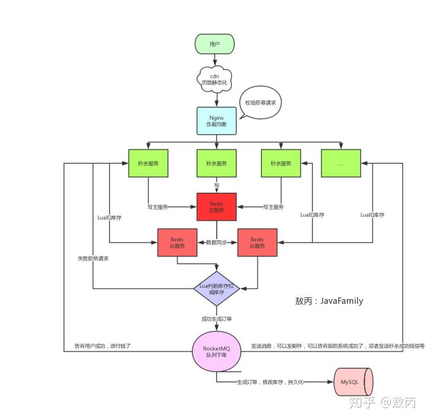

<!-- START doctoc generated TOC please keep comment here to allow auto update -->
<!-- DON'T EDIT THIS SECTION, INSTEAD RE-RUN doctoc TO UPDATE -->


- [RESTful](#restful)
- [JWT](#jwt)
  - [原理](#%E5%8E%9F%E7%90%86)
  - [数据结构](#%E6%95%B0%E6%8D%AE%E7%BB%93%E6%9E%84)
- [金额使用decimal存储类型的缺点](#%E9%87%91%E9%A2%9D%E4%BD%BF%E7%94%A8decimal%E5%AD%98%E5%82%A8%E7%B1%BB%E5%9E%8B%E7%9A%84%E7%BC%BA%E7%82%B9)
- [Maven的作用](#maven%E7%9A%84%E4%BD%9C%E7%94%A8)
- [为什么使用消息队列](#%E4%B8%BA%E4%BB%80%E4%B9%88%E4%BD%BF%E7%94%A8%E6%B6%88%E6%81%AF%E9%98%9F%E5%88%97)
- [秒杀系统](#%E7%A7%92%E6%9D%80%E7%B3%BB%E7%BB%9F)
- [shiro](#shiro)
- [分布式锁](#%E5%88%86%E5%B8%83%E5%BC%8F%E9%94%81)
- [dubbo](#dubbo)
- [分布式ID](#%E5%88%86%E5%B8%83%E5%BC%8Fid)
  - [UUID](#uuid)
  - [数据库自增ID](#%E6%95%B0%E6%8D%AE%E5%BA%93%E8%87%AA%E5%A2%9Eid)
  - [基于Redis模式](#%E5%9F%BA%E4%BA%8Eredis%E6%A8%A1%E5%BC%8F)
  - [雪花算法](#%E9%9B%AA%E8%8A%B1%E7%AE%97%E6%B3%95)
- [foeach和for的效率](#foeach%E5%92%8Cfor%E7%9A%84%E6%95%88%E7%8E%87)
- [epoll](#epoll)
- [防止重复请求](#%E9%98%B2%E6%AD%A2%E9%87%8D%E5%A4%8D%E8%AF%B7%E6%B1%82)
- [接口幂等性](#%E6%8E%A5%E5%8F%A3%E5%B9%82%E7%AD%89%E6%80%A7)
- [令牌桶算法](#%E4%BB%A4%E7%89%8C%E6%A1%B6%E7%AE%97%E6%B3%95)
- [超卖问题](#%E8%B6%85%E5%8D%96%E9%97%AE%E9%A2%98)
- [TPS和QPS](#tps%E5%92%8Cqps)
- [微服务](#%E5%BE%AE%E6%9C%8D%E5%8A%A1)
- [进程通信](#%E8%BF%9B%E7%A8%8B%E9%80%9A%E4%BF%A1)
- [分布式事务](#%E5%88%86%E5%B8%83%E5%BC%8F%E4%BA%8B%E5%8A%A1)

<!-- END doctoc generated TOC please keep comment here to allow auto update -->

## RESTful

[RESTful API](https://www.zhihu.com/question/28557115)

REST -- REpresentational State Transfer 直接翻译：表现层状态转移。URL定位资源，用HTTP动词（GET,POST,DELETE,DETC）描述操作。

REST描述的是在网络中client和server的一种交互形式。REST本身不实用，实用的是如何设计 RESTful API（REST风格的网络接口）。

 Server提供的RESTful API中，URL中只使用名词来指定资源，原则上不使用动词。通过HTTP方法来实现资源的状态扭转：

```java
DELETE http://api.qc.com/v1/friends/{id}
GET http://api.qc.com/v1/friends
```


## JWT

[JWT教程](http://www.ruanyifeng.com/blog/2018/07/json_web_token-tutorial.html) | [数字签名](https://blog.csdn.net/qq_21514303/article/details/82898984)

JSON Web Token（缩写 JWT）是目前最流行的跨域认证解决方案。

session认证流程：

1、用户向服务器发送用户名和密码。

2、服务器验证通过后，在当前对话（session）里面保存相关数据，比如用户角色、登录时间等等。

3、服务器向用户返回一个 session_id，写入用户的 Cookie。

4、用户随后的每一次请求，都会通过 Cookie，将 session_id 传回服务器。

5、服务器收到 session_id，找到前期保存的数据，由此得知用户的身份。

如果需要跨域认证，即用户登录了a网站，再访问b网站需要自动登录，则要求session数据共享。可以将session数据持久化，存到数据库来实现session共享。

JWT不在服务器端保存session数据，所有数据都保存在客户端，每次请求都发回服务器。它是通过算法实现对Token合法性的验证，不依赖数据库，只要密钥和算法相同，**不同服务器程序生成的Token可以互相验证**。

### 原理

用户使用用户名和密码登录服务器。服务器认证完成后，使用私钥生成一个 JSON 对象（包括用户名、权限等），发回给用户。

```json
{
  "username": "张三",
  "roles": "管理员",
  "expire": "2018年7月1日0点0分"
}
```

以后，用户与服务端通信的时候，都要发回这个 JSON 对象。服务器依据JSON对象认证用户身份。为了防止用户篡改数据，服务器在生成JSON对象的时候会使用私钥进行加密生成签名。


### 数据结构

JWT数据分为三个部分：

- Header（头部）
- Payload（负载）
- Signature（签名）

Header和Payload会使用 Base64URL 算法转成字符串，然后三部分用`.`进行分隔：

```javascript
Header.Payload.Signature
```

Header 部分是一个 JSON 对象，描述 JWT 的元数据。

```javascript
{
  "alg": "HS256",
  "typ": "JWT"
}
```

Payload 部分也是一个 JSON 对象，用来存放实际需要传递的数据，如用户名、权限等。

Signature 部分是对前两部分的签名，防止数据篡改。首先需要指定一个密钥（secret）。这个密钥只有服务器才知道，不能泄露给用户。然后使用 Header 里面指定的签名算法（默认是 HMAC SHA256），根据下面的公式产生签名。

```javascript
HMACSHA256(
  base64UrlEncode(header) + "." +
  base64UrlEncode(payload),
  secret)
```


## 金额使用decimal存储类型的缺点

- 占用存储空间。浮点类型在存储同样范围的值时，通常比decimal使用更少的空间
- 使用decimal计算效率不高

因为使用decimal时间和空间开销较大，选用int作为数据库存储格式比较合适，可以同时避免浮点存储计算的不精确和decimal的缺点。对于存储数值较大或者保留小数较多的数字，数据库存储结构可以选择bigint，可以同时避免浮点存储计算不精准和DECIMAL精度计算代价高的问题


## Maven的作用

管理jar包依赖；根据配置自动下载相应jar包； 热部署，编译* package命令完成了项目编译、单元测试、打包功能，但没有把打好的可执行jar包（war包或其它形式的包）布署到本地maven仓库和远程maven私服仓库* install命令完成了项目编译、单元测试、打包功能，同时把打好的可执行jar包（war包或其它形式的包）布署到本地maven仓库，但没有布署到远程maven私服仓库* deploy命令完成了项目编译、单元测试、打包功能，同时把打好的可执行jar包（war包或其它形式的包）布署到本地maven仓库和远程maven私服仓库　


## 为什么使用消息队列

在高并发环境下，由于来不及同步处理，请求往往会发生堵塞，比如说，大量的insert，update之类的请求同时到达MySQL，直接导致无数的行锁表锁，甚至最后请求会堆积过多，从而触发too many connections错误。通过使用消息队列，我们可以异步处理请求，从而缓解系统的压力。
异步通信就是你发了一个请求，没收到回答的时候，你发了另一个请求。


## 秒杀系统

rabbitmq是为了削峰，如果是有1000件商品参与秒杀，每个商品有10件，那么系统的最大并发就是1万，db扛不住这么大的并发的，如果商品数量更大，这个并发量会更大。
通过Redis预减库存减少到DB的请求，通过消息队列异步写库缓解数据库的压力。用消息队列来缓冲瞬时流量，把同步的直接调用转换成异步操作。

把判断库存扣减库存的操作封装成lua脚本，实现原子性操作，避免超卖。




## shiro

作用：

1. 验证用户身份
2. 用户访问权限控制
3. 支持提供`Remember Me`服务


## 分布式锁

在多线程的环境下，为了保证一个代码块在同一时间只能由一个线程访问，Java中我们一般可以使用synchronized语法和ReetrantLock去保证，这实际上是本地锁的方式。

在一个分布式系统中，多台机器上部署了多个服务，当客户端一个用户发起一个数据插入请求时，如果没有分布式锁机制保证，那么那多台机器上的多个服务可能进行并发插入操作，导致数据重复插入，对于某些不允许有多余数据的业务来说，这就会造成问题。而分布式锁机制就是为了解决类似这类问题，保证多个服务之间互斥的访问共享资源，如果一个服务抢占了分布式锁，其他服务没获取到锁，就不进行后续操作。


实现分布式锁有以下几种方式：

- 基于数据库

- 基于Redis

  使用lua优点，可以保证多个命令是一次行传输到Redis服务器并且是串行执行的，保证串行执行的命令中不行插入其他命令，防止并发问题。

- 基于zookeeper


## dubbo

分布式协调服务：在分布式系统中共享配置，协调锁资源，提供命名服务。


## 分布式ID

`全局唯一ID`就叫`分布式ID`。

### UUID

```java
String uuid = UUID.randomUUID().toString().replaceAll("-","");
```

优点：

- 生成足够简单，本地生成无网络消耗，具有唯一性

缺点：

- 无序的字符串，不具备趋势自增特性
- 没有具体的业务含义

### 数据库自增ID

优点:

- 简单方便，有序递增，方便排序和分页

缺点:

- 分库分表会带来问题，需要进行改造。

### 基于Redis模式

利用`redis`的 `incr`命令实现ID的原子性自增。

### 雪花算法


## foeach和for的效率

1、foreach适用于数组或实现了iterator的集合类。foreach就是使用Iterator接口来实现对集合的遍历的。

2、在用foreach循环遍历一个集合时，不能改变集合中的元素，如增加元素、修改元素。否则会抛出ConcurrentModificationException异常。普通 for 循环遍历过程可以修改元素。


## epoll

select、poll和epoll都是IO多路复用的机制。


## 防止重复请求

1. 前端提交按钮置灰几秒钟。
2. 后端使用Redis保存请求的唯一id（业务参数或者前端自己生成，保证唯一），当第一次请求过来，从redis中取id，如果value为null，说明是第一次请求，将这个id存入redis；如果不为null，说明是重复请求，直接抛异常。


## 接口幂等性

幂等性：接口一次调用和多次调用的结果一致。

对于业务中需要考虑幂等性的地方一般都是接口的重复请求，重复请求是指同一个请求因为某些原因被多次提交。导致这个情况会有几种场景：

- 前端重复提交：提交订单，用户快速重复点击多次，造成后端生成多个内容重复的订单。
- 接口超时重试：对于给第三方调用的接口，为了防止网络抖动或其他原因造成请求丢失，这样的接口一般都会设计成超时重试多次。
- 消息重复消费：MQ消息中间件，消息重复消费。


## 令牌桶算法

令牌桶算法的原理是系统会以一个恒定的速度往桶里放入令牌，而如果请求需要被处理，则需要先从桶里获取一个令牌，当桶里没有令牌可取时，则拒绝服务。


## 超卖问题

先到数据库查询库存，在减库存。不是原子操作，会有超卖问题。

通过加排他锁解决该问题。

- 开始事务。
- 查询库存，并显式的设置排他锁：SELECT * FROM table_name WHERE … FOR UPDATE
- 生成订单。
- 去库存，update会隐式的设置排他锁：UPDATE products SET count=count-1 WHERE id=1
- commit，释放锁。

也可以通过乐观锁实现。使用版本号实现乐观锁。

假设此时version = 100， num = 1; 100个线程进入到了这里，同时他们select出来版本号都是version = 100。

然后直接update的时候，只有其中一个先update了，同时更新了版本号。

那么其他99个在更新的时候，会发觉version并不等于上次select的version，就说明version被其他线程修改过了，则放弃此次update，重试直到成功。

```mysql
select version from goods WHERE id= 1001
update goods set num = num - 1, version = version + 1 WHERE id= 1001 AND num > 0 AND version = @version(上面查到的version);
```


## TPS和QPS

**QPS**：Queries Per Second意思是“每秒查询率”，是一台服务器每秒处理的查询次数。

**TPS：**是TransactionsPerSecond的缩写，也就是事务数/秒。它是软件测试结果的测量单位。一个事务是指一个客户机向服务器发送请求然后服务器做出反应的过程。客户机在发送请求时开始计时，收到服务器响应后结束计时，以此来计算使用的时间和完成的事务个数。

Tps即每秒处理事务数，包括了三个过程：

1）用户请求服务器

2）服务器自己的内部处理

3）服务器返回给用户

如果每秒能够完成N个这三个过程，Tps也就是N；

对于一个页面的一次访问，形成一个Tps；但一次页面请求，可能产生多次对服务器的请求，这些请求可以计入Qps之中。例如访问一个页面会请求服务器3次，产生一个TPS，产生3个QPS。


## 微服务

单体应用：将所有功能都打包成在一个独立单元的应用程序。

微服务将单一应用程序划分成一组小的服务，服务之间相互协调、互相配合。每个服务运行在其独立的进程中，服务和服务之间采用轻量级的通信机制相互沟通。每个服务可以被独立的部署到生产环境。


## 进程通信

进程间通信方式：
1、管道通信
 匿名管道( pipe )：管道是一种半双工的通信方式，数据只能单向流动，而且只能在具有亲缘关系的进程间使用。进程的亲缘关系通常是指父子进程关系。
 有名管道是半双工的通信方式，数据只能单向流动。
2、消息队列
3、共享内存。共享内存是最快的 IPC 方式，它是针对其他进程间通信方式运行效率低而专门设计的。它往往与其他通信机制，如信号量，配合使用，来实现进程间的同步和通信。
4、信号量。信号量是一个计数器，可以用来控制多个进程对共享资源的访问。它常作为一种锁机制，防止某进程正在访问共享资源时，其他进程也访问该资源。因此，主要作为进程间以及同一进程内不同线程之间的同步手段。


## 分布式事务

分布式事务是指事务的参与者，支持事务的服务器，资源服务器以及事务管理器分别位于分布式系统的不同节点之上。通常一个分布式事务中会涉及对多个数据源或业务系统的操作。分布式事务也可以被定义为一种嵌套型的事务，同时也就具有了ACID事务的特性。
CAP理论
Consistency(一致性)：数据一致更新，所有数据变动都是同步的（强一致性）。
Availability(可用性)：好的响应性能
Partition tolerance(分区容错性) ：可靠性

定理：任何分布式系统只可同时满足二点，没法三者兼顾。

CA系统（放弃P）：指将所有数据（或者仅仅是那些与事务相关的数据）都放在一个分布式节点上，就不会存在网络分区。所以强一致性以及可用性得到满足。
CP系统（放弃A）：如果要求数据在各个服务器上是强一致的，然而网络分区会导致同步时间无限延长，那么如此一来可用性就得不到保障了。坚持事务ACID（原子性、一致性、隔离性和持久性）的传统数据库以及对结果一致性非常敏感的应用通常会做出这样的选择。
AP系统（放弃C）：这里所说的放弃一致性，并不是完全放弃数据一致性，而是放弃数据的强一致性，而保留数据的最终一致性。如果即要求系统高可用又要求分区容错，那么就要放弃一致性了。因为一旦发生网络分区，节点之间将无法通信，为了满足高可用，每个节点只能用本地数据提供服务，这样就会导致数据不一致。一些遵守BASE原则数据库，（如：Cassandra、CouchDB等）往往会放宽对一致性的要求（满足最终一致性即可），一次来获取基本的可用性。

BASE理论
Basically Available基本可用：指分布式系统在出现不可预知的故障的时候，允许损失部分可用性——但不是系统不可用。
响应时间上的损失：假如正常一个在线搜索0.5秒之内返回，但由于故障（机房断电或网络不通），查询结果的响应时间增加到1—2秒。功能上的损失：如果流量激增或者一个请求需要多个服务间配合，而此时有的服务发生了故障，这时需要进行服务降级，进而保护系统稳定性。
Soft state软状态：允许系统在不同节点的数据副本之间进行数据同步的过程存在延迟。Eventually consistent最终一致：最终数据是一致的就可以了，而不是时时高一致。
BASE思想主要强调基本的可用性，如果你需要High 可用性，也就是纯粹的高性能，那么就要以一致性或容错性为牺牲。