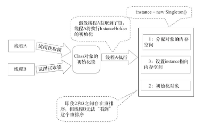

<!-- START doctoc generated TOC please keep comment here to allow auto update -->
<!-- DON'T EDIT THIS SECTION, INSTEAD RE-RUN doctoc TO UPDATE -->


- [单例模式](#%E5%8D%95%E4%BE%8B%E6%A8%A1%E5%BC%8F)
- [装饰模式](#%E8%A3%85%E9%A5%B0%E6%A8%A1%E5%BC%8F)
- [适配器模式](#%E9%80%82%E9%85%8D%E5%99%A8%E6%A8%A1%E5%BC%8F)
- [观察者模式](#%E8%A7%82%E5%AF%9F%E8%80%85%E6%A8%A1%E5%BC%8F)
- [代理模式](#%E4%BB%A3%E7%90%86%E6%A8%A1%E5%BC%8F)
- [工厂模式](#%E5%B7%A5%E5%8E%82%E6%A8%A1%E5%BC%8F)

<!-- END doctoc generated TOC please keep comment here to allow auto update -->

## 单例模式

需要对实例字段使用线程安全的延迟初始化，使用双重检查锁定的方案；需要对静态字段使用线程安全的延迟初始化，使用静态内部类的方案。

### 饿汉模式

```
public class Singleton {  
    private static Singleton instance = new Singleton();  
    private Singleton() {}  
    public static Singleton newInstance() {
        return instance;  
    }  
}
```
JVM在类的初始化阶段，会执行类的初始化。在执行类的初始化期间，JVM会去获取一个锁。这个锁可以同步多个线程对同一个类的初始化。

饿汉模式只在类加载的时候创建一次实例，没有多线程同步的问题。单例没有用到也会被创建，而且在类加载之后就被创建，内存就被浪费了。

### 双重检查锁定

```
public class Singleton {  
    private static volatile Singleton instance = null;  //volatile
    private Singleton(){}  
    public static Singleton getInstance() {  
        if (instance == null) {  
            synchronized (Singleton.class) {  
                if (instance == null) {
                    instance = new Singleton();  
                }  
            }  
        }  
        return instance;  
    }  
}  
```
`new Singleton()`会执行三个动作：分配内存空间、初始化对象和对象引用指向内存地址。

```java
memory = allocate();　　// 1：分配对象的内存空间
ctorInstance(memory);　 // 2：初始化对象
instance = memory;　　  // 3：设置instance指向刚分配的内存地址
```

由于指令重排优化的存在，导致初始化对象和将对象引用指向内存地址的顺序是不确定的。在某个线程创建单例对象时，会为该对象分配了内存空间并将对象的字段设置为默认值。此时就可以将分配的内存地址赋值给instance字段了，然而该对象可能还没有初始化。若紧接着另外一个线程来调用getInstance，取到的是未初始化的对象，程序就会出错。volatile 可以禁止指令重排序，保证了先初始化对象再赋值给instance变量。

### 静态内部类

```
public class InstanceFactory {
    private static class InstanceHolder {
        public static Instance instance = new Instance();
    }
    public static Instance getInstance() {
        return InstanceHolder.instance ;　　// 这里将导致InstanceHolder类被初始化
    }
}
```
它与饿汉模式一样，也是利用了类初始化机制，因此不存在多线程并发的问题。不一样的是，它是在内部类里面去创建对象实例。这样的话，只要应用中不使用内部类，JVM就不会去加载这个单例类，也就不会创建单例对象，从而实现懒汉式的延迟加载。也就是说这种方式可以同时保证延迟加载和线程安全。



基于类初始化的方案的实现代码更简洁。但基于volatile的双重检查锁定的方案有一个额外的优势：除了可以对静态字段实现延迟初始化外，还可以对实例字段实现延迟初始化。字段延迟初始化降低了初始化类或创建实例的开销，但增加了访问被延迟初始化的字段的开销。在大多数时候，正常的初始化要优于延迟初始化。


[参考：单例模式](https://blog.csdn.net/goodlixueyong/article/details/51935526)


## 装饰模式
装饰模式以对客户透明的方式动态地给一个对象附加上更多的责任。换言之，客户端并不会觉得对象在装饰前和装饰后有什么不同。装饰模式可以在不创造更多子类的情况下，将对象的功能加以扩展。

```
InputStream in = new LowerCaseInputStream(
                                        new  BufferedInputStream(
                                         new  FileInputStream("test.txt")));
```
设置FileInputStream，先用BufferedInputStream装饰它，再用自己写的LowerCaseInputStream过滤器去装饰它。

在装饰模式中的角色有：
抽象组件(Component)角色：给出一个抽象接口，以规范准备接收附加责任的对象。
具体组件(ConcreteComponent)角色：定义一个将要接收附加责任的类。
装饰(Decorator)角色：持有一个构件(Component)对象的实例，并定义一个与抽象构件接口一致的接口。
具体装饰(ConcreteDecorator)角色：负责给构件对象“贴上”附加的责任。


## 适配器模式
适配器模式把一个类的接口变换成客户端所期待的另一种接口，从而使原本因接口不匹配而无法在一起工作的两个类能够在一起工作。
适配器模式有类的适配器模式和对象的适配器模式两种不同的形式。

类的适配器模式把适配的类的API转换成为目标类的API。

Adaptee类并没有sampleOperation2()方法，而客户端则期待这个方法。为使客户端能够使用Adaptee类，提供一个中间环节，即类Adapter，把Adaptee的API与Target类的API衔接起来。Adapter与Adaptee是继承关系，这决定了这个适配器模式是类的

模式所涉及的角色有：
目标(Target)角色：这就是所期待得到的接口。注意：由于这里讨论的是类适配器模式，因此目标不可以是类。
源(Adapee)角色：现在需要适配的接口。
适配器(Adaper)角色：适配器类是本模式的核心。适配器把源接口转换成目标接口。显然，这一角色不可以是接口，而必须是具体类。

与类的适配器模式一样，对象的适配器模式把被适配的类的API转换成为目标类的API，与类的适配器模式不同的是，对象的适配器模式不是使用继承关系连接到Adaptee类，而是使用委派关系连接到Adaptee类。

Adaptee类并没有sampleOperation2()方法，而客户端则期待这个方法。为使客户端能够使用Adaptee类，需要提供一个包装(Wrapper)类Adapter。这个包装类包装了一个Adaptee的实例，从而此包装类能够把Adaptee的API与Target类的API衔接起来。Adapter与Adaptee是委派关系，这决定了适配器模式是对象的。

适配器模式的优点
更好的复用性
系统需要使用现有的类，而此类的接口不符合系统的需要。那么通过适配器模式就可以让这些功能得到更好的复用。
更好的扩展性
在实现适配器功能的时候，可以调用自己开发的功能，从而自然地扩展系统的功能。    

## 观察者模式
观察者模式定义了一种一对多的依赖关系，让多个观察者对象同时监听某一个主题对象。这个主题对象在状态上发生变化时，会通知所有观察者对象，使它们能够自动更新自己。
作用:提供了一种对象设计，让主题和观察者松耦合

观察者模式所涉及的角色有：
抽象主题(Subject)角色：抽象主题角色把所有对观察者对象的引用保存在一个聚集（比如ArrayList对象）里，每个主题都可以有任何数量的观察者。抽象主题提供一个接口，可以增加和删除观察者对象，抽象主题角色又叫做抽象被观察者(Observable)角色。
具体主题(ConcreteSubject)角色：将有关状态存入具体观察者对象；在具体主题的内部状态改变时，给所有登记过的观察者发出通知。具体主题角色又叫做具体被观察者(Concrete Observable)角色。
抽象观察者(Observer)角色：为所有的具体观察者定义一个接口，在得到主题的通知时更新自己，这个接口叫做更新接口。
具体观察者(ConcreteObserver)角色：存储与主题的状态自恰的状态。具体观察者角色实现抽象观察者角色所要求的更新接口，以便使本身的状态与主题的状态相协调。如果需要，具体观察者角色可以保持一个指向具体主题对象的引用。
Observer接口　Observable类
被观察者类都是java.util.Observable类的子类。

[观察者模式](https://www.cnblogs.com/luohanguo/p/7825656.html)

## 代理模式
代理模式是指客户端并不直接调用实际的对象，而是通过调用代理对象，来间接的调用实际的对象。
某些情况下客户端不能直接访问实际的对象，因此通过一个代理对象来完成间接的访问。通过代理类这中间一层，将两个类的关系解耦，避免对委托类对象的直接访问，也可以很好地隐藏和保护委托类对象。

代理模式包含如下角色：
Subject：抽象主题角色，是一个接口。该接口是对象和它的代理共用的接口。
RealSubject：真实主题角色，是实现抽象主题接口的类。
Proxy：代理角色，内部含有对真实对象RealSubject的引用，从而可以操作真实对象。代理对象提供与真实对象相同的接口，以便在任何时刻都能代替真实对象。同时，代理对象可以在执行真实对象操作时，附加其他的操作，相当于对真实对象进行封装。

静态代理
静态代理在使用时,被代理对象与代理对象一起实现相同的接口或者是继承相同父类。
静态代理总结:
1.可以做到在不修改目标对象的功能前提下，对目标功能扩展。
2.缺点:
因为代理对象需要与目标对象实现一样的接口，所以会有很多代理类。同时，一旦接口增加方法，目标对象与代理对象都要维护。


jdk动态代理利用了JDK API，动态地在内存中构建代理对象，从而实现对目标对象的代理功能。
JDK实现代理只需要使用newProxyInstance方法，但是该方法需要接收三个参数，完整的写法是:
```
static Object newProxyInstance(ClassLoader loader, Class<?>[] interfaces,InvocationHandler h )
```
注意该方法是在Proxy类中是静态方法,且接收的三个参数依次为:
```
ClassLoader loader:指定当前目标对象使用类加载器,获取加载器的方法是固定的
Class<?>[] interfaces,:目标对象实现的接口的类型,使用泛型方式确认类型
InvocationHandler h:事件处理,执行目标对象的方法时,会触发事件处理器的方法,会把当前执行目标对象的方法作为参数传入
```
动态代理有以下特点:
1.代理对象,不需要实现接口
2.代理对象的生成,是利用JDK的API,动态的在内存中构建代理对象
总结:
代理对象不需要实现接口,但是目标对象一定要实现接口,否则不能用jdk动态代理

动态代理的应用：当用户调用代理对象的方法，就会调用InvocationHandler的invoke方法（这相当于invoke方法拦截到了代理对象的方法调用）。通过invoke方法的参数，可以知道用户调用的是什么方法，这样就可以实现一些特殊需求，例如：拦截用户的访问请求以检查用户是否有访问权限、动态为某个对象添加额外的功能。

在Spring的AOP编程中，如果加入容器的目标对象有实现接口，用JDK代理；如果目标对象没有实现接口，用Cglib代理。
Cglib代理，也叫作子类代理，运行时在内存中动态生成一个子类对象，从而实现对目标对象功能的扩展，代理没有实现接口的类。

cglib与jdk动态代理的区别
使用jdk动态代理的对象必须实现一个或多个接口。
使用cglib代理的对象则无需实现接口，达到代理类无侵入。
[代理模式](https://www.cnblogs.com/cenyu/p/6289209.html)

## 工厂模式
工厂模式是用来封装对象的创建。
简单工厂模式又称静态工厂方法模式。
1) 工厂类角色：这是本模式的核心，含有一定的商业逻辑和判断逻辑，用来创建产品
2) 抽象产品角色：它一般是具体产品继承的父类或者实现的接口。         
3) 具体产品角色：工厂类所创建的对象就是此角色的实例。在Java中由一个具体类实现。
缺点：每增加一种产品，都要在工厂类中增加相应的创建业务逻辑，这显然是违背开闭原则的（对扩展开放；对修改封闭）


工厂方法模式：提供一个用于创建对象的工厂接口，让其工厂实现类决定实例化哪一个产品类，并且由该工厂实现类创建对应类的实例。
工厂方法模式包含四个部分：
1.抽象产品：产品对象同一的基类，或者是同一的接口。
2.具体的产品：各个不同的实例对象类
3.抽象工厂：所有的子类工厂类的基类，或是同一的接口
4.具体的工厂子类：负责每个不同的产品对象的实际创建


抽象工厂模式：为创建一组相关或相互依赖的对象提供一个接口，而且无需指定他们的具体类。

区别：
工厂方法模式只有一个抽象产品类，而抽象工厂模式有多个。   
工厂方法模式的具体工厂类只能创建一种具体产品类的实例，而抽象工厂模式可以创建多种。

模式作用
可以一定程度上解耦
可以一定程度增加扩展性
可以一定程度增加代码的封装性、可读性。