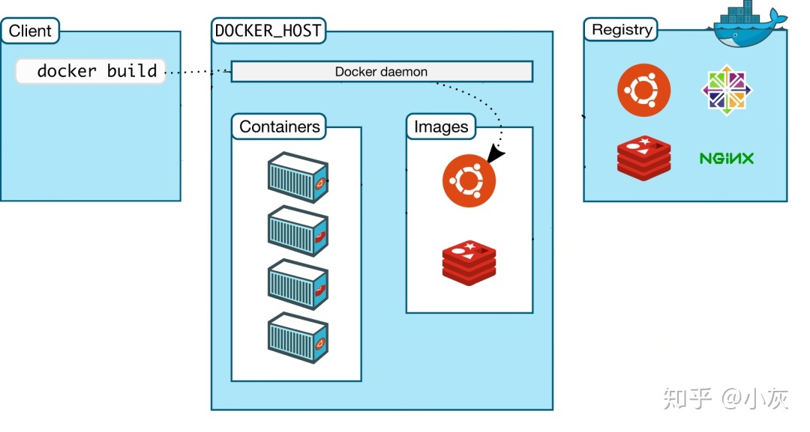

<!-- START doctoc generated TOC please keep comment here to allow auto update -->
<!-- DON'T EDIT THIS SECTION, INSTEAD RE-RUN doctoc TO UPDATE -->
**Table of Contents**  *generated with [DocToc](https://github.com/thlorenz/doctoc)*

- [简介](#%E7%AE%80%E4%BB%8B)
  - [基本概念](#%E5%9F%BA%E6%9C%AC%E6%A6%82%E5%BF%B5)
- [docker镜像常用命令](#docker%E9%95%9C%E5%83%8F%E5%B8%B8%E7%94%A8%E5%91%BD%E4%BB%A4)
  - [添加docker仓库位置](#%E6%B7%BB%E5%8A%A0docker%E4%BB%93%E5%BA%93%E4%BD%8D%E7%BD%AE)
  - [安装docker服务](#%E5%AE%89%E8%A3%85docker%E6%9C%8D%E5%8A%A1)
  - [启动 docker 服务](#%E5%90%AF%E5%8A%A8-docker-%E6%9C%8D%E5%8A%A1)
  - [重启docker服务](#%E9%87%8D%E5%90%AFdocker%E6%9C%8D%E5%8A%A1)
  - [搜索镜像](#%E6%90%9C%E7%B4%A2%E9%95%9C%E5%83%8F)
  - [下载镜像：](#%E4%B8%8B%E8%BD%BD%E9%95%9C%E5%83%8F)
  - [列出镜像](#%E5%88%97%E5%87%BA%E9%95%9C%E5%83%8F)
  - [删除镜像](#%E5%88%A0%E9%99%A4%E9%95%9C%E5%83%8F)
  - [打包镜像](#%E6%89%93%E5%8C%85%E9%95%9C%E5%83%8F)
  - [创建镜像](#%E5%88%9B%E5%BB%BA%E9%95%9C%E5%83%8F)
  - [推送镜像：](#%E6%8E%A8%E9%80%81%E9%95%9C%E5%83%8F)
  - [docker hub](#docker-hub)
  - [修改镜像存放位置](#%E4%BF%AE%E6%94%B9%E9%95%9C%E5%83%8F%E5%AD%98%E6%94%BE%E4%BD%8D%E7%BD%AE)
- [docker容器常用命令](#docker%E5%AE%B9%E5%99%A8%E5%B8%B8%E7%94%A8%E5%91%BD%E4%BB%A4)
  - [新建容器](#%E6%96%B0%E5%BB%BA%E5%AE%B9%E5%99%A8)
  - [查看容器](#%E6%9F%A5%E7%9C%8B%E5%AE%B9%E5%99%A8)
  - [停止容器](#%E5%81%9C%E6%AD%A2%E5%AE%B9%E5%99%A8)
  - [启动容器](#%E5%90%AF%E5%8A%A8%E5%AE%B9%E5%99%A8)
  - [重启容器](#%E9%87%8D%E5%90%AF%E5%AE%B9%E5%99%A8)
  - [进入容器](#%E8%BF%9B%E5%85%A5%E5%AE%B9%E5%99%A8)
  - [删除容器](#%E5%88%A0%E9%99%A4%E5%AE%B9%E5%99%A8)
  - [容器日志](#%E5%AE%B9%E5%99%A8%E6%97%A5%E5%BF%97)
  - [容器ip](#%E5%AE%B9%E5%99%A8ip)
  - [容器启动方式](#%E5%AE%B9%E5%99%A8%E5%90%AF%E5%8A%A8%E6%96%B9%E5%BC%8F)
  - [资源占用](#%E8%B5%84%E6%BA%90%E5%8D%A0%E7%94%A8)
  - [磁盘使用情况](#%E7%A3%81%E7%9B%98%E4%BD%BF%E7%94%A8%E6%83%85%E5%86%B5)
  - [执行容器内部命令](#%E6%89%A7%E8%A1%8C%E5%AE%B9%E5%99%A8%E5%86%85%E9%83%A8%E5%91%BD%E4%BB%A4)
  - [网络](#%E7%BD%91%E7%BB%9C)
  - [复制文件](#%E5%A4%8D%E5%88%B6%E6%96%87%E4%BB%B6)
- [docker-compose](#docker-compose)
  - [安装](#%E5%AE%89%E8%A3%85)
  - [常用命令](#%E5%B8%B8%E7%94%A8%E5%91%BD%E4%BB%A4)
  - [部署多个服务](#%E9%83%A8%E7%BD%B2%E5%A4%9A%E4%B8%AA%E6%9C%8D%E5%8A%A1)
    - [定义配置文件](#%E5%AE%9A%E4%B9%89%E9%85%8D%E7%BD%AE%E6%96%87%E4%BB%B6)
    - [启动服务](#%E5%90%AF%E5%8A%A8%E6%9C%8D%E5%8A%A1)
- [maven插件构建docker镜像](#maven%E6%8F%92%E4%BB%B6%E6%9E%84%E5%BB%BAdocker%E9%95%9C%E5%83%8F)
  - [docker镜像仓库](#docker%E9%95%9C%E5%83%8F%E4%BB%93%E5%BA%93)
    - [docker开启远程访问](#docker%E5%BC%80%E5%90%AF%E8%BF%9C%E7%A8%8B%E8%AE%BF%E9%97%AE)
    - [docker支持http上传镜像](#docker%E6%94%AF%E6%8C%81http%E4%B8%8A%E4%BC%A0%E9%95%9C%E5%83%8F)
    - [重启docker](#%E9%87%8D%E5%90%AFdocker)
    - [开放端口](#%E5%BC%80%E6%94%BE%E7%AB%AF%E5%8F%A3)
  - [构建docker镜像](#%E6%9E%84%E5%BB%BAdocker%E9%95%9C%E5%83%8F)
- [其他](#%E5%85%B6%E4%BB%96)
  - [给nginx增加端口映射](#%E7%BB%99nginx%E5%A2%9E%E5%8A%A0%E7%AB%AF%E5%8F%A3%E6%98%A0%E5%B0%84)

<!-- END doctoc generated TOC please keep comment here to allow auto update -->

## 简介

Docker是一个开源的应用容器引擎，通过容器可以隔离应用程序的运行时环境（程序运行时依赖的各种库和配置），比虚拟机更轻量（虚拟机在操作系统层面进行隔离）。docker的另一个优点就是build once, run everywhere，只编译一次，就可以在各个平台（windows、linux等）运行。

### 基本概念

[docker](https://zhuanlan.zhihu.com/p/23599229)

docker的基本概念：

1. 镜像（image），类似于虚拟机中的镜像，可以理解为可执行程序。

2. 容器（container），类似于一个轻量级的沙盒，可以将其看作一个极简的Linux系统环境。Docker引擎利用容器来运行、隔离各个应用。容器是镜像创建的应用实例，可以创建、启动、停止、删除容器，各个容器之间是是相互隔离的，互不影响。

3. 镜像仓库（repository），是Docker用来集中存放镜像文件的地方。注意与注册服务器（Registry）的区别：注册服务器是存放仓库的地方，一般会有多个仓库；而仓库是存放镜像的地方，一般每个仓库存放一类镜像，每个镜像利用tag进行区分，比如Ubuntu仓库存放有多个版本（12.04、14.04等）的Ubuntu镜像。
4. dockerfile，image的编译配置文件，docker就是"编译器"。

docker的基本命令：

- docker build：我们只需要在dockerfile中指定需要哪些程序、依赖什么样的配置，之后把dockerfile交给“编译器”docker进行“编译”，生成的可执行程序就是image。

- docker run：运行image，运行起来后就是docker container。
- docker pull：到Docker Hub（docker registry）下载别人写好的image。



> 图片来源：知乎小灰


## docker镜像常用命令

### 添加docker仓库位置

安装yum-utils：

```
yum install -y yum-utils device-mapper-persistent-data lvm2
```

添加仓库地址：

```
yum-config-manager --add-repo https://download.docker.com/linux/centos/docker-ce.repo
```

### 安装docker服务

```
yum install docker-ce
```

### 启动 docker 服务

```
systemctl start docker
```

### 重启docker服务

```java
systemctl restart docker.service
```

### 搜索镜像

```
docker search java
```

### 下载镜像：

不加版本号，则默认下载最新版本。

```
docker pull nginx:1.18.0
```

### 列出镜像

```
docker images

REPOSITORY   TAG       IMAGE ID       CREATED         SIZE
nginx        1.18.0    c2c45d506085   7 days ago      133MB
nginx        1.17.0    719cd2e3ed04   22 months ago   109MB
java         8         d23bdf5b1b1b   4 years ago     643MB
```

### 删除镜像

删除镜像前必须先删除以此镜像为基础的容器。

```
docker rmi -f imageID # -f 强制删除镜像
```

删除所有没有引用的镜像（找出IMAGE ID为none的镜像）：

```
docker rmi `docker images | grep none | awk '{print $3}'`
```

强制删除所有镜像：

```
docker rmi -f $(docker images)
```

### 打包镜像

```
# -t 表示指定镜像仓库名称/镜像名称:镜像标签 .表示使用当前目录下的Dockerfile文件
docker build -t mall/mall-admin:1.0-SNAPSHOT .
```

### 创建镜像

镜像的创建也有两种：

- 利用已有的镜像创建容器之后进行修改，之后commit生成镜像
- 利用Dockerfile创建镜像

（1）利用已有的镜像创建容器之后进行修改

利用镜像启动容器：

```
[root@xxx ~]# docker run -it java:8 /bin/bash    # 启动一个容器
[root@72f1a8a0e394 /]#    # 这里命令行形式变了，表示已经进入了一个新环境
[root@72f1a8a0e394 /]# vim    # 此时的容器中没有vim
bash: vim: command not found
[root@72f1a8a0e394 /]# apt-get update    # 更新软件包
[root@72f1a8a0e394 /]# apt-get install vim   # 安装vim
```

exit退出该容器，然后查看docker中运行的程序（容器）：

```
[root@VM_0_7_centos ~]# docker ps -a
CONTAINER ID   IMAGE          COMMAND                  CREATED          STATUS                       PORTS     NAMES
857aa43eeed4   java:8         "/bin/bash"              19 minutes ago   Exited (127) 4 seconds ago             gifted_blackburn
```

将容器转化为一个镜像，此时Docker引擎中就有了我们新建的镜像，此镜像和原有的java镜像区别在于多了个vim工具。

```
[root@VM_0_7_centos ~]# docker commit -m "java with vim" -a "tyson" 857aa43eeed4 tyson/java:vim
sha256:67c4b3658485690c9128e0b6d4c5dfa63ec100c89b417e3148f3c808254d6b9b
[root@VM_0_7_centos ~]# docker images
REPOSITORY   TAG       IMAGE ID       CREATED         SIZE
tyson/java   vim       67c4b3658485   7 seconds ago   684MB
```

运行新建的镜像：

```
[root@VM_0_7_centos ~]# docker run -it tyson/java:vim /bin/bash
root@88fead8e7db5:/# ls
bin  boot  dev  etc  home  lib  lib64  media  mnt  opt  proc  root  run  sbin  srv  sys  tmp  usr  var
root@88fead8e7db5:/# touch demo.txt
root@88fead8e7db5:/# vim demo.txt
```

（2）利用Dockerfile创建镜像

dockerfile用于告诉docker build执行哪些操作。

```
#该镜像以哪个镜像为基础
FROM java:8

#构建者的信息
MAINTAINER tyson

#build镜像执行的操作
RUN apt-get update
RUN apt-get install vim

#拷贝本地文件到镜像中
COPY ./* /usr/tyson/
```

利用build命令构建镜像：

```
docker build -t="tyson/java:vim" .
```

其中-t用来指定新镜像的用户信息、tag等。最后的点表示在当前目录寻找Dockerfile。

构建完成之后，通过`docker images`可以查看生成的镜像。

### 推送镜像：

```
# 登录Docker Hub
docker login
# 给本地镜像打标签为远程仓库名称
docker tag mall/mall-admin:1.0-SNAPSHOT macrodocker/mall-admin:1.0-SNAPSHOT
# 推送到远程仓库
docker push macrodocker/mall-admin:1.0-SNAPSHOT
```

### docker hub

Docker官方维护了一个DockerHub的公共仓库，里边包含有很多平时用的较多的镜像。除了从上边下载镜像之外，我们也可以将自己自定义的镜像发布（push）到DockerHub上。

1. 登录docker hub：`docker login`
2. 将本地镜像推送到docker hub，镜像的username需要与docker hub的username一致：`docker  push tyson14/java:vim`

### 修改镜像存放位置

1. 查看镜像存放位置：

   ```
   docker info | grep "Docker Root Dir"
    Docker Root Dir: /var/lib/docker
   ```

2. 关闭docker服务：

   ```
   systemctl stop docker
   ```

3. 原镜像目录移动到目标目录：

   ```
   mv /var/lib/docker /home/data/docker
   ```

4. 建立软连接：

   ```
   ln -s /home/data/docker /var/lib/docker
   ```

5. 再次查看镜像存放位置，发现已经修改。


## docker容器常用命令

### 新建容器

新建并启动容器（docker容器运行必须有一个前台进程， 如果没有前台进程执行，容器认为空闲，就会自行退出。所以需要先创建一个前台进程）：

```
docker run -it --name java java:8 /bin/bash

docker run -p 33055:33055 --name nginx \
> -v /home/data:/home/data \
> nginx:1.18.0 \
> -e TZ="Asia/Shanghai"
# -d nginx:1.18.0 -d表示容器以后台方式运行
```

- -p：将宿主机和容器端口进行映射，格式为：宿主机端口:容器端口；
- --name：指定容器名称，之后可以通过容器名称来操作容器；
- -e：设置容器的环境变量，这里设置的是时区；
- -v：将宿主机上的文件挂载到容器上，格式为：宿主机文件目录:容器文件目录；
- -d：表示容器以后台方式运行。终端不会输出任何运行信息；
- -i: 以交互模式运行容器，通常与 -t 同时使用；
- -t: 为容器分配一个终端，通常与 -i 同时使用。

使用-it，此时如果使用exit退出，则容器的状态处于Exit，而不是后台运行。如果想让容器一直运行，而不是停止，可以使用快捷键 ctrl+p ctrl+q 退出，此时容器的状态为Up。

**创建MySQL容器**：

```java
docker run --name mysql4blog -e MYSQL_ROOT_PASSWORD=123456 -p 3307:3307 -d mysql:8.0.20
```

- `-name`: 给新创建的容器命名，此处命名为`mysql4blog`
- `-e`: 配置信息，此处配置MySQL的 root 用户的登录密码
- `-p`: 端口映射，此处映射主机的3307端口到容器的3307端口
- -d: 成功启动同期后输出容器的完整ID
- 最后一个`mysql:8.0.20`指的是`mysql`镜像

### 查看容器

列出运行中的容器，`-a`参数可以列出所有容器：

```
docker ps
```

### 停止容器

使用容器名称或者容器ID：

```
docker stop $ContainerName(or $ContainerId)
```

强制停止容器：

```
docker kill $ContainerName
```

### 启动容器

```
docker start $ContainerName
```

### 重启容器

```
docker restart nginx
```

### 进入容器

进入名字为mysql的容器，同时打开命令行终端。使用exit时，容器不会停止。

```
docker exec -it mysql /bin/bash
```

docker attach可以将本机的输入直接输到容器中，容器的输出会直接显示在本机的屏幕上。如果使用exit或者ctrl+c退出，会导致容器的停止。

```
docker attach container_name/container_id
```

新建并运行容器时，使用`docker run -it tyson/java:vim /bin/bash`，直接进入容器命令行界面。

使用exit退出命令行之后，重新进入容器：

1. 先查询容器id：`docker inspect --format "{{.State.Pid}}" nginx`

2. 根据查到的容器id进入容器：`nsenter --target 28487 --mount --uts --ipc --net --pid`

   ```
   [root@VM_0_7_centos ~]# docker inspect --format "{{.State.Pid}}" nginx
   28487
   [root@VM_0_7_centos ~]# nsenter --target 28487 --mount --uts --ipc --net --pid
   mesg: ttyname failed: No such device
   root@b217a35fc808:/# ls -l
   ```

### 删除容器

根据ContainerName删除容器：

```
docker rm nginx
```

按名称通配符删除容器，比如删除以名称`mall-`开头的容器：

```
docker rm `docker ps -a | grep mall-* | awk '{print $1}'`
```

强制删除所有容器：

```
docker rm -f $(docker ps -a -q)
```

### 容器日志

根据ContainerName查看容器产生的日志：

```
docker logs nginx
```

动态查看容器产生的日志：

```
docker logs -f nginx
```

实时查看日志最后200行：

```bash
docker logs -f --tail 200 mysql
```

### 容器ip

```
docker inspect --format '{{.NetworkSettings.IPAddress}}' nginx
```

### 容器启动方式

```
# 将容器启动方式改为always
docker container update --restart=always $ContainerName
```

### 资源占用

查看指定容器资源占用状况，比如cpu、内存、网络、io状态：

```
docker stats nginx

CONTAINER ID   NAME      CPU %     MEM USAGE / LIMIT     MEM %     NET I/O     BLOCK I/O         PIDS
b217a35fc808   nginx     0.00%     3.641MiB / 1.795GiB   0.20%     656B / 0B   11.3MB / 8.19kB   2
```

查看所有容器资源占用情况：

```
docker stats -a
```

### 磁盘使用情况

```
docker system df

TYPE            TOTAL     ACTIVE    SIZE      RECLAIMABLE
Images          3         1         885.4MB   752.5MB (84%)
Containers      1         1         1.258kB   0B (0%)
Local Volumes   0         0         0B        0B
Build Cache     0         0         0B        0B
```

### 执行容器内部命令

```
[root@VM_0_7_centos ~]# docker exec -it nginx /bin/bash
root@b217a35fc808:/# ll
bash: ll: command not found
root@b217a35fc808:/# ls -l
total 80
drwxr-xr-x   2 root root 4096 Apr  8 00:00 bin
drwxr-xr-x   2 root root 4096 Mar 19 23:44 boot
```

指定账号进入容器内部：

```
docker exec -it --user root nginx /bin/bash
```

### 网络

查看网络：

```
docker network ls
NETWORK ID     NAME      DRIVER    SCOPE
5f0d326b7082   bridge    bridge    local
af84aa332f22   host      host      local
741c1734f3bb   none      null      local
```

创建外部网络：

```
docker network create -d bridge my-bridge-network
```

创建容器时指定网络：

```
docker run -p 33056:33056 --name java \
> --network my-bridge-network \
> java:8
```

### 复制文件

将当前目录tpch文件夹复制到mysql容器相应的位置：

```
docker cp tpch mysql56:/var/lib/mysql #mysql56为容器名
```

容器文件拷贝到宿主机：

```java
docker cp 容器名：要拷贝的文件在容器里面的路径 要拷贝到宿主机的相应路径
```


## docker-compose

Docker Compose是一个用于定义和运行多个docker容器应用的工具。使用YAML文件配置多个应用服务，通过这个YAML文件一次性部署配置的所有服务。

### 安装

```
curl -L https://get.daocloud.io/docker/compose/releases/download/1.24.0/docker-compose-`uname -s`-`uname -m` > /usr/local/bin/docker-compose
```

修改文件的权限为可执行：

```
chmod +x /usr/local/bin/docker-compose
```

查看是否安装成功：

```
docker-compose --version
```

### 常用命令

创建、启动容器（默认配置文件docker-compose.yml）：

```
# -d表示在后台运行
docker-compose up -d
```

指定文件启动：

```
docker-compose -f docker-compose.yml up -d
```

停止所有相关容器：

```
docker-compose stop
```

列出所有容器信息：

```
docker-compose ps
```


### 部署多个服务

1. 使用docker-compose.yml定义需要部署的服务；
2. 使用docker-compose up命令一次性部署配置的所有服务。

#### 定义配置文件

ports：指定主机和容器的端口映射（HOST:CONTAINER）

volumes：将主机目录挂载到容器（HOST:CONTAINER）

link：连接其他容器（同一个网络下）的服务（SERVICE:ALIAS）

```yaml
services:
  elasticsearch:
    image: elasticsearch:7.6.2
    container_name: elasticsearch
    user: root
    environment:
      - "cluster.name=elasticsearch" #设置集群名称为elasticsearch
      - "discovery.type=single-node" #以单一节点模式启动
      - "ES_JAVA_OPTS=-Xms128m -Xmx128m" #设置使用jvm内存大小
    volumes:
      - /mydata/elasticsearch/plugins:/usr/share/elasticsearch/plugins #插件文件挂载
      - /mydata/elasticsearch/data:/usr/share/elasticsearch/data #数据文件挂载
    ports:
      - 9200:9200
      - 9300:9300
  logstash:
    image: logstash:7.6.2
    container_name: logstash
    environment:
      - TZ=Asia/Shanghai
    volumes:
      - /mydata/logstash/logstash.conf:/usr/share/logstash/pipeline/logstash.conf #挂载logstash的配置文件
    depends_on:
      - elasticsearch #kibana在elasticsearch启动之后再启动
    link:
      - elasticsearch:es #可以用es这个域名访问elasticsearch服务
```

#### 启动服务

先将docker-compose.yml上传至Linux服务器，再在当前目录下运行如下命令（默认配置文件docker-compose.yml）：

```
docker-compose up -d
```


## maven插件构建docker镜像


### docker镜像仓库

服务器创建docker镜像仓库docker registry：

```
docker run -d -p 5000:5000 --restart=always --name registry2 registry:2
```

#### docker开启远程访问

docker开启远程访问的端口2375，修改docker.service文件：

```
vi /usr/lib/systemd/system/docker.service
```

修改内容如下：

```
ExecStart=/usr/bin/dockerd -H fd:// --containerd=/run/containerd/containerd.sock
ExecStart=/usr/bin/dockerd -H tcp://0.0.0.0:2375 -H unix://var/run/docker.sock
```

`unix:///var/run/docker.sock`：unix socket，本地客户端将通过这个来连接 Docker Daemon。
`tcp://0.0.0.0:2375`：tcp socket，表示允许任何远程客户端通过 2375 端口连接 Docker Daemon。

#### docker支持http上传镜像

```
echo '{ "insecure-registries":["192.168.3.101:5000"] }' > /etc/docker/daemon.json
```

#### 重启docker

使配置生效：

```
systemctl daemon-reload
```

重启docker服务：

```
systemctl restart docker
```

#### 开放端口

```
firewall-cmd --zone=public --add-port=2375/tcp --permanent
firewall-cmd --reload
```

### 构建docker镜像

在应用的pom.xml文件中添加docker-maven-plugin的依赖：

```xml
<plugin>
    <groupId>com.spotify</groupId>
    <artifactId>docker-maven-plugin</artifactId>
    <version>1.1.0</version>
    <executions>
        <execution>
            <id>build-image</id>
            <phase>package</phase>
            <goals>
                <goal>build</goal>
            </goals>
        </execution>
    </executions>
    <configuration>
        <imageName>mall-tiny/${project.artifactId}:${project.version}</imageName>
        <dockerHost>http://tysonbin.com:2375</dockerHost>
        <baseImage>java:8</baseImage>
        <entryPoint>["java", "-jar","/${project.build.finalName}.jar"]
        </entryPoint>
        <resources>
            <resource>
                <targetPath>/</targetPath>
                <directory>${project.build.directory}</directory>
                <include>${project.build.finalName}.jar</include>
            </resource>
        </resources>
    </configuration>
</plugin>
```

相关配置说明：

- executions.execution.phase:此处配置了在maven打包应用时构建docker镜像；
- imageName：用于指定镜像名称，mall-tiny是仓库名称，`${project.artifactId}`为镜像名称，`${project.version}`为版本号；
- dockerHost：打包后上传到的docker服务器地址；
- baseImage：该应用所依赖的基础镜像，此处为java；
- entryPoint：docker容器启动时执行的命令；
- resources.resource.targetPath：将打包后的资源文件复制到该目录；
- resources.resource.directory：需要复制的文件所在目录，maven打包的应用jar包保存在target目录下面；
- resources.resource.include：需要复制的文件，打包好的应用jar包。

修改application.yml中的域名，将localhost改为db。可以把docker中的容器看作独立的虚拟机，mall-tiny-docker访问localhost自然会访问不到mysql，docker容器之间可以通过指定好的服务名称db进行访问，至于db这个名称可以在运行mall-tiny-docker容器的时候指定。

```yaml
spring:
  datasource:
    url: jdbc:mysql://db:3306/mall?useUnicode=true&characterEncoding=utf-8&serverTimezone=Asia/Shanghai
    username: root
    password: root
```

执行maven的package命令，执行成功之后，镜像仓库会生成mall-tiny-docker镜像。

启动mysql服务：

```
docker run -p 3306:3306 --name mysql \
-v /mydata/mysql/log:/var/log/mysql \
-v /mydata/mysql/data:/var/lib/mysql \
-v /mydata/mysql/conf:/etc/mysql \
-e MYSQL_ROOT_PASSWORD=root  \
-d mysql:5.7
```

进入运行mysql的docker容器：`docker exec -it mysql /bin/bash`

启动mall-tiny-docker服务，通过--link表示在同一个网络内（可以在启动容器时通过--network指定），应用可以用db这个域名访问mysql服务：

```
docker run -p 8080:8080 --name mall-tiny-docker \
--link mysql:db \ # 在同一个网络内不同容器之间可以通过--link指定的服务别名互相访问，containName:alias
-v /etc/localtime:/etc/localtime \
-v /mydata/app/mall-tiny-docker/logs:/var/logs \
-d mall-tiny/mall-tiny-docker:0.0.1-SNAPSHOT
```


## 其他

### 给nginx增加端口映射

nginx一开始只映射了80端口，后面载部署项目的时候，需要用到其他端口，不想重新部署容器，所以通过修改配置文件的方式给容器添加其他端口。

1、执行命令`docker inspect nginx`，找到容器id

2、停止容器`docker stop nginx`，不然修改了配置会自动还原

3、修改hostconfig.json

```java
cd /var/lib/docker/containers/135254e3429d1e75aa68569137c753b789416256f2ced52b4c5a85ec3849db87 # container id
vim hostconfig.json
```

添加端口：

```java
"PortBindings": {
    "80/tcp": [
        {
            "HostIp": "",
            "HostPort": "80"
        }
    ],
    "8080/tcp": [
        {
            "HostIp": "",
            "HostPort": "8080"
        }
    ]
},
```

4、修改同目录下 config.v2.json

```java
"ExposedPorts": {
    "80/tcp": {},
    "8080/tcp": {},
    "8189/tcp": {}
},
```

5、重启容器

```java
systemctl restart docker.service # 重启docker服务
docker start nginx
```


