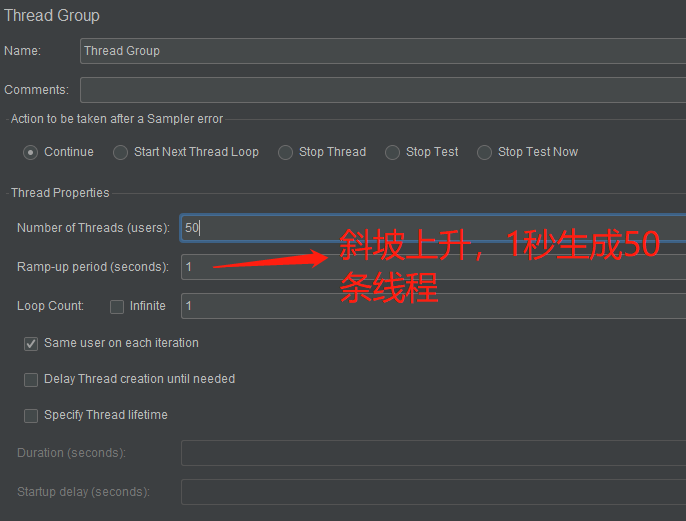
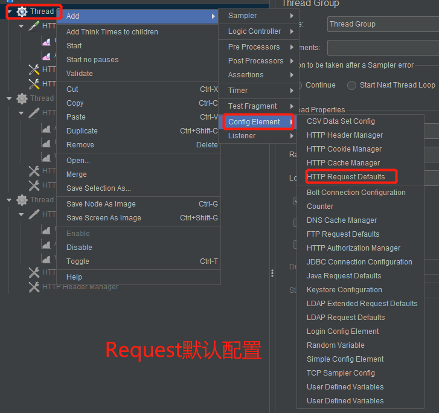
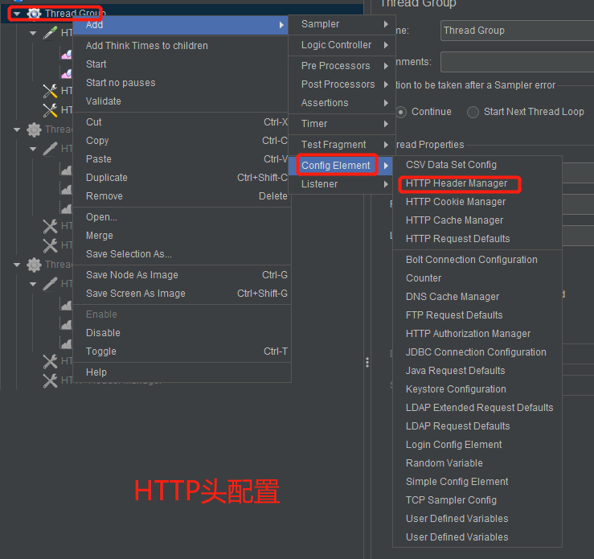
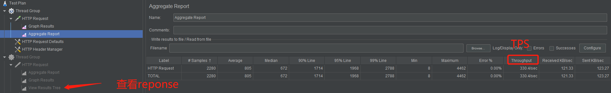
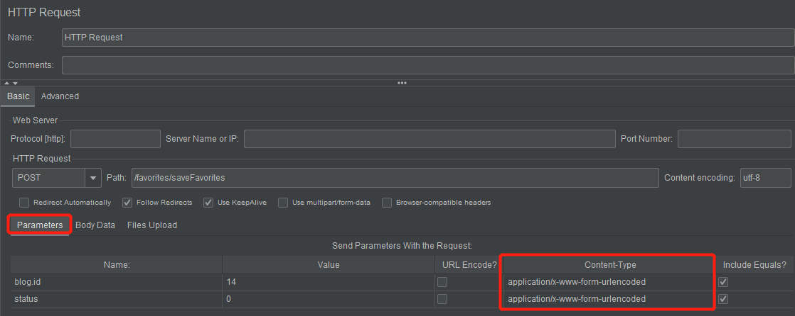

<!-- START doctoc generated TOC please keep comment here to allow auto update -->
<!-- DON'T EDIT THIS SECTION, INSTEAD RE-RUN doctoc TO UPDATE -->
**Table of Contents**  *generated with [DocToc](https://github.com/thlorenz/doctoc)*

- [线程组配置](#%E7%BA%BF%E7%A8%8B%E7%BB%84%E9%85%8D%E7%BD%AE)
- [Request 默认配置](#request-%E9%BB%98%E8%AE%A4%E9%85%8D%E7%BD%AE)
- [HTTP头配置](#http%E5%A4%B4%E9%85%8D%E7%BD%AE)
- [聚合报告](#%E8%81%9A%E5%90%88%E6%8A%A5%E5%91%8A)
- [HTTP请求参数](#http%E8%AF%B7%E6%B1%82%E5%8F%82%E6%95%B0)

<!-- END doctoc generated TOC please keep comment here to allow auto update -->

## 线程组配置

## Request 默认配置

## HTTP头配置

## 聚合报告

## HTTP请求参数

