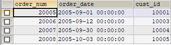

<!-- START doctoc generated TOC please keep comment here to allow auto update -->
<!-- DON'T EDIT THIS SECTION, INSTEAD RE-RUN doctoc TO UPDATE -->


- [简介](#%E7%AE%80%E4%BB%8B)
  - [数据类型](#%E6%95%B0%E6%8D%AE%E7%B1%BB%E5%9E%8B)
    - [整型](#%E6%95%B4%E5%9E%8B)
    - [浮点型](#%E6%B5%AE%E7%82%B9%E5%9E%8B)
    - [定点数](#%E5%AE%9A%E7%82%B9%E6%95%B0)
    - [字符串](#%E5%AD%97%E7%AC%A6%E4%B8%B2)
    - [二进制数据（BLOB）](#%E4%BA%8C%E8%BF%9B%E5%88%B6%E6%95%B0%E6%8D%AEblob)
    - [日期时间类型](#%E6%97%A5%E6%9C%9F%E6%97%B6%E9%97%B4%E7%B1%BB%E5%9E%8B)
- [基本命令](#%E5%9F%BA%E6%9C%AC%E5%91%BD%E4%BB%A4)
  - [启动](#%E5%90%AF%E5%8A%A8)
  - [数据库操作](#%E6%95%B0%E6%8D%AE%E5%BA%93%E6%93%8D%E4%BD%9C)
  - [表](#%E8%A1%A8)
  - [检索](#%E6%A3%80%E7%B4%A2)
  - [排序](#%E6%8E%92%E5%BA%8F)
  - [过滤](#%E8%BF%87%E6%BB%A4)
    - [不匹配检查：](#%E4%B8%8D%E5%8C%B9%E9%85%8D%E6%A3%80%E6%9F%A5)
    - [范围查询：](#%E8%8C%83%E5%9B%B4%E6%9F%A5%E8%AF%A2)
    - [空值检查](#%E7%A9%BA%E5%80%BC%E6%A3%80%E6%9F%A5)
    - [计算次序](#%E8%AE%A1%E7%AE%97%E6%AC%A1%E5%BA%8F)
    - [IN 操作符](#in-%E6%93%8D%E4%BD%9C%E7%AC%A6)
    - [NOT操作符](#not%E6%93%8D%E4%BD%9C%E7%AC%A6)
    - [LIKE操作符](#like%E6%93%8D%E4%BD%9C%E7%AC%A6)
    - [LIMIT](#limit)
    - [正则表达式](#%E6%AD%A3%E5%88%99%E8%A1%A8%E8%BE%BE%E5%BC%8F)
- [计算字段](#%E8%AE%A1%E7%AE%97%E5%AD%97%E6%AE%B5)
  - [拼接字段](#%E6%8B%BC%E6%8E%A5%E5%AD%97%E6%AE%B5)
  - [计算字段](#%E8%AE%A1%E7%AE%97%E5%AD%97%E6%AE%B5-1)
- [函数](#%E5%87%BD%E6%95%B0)
  - [文本处理](#%E6%96%87%E6%9C%AC%E5%A4%84%E7%90%86)
  - [日期处理函数](#%E6%97%A5%E6%9C%9F%E5%A4%84%E7%90%86%E5%87%BD%E6%95%B0)
  - [数值处理函数](#%E6%95%B0%E5%80%BC%E5%A4%84%E7%90%86%E5%87%BD%E6%95%B0)
- [汇总数据](#%E6%B1%87%E6%80%BB%E6%95%B0%E6%8D%AE)
  - [聚集函数](#%E8%81%9A%E9%9B%86%E5%87%BD%E6%95%B0)
- [分组](#%E5%88%86%E7%BB%84)
  - [过滤分组](#%E8%BF%87%E6%BB%A4%E5%88%86%E7%BB%84)
  - [having和where区别](#having%E5%92%8Cwhere%E5%8C%BA%E5%88%AB)
  - [SELECT 子句顺序](#select-%E5%AD%90%E5%8F%A5%E9%A1%BA%E5%BA%8F)
- [子查询](#%E5%AD%90%E6%9F%A5%E8%AF%A2)
- [连接](#%E8%BF%9E%E6%8E%A5)
  - [内连接](#%E5%86%85%E8%BF%9E%E6%8E%A5)
  - [自连接](#%E8%87%AA%E8%BF%9E%E6%8E%A5)
  - [自然连接](#%E8%87%AA%E7%84%B6%E8%BF%9E%E6%8E%A5)
  - [内连接](#%E5%86%85%E8%BF%9E%E6%8E%A5-1)
  - [外连接](#%E5%A4%96%E8%BF%9E%E6%8E%A5)
  - [多表连接](#%E5%A4%9A%E8%A1%A8%E8%BF%9E%E6%8E%A5)
- [组合查询](#%E7%BB%84%E5%90%88%E6%9F%A5%E8%AF%A2)
  - [UNION](#union)
- [全文搜索](#%E5%85%A8%E6%96%87%E6%90%9C%E7%B4%A2)
- [表操作](#%E8%A1%A8%E6%93%8D%E4%BD%9C)
  - [创建表](#%E5%88%9B%E5%BB%BA%E8%A1%A8)
  - [更新表](#%E6%9B%B4%E6%96%B0%E8%A1%A8)
  - [约束](#%E7%BA%A6%E6%9D%9F)
  - [删除表](#%E5%88%A0%E9%99%A4%E8%A1%A8)
  - [重命名表](#%E9%87%8D%E5%91%BD%E5%90%8D%E8%A1%A8)
- [列操作](#%E5%88%97%E6%93%8D%E4%BD%9C)
  - [插入数据](#%E6%8F%92%E5%85%A5%E6%95%B0%E6%8D%AE)
  - [更新数据](#%E6%9B%B4%E6%96%B0%E6%95%B0%E6%8D%AE)
  - [删除数据](#%E5%88%A0%E9%99%A4%E6%95%B0%E6%8D%AE)
  - [truncate、delete与drop区别](#truncatedelete%E4%B8%8Edrop%E5%8C%BA%E5%88%AB)
- [引擎](#%E5%BC%95%E6%93%8E)
- [视图](#%E8%A7%86%E5%9B%BE)
  - [应用](#%E5%BA%94%E7%94%A8)
  - [限制](#%E9%99%90%E5%88%B6)
  - [语法](#%E8%AF%AD%E6%B3%95)
  - [简化复杂连接](#%E7%AE%80%E5%8C%96%E5%A4%8D%E6%9D%82%E8%BF%9E%E6%8E%A5)
  - [更新视图](#%E6%9B%B4%E6%96%B0%E8%A7%86%E5%9B%BE)
- [存储过程](#%E5%AD%98%E5%82%A8%E8%BF%87%E7%A8%8B)
  - [创建](#%E5%88%9B%E5%BB%BA)
  - [调用](#%E8%B0%83%E7%94%A8)
  - [删除](#%E5%88%A0%E9%99%A4)
  - [参数](#%E5%8F%82%E6%95%B0)
  - [实例](#%E5%AE%9E%E4%BE%8B)
  - [检查](#%E6%A3%80%E6%9F%A5)
- [游标](#%E6%B8%B8%E6%A0%87)
  - [创建游标](#%E5%88%9B%E5%BB%BA%E6%B8%B8%E6%A0%87)
  - [使用游标](#%E4%BD%BF%E7%94%A8%E6%B8%B8%E6%A0%87)
- [触发器](#%E8%A7%A6%E5%8F%91%E5%99%A8)
  - [创建](#%E5%88%9B%E5%BB%BA-1)
  - [删除](#%E5%88%A0%E9%99%A4-1)
  - [使用触发器](#%E4%BD%BF%E7%94%A8%E8%A7%A6%E5%8F%91%E5%99%A8)
- [事务处理](#%E4%BA%8B%E5%8A%A1%E5%A4%84%E7%90%86)
  - [保留点](#%E4%BF%9D%E7%95%99%E7%82%B9)
- [权限](#%E6%9D%83%E9%99%90)
  - [管理用户](#%E7%AE%A1%E7%90%86%E7%94%A8%E6%88%B7)
- [优化性能](#%E4%BC%98%E5%8C%96%E6%80%A7%E8%83%BD)
- [索引](#%E7%B4%A2%E5%BC%95)
  - [创建索引](#%E5%88%9B%E5%BB%BA%E7%B4%A2%E5%BC%95)
  - [删除索引](#%E5%88%A0%E9%99%A4%E7%B4%A2%E5%BC%95)
  - [查看索引](#%E6%9F%A5%E7%9C%8B%E7%B4%A2%E5%BC%95)

<!-- END doctoc generated TOC please keep comment here to allow auto update -->

## 简介

SQL 结构化查询语言。

### 数据类型

主要包括以下五大类：

整数类型：BIT、BOOL、TINY INT、SMALL INT、MEDIUM INT、 INT、 BIG INT

浮点数类型：FLOAT、DOUBLE、DECIMAL

字符串类型：CHAR、VARCHAR、TINY TEXT、TEXT、MEDIUM TEXT、LONGTEXT、TINY BLOB、BLOB、MEDIUM BLOB、LONG BLOB

日期类型：Date、DateTime、TimeStamp、Time、Year

其他数据类型：BINARY、VARBINARY、ENUM、SET、Geometry、Point、MultiPoint、LineString、MultiLineString、Polygon、GeometryCollection等

#### 整型

| MySQL数据类型 | 含义（有符号）                       |
| ------------- | ------------------------------------ |
| tinyint(m)    | 1个字节 范围(-128~127)               |
| smallint(m)   | 2个字节 范围(-32768~32767)           |
| mediumint(m)  | 3个字节 范围(-8388608~8388607)       |
| int(m)        | 4个字节 范围(-2147483648~2147483647) |
| bigint(m)     | 8个字节 范围(+-9.22*10的18次方)      |

int(m) m 用于指定显示宽度，int(5)表示5位数的宽度。注意显示宽度属性不能控制列可以存储的值范围，显示宽度属性通常由应用程序用于格式化整数值。

#### 浮点型

| MySQL数据类型 | 含义                                  |
| ------------- | ------------------------------------- |
| float(m,d)    | 单精度浮点型  4字节  m总个数，d小数位 |
| double(m,d)   | 双精度浮点型  8字节  m总个数，d小数位 |

浮点型数据类型会有精度丢失的问题，比如小数位设置6位，存入0.45，0.45转换成二进制是个无限循环小数0.01110011100...，无法准确表示，存储的时候会发生精度丢失。

不论是定点还是浮点类型，如果用户指定的精度超出精度范围，则会四舍五入进行处理。

#### 定点数

浮点型在数据库中存放的是近似值，而定点类型在数据库中存放的是精确值，不会丢失精度。定点数以字符串形式存储。

decimal(m,d) 参数m是总个数，d是小数位。

#### 字符串

| MySQL数据类型 | 含义                            |
| ------------- | ------------------------------- |
| char(n)       | 固定长度，最多255个字节         |
| varchar(n)    | 可变长度，最多65535个字节       |
| tinytext      | 可变长度，最多255个字节         |
| text          | 可变长度，最多65535个字节       |
| mediumtext    | 可变长度，最多2的24次方-1个字节 |
| longtext      | 可变长度，最多2的32次方-1个字节 |

查询速度：char > varchar > text

char：定长，效率高，一般用于固定长度的表单提交数据存储 ；例如：身份证号，手机号，电话，密码等。char长度不足时，在右边使用空格填充，而varchar值保存时只保存需要的字符数。

varchar：不定长，效率偏低，内容开头用1到2个字节表示实际长度（长度超过255时需要2个字节），因此最大长度不能超过65535。

nvarchar（存储的是Unicode数据类型的字符）不管是一个字符还是一个汉字，都存为2个字节 ，一般用作中文或者其他语言输入，这样不容易乱码 ；varchar存储汉字是2个字节，其他字符存为1个字节 ，varchar适合输入英文和数字。

text：不需要指定存储长度，能用varchar就不用text。

#### 二进制数据（BLOB）

二进制数据类型可存储任何数据，如图像、多媒体、文档等。

BLOB和TEXT存储方式不同，TEXT以文本方式存储，英文存储区分大小写；而Blob是以二进制方式存储，不区分大小写。

#### 日期时间类型

| MySQL数据类型 | 含义                          |
| ------------- | ----------------------------- |
| date          | 日期 '2008-12-2'              |
| time          | 时间 '12:25:36'               |
| datetime      | 日期时间 '2008-12-2 22:06:44' |
| timestamp     | 自动存储记录修改时间          |

若定义一个字段为timestamp，这个字段里的时间数据会随其他字段修改的时候自动刷新，所以这个数据类型的字段可以存放这条记录最后被修改的时间。


## 基本命令

### 启动

启动服务：`service mysqld start`

关闭服务：`service mysqld stop`

启动客户端：`mysql -uroot -p`  -u 后不要有空格（Ubuntu有空格）

### 数据库操作

```mysql
SHOW DATABASES;
CREATE DATABASE db_name;
USE db_name;
DROP DATABASE db_name;
```

### 表

创建表：`create table user (id int, name varchar(10))`

清空表数据：`truncate table user;`

查看表结构：`desc table_name/select columns from table_name`

`SHOW CREATE db` | `SHOW CREATE table`：显示创建特定数据库或表的MySQL语句

### 检索

检索不同的行：

```mysql
SELECT DISTINCT vend_id
FROM products;
```

限制结果：

```mysql
SELECT prod_name
FROM products
LIMIT 0, 5; #开始位置，行数|返回从第0行开始的5行数据
```

### 排序

```mysql
SELECT prod_name
FROM products
ORDER BY prod_name, prod_price DESC; #先按名称排序，再按价格排序 | DESC降序排列，默认ASC升序
```

找出最贵的物品：

```mysql
SELECT prod_price
FROM products
ORDER BY prod_price DESC
LIMIT 1; # 仅返回一行
```

子句顺序：FORM -- ORDER BY -- LIMIT，顺序不对会报错。

### 过滤

子句操作符：

| 操作符  | 说明     |
| ------- | -------- |
| =       | 等于     |
| <>      | 不等于   |
| !=      | 不等于   |
| <       | 小于     |
| <=      | 小于等于 |
| BETWEEN | 两值之间 |

#### 不匹配检查：

```mysql
SELECT vend_id, prod_name
FROM products
WHERE vend_id <> 1003;
```

#### 范围查询：

```mysql
SELECT prod_name, prod_price
FROM products
WHERE prod_price BETWEEN 5 AND 10;
```

#### 空值检查

```mysql
SELECT prod_name
FROM products
WHERE prod_price IS NULL;
```

#### 计算次序

```mysql
SELECT prod_name, prod_price
FROM products
WHERE vend_id = 1002 OR vend_id = 1003 AND prod_price >= 10; # AND优先级大于OR
```

#### IN 操作符

```mysql
SELECT prod_name, product_price
FROM products
WHERE vend_id IN (1002, 1003)
ORDER BY prod_name;
```

IN操作符一般比OR操作符清单执行更快。IN的最大优点是可以包含其他SELECT语句，使得能够更动态地建立WHERE子句。

#### NOT操作符

MySQL支持使用NOT 对IN 、BETWEEN 和EXISTS子句取反。

```mysql
SELECT prod_name, product_price
FROM products
WHERE vend_id NOT IN (1002, 1003)
```

#### LIKE操作符

% 匹配0到多个任意字符。

```mysql
SELECT prod_id, prod_name
FROM products
WHERE prod_name LIKE '%jet%';
```

_ 匹配单个字符。

```mysql
SELECT prod_id, prod_name
FROM products
WHERE prod_name LIKE '_jet_';
```

通配符搜索比其他简单搜索耗时，不能过度使用通配符。

#### LIMIT

limit 0,4 ：从第0条记录开始，取4条

#### 正则表达式

OR 匹配：

```mysql
SELECT prod_name
FROM products
WHERE prod_name REGEXP '1000|2000'
ORDER BY prod_name;
```

匹配特定字符：

```mysql
SELECT prod_name
FROM products
WHERE prod_name REGEXP '[123] Rely' #匹配1或2或3 [^123]取反
ORDER BY prod_name;
```

匹配范围：

```mysql
SELECT prod_name
FROM products
WHERE prod_anem REGEXP '[1-5] Ton';#匹配1-5任意一个数字，[a-z]同理
```

匹配特殊字符：

```mysql
SELECT prod_name
FROM products
WHERE prod_anem REGEXP '\\.';#转义
```

匹配多个实例:

```mysql
SELECT prod_name
FROM products
WHERE prod_anem REGEXP '\\([0-9] sticks?\\)'; #?匹配它前面的任何字符出现0次或1次
```

匹配连着的四个数：

```mysql
SELECT prod_name
FROM products
WHERE prod_anem REGEXP '[[:digit:]]{4}'; #[:digit:]匹配任意数字
```

定位符：

| 元字符  | 说明     |
| ------- | -------- |
| ^       | 文本开始 |
| $       | 文本结束 |
| [[:<:]] | 词开始   |
| [[:>:]] | 词结束   |

查找一个数（包括小数点开始的数）开始的所有产品：

```mysql
SELECT prod_name
FROM products
WHERE prod_name REGEXP '^[0-9\\.]'
ORDER BY prod_name;
```

简单的正则表达式测试：

```mysql
SELECT 'hello' REGEXP '[0-9]';#REGEXP检查返回0或1；此处返回0
```

## 计算字段

### 拼接字段

MySQL使用Concat()函数实现拼接。

```mysql
SELECT Concat(RTrim(vend_name), ' (', vend_country, ')') #RTrim()去掉右边空格 | Trim()去掉两边空格
FROM vend_name
ORDER BY vend_name;
```

返回值：`ACME (USA)`
使用别名：`SELECT dept AS department FROM t_dept;`

### 计算字段

```mysql
SELECT prod_id, quantity, item_price, quantity*item_price AS expanded_price
FROM orderitems
WHERE order_num = 2005;
```

## 函数

### 文本处理

```mysql
SELECT vend_name, Upper(vend_name) AS vend_name_upcase
FROM vendors
ORDER BY vend_name;
```

Soundex()函数，匹配所有同音字符串。

```mysql
SELECT cust_name, cust_contact
FROM customers
WHERE Soundex(cust_contact) = Soundex('Y Lie');
```

返回数据：`Tyson Y lee`

### 日期处理函数


查找2005年9月的所有订单：

```mysql
SELECT cust_id, order_num
FROM orders
WHERE Date(order_date) BETWEEN '2005-09-01' AND '2005-09-30';
```

或者

```mysql
SELECT cust_id, order_num
FROM orders
WHERE Year(order_date) = 2005 AND Month(order_date) = 9;
```

### 数值处理函数


## 汇总数据

### 聚集函数

Sum:求和
Avg:求平均数
Max:求最大值
 Min:求最小值
 Count:求记录

```mysql
SELECT SUM(item_price*quanlity) AS total_price
FROM orderitems
WHERE order_num = 2005;
```

聚集不同值：

```mysql
SELECT AVG(DISTINCT prod_price) AS avg_price #只考虑不同价格
FROM products
WHERE vend_id = 1003;
```

## 分组

单独地使用group  by没意义，它只能显示出每组记录的第一条记录。

```mysql
SELECT * FROM orders
GROUP BY cust_id;
```



除聚集计算语句外，SELECT语句中的每个列都必须在GROUP BY子句中给出。

```mysql
SELECT vend_id, COUNT(*) AS num_prods #vend_id在GROUP BY子句给出
FROM products
GROUP BY vend_id;
```

GROUP BY子句必须出现在WHERE子句之后，ORDER BY子句之前。

### 过滤分组

having 用来分组查询后指定一些条件来输出查询结果，having作用和where类似，但是having只能用在group  by场合，并且必须位于group  by之后order  by之前。

```mysql
SELECT cust_id, COUNT(*) AS orders
FROM orders
GROUP BY cust_id
HAVING COUNT(*) >= 2;
```

### having和where区别

```mysql
SELECT cust_id FROM orders GROUP BY cust_id HAVING COUNT(cust_id) >= 2;
SELECT cust_id FROM orders GROUP BY cust_id WHERE COUNT(cust_id) >= 2; #Error Code : 1064
```

第一个sql语句可以执行，但是第二个会报错。

- WHERE子句不起作用，因为过滤是基于分组聚集值而不是特定行值的。

- 二者作用的对象不同，where子句作用于表和视图，having作用于组。

- WHERE在数据分组前进行过滤，HAVING在数据分组后进行过滤。

```mysql
SELECT vend_id, COUNT(*) AS num_prods
FROM products
WHERE prod_price >= 10
GROUP BY vend_id
HAVING COUNT(*) >= 2;
```

WHERE子句过滤所有prod_price至少为10的行。然后按vend_id分组数据，HAVING子句过滤计数为2或2以上的分组。

### SELECT 子句顺序

```mysql
SELECT
FROM
WHERE
GROUP BY
HAVING
ORDER BY
LIMIT
```


## 子查询

由于性能的限制，不能嵌套太多的子查询。

```mysql
SELECT cust_id
FROM orders
WHERE order_num IN (SELECT order_num
                    FROM orderitems
                    WHERE prod_id = 'TNT2');
```


## 连接

### 内连接

找出供应商生产的产品。

```mysql
SELECT vend_name, prod_name
FROM vendors INNER JOIN products
ON vendors.vend_id = products.vend_id; #连接条件使用on子句
```

等价于：

```mysql
SELECT vend_name, prod_name
FROM vendors, products
WHERE vendors.vend_id = products.vend_id;
```

没有给出连接条件的话，会得到两张表的笛卡尔积。

### 自连接

找出生产nike的供应商生产的所有物品。

```mysql
SELECT prod_id, prod_name
FROM products AS p1, products AS p2
WHERE p1.vend_id = p2.vend_id
	AND p2.prod_id = 'nike';
```

### 自然连接

natural join是对两张表中字段名和数据类型都相同的字段进行**等值连接**，并返回符合条件的结果 。

```mysql
SELECT * FROM role NATURAL JOIN user_role;
```

返回结果：


### 内连接

显示符合连接条件的记录。没有设置连接条件则返回笛卡尔积的结果。join 默认是 inner join。

```mysql
SELECT * FROM role INNNER JOIN user_role
```

返回结果：


join…using(column)按指定的属性做等值连接。
join…on tableA.column1 = tableB.column2 指定条件。

```mysql
SELECT * FROM role INNER JOIN user_role ON role.role_id = user_role.role_id
```

返回结果：


### 外连接

左外联接（Left Outer Join）：除了匹配2张表中相关联的记录外，还会匹配左表中剩余的记录，右表中未匹配到的字段用NULL表示。
右外联接（Right Outer Join）：除了匹配2张表中相关联的记录外，还会匹配右表中剩余的记录，左表中未匹配到的字段用NULL表示。
在判定左表和右表时，要根据表名出现在Outer Join的左右位置关系。

查找所有客户及其订单，包括没有下过订单的客户。使用左外连接，保留左边表的所有记录。

```mysql
SELECT customer.cust_id, order.order_num
FROM customers LEFT OUTER JOIN orders
ON customers.cust_id = order.cust_id;
```

### 多表连接

```mysql
SELECT goal.player, eteam.teamname, game.stadium, game.mdate
FROM game JOIN goal
ON game.id = goal.matchid 
JOIN eteam
ON eteam.id = goal.teamid
WHERE eteam.id = 'GRE'
```


## 组合查询

### UNION

UNION中的每个查询必须包含相同的列、表达式或聚集函数。列数据类型必须兼容。

```mysql
SELECT vend_id, prod_id
FROM products
WHERE prod_price <= 5
UNION
SELECT vend_id, prod_id
FROM products
WHERE vend_id IN (1001, 1002);
-- 等价于
SELECT vend_id, prod_id
FROM products
WHERE prod_price < = 5
	AND vend_id IN (1001, 1002);
```

UNION 默认会去掉重复的行，使用 UNION ALL可以返回所有匹配行。


## 全文搜索

为了进行全文本搜索，必须索引被搜索的列，而且要随着数据的改变不断地重新索引。在对表列进行适当设计后，MySQL会自动进行所有的索引和重新索引。

启动全文搜索（仅在MyISAM数据库引擎中支持全文本搜索）：

```mysql
CREATE TABLE productnotes
(
	note_id int NOT NULL AUTO_INCREMENT,
    note_text text NULL,
    PRIMARY KEY(note_id),
    FULLTEXT(note_text)
) ENGINE=MyISAM;
```

在定义之后，MySQL自动维护该索引。在增加、更新或删除行时，索引随之自动更新。

不要在导入数据时使用FULLTEXT，。应该首先导入所有数据，然后再修改表，定义FULLTEXT，这样可以更快导入数据。

使用全文搜索：

```mysql
SELECT note_text
FROM productnotes
WHERE Match(note_text) Against('shoe'); #Match指定搜索列，Against指定搜索词
```

返回结果：`nike shoes is good`，搜索不区分大小写。

全文搜索会对返回结果进行排序，具有高等级的行先返回：

```mysql
SELECT note_text,
	Match(note_text) Against('shoes') AS rank #等级由MySQL根据行中词的数目、唯一词的数目、整个索引中词的总数以及包含该词的行的数目计算出来。
FROM productnotes;
```

全文搜索数据是有索引的，速度快。


## 表操作

### 创建表

```mysql
CREATE TABLE productnotes
(
	note_id int NOT NULL AUTO_INCREMENT,
    note_text text NULL,
    quanlity int NOT NULL DEFAULT 1, # 默认值，只支持常量
    PRIMARY KEY(note_id),
    FULLTEXT(note_text)
) ENGINE=MyISAM;
```

主键中只能使用NOT NULL值的列。

### 更新表

数据库表的更改不能撤销，应先做好备份。

添加列：

```mysql
ALTER TABLE vendors
ADD vend_phone CHAR(20);
```

删除列：

```mysql
ALTER TABLE vendors
DROP COLUMN vend_phone;
```

更改列属性：

```mysql
ALTER TABLE vendors
MODIFY vend_phone CHAR(16);
```

复杂的表结构更改一般需要手动删除过程：

- 用新的列布局创建一个新表；

- 使用INSERT SELECT语句，从旧表复制数据到新表；

- 检验包含所需数据的新表；
- 重命名旧表（如果确定，可以删除它）；

- 用旧表原来的名字重命名新表；

- 重新创建触发器、存储过程、索引和外键。

### 约束

添加主键约束：

```mysql
ALTER TABLE vendors
ADD CONSTRAINT pk_vendors PRIMARY KEY(vend_id);
```

删除主键约束：

```mysql
ALTER TABLE vendors
DROP PRIMARY KEY;
```

添加外键约束：

```mysql
ALTER TABLE products
ADD FOREIGN KEY(vendor_id) REFERENCES vendors(vendor_id);
```

删除外键约束：

```mysql
ALTER TABLE products DROP FOREIGN KEY vendor_id;
```

### 删除表

`DROP TABLE cumstomers`

### 重命名表

`RENAME TABLE cusmtomers TO cust`


## 列操作

### 插入数据

MySQL用单条INSERT语句处理多个插入比使用多条INSERT语句快。

```mysql
INSERT INTO customers(cust_name, cust_city)
	VALUES('Tyson', 'GD'),
		('sophia','GZ');
```

INSERT操作可能很耗时（特别是有很多索引需要更新时），而且它可能降低等待处理的SELECT语句的性能。降低INSERT语句的优先级：`INSERT LOW_PRIORITY INTO`

### 更新数据

如果用UPDATE语句更新多行，并且在更新这些行中的一行或多行时出一个现错误，则整个UPDATE操作被取消。为了在发生错误时也继续进行更新，可使用IGNORE关键字：`UPDATE IGNORE customers...`

```mysql
UPDATE customers
SET cust_city = NULL
WHERE cust_id = 1005;
```

返回值是受影响的记录数。

### 删除数据

如果想从表中删除所有行，不要使用DELETE。可使用TRUNCATE TABLE语句，它完成相同的工作，但速度更快（TRUNCATE实际是删除原来的表并重新创建一个表，而不是逐行删除表中的数据）。

```mysql
DELETE FROM customers
WHERE cust_id = 1006;
```

如果执行DELETE语句而不带WHERE子句，表的所有数据都将被删除。MySQL没有撤销操作，应该非常小心地使用UPDATE和DELETE。

delete使用别名的时候，要在delete和from间加上删除表的别名。

```mysql
DELETE a #加上删除表的别名
FROM table1 a
WHERE a.status = 0
AND EXISTS
	(SELECT b.id FROM table2 b
    WHERE b.id = a.id);
```

### truncate、delete与drop区别

**相同点：**

1. truncate和不带where子句的delete、以及drop都会删除表内的数据。

2. drop、truncate都是DDL语句(数据定义语言)，执行后会自动提交。

**不同点：**

1. truncate 和 delete 只删除数据不删除表的结构；drop 语句将删除表的结构被依赖的约束、触发器、索引；

2. 速度，一般来说: drop> truncate > delete。


## 引擎

InnoDB是一个可靠的事务处理引擎，它不支持全文本搜索；

MEMORY在功能等同于MyISAM，但由于数据存储在内存（不是磁盘）中，速度很快（特别适合于临时表）；

MyISAM是一个性能极高的引擎，它支持全文本搜索，但不支持事务处理。

外键不能跨引擎，用一个引擎的表不能引用使用不同引擎的表的外键。


## 视图

视图为虚拟的表。视图提供了一种MySQL的SELECT语句层次的封装，可用来简化数据处理以及重新格式化基础数据或保护基础数据。
### 应用

- 重用SQL语句。
- 保护数据。可以给用户授予表的特定部分的访问权限而不是整个表的访问权限。
- 更改数据格式和表示。视图可返回与底层表的表示和格式不同的数据。

### 限制

- 与表一样，视图必须唯一命名
- 视图不能索引，也不能有关联的触发器或默认值。
- 视图可以和表一起使用。例如，编写一条联结表和视图的SELECT语句。
- ORDER BY可以用在视图中，但如果从该视图检索数据SELECT中也含有ORDER BY，那么该视图中的ORDER BY将被覆盖。

### 语法

`CREATE VIEW`：创建视图

`SHOW CREATE VIEW viewname`：查看创建视图的语句

`DROP VIEW viewname`：删除视图

`CREATE ORREPLACE VIEW`：更新视图，相当于先用`DROP`再用`CREATE`
### 简化复杂连接
创建一个视图，返回订购了任意产品的客户列表。
```mysql
CREATE VIEW productcustomers AS
SELECT cust_name, orders, orderitems
FROM customers, orders, orderitems
WHERE orderitems.order_num = orders.order_num
	AND customers.cust_id = orders.cust_id;
```
使用视图：
```mysql
SELECT cust_name, cust_contact
FROM productcustomers
WHERE prod_id = 'nike';
```
### 更新视图
对视图增加或删除行，实际上是对其基表增加或删除行。视图主要用于数据检索。


## 存储过程

为以后的使用而保存的一条或多条MySQL语句的集合。可将其视为批文件。
为什么使用存储过程：

- 把复杂处理进行封装，简化复杂的操作；
- 提高性能，存储过程比单独SQL语句更快；
### 创建
返回产品平均价格的存储过程：
```mysql
CREATE PROCEDURE productpricing() # 可以接受参数
BEGIN
	SELECT Avg(prod_price) AS priceaverage
	FROM products;
END;
```
BEGIN/END 用来限定存储过程体。此段代码仅创建了存储过程，未执行。
### 调用
`CALL productpricing()`
### 删除
存储过程在创建之后，被保存在服务器上以供使用，直至被删除。
`DROP PROCEDURE productpricing IF EXISTS`
### 参数
MySQL支持IN（传递给存储过程）、OUT（从存储过程传出）和INOUT（对存储过程传入和传出）类型的参数。
接受订单号并返回该订单的金额：
```mysql
CREATE PROCEDURE ordertotal(
	IN ordernum INT,
	OUT ordersum DECIMAL(8, 2)
)
BEGIN
	SELECT Sum(item_price * quantity)
	FROM orderitems
	WHERE order_num = ordernum
	INTO ordersum;
END;
```
调用存储过程：`CALL ordertotal(20, @total);`
显示订单金额：`SELECT @total;`
### 实例
获取订单税后金额（订单金额+税收）。
```mysql
CREATE PROCEDURE ordertotal(
	IN onum INT,
	IN taxable BOOLEAN, # 是否计税
	OUT ototal DECIMAL(8, 2)
) COMMENT 'order total, adding tax'
BEGIN
	DECLARE total DECIMAL(8, 2);
	DECLARE taxrate INT DEFAULT 6;

	SELECT Sum(item_price * quanlity)
	FROM orderitems
	WHERE order_num = onum
	INTO total;

	IF taxable THEN
		SELECT total + (total / 100 * taxrate) INTO total;
	END IF;
	-- SELECT total INTO ototal;
END;
```
调用存储过程：
```mysql
CALL ordertotal(20005, 1, @total);
SELECT @total;
```
### 查看
创建存储过程的 CREATE 语句。
```mysql
SHOW CREATE PROCEDURE ordertotal;
```
获得包括何时、由谁创建等详细信息的存储过程列表，使用`SHOW PROCEDURE STATUS LIKE 'ordertotal';`

查看存储过程状态：

```mysql
SHOW PROCEDURE status;
```

## 游标
存储了游标之后，应用程序可以根据需要滚动或浏览其中的数据。MySQL游标只能用于存储过程（和函数）。
### 创建游标
DECLARE 命名游标。存储过程处理完成后，游标便消失（游标只存在于存储过程）。定义游标之后，便可以打开它。
```mysql
CREATE PROCEDURE processorders()
BEGIN
	DECLARE ordernumbers CURSOR
	FOR
	SELECT order_num FROM orders;
END;
```
### 使用游标
`OPEN ordernumbers` 打开游标。
`CLOSE ordernumbers` CLOSE释放游标使用的所有内部内存和资源。
```mysql
CREATE PROCEDURE processorders()
BEGIN

	DECLARE done BOOLEAN DEFAULT 0;
	DECLARE o INT;
	DECLARE t DECIMAL(8, 2);
	
	DECLARE ordernumbers CURSOR
	FOR
	SELECT order_num FROM orders;
	
	DECLARE CONTINUE HANDLER FOR SQLSTATE '02000' SET done=1; #游标移到最后
	
	CREATE TABLE IF NOT EXISTS ordertotals
		(order_num INT, total DECIMAL(8,2));
	-- 打开游标
	OPEN ordernumbers;
	
	-- 循环
	REPEAT
	FETCH ordernumbers INTO o;
	CALL ordertotal(o, 1, t);
	
	-- 插入订单号和订单金额
	INSERT INTO ordertotals(order_num, total)
	VALUES(o, t);
	
	-- done为1结束循环
	UNTIL done END REPEAT;
	
	CLOSE ordernumbers;
END;
```
存储过程还在运行中创建了一个新表，。这个表将保存存储过程生成的结果。FETCH取每个order_num，然后用CALL执行另一个存储过程，计算每个订单税后金额。最后，用INSERT保存每个订单的订单号和金额。


## 触发器

提供SQL语句自动执行的功能。DELETE/INSERT/UPDATE支持触发器，其他SQL语句不支持。
### 创建
创建触发器四要素：1.唯一的触发器名（MySQL5规定触发器名在表中唯一，数据库没要求）；2.触发器关联的表；3.相应的SQL语句；4.何时执行（处理之前或者之后）。
```mysql
CREATE TRIGGER newproduct AFTER INSERT ON products #插入之后执行
FOR EACH ROW SELECT 'product added'; #对每个插入行执行
```
只有表支持触发器，视图不支持。单一触发器不能与多个事件或多个表关联，如果需要对INSERT和UPDATE操作执行触发器，则应该定义两个触发器。
### 删除
`DROP TRIGGER newproduct`

### 使用触发器

INSERT 触发器可饮用名为 NEW  的虚拟表，访问被插入的行。NEW中的值也可以被更新（允许更改被插入的值）。

```mysql
CREATE TRIGGER neworder AFTER INSERT ON order
FOR EACH ROW SELECT NEW.order_num; #返回新的订单号
```

DELETE 触发器可以引用名为 OLD 的虚拟表，访问被删除的行。OLD中的值全都是只读的，不能更新。

```mysql
CREATE TRIGGER deleteorder BEFORE DELETE ON orders
FOR EACH ROW
BEGIN
	INSERT INTO archive_orders(order_num, cust_id)
	VALUES(OLD.order_num, OLD.cust_id);
END;
```

订单删除之前保存订单信息到存档表。

UPDATE 触发器可以引用名为 OLD 的虚拟表访问以前的值，引用一个名为NEW的虚拟表访问新更新的值。NEW 值可被更新，OLD 值是只读的。

下面的例子保证州名缩写总是大写。

```mysql
CREATE TRIGGER updatevendor BEFORE UPDATE ON vendor
FOR EACH ROW SET NEW.vend_state = Upper(NEW.vend_state);
```


## 事务处理

事务处理可以用来维护数据库的完整性。它保证成批的MySQL操作要么完全执行，要么完全不执行。

CREATE/DROP 操作不能回退，即便可以执行回退操作，回退不会有效果。

执行事务过程，一旦某个SQL失败，则之前执行成功的SQL会被自动撤销。

```mysql
START TRANSACTION;
DELETE FROM orderitems WHERE order_num = 20010;
DELETE FROM orders WHERE order_num = 20010;
COMMIT;
```

当COMMIT或ROLLBACK语句执行后，事务会自动关闭。

### 保留点

为了支持回退部分事务处理，必须能在事务处理块中合适的位置放置占位符。这样，如果需要回退，可以回退到某个占位符。

保留点在事务处理完成后自动释放。

```mysql
...
SAVEPOINT delete1;
...
ROLLBACK TO delete1;
```


## 权限

### 管理用户

MySQL用户账号和信息存储在名为mysql的MySQL数据库中。获取用户账号列表。

```mysql
USE mysql;
SELECT user FROM user;
```

创建用户账号：`CREATE USER tyson IDENTIFIED BY 'abc123'`

修改密码：`SET PASSWORD FOR tyson = Password('xxx');`，新密码需传递到Password()函数进行加密。

设置当前用户密码：`SET PASSWORD = Password('xxx');`

重命名账号：`RENAME USER tyson TO tom`

删除用户账号：`DROP USER tyson`

查看访问权限：`SHOW GRANTS FOR tyson`，返回`USAGE ON *.*`则表示没有权限。

授予访问权限：`GRANT SELECT ON mall.# TO tyson`，允许用户在mall数据库所有表使用SELECT。

撤销权限：`REVOKE SELECT, INSERT ON mall.* FROM tyson`，被撤销的访问权限必须存在，否则会出错。

GRANT和REVOKE可在几个层次上控制访问权限：
 整个服务器，使用GRANT ALL和REVOKE ALL；
 整个数据库，使用ON database.*；
 特定的表，使用ON database.table；
 特定的列；
 特定的存储过程。


## 优化性能

使用EXPLAIN语句让MySQL解释它将如何执行一条SELECT语句。

如果一个简单的WHERE子句返回结果所花的时间太长，则可以断定其中使用的某些列就是需要索引的对象。

避免使用OR。通过使用多条SELECT语句和连接它们的UNION语句，会有极大的性能改进。

LIKE很慢，最好是使用FULLTEXT而不是LIKE。

很多高性能的应用都会对关联查询进行分解，有如下的优势：
1 、让缓存效率更高。如果某张表很少变化，那么基于该表的查询就可以重复利用查询缓存结果。
2 、将查询分解后，执行单个查询可以减少锁的竞争。
3 、在应用层做关联，可以更容易对数据库进行拆分，更容易做到高性能和可扩展。
4 、查询本身效率也可能会有所提升。例如 IN()代替关联查询，可能比随机的关联更高效。
5 、减少冗余记录得查询。
6 、更进一步，这样做相当于在应用中实现了哈希关联，而不是使用 MySQL 得嵌套循环关联。某些场景哈希关联得效率要高很多。


## 索引

### 创建索引

ALTER TABLE用来创建普通索引、UNIQUE索引或PRIMARY KEY索引。

```mysql
ALTER TABLE table_name ADD INDEX index_name (column_list)
ALTER TABLE table_name ADD UNIQUE (column_list)
ALTER TABLE table_name ADD PRIMARY KEY (column_list)
```

CREATE INDEX可对表增加普通索引或UNIQUE索引。

```mysql
CREATE INDEX index_name ON table_name (column_list)
CREATE UNIQUE INDEX index_name ON table_name (column_list)
```

在创建索引时，可以规定索引能否包含重复值。如果不包含，则索引应该创建为PRIMARY KEY或UNIQUE索引。

### 删除索引

```mysql
DROP INDEX index_name ON talbe_name
ALTER TABLE table_name DROP INDEX index_name
ALTER TABLE table_name DROP PRIMARY KEY #只有一个主键，不需要指定索引名
```

### 查看索引

```mysql
show index from tblname;
show keys from tblname;
```

