<!-- START doctoc generated TOC please keep comment here to allow auto update -->
<!-- DON'T EDIT THIS SECTION, INSTEAD RE-RUN doctoc TO UPDATE -->
**Table of Contents**  *generated with [DocToc](https://github.com/thlorenz/doctoc)*

- [事务特性（ACID）](#%E4%BA%8B%E5%8A%A1%E7%89%B9%E6%80%A7acid)
- [数据库事务隔离级别](#%E6%95%B0%E6%8D%AE%E5%BA%93%E4%BA%8B%E5%8A%A1%E9%9A%94%E7%A6%BB%E7%BA%A7%E5%88%AB)
- [数据库范式](#%E6%95%B0%E6%8D%AE%E5%BA%93%E8%8C%83%E5%BC%8F)
  - [2NF和3NF区别](#2nf%E5%92%8C3nf%E5%8C%BA%E5%88%AB)
- [索引](#%E7%B4%A2%E5%BC%95)
  - [索引的作用](#%E7%B4%A2%E5%BC%95%E7%9A%84%E4%BD%9C%E7%94%A8)
  - [索引分类](#%E7%B4%A2%E5%BC%95%E5%88%86%E7%B1%BB)
    - [MyISAM和InnoDB索引区别](#myisam%E5%92%8Cinnodb%E7%B4%A2%E5%BC%95%E5%8C%BA%E5%88%AB)
    - [聚集索引](#%E8%81%9A%E9%9B%86%E7%B4%A2%E5%BC%95)
    - [二级索引](#%E4%BA%8C%E7%BA%A7%E7%B4%A2%E5%BC%95)
    - [覆盖索引](#%E8%A6%86%E7%9B%96%E7%B4%A2%E5%BC%95)
    - [稠密索引](#%E7%A8%A0%E5%AF%86%E7%B4%A2%E5%BC%95)
    - [稀疏索引](#%E7%A8%80%E7%96%8F%E7%B4%A2%E5%BC%95)
  - [索引失效](#%E7%B4%A2%E5%BC%95%E5%A4%B1%E6%95%88)
  - [最左匹配](#%E6%9C%80%E5%B7%A6%E5%8C%B9%E9%85%8D)
  - [前缀索引](#%E5%89%8D%E7%BC%80%E7%B4%A2%E5%BC%95)
  - [什么情况下需要建索引？什么情况下不建？](#%E4%BB%80%E4%B9%88%E6%83%85%E5%86%B5%E4%B8%8B%E9%9C%80%E8%A6%81%E5%BB%BA%E7%B4%A2%E5%BC%95%E4%BB%80%E4%B9%88%E6%83%85%E5%86%B5%E4%B8%8B%E4%B8%8D%E5%BB%BA)
- [B+树](#b%E6%A0%91)
  - [索引实例](#%E7%B4%A2%E5%BC%95%E5%AE%9E%E4%BE%8B)
  - [数据定位过程](#%E6%95%B0%E6%8D%AE%E5%AE%9A%E4%BD%8D%E8%BF%87%E7%A8%8B)
  - [不用hash的原因](#%E4%B8%8D%E7%94%A8hash%E7%9A%84%E5%8E%9F%E5%9B%A0)
  - [带有顺序访问指针的B+Tree](#%E5%B8%A6%E6%9C%89%E9%A1%BA%E5%BA%8F%E8%AE%BF%E9%97%AE%E6%8C%87%E9%92%88%E7%9A%84btree)
  - [B+树比B树更适合数据库索引](#b%E6%A0%91%E6%AF%94b%E6%A0%91%E6%9B%B4%E9%80%82%E5%90%88%E6%95%B0%E6%8D%AE%E5%BA%93%E7%B4%A2%E5%BC%95)
- [乐观锁悲观锁](#%E4%B9%90%E8%A7%82%E9%94%81%E6%82%B2%E8%A7%82%E9%94%81)
- [存储引擎](#%E5%AD%98%E5%82%A8%E5%BC%95%E6%93%8E)
  - [InnoDB](#innodb)
  - [MyISAM](#myisam)
  - [MEMORY](#memory)
  - [MyISAM和InnoDB区别](#myisam%E5%92%8Cinnodb%E5%8C%BA%E5%88%AB)
- [sql优化](#sql%E4%BC%98%E5%8C%96)
- [Mysql数据库优化](#mysql%E6%95%B0%E6%8D%AE%E5%BA%93%E4%BC%98%E5%8C%96)
- [mysql的锁](#mysql%E7%9A%84%E9%94%81)
  - [悲观锁](#%E6%82%B2%E8%A7%82%E9%94%81)
  - [乐观锁](#%E4%B9%90%E8%A7%82%E9%94%81)
- [分库分表](#%E5%88%86%E5%BA%93%E5%88%86%E8%A1%A8)
  - [垂直划分](#%E5%9E%82%E7%9B%B4%E5%88%92%E5%88%86)
  - [水平划分](#%E6%B0%B4%E5%B9%B3%E5%88%92%E5%88%86)
  - [分片规则](#%E5%88%86%E7%89%87%E8%A7%84%E5%88%99)
- [join](#join)
- [MVCC](#mvcc)
  - [实现](#%E5%AE%9E%E7%8E%B0)
  - [read view](#read-view)
  - [数据访问流程](#%E6%95%B0%E6%8D%AE%E8%AE%BF%E9%97%AE%E6%B5%81%E7%A8%8B)
  - [快照读和当前读](#%E5%BF%AB%E7%85%A7%E8%AF%BB%E5%92%8C%E5%BD%93%E5%89%8D%E8%AF%BB)
  - [select 读取锁定](#select-%E8%AF%BB%E5%8F%96%E9%94%81%E5%AE%9A)
- [分析执行计划](#%E5%88%86%E6%9E%90%E6%89%A7%E8%A1%8C%E8%AE%A1%E5%88%92)
  - [id](#id)
  - [select_type](#select_type)
  - [table](#table)
  - [partitions](#partitions)
  - [type](#type)
  - [possible_keys:](#possible_keys)
  - [key](#key)
  - [rows](#rows)
  - [filtered](#filtered)
  - [extra](#extra)
    - [filesort](#filesort)
- [尽量避免使用外键约束](#%E5%B0%BD%E9%87%8F%E9%81%BF%E5%85%8D%E4%BD%BF%E7%94%A8%E5%A4%96%E9%94%AE%E7%BA%A6%E6%9D%9F)
- [日志](#%E6%97%A5%E5%BF%97)
- [sql 执行过程](#sql-%E6%89%A7%E8%A1%8C%E8%BF%87%E7%A8%8B)
  - [Server 层基本组件介绍](#server-%E5%B1%82%E5%9F%BA%E6%9C%AC%E7%BB%84%E4%BB%B6%E4%BB%8B%E7%BB%8D)
  - [查询语句执行流程](#%E6%9F%A5%E8%AF%A2%E8%AF%AD%E5%8F%A5%E6%89%A7%E8%A1%8C%E6%B5%81%E7%A8%8B)
  - [更新语句执行过程](#%E6%9B%B4%E6%96%B0%E8%AF%AD%E5%8F%A5%E6%89%A7%E8%A1%8C%E8%BF%87%E7%A8%8B)
- [慢查询](#%E6%85%A2%E6%9F%A5%E8%AF%A2)
  - [mysqldumpslow](#mysqldumpslow)
- [其他](#%E5%85%B6%E4%BB%96)
  - [processlist](#processlist)
  - [exist和in](#exist%E5%92%8Cin)
- [查询性能优化](#%E6%9F%A5%E8%AF%A2%E6%80%A7%E8%83%BD%E4%BC%98%E5%8C%96)

<!-- END doctoc generated TOC please keep comment here to allow auto update -->


## 事务特性（ACID）

对于几个SQL语句，要么全部执行成功，要么全部执行失败。比如银行转账就是事务的典型场景。
数据库事务的三个常用命令：Begin Transaction、Commit Transaction、RollBack Transaction。

①原子性是指事务包含的所有操作要么全部成功，要么全部失败回滚。
②一致性是指一个事务执行之前和执行之后都必须处于一致性状态。比如a与b账户共有1000块，两人之间转账之后无论成功还是失败，它们的账户总和还是1000。
③隔离性。跟隔离级别相关，如read committed，一个事务只能读到已经提交的修改。
④持久性是指一个事务一旦被提交了，那么对数据库中的数据的改变就是永久性的，即便是在数据库系统遇到故障的情况下也不会丢失提交事务的操作。


## 数据库事务隔离级别

①脏读是指在一个事务处理过程里读取了另一个未提交的事务中的数据。
②不可重复读是指在对于数据库中的某行记录，一个事务范围内多次查询却返回了不同的数据值，这是由于在查询间隔，另一个事务修改了数据并提交了。
③幻读（虚读）是当某个事务在读取某个范围内的记录时，另外一个事务又在该范围内插入了新的记录，当之前的事务再次读取该范围的记录时，会产生幻行，就好像产生幻觉一样，这就是发生了幻读。

不可重复读和脏读的区别是，脏读是某一事务读取了另一个事务未提交的脏数据，而不可重复读则是读取了前一事务提交的数据。
幻读和不可重复读都是读取了另一条已经提交的事务，不同的是不可重复读的重点是修改，幻读的重点在于新增或者删除。

MySQL数据库为我们提供的四种隔离级别：
① Serializable (串行化)：通过强制事务排序，使之不可能相互冲突，从而解决幻读问题。
② Repeatable read (可重复读)：MySQL的默认事务隔离级别，它确保同一事务的多个实例在并发读取数据时，会看到同样的数据行。
③ Read committed (读已提交)：一个事务只能看见已经提交事务所做的改变。可避免脏读的发生。
④ Read uncommitted (读未提交)：所有事务都可以看到其他未提交事务的执行结果。

设置数据库的隔离级别一定要是在开启事务之前！
如果是使用JDBC对数据库的事务设置隔离级别的话，也应该是在调用Connection对象的setAutoCommit(false)方法之前。调用Connection对象的setTransactionIsolation(level)即可设置当前连接的隔离级别

查看隔离级别：

```mysql
select @@transaction_isolation;
```

设置隔离级别：

```mysql
set session transaction isolation level read uncommitted;
```


## 数据库范式

- 第一范式1NF：确保数据库表字段的原子性。
  userInfo: '山东省烟台市 1318162008' 依照第一范式必须拆分成 userInfo: '山东省烟台市  'userTel: '1318162008'两个字段

- 第二范式2NF：首先是 1NF，另外包含两部分内容，一是表必须有一个主键；二是非主键列必须完全依赖于主键，而不能只依赖于主键的一部分。
  假定选课关系表为SelectCourse(学号, 姓名, 年龄, 课程名称, 成绩, 学分)，主键为(学号, 课程名称)，因为存在如下决定关系：(学号, 课程名称) → (姓名, 年龄, 成绩, 学分)
  其中学分完全依赖于课程名称，姓名年龄完全依赖学号，不符合第二范式，会导致数据冗余（学生选n门课，姓名年龄有n条记录），插入异常（插入一门新课，因为没有学号，无法保存新课记录）等。
  可以拆分成三个表：学生：Student(学号, 姓名, 年龄)；课程：Course(课程名称, 学分)；选课关系：SelectCourse(学号, 课程名称, 成绩)。

- 第三范式3NF：首先是 2NF，另外非主键列必须直接依赖于主键，不能存在传递依赖。即不能存在：非主键列 A 依赖于非主键列 B，非主键列 B 依赖于主键的情况。
  假定学生关系表为Student(学号, 姓名, 年龄, 学院id, 学院地点, 学院电话)，主键为"学号"，其中学院id依赖于学号，而学院地点和学院电话依赖于学院id，存在传递依赖，不符合第三范式。
  把学生关系表分为如下两个表：学生：(学号, 姓名, 年龄, 学院id)；学院：(学院,id 地点, 电话)。

### 2NF和3NF区别

2NF依据非主键列是否完全依赖于主键，还是依赖于主键的一部分
3NF依据非主键列是直接依赖于主键，还是直接依赖于非主键


## 索引

索引是存储引擎用于提高数据库表的访问速度的一种数据结构。

特点：
避免进行数据库全表的扫描，大多数情况，只需要扫描较少的索引页和数据页。
可以提升查询语句的执行效率，但降低了新增、删除操作的速度，同时也会占用额外的存储空间。

### 索引的作用

数据是存储在磁盘上的，查询数据时，如果没有索引，会加载所有的数据到内存，依次进行检索，读取磁盘次数较多。有了索引，就不需要加载所有数据，因为B+树的高度一般在2-4层，最多只需要读取2-4次磁盘，查询速度大大提升。

### 索引分类
1. 唯一索引：索引列中的值必须是唯一的，但是允许为空值。
2. 主键索引：名为primary的唯一非空索引，不允许有空值。
3. 组合索引：在表中的多个字段组合上创建的索引，只有在查询条件中使用了这些字段的左边字段时，索引才会被使用，使用组合索引时遵循最左前缀原则。
4. 全文索引：全文索引，只有在MyISAM引擎上才能使用，只能在CHAR,VARCHAR,TEXT类型字段上使用全文索引。

PRIMARY KEY + NULL = UNIQUE KEY，UNIQUE 约束的列可以为null且可以存在多个null值。UNIQUE KEY的用途：唯一标识数据库表中的每条记录，主要是用来防止数据插入的时候重复的。

```mysql
ALTER TABLE table_name
ADD CONSTRAINT constraint_name UNIQUE KEY(column_1,column_2,...);
```

#### MyISAM和InnoDB索引区别

MyISAM不支持聚集索引，InnoDB支持聚集索引。

myisam引擎主键索引和其他索引区别不大，叶子节点都包含索引值和行指针。
innodb引擎二级索引叶子存储的是索引值和主键值（不是行指针），这样可以减少行移动和数据页分裂时二级索引的维护工作。

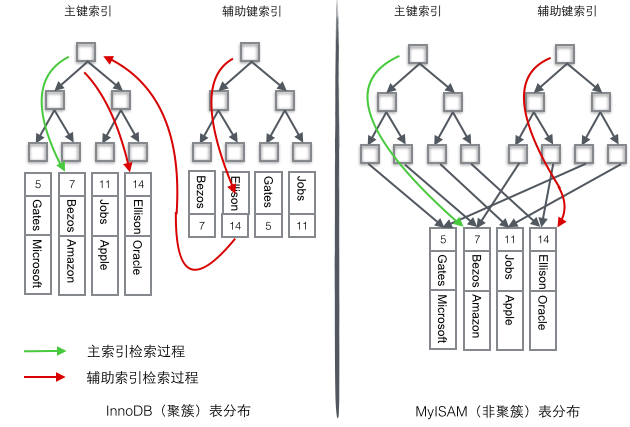

#### 聚集索引

InnoDB使用表的主键构造主键索引树，同时叶子节点中存放的即为整张表的记录数据。聚集索引叶子节点的存储是逻辑上连续的，使用双向链表连接，叶子节点按照主键的顺序排序，因此对于主键的排序查找和范围查找速度比较快。

聚集索引的叶子节点就是整张表的行记录。InnoDB 主键使用的是聚簇索引。聚集索引要比非聚集索引查询效率高很多。

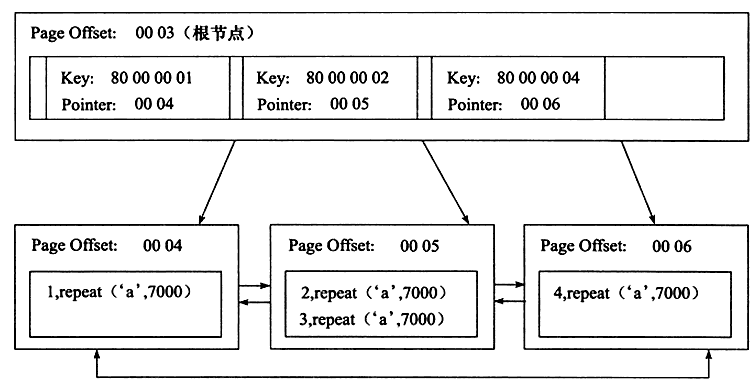

对于InnoDB来说，聚集索引一般是表中的主键索引，如果表中没有显示指定主键，则会选择表中的第一个不允许为NULL的唯一索引。如果没有主键也没有合适的唯一索引，那么innodb内部会生成一个隐藏的主键作为聚集索引，这个隐藏的主键长度为6个字节，它的值会随着数据的插入自增。

#### 二级索引

也叫辅助索引，二级索引的叶子节点存的是索引列和主键值。MyISAM不支持聚集索引，主键使用的是非聚集索引。

当使用二级索引查找数据时，InnoDB存储引擎会遍历二级索引找到对应的主键，然后再通过主键查找对应的行记录，即通过二级索引访问需要两次索引查找。

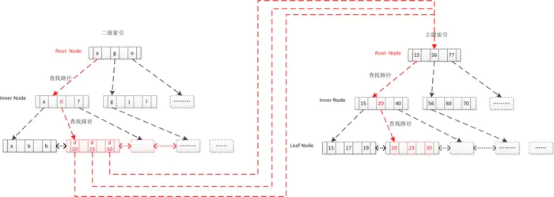

#### 覆盖索引

select的数据列只用从索引中就能够取得，不需要到数据表进行二次查询，换句话说查询列要被所使用的索引覆盖。

对于innodb表的二级索引，如果索引能覆盖到查询的列，那么就可以避免对主键索引的二次查询。

不是所有类型的索引都可以成为覆盖索引。覆盖索引要存储索引列的值，而哈希索引、全文索引不存储索引列的值，所以mysql只能使用b+树索引做覆盖索引。

 对于使用了覆盖索引的查询，在查询前面使用explain，输出的extra列会显示为using index。

比如user_like 用户点赞表，组合索引为(user_id, blog_id)，user_id和blog_id都不为null。

`explain select blog_id from user_like where user_id = 13;` Extra中为`Using index`，查询的列被索引覆盖，并且where筛选条件符合最左前缀原则，通过**索引查找**就能直接找到符合条件的数据，不需要回表查询数据。

`explain select user_id from user_like where blog_id = 1;`Extra中为`Using where; Using index`， 查询的列被索引覆盖，where筛选条件不符合最左前缀原则，无法通过索引查找找到符合条件的数据，但可以通过**索引扫描**找到符合条件的数据，也不需要回表查询数据。

`explain select blog_id from user_like where status = 1;` Extra中为`Using where`，查询时未找到可用的索引，进而通过`where`条件过滤获取所需数据。

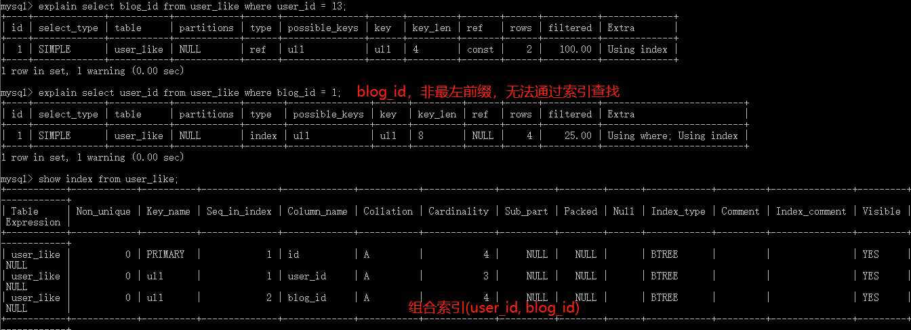

#### 稠密索引

每个索引字段的值都对应一个索引项。


#### 稀疏索引

只有某些索引字段有索引项，通过索引项确定目标记录的范围，然后再到这个范围中顺序查找。


### 索引失效

[索引失效与优化](https://blog.csdn.net/wuseyukui/article/details/72312574)

- 对于组合索引，不是使用组合索引最左边的字段，则不会使用索引
- 以%开头的like查询如`%abc`，无法使用索引；非%开头的like查询如`abc%`，相当于范围查询，会使用索引
- 查询条件中列类型是字符串，没有使用引号，可能会因为类型不同发生隐式转换，使索引失效
- 判断索引列是否不等于某个值时
- 对索引列进行运算
- 使用or连接的条件，如果左边的字段有索引，右边的字段没有索引，那么左边的索引会失效

### 最左匹配

[最左匹配](https://www.zhihu.com/search?type=content&q=%E6%9C%80%E5%B7%A6%E5%8C%B9%E9%85%8D)

如果 SQL 语句中用到了联合索引中的最左边的索引，那么这条 SQL 语句就可以利用这个联合索引去进行匹配。当遇到范围查询(>、<、between、like)就会停止匹配，后面的字段不会用到索引。

对(a,b,c)建立索引，查询条件使用 a/ab/abc 会走索引，使用 bc 不会走索引。

对(a,b,c,d)建立索引，查询条件为`a = 1 and b = 2 and c > 3 and d = 4`，那么，a,b,c三个字段能用到索引，而d就匹配不到。因为遇到了范围查询！

对(a, b) 建立索引，a 在索引树中是全局有序的，而 b 是全局无序，局部有序（当a相等时，会对b进行比较排序）。直接执行`b = 2`这种查询条件没有办法利用索引。

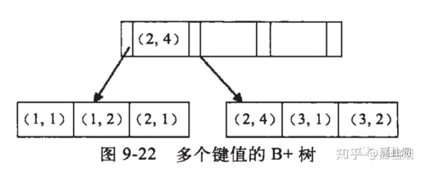

从局部来看，当a的值确定的时候，b是有序的。例如a = 1时，b值为1，2是有序的状态。当a=2时候，b的值为1,4也是有序状态。 因此，你执行`a = 1 and b = 2`是a,b字段能用到索引的。而你执行`a > 1 and b = 2`时，a字段能用到索引，b字段用不到索引。因为a的值此时是一个范围，不是固定的，在这个范围内b值不是有序的，因此b字段用不上索引。

最左匹配原则，在遇到范围查询的时候，就会停止匹配，后面的字段不会用到索引。

### 前缀索引

当索引字段比较长时，查询速度会比较慢。可以选择索引的前几个字符作为索引，提高查询速度。前缀索引的缺点是Mysql无法使用前缀索引做GROUP BY和ORDER BY操作，也无法使用前缀索引做覆盖扫描。

### 什么情况下需要建索引？什么情况下不建？

建索引的情况：

1. 经常用于查询的字段
2. 经常用于连接的字段（如外键）建立索引，可以加快连接的速度
3. 经常需要排序的字段建立索引，因为索引已经排好序，可以加快排序查询速度

不建索引的情况：

1. where条件中用不到的字段不适合建立索引
2. 表记录较少
3. 需要经常增删改
4. 参与列计算的列不适合建索引
5. 区分度不高的字段不适合建立索引，性别等


## B+树

[Mysql B+索引](https://blog.csdn.net/chybin500/article/details/103057140) | [索引演化](https://juejin.im/post/5b08fcc86fb9a07a9b3666ac#heading-4) | [为什么MySQL数据库索引选择使用B+树？](https://www.cnblogs.com/tiancai/p/9024351.html)

MySQL中MyIsAM和InnoDB都是采用的B+树结构。InnoDB主键使用的是聚集索引，MyIsAM是非聚集索引。

### 索引实例

col1 是主键，col2和col3 是普通字段。

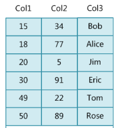

主索引 对应的 B+树 结构，每个节点对应磁盘的一页。

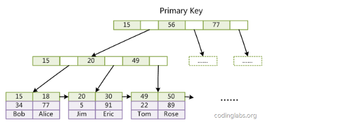

对col3 建立一个单列索引，对应的B+树结构（图中叶子节点少画了Col2）：

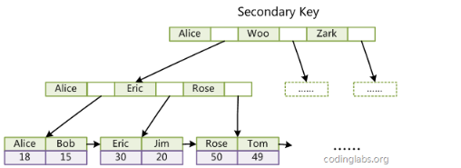

### 数据定位过程

进行定位操作时，不再进行表扫描，而是进行索引扫描。非叶子节点都是索引块，叶子节点是索引和数据。

第一种场景：索引精确查找

```mysql
select * from user_info where id = 23 ;
```

将根节点索引块读到内存, 逐层向下查找, 读取叶子节点Page,通过二分查找找到记录或未命中。

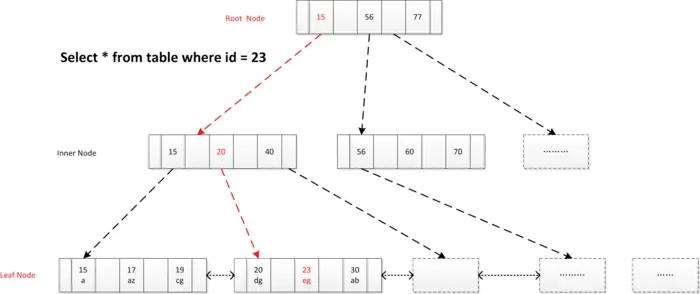

第二种场景：索引范围查找

```msyql
select * from user_info where id >= 18 and id < 22 ;
```

读取根节点至内存, 确定索引定位条件id=18, 找到满足条件第一个叶节点, 顺序扫描所有结果, 直到终止条件满足id >=22。

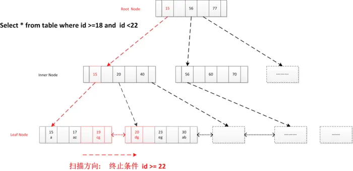

第三种场景：全表扫描

```mysql
select * from user_info where name = 'ab' ;
```

直接读取叶节点头结点， 顺序扫描， 返回符合条件记录， 到最终节点结束。

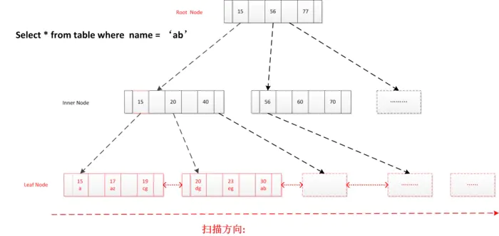

第四中场景：二级索引查找

```mysql
create table table_x(int id primary key, varchar(64) name , key sec_index(name) ) ;
select * from table_x where name = 'd' ;
```

通过二级索引查出对应主键（叶子节点是二级索引和主键，匹配的主键可能有多个），查主键索引得到数据， 二级索引可筛选掉大量无效记录，提高效率。


### 不用hash的原因

查询某条数据，自然是hash算法快，但是我们平常用的查询往往不是只查询单条数据，而是order by，group by，< >这种排序查询和范围查询，遇到这种情况，hash就会退化成O(n)，而树因为它的有序性依然保持O(log(n))高效率。如果索引的值有重复的话，会发生hash碰撞，导致查询效率降低。

### 带有顺序访问指针的B+Tree

一般在数据库系统或文件系统中使用的B+Tree结构都在经典B+Tree的基础上进行了优化，增加了顺序访问指针。做这个优化的目的是为了提高区间访问的性能。比如要查询key为从18到49的所有数据记录，当找到18后，只需顺着节点和指针顺序遍历就可以一次性访问到所有数据节点，极大提到了区间查询效率。

### B+树比B树更适合数据库索引

由于B+树的数据都存储在叶子结点中，叶子结点均为索引，方便扫库，只需要扫一遍叶子结点即可，但是B树因为其分支结点同样存储着数据，我们要找到具体的数据，需要进行一次中序遍历按序来扫，所以B+树更加适合在区间查询的情况，而在数据库中基于范围的查询是非常频繁的，所以通常B+树用于数据库索引。

B+树的节点只存储索引key值，具体信息的地址存在于叶子节点的地址中。这就使以页为单位的索引中可以存放更多的节点。减少更多的I/O支出。

B+树的查询效率更加稳定，任何关键字的查找必须走一条从根结点到叶子结点的路。所有关键字查询的路径长度相同，导致每一个数据的查询效率相当。


## 乐观锁悲观锁

- 乐观锁假设多用户并发的事务在处理时不会彼此互相影响，各事务能够在不产生锁的情况下处理各自影响的那部分数据。在提交数据更新之前，每个事务会先检查有没有其他事务修改了该数据。如果其他事务有更新的话，正在提交的事务会进行回滚。乐观锁多用于数据争用不大、冲突较少的环境中。
- 悲观锁在整个数据处理过程中，将数据处于锁定状态。悲观锁的实现，往往依靠数据库提供的锁机制。悲观并发控制主要用于数据争用激烈的环境。

乐观锁的一种实现方式，CAS(比较并交换)。CAS 操作中包含三个操作数 —— 需要读写的内存位置（V）、进行比较的预期原值（E）和拟写入的新值(N)。如果内存位置V的值与预期原值E相匹配，那么处理器会自动将该位置值更新为新值N。否则不更新。最后会返回该位置的值。（冲突检查+数据更新）


## 存储引擎

MySQL 5.5版本后默认的存储引擎为InnoDB。

### InnoDB
InnoDB是mysql默认的事务型存储引擎，使用最广泛，基于聚簇索引建立的，InnoDB的优势在于支持事务、崩溃修复能力和并发控制。InnoDB引入了行级锁和外键约束。缺点是占用的数据空间相对较大。
适用场景：一般来说，如果需要事务支持，并且有较高的并发读写频率，InnoDB是不错的选择。

### MyISAM
MyISAM不支持事务和行级锁，不支持崩溃后的安全恢复，也不支持外键，不过它访问速度快，如果对事务完整性没有要求可以使用这个引擎来创建表。

### MEMORY
MEMORY将数据全部放在内存中，访问速度较快，但是一旦系统奔溃的话，数据都会丢失。

MEMORY引擎默认使用哈希索引，将键的哈希值和指向数据行的指针保存在哈希索引中。哈希索引使用拉链法来处理哈希冲突。

缺点：

1. 哈希索引数据不是按照索引值顺序存储，无法用于排序。
2. 不支持部分索引匹配查找，因为哈希索引是使用索引列的全部内容来计算哈希值的。
3. 只支持等值比较，不支持范围查询。
4. 当出现哈希冲突时，存储引擎需要遍历链表中所有的行指针，逐行进行比较，直到找到符合条件的行。

### MyISAM和InnoDB区别

1. **是否支持行级锁** : MyISAM 只有表级锁，而InnoDB 支持行级锁和表级锁，默认为行级锁。
2. **是否支持事务和崩溃后的安全恢复**： MyISAM 强调的是性能，每次查询具有原子性，其执行速度比InnoDB类型更快，但是不提供事务支持。但是InnoDB 提供事务支持，具有事务(commit)、回滚(rollback)和崩溃修复能力。
3. **是否支持外键：** MyISAM不支持，而InnoDB支持。
4. **是否支持MVCC** ：仅 InnoDB 支持。应对高并发事务，MVCC比单纯的加锁更高效；MVCC只在 `READ COMMITTED` 和 `REPEATABLE READ` 两个隔离级别下工作；MVCC可以使用 乐观(optimistic)锁 和 悲观(pessimistic)锁来实现；各数据库中MVCC实现并不统一。


## sql优化

 1. 在where和order by涉及的字段加索引，避免全表扫描。

 2. 索引不是越多越好，会降低insert和update的效率。

 3. 避免在where子句使用大于小于不等于等范围查找的操作符。

 4. 不要在where子句中对字段进行null值判断。

 5. WHERE 从句中禁止对列进行函数转换和计算。

 6. 搜索字符型字段，避免使用like和通配符，可以考虑全文检索。

 7. 用exists代替in，in 通常会使索引失效。

 8. 避免使用 join 管理太多的表。

     对于 MySQL 来说，是存在关联缓存的，缓存的大小可以由 join_buffer_size 参数进行设置。 每关联一个表，就会多分配一个关联缓存，如果在一个 SQL 中关联的表越多，所占用的内存也就越大，会影响到数据库性能。同时对于关联操作来说，会产生临时表操作，影响查询效率。

当索引字段比较长时，比如存储大量的URL，可以删除URL列的索引，新增一个索引字段url_crc，使用crc32做哈希，提高查询性能。

```mysql
SELECT id from url WHERE url = 'www.xxx.com' AND url_crc = 'www.xxx.com';
```


## Mysql数据库优化

1. 选取合适的字段属性(能用mediumint就不用bigint)，尽量将字段设置为NOT NULL(查询的时候不会去比较NULL值)，某些文本字段可以用ENUM代替(像性别，ENUM类型会被当做数值型数据处理，处理速度比文本类型快)。
2. 使用连接join代替子查询。join不需要在内存中创建临时表。
3. 使用union代替创建临时表。使用union查询完，会自动删除临时表。


## mysql的锁

MySQL各存储引擎使用了三种类型的锁定机制：表级锁定，行级锁定和页级锁定。
- 表级锁：开销小，加锁快；不会出现死锁；锁定粒度大，发生锁冲突的概率最高，并发度最低。
- 行级锁：开销大，加锁慢；会出现死锁；锁定粒度最小，发生锁冲突的概率最低，并发度也最高。
- 页面锁：开销和加锁时间界于表锁和行锁之间；会出现死锁；锁定粒度界于表锁和行锁之间，并发度一般。

表级锁
每种mysql存储引擎都可以实现自己的锁策略和锁粒度。
MyISAM和MEMORY存储引擎采用的是表级锁，读取时会对需要读到的所有表加读锁，写入时则对表加写锁。
对MyISAM表的读操作，不会阻塞其他用户对同一表的读请求，但会阻塞对同一表的写请求；
对MyISAM表的写操作，则会阻塞其他用户对同一表的读和写操作。

行级锁
InnoDB存储引擎既支持行级锁，也支持表级锁，但默认情况下是采用行级锁。
行级锁类型：共享锁(S锁)/排他锁(X锁)/意向共享锁(IS)/意向排他锁(IX)
事务对表加S锁，其他事务可以该表加S锁，不能加X锁。
事务对表加X锁，其他事务不能对该表加任何锁。

意向锁

为了方便检测表级锁和行级锁之间的冲突，就引入了意向锁。
意向锁是表级锁。当事务A对表t的某些行修改，需要对t加上意向排它锁，在A事务完成之前，如果B事务需要对表t加表锁，此时表t的意向排它锁就能告诉B需要等待，而不需要判断表中的每一行是否已经被行锁锁住。
意向锁之间不会冲突, 因为意向锁仅仅代表要对某行记录进行操作。在加行锁时，会判断是否冲突。
意向锁是InnoDB自动加的，不需用户干预。

间隙锁(Next-Key锁)
当我们用范围条件查询数据时，对于键值在条件范围内但不存在的记录(即间隙)，innoDB会对这个间隙加锁，以防止幻影行的插入，避免幻读的出现。

### 悲观锁

悲观锁，每次在拿数据的时候都会上锁，这样别人想拿这个数据就会阻塞。Java synchronized 就属于悲观锁的一种实现，每次线程要修改数据时都先获得锁，保证同一时刻只有一个线程能操作数据，其他线程则会被block。

### 乐观锁

乐观锁，每次去拿数据的时候都认为别人不会修改，所以不会上锁，但是在提交更新的时候会判断一下在此期间别人有没有去更新这个数据。

乐观锁一般来说有以下2种方式：

1. 使用数据版本（Version）记录机制实现，这是乐观锁最常用的一种实现方式。何谓数据版本？即为数据增加一个版本标识，一般是通过为数据库表增加一个数字类型的 “version” 字段来实现。当读取数据时，将version字段的值一同读出，数据每更新一次，对此version值加一。当我们提交更新的时候，判断数据库表对应记录的当前版本信息与第一次取出来的version值进行比对，如果数据库表当前版本号与第一次取出来的version值相等，则予以更新，否则认为是过期数据。
2. 使用时间戳（timestamp）。乐观锁定的第二种实现方式和第一种差不多，同样是在需要乐观锁控制的table中增加一个字段，名称无所谓，字段类型使用时间戳（timestamp）, 和上面的version类似，也是在更新提交的时候检查当前数据库中数据的时间戳和自己更新前取到的时间戳进行对比，如果一致则OK，否则就是版本冲突。

Java JUC中的atomic包就是乐观锁的一种实现，AtomicInteger 通过CAS（Compare And Set）操作实现线程安全的自增。


## 分库分表

[分库分表](https://blog.csdn.net/weixin_44062339/article/details/100491744)

### 垂直划分

垂直划分数据库是根据业务进行划分，例如将shop库中涉及商品、订单、用户的表分别划分出成一个库，通过降低单库的大小来提高性能，但这种方式并没有解决高数据量带来的性能损耗。同样的，分表的情况就是将一个大表根据业务功能拆分成一个个子表，例如商品基本信息和商品描述，商品基本信息一般会展示在商品列表，商品描述在商品详情页，可以将商品基本信息和商品描述拆分成两张表。
优点：行记录变小，页可以存放更多记录，在查询时减少I/O次数
缺点：主键出现冗余，需要管理冗余列；会引起表连接JOIN操作（增加CPU开销），可以通过在业务服务器上进行join来减少数据库压力；依然存在单表数据量过大的问题（需要水平拆分）

### 水平划分

水平划分是根据一定规则，例如时间或id序列值等进行数据的拆分。比如根据年份来拆分不同的数据库。每个数据库结构一致，但是数据得以拆分，从而提升性能。

优点：单库（表）的数据量得以减少，提高性能；切分出的表结构相同，程序改动较少

缺点：

- 分片事务一致性难以解决
- 跨节点Join性能差，逻辑复杂
- 数据分片在扩容时需要迁移

库内分表，仅仅是单纯的解决了单一表数据过大的问题，由于没有把表的数据分布到不同的机器上，因此对于减轻MySQL服务器的压力来说，并没有太大的作用，大家还是竞争同一个物理机上的IO、CPU、网络，这个可以通过分库来解决。

### 分片规则

1. 尽量不要在一个事务中的SQL跨越多个分片，分布式事务一直是个不好处理的问题。

2. 通过数据冗余和表分区赖降低跨库Join的可能。

sharding-jdbc可以用于水平拆分，在应用中做分片逻辑。缺点是扩展性一般，对于比较复杂的系统可能会力不从心。


## join
natural join按照**相同列名**进行连接，会去除重复的列名，不能使用using指定join哪个column
join 默认是 inner join(table1 inner join table2 on ...)
join...using(column)按指定的属性做等值连接
join...on tableA.column1 = tableB.column2 指定条件

内联接（Inner Join）：匹配2张表中相关联的记录。
左外联接（Left Outer Join）：除了匹配2张表中相关联的记录外，还会匹配左表中剩余的记录，右表中未匹配到的字段用NULL表示。
右外联接（Right Outer Join）：除了匹配2张表中相关联的记录外，还会匹配右表中剩余的记录，左表中未匹配到的字段用NULL表示。
在判定左表和右表时，要根据表名出现在Outer Join的左右位置关系。

等值连接有两种方式，一种是where子句（隐性连接），一种是inner join关键字（显性连接），两者执行过程不同：
- 隐性连接会对所有的表做笛卡尔积，最终通过where条件过滤；
- 显性连接在每一次表连接时进行on条件过滤，筛选后的结果集再跟下一个表做笛卡尔积，以此循环。

显性连接效率更高。


## MVCC

MVCC(`Multiversion concurrency control`) 就是同一份数据保留多版本的一种方式，进而实现并发控制。在查询的时候，通过read view和版本链找到对应版本的数据。

MVCC只适用于read committed和repeatable read。使用事务更新行记录时，会生成一个新的版本的行记录。使用SELECT会去版本链中取记录，这就实现了读-写，写-读的并发执行，提升了系统的性能。对于高并发场景，MVCC比行级锁更有效、开销更小。

### 实现

[MVCC实现原理](https://zhuanlan.zhihu.com/p/64576887) | [MVCC](https://www.cnblogs.com/axing-articles/p/11415763.html)

mvcc实现依赖于版本链，版本链是通过表的三个隐藏字段实现。

- 事务id：data_trx_id，当前事务id

- 回滚指针：data_roll_ptr，指向当前行记录的上一个版本，通过这个指针将数据的多个版本连接在一起构成undo log版本链

- 主键：db_row_id，如果数据表没有主键，InnoDB会自动生成主键

使用事务更新行记录的时候，就会生成版本链：

1. 用排他锁锁住该行；
2. 将该行原本的值拷贝到 undo log，作为旧版本用于回滚；
3. 修改当前行的值，生成一个新版本，更新事务id，使回滚指针指向旧版本的记录，这样就形成一条版本链；
4. 记录redo log；

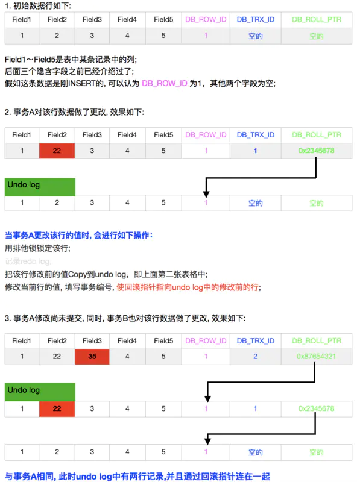

### read view

read view就是在某一时刻给事务打snapshot快照。在read_view内部维护一个活跃事务链表，这个链表包含在创建read view之前还未提交的事务，不包含创建read view之后提交的事务。

不同隔离级别创建read view的时机不同。

read committed：每次执行select都会创建新的read_view，保证能读取到其他事务已经提交的修改。

repeatable read：在一个事务范围内，第一次select时更新这个read_view，以后不会再更新，后续所有的select都是复用之前的read_view。这样可以保证事务范围内每次读取的内容都一样，即可重复读。

### 数据访问流程

当访问数据行时，会先判断当前版本数据项是否可见，如果是不可见的，会通过版本链找到一个可见的版本。

- 如果数据行的当前版本 < read view最早的活跃事务id：说明在创建read_view时，修改该数据行的事务已提交，该版本的数据行可被当前事务读取到。

- 如果数据行的当前版本 >= read view最晚的活跃事务id：说明当前版本的数据行的事务是在创建read_view之后生成的，该版本的数据行不可以被当前事务访问。此时需要通过版本链找到上一个版本，然后重新判断该版本数据对当前事务的可见性。

- 如果数据行的当前版本在最早的活跃事务id和最晚的活跃事务id之间：

- - 需要在活跃事务链表中查找是否包含该数据行的最新事务id，即生成当前版本数据行的事务是否已经提交。
  - 如果存在，说明生成当前版本数据行的事务未提交，所以该版本的数据行不能被当前事务访问。此时需要通过版本链找到上一个版本，然后重新判断该版本的可见性。
  - 如果不存在，说明事务已经提交，可以直接读取该数据行。

通过比较read view和数据行的当前版本，找到当前事务可见的版本，进而实现read commit和repeatable read的事务隔离级别。

### 快照读和当前读

记录的两种读取方式。

快照读：读取的是快照版本，也就是历史版本。普通的SELECT就是快照读。通过MVCC来进行控制的，不用加锁。

当前读：读取的是最新版本。UPDATE、DELETE、INSERT、SELECT … LOCK IN SHARE MODE、SELECT … FOR UPDATE是当前读。

快照读情况下，InnoDB通过mvcc机制避免了幻读现象。而mvcc机制无法避免当前读情况下出现的幻读现象。

事务a和事务b同时开启事务，事务a插入数据然后提交，事务b执行全表的update，然后执行查询，查到了事务A中添加的数据。

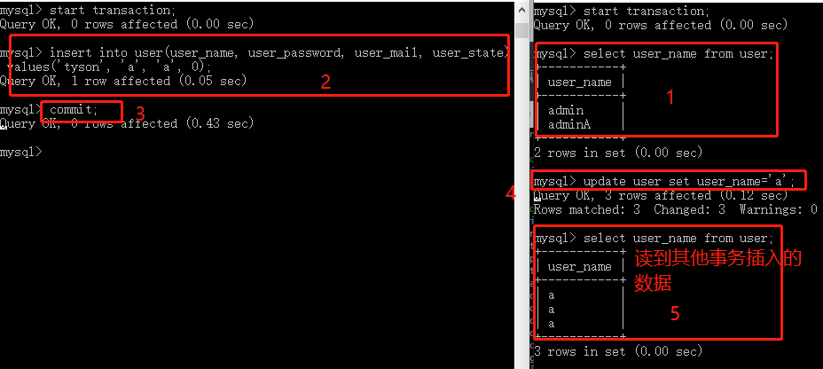

mysql如何实现避免幻读:

- 在快照读情况下，mysql通过mvcc来避免幻读。
- 在当前读情况下，mysql通过next-key来避免幻读（加行锁和间隙锁来实现的）。

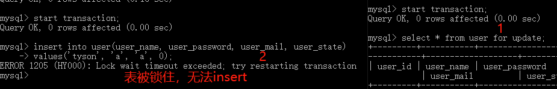

next-key包括两部分：行锁和间隙锁。行锁是加在索引上的锁，间隙锁是加在索引之间的。

```mysql
select * from table where id<6 lock in share mode;--共享锁 锁定的是小于6的行和等于6的行
select * from table where id<6 for update;--排他锁
```

实际上很多的项目中是不会使用到上面的两种方法的，串行化读的性能太差，而且其实幻读很多时候是我们完全可以接受的。

Serializable隔离级别也可以避免幻读，会锁住整张表，并发性极低，一般很少使用。

### select 读取锁定

在SELECT 的读取锁定主要分为两种方式：共享锁和排他锁。

```mysql
SELECT ... LOCK IN SHARE MODE　
SELECT ... FOR UPDATE
```

这两种方式主要的不同在于LOCK IN SHARE MODE 多个事务同时更新同一个表单时很容易造成死锁。这种情况最好使用SELECT ...FOR UPDATE。

`select * from goods where id = 1 for update`：申请排他锁的前提是，没有线程对该结果集的任何行数据使用排它锁或者共享锁，否则申请会受到阻塞。在进行事务操作时，mysql会对查询结果集的每行数据添加排它锁，其他线程对这些数据的更改或删除操作会被阻塞（只能读操作），直到该语句的事务被commit语句或rollback语句结束为止。

[select... for update 使用注意事项](https://blog.csdn.net/claram/article/details/54023216)

1. for update 仅适用于Innodb，且必须在事务范围内才能生效。
2. 根据主键进行查询，查询条件为 like或者不等于，主键字段产生表锁。
3. 根据非索引字段进行查询，name字段产生表锁。


## 分析执行计划

[explain执行计划](https://juejin.im/post/5ec4e4a5e51d45786973b357)

使用 explain 输出 SELECT 语句执行的详细信息，比如，如何处理该语句，包括如何连接表以及什么顺序连接表等。

- 表的加载顺序
- `sql` 的查询类型
- 可能用到哪些索引，哪些索引又被实际使用
- 表与表之间的引用关系
- 一个表中有多少行被优化器查询

`Explain` 执行计划包含字段信息如下：分别是 `id`、`select_type`、`table`、`partitions`、`type`、`possible_keys`、`key`、`key_len`、`ref`、`rows`、`filtered`、`Extra` 12个字段。

### id

表示查询中执行select子句或者操作表的顺序，**`id`的值越大，代表优先级越高，越先执行**。

```mysql
explain select discuss_body from discuss where blog_id = (select blog_id from blog where user_id = (select user_id from user where user_name = 'admin'));
```

三个表依次嵌套，发现最里层的子查询 `id`最大，最先执行。


### select_type

表示 `select` 查询的类型，主要是用于区分各种复杂的查询，例如：`普通查询`、`联合查询`、`子查询`等。

1. SIMPLE，表示最简单的 select 查询语句，也就是在查询中不包含子查询或者 `union`交并差集等操作。
2. PRIMARY，当查询语句中包含任何复杂的子部分，最外层查询则被标记为`PRIMARY`。
3. SUBQUERY，查询语句包含子查询。
4. DERIVED，表示包含在`from`子句中的子查询的select，在我们的 `from` 列表中包含的子查询会被标记为`derived` 。
5. UNION，如果`union`后边又出现的`select` 语句，则会被标记为`union`；若 `union` 包含在 `from` 子句的子查询中，外层 `select` 将被标记为 `derived`。

### table

查询的表名，并不一定是真实存在的表，有别名显示别名，也可能为临时表。

### partitions

查询时匹配到的分区信息，对于非分区表值为`NULL`，当查询的是分区表时，`partitions`显示分区表命中的分区情况。

### type

查询使用了何种类型，它在 `SQL`优化中是一个非常重要的指标。

system：当表仅有一行记录时(系统表)，数据量很少，往往不需要进行磁盘IO，速度非常快。

const：单表操作的时候，查询使用了主键或者唯一索引。

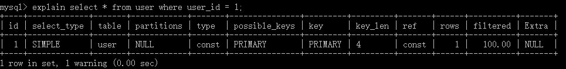

eq_ref：多表关联查询的时候，主键和唯一索引作为关联条件。

ref：使用非唯一性索引，会找到很多个符合条件的行，速度比const慢的多。

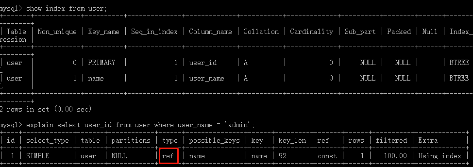

ref_or_null：类似 ref，会额外搜索包含`NULL`值的行。

index_merge：使用了索引合并优化方法，查询使用了两个以上的索引。

```mysql
#id 主键，value_id 非唯一索引。
mysql> explain select content from litemall_comment where value_id = 1181000 and id > 1000;
+----+-------------+------------------+------------+-------------+------------------+------------------+---------+------+------+----------+------------------------------------------------+
| id | select_type | table            | partitions | type        | possible_keys    | key              | key_len | ref  | rows | filtered | Extra                                          |
+----+-------------+------------------+------------+-------------+------------------+------------------+---------+------+------+----------+------------------------------------------------+
|  1 | SIMPLE      | litemall_comment | NULL       | index_merge | PRIMARY,id_value | id_value,PRIMARY | 8,4     | NULL |    1 |   100.00 | Using intersect(id_value,PRIMARY); Using where |
+----+-------------+------------------+------------+-------------+------------------+------------------+---------+------+------+----------+------------------------------------------------+
```

range：有范围的索引扫描，相对于index的全索引扫描，它有范围限制，因此要优于index。除了between，and以及'>','<'外，in和or也是范围索引扫描。

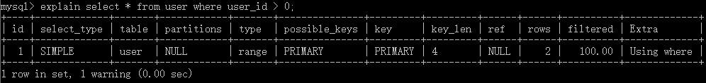

index：`Index` 与`ALL`都是读全表，区别在于`index`是遍历索引树读取，而`ALL`是从硬盘中读取。index 包括select索引列，order by 主键两种情况。

all：将遍历全表以找到匹配的行，性能最差。

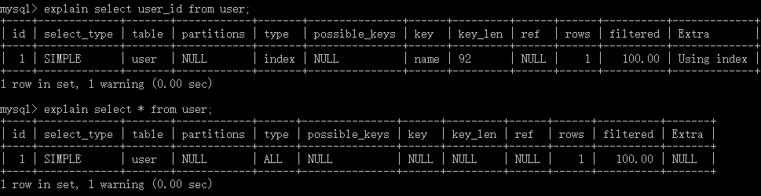

### possible_keys:

此次查询中可能选用的索引。**但这个索引并不定一会是最终查询数据时所被用到的索引**。

### key

此次查询中确切使用到的索引。

### rows

估算要找到我们所需的记录，需要读取的行数。评估`SQL` 性能的一个比较重要的数据，`mysql`需要扫描的行数，很直观的显示 `SQL` 性能的好坏，一般情况下 `rows` 值越小越好。

### filtered

存储引擎返回的数据在经过过滤后，剩下满足条件的记录数量的比例。

### extra

using index：查询的列被索引覆盖，并且where筛选条件符合最左前缀原则，通过**索引查找**就能直接找到符合条件的数据，不需要回表查询数据。

using where：查询时未找到可用的索引，进而通过`where`条件过滤获取所需数据。

Using where&Using index：查询的列被索引覆盖，where筛选条件不符合最左前缀原则，无法通过索引查找找到符合条件的数据，但可以通过**索引扫描**找到符合条件的数据，也不需要回表查询数据。

using temporary：表示查询后结果需要使用临时表来存储，一般在排序或者分组查询时用到。

filesort：Using filesort 是Mysql里一种速度比较慢的外部排序，很多时候，我们可以通过优化索引来尽量避免出现Using filesort，从而提高速度。

#### filesort

[filesort](https://juejin.im/entry/5795faaa0a2b580061c980aa)

在MySQL中的ORDER BY有两种排序实现方式： 

1. 利用索引排序 
2. 文件排序

在explain中分析查询的时候，利用索引排序显示Using index ，文件排序显示 Using filesort。

利用索引排序条件：

1. ORDER BY中所有的列都包含在索引中
2. 索引的顺序和ORDER BY子句中的顺序完全一致
3. ORDER BY所有列的排序方向（升序或者降序）一样

通过将 where 子句的字段和 order by 子句的字段建立联合索引（order by子句字段需放在联合索引的最后），可以让排序变得更快。

```mysql
ALTER TABLE test ADD index a_b(a,b);
EXPLAIN SELECT * FROM test WHERE a=1 ORDER BY b;
```


## 尽量避免使用外键约束

外键会影响父表和子表的写操作从而降低性能


## 日志

二进制日志（bin log）：是mysql数据库级别的文件，记录对mysql数据库执行修改的所有操作，不会记录select和show语句，主要用于恢复数据库和同步数据库。

```mysql
show variables like '%log_bin%'
```

重做日志（redo log）：Innodb引擎级别，用来记录Innodb存储引擎的事务日志，不管事务是否提交都会记录下来，用于数据恢复。当数据库发生故障，InnoDB存储引擎会使用redo log恢复到发生故障前的时刻，以此来保证数据的完整性。将参数innodb_flush_log_at_tx_commit设置为1，那么在执行commit时将redo log同步写到磁盘。

bin log和redo log区别：

1. bin log会记录所有日志记录，包括innoDB、MyISAM等存储引擎的日志；redo log只记录innoDB自身的事务日志
2. bin log只在事务提交前写入到磁盘，一个事务只写一次，无论事务多大；而在事务进行过程，会有redo log不断写入磁盘
3. binlog 是逻辑日志，记录的是SQL语句的原始逻辑；redo log 是物理日志，记录的是在某个数据页上做了什么修改。

Undo Log：除了记录redo log外，当进行数据修改时还会记录undo log，undo log用于数据的撤回操作，它保留了记录修改前的内容。通过undo log可以实现事务回滚，并且可以根据undo log回溯到某个特定的版本的数据，实现MVCC。

查询日志：记录所有对mysql请求的信息，无论请求是否正确执行。

```mysql
mysql> show variables like '%general_log%';
+------------------+----------------------------------+
| Variable_name    | Value                            |
+------------------+----------------------------------+
| general_log      | OFF                              |
| general_log_file | /var/lib/mysql/VM_0_7_centos.log |
+------------------+----------------------------------+
```


## sql 执行过程

MySQL主要分为 Server 层和存储引擎层：

- **Server 层**：主要包括连接器、查询缓存、分析器、优化器、执行器等，所有跨存储引擎的功能都在这一层实现，比如存储过程、触发器、视图，函数等，还有一个通用的日志模块 binglog 日志模块。
- **存储引擎**： 主要负责数据的存储和读取

### Server 层基本组件介绍

- **连接器：** 登录 MySQL 时，进行身份认证和权限校验。
- **查询缓存:** 执行查询语句的时候，会先查询缓存（MySQL 8.0 版本后移除），先校验这个 sql 是否执行过，如果缓存 key （sql语句）被命中，就会直接返回给客户端，如果没有命中，就会执行后续的操作。MySQL 查询不建议使用缓存，因为查询缓存失效在实际业务场景中可能会非常频繁，不推荐使用。
- **分析器:** 没有命中缓存的话，SQL 语句就会经过分析器，主要分为两步，词法分析和语法分析，先看 SQL 语句要做什么，再检查 SQL 语句语法是否正确。
- **优化器：** 生成执行计划
- **执行器：** 首先执行前会校验该用户有没有权限，如果没有权限，就会返回错误信息，如果有权限，就会根据执行计划去调用引擎的接口，返回结果。

Mysql 能够处理的优化类型：

1. 重新定义关联表的顺序。
2. 将外连接转化成内连接。
3. 使用等价变换规，简化表达式。比如将 `5=5 AND a > 5` 转化为 `a > 5`。
4. 优化COUNT/MIN/MAX。MIN查询最小值，对应的是b+树索引的第一行记录，优化器会将这个表达式作为一个常数对待。
5. 覆盖索引扫描。

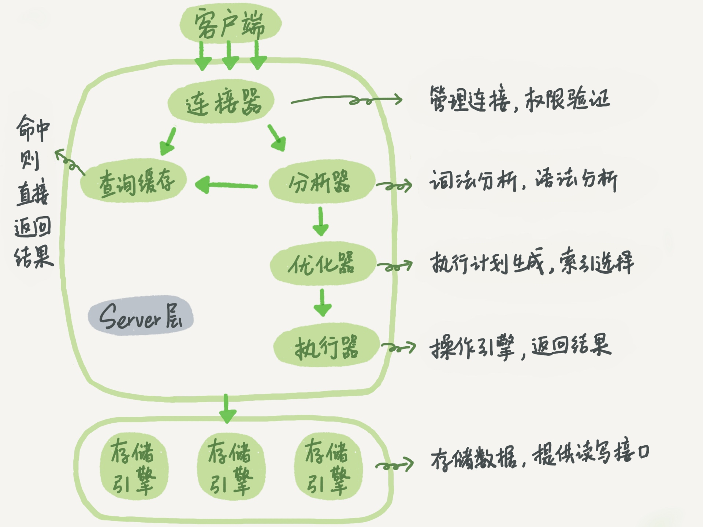

### 查询语句执行流程

查询语句的执行流程如下：权限校验 ---》查询缓存---》分析器---》优化器---》权限校验---》执行器---》引擎

查询语句：

```mysql
select * from user where id > 1 and name = 'admin';
```

1. 检查权限，没有权限则返回错误
2. Mysql8.0以前会查询缓存，缓存命中则直接返回，没有则执行下一步
3. 词法分析和语法分析。提取select，表名，查询条件，检查语法是否有错误。
4. 两种执行方案，先查 `id > 1` 还是 `name = 'admin'`，优化器根据自己的优化算法进行选择执行效率最好的一个方案
5. 校验权限，有权限就调用数据库引擎接口，返回引擎的执行结果。

### 更新语句执行过程

更新语句执行流程如下：分析器----》权限校验----》执行器---》引擎---redo log(prepare 状态)---》binlog---》redo log(commit状态)

更新语句：

```mysql
update user set name = 'tyson' where id = 1;
```

1. 先查询到 id 为1的记录，有缓存会使用缓存
2. 拿到查询结果，将 name 更新为 tyson，然后调用引擎接口，写入更新数据，innodb 引擎将数据保存在内存中，同时记录 redo log，此时 redo log 进入 prepare 状态，然后告诉执行器，执行完成了，随时可以提交。
3. 执行器收到通知后记录 binlog，然后调用引擎接口，提交 redo log 为提交状态。
4. 更新完成。

为什么记录完 redo log，不直接提交，先进入prepare状态？

假设先写 redo log 直接提交，然后写 binlog，写完 redo log 后，机器挂了，binlog 日志没有被写入，那么机器重启后，这台机器会通过 redo log 恢复数据，但是这个时候 binlog 并没有记录该数据，后续进行机器备份的时候，就会丢失这一条数据，同时主从同步也会丢失这一条数据。

假设写完了 binlog，机器异常重启了，由于没有 redo log，本机是无法恢复这一条记录的，但是 binlog 又有记录，那么和上面同样的道理，就会产生数据不一致的情况。


## 慢查询

[慢查询日志](https://www.cnblogs.com/kerrycode/p/5593204.HTML)

sql 语句查询时间超过（不包括等于） long_query_time，称为慢查询。

查看慢查询配置：

```mysql
show variables  like '%slow_query_log%'; #查看慢查询配置
set global slow_query_log=1; #开启慢查询
```

使用set global slow_query_log=1开启了慢查询日志只对当前数据库生效，如果MySQL重启后则会失效。如果要永久生效，就必须修改配置文件my.cnf。

```properties
slow_query_log =1
slow_query_log_file=/tmp/mysql_slow.log #系统默认会给一个缺省的文件host_name-slow.log
```

默认情况下long_query_time的值为10秒，可以使用命令修改，也可以在my.cnf参数里面修改。

```mysql
show variables like 'long_query_time%';
set global long_query_time=4; #需要重新连接或新开一个会话才能看到修改值或者使用show global variables like 'long_query_time'
```

MySQL数据库支持同时两种日志存储方式，配置的时候以逗号隔开即可，如：log_output='FILE,TABLE'。

日志记录到系统的专用日志表中，要比记录到文件耗费更多的系统资源，因此对于需要启用慢查询日志，又需要能够获得更高的系统性能，那么建议优先记录到文件。

### mysqldumpslow

mysqldumpslow 命令可用于分析慢查询日志。

获取执行时间最长的10条sql语句：

```mysql
mysqldumpslow -s al -n 10 /usr/local/mysql/data/slow.log
```


## 其他

页是InnoDB存储引擎管理数据库的最小磁盘单位。

### processlist

`select * `会查询出不需要的、额外的数据，那么这些额外的数据在网络上进行传输，带来了额外的网络开销。


`show processlist` 或 `show full processlist` 可以查看当前 mysql 是否有压力，正在运行的sql，有没有慢 SQL 正在执行。

- **id** - 线程ID，可以用：`kill id;` 杀死一个线程，很有用

- **db** - 数据库

- **user** - 用户

- **host** - 连库的主机IP

- **command** - 当前执行的命令，比如最常见的：Sleep，Query，Connect 等

- **time** - 消耗时间，单位秒，很有用

- **state** - 执行状态

  sleep，线程正在等待客户端发送新的请求

  query，线程正在查询或者正在将结果发送到客户端

  Sorting result，线程正在对结果集进行排序

  Locked，线程正在等待锁

- **info** - 执行的SQL语句，很有用


### exist和in

exists 用于对外表记录做筛选。

exists 会遍历外表，将外查询表的每一行，代入内查询进行判断。当 exists 里的条件语句能够返回记录行时，条件就为真，返回外表当前记录。反之如果exists里的条件语句不能返回记录行，条件为假，则外表当前记录被丢弃。

```mysql
select a.* from A a
where exists(select 1 from B b where a.id=b.id)
```

in 是先把后边的语句查出来放到临时表中，然后遍历临时表，将临时表的每一行，代入外查询去查找。

```mysql
select * from A
where id in(select id from B)
```

子查询的表大的时候，使用EXISTS可以有效减少总的循环次数来提升速度；当外查询的表大的时候，使用IN可以有效减少对外查询表循环遍历来提升速度。


## 查询性能优化

优化数据访问

1. 向数据库请求了不需要的数据。select * 取出全部列，会让优化器无法完成索引覆盖扫描这类优化，还会给服务器带来额外的资源消耗。
2. 避免全表扫描，使用索引覆盖扫描，这样存储引擎无需回表查询数据

重构查询方式

1. 切分查询。比如定期删除大量旧数据。如果使用一个语句一次性完成，则可能需要锁住很多数据、阻塞其他请求。可以将这个大的DELETE请求切分成小的查询，尽可能小的影响Mysql的性能。
2. 分解关联查询。单表查询可以充分利用缓存的结果（应用层或者Mysql的查询缓存）；将查询分解后，执行单个查询可以减少锁的竞争；查询效率会更高，使用IN代替关联查询，可以让Mysql按照ID顺序进行查询，比随机的关联要更高效。