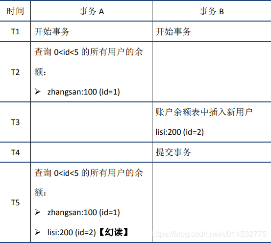

<!-- START doctoc generated TOC please keep comment here to allow auto update -->
<!-- DON'T EDIT THIS SECTION, INSTEAD RE-RUN doctoc TO UPDATE -->


- [数据库特性（ACID）](#%E6%95%B0%E6%8D%AE%E5%BA%93%E7%89%B9%E6%80%A7acid)
- [数据库事务隔离级别](#%E6%95%B0%E6%8D%AE%E5%BA%93%E4%BA%8B%E5%8A%A1%E9%9A%94%E7%A6%BB%E7%BA%A7%E5%88%AB)
- [数据库范式](#%E6%95%B0%E6%8D%AE%E5%BA%93%E8%8C%83%E5%BC%8F)
  - [2NF和3NF区别](#2nf%E5%92%8C3nf%E5%8C%BA%E5%88%AB)
- [B+树](#b%E6%A0%91)
  - [索引的作用](#%E7%B4%A2%E5%BC%95%E7%9A%84%E4%BD%9C%E7%94%A8)
  - [索引实例](#%E7%B4%A2%E5%BC%95%E5%AE%9E%E4%BE%8B)
  - [数据定位过程](#%E6%95%B0%E6%8D%AE%E5%AE%9A%E4%BD%8D%E8%BF%87%E7%A8%8B)
  - [不用hash的原因](#%E4%B8%8D%E7%94%A8hash%E7%9A%84%E5%8E%9F%E5%9B%A0)
  - [带有顺序访问指针的B+Tree](#%E5%B8%A6%E6%9C%89%E9%A1%BA%E5%BA%8F%E8%AE%BF%E9%97%AE%E6%8C%87%E9%92%88%E7%9A%84btree)
  - [B+树比B树更适合数据库索引](#b%E6%A0%91%E6%AF%94b%E6%A0%91%E6%9B%B4%E9%80%82%E5%90%88%E6%95%B0%E6%8D%AE%E5%BA%93%E7%B4%A2%E5%BC%95)
- [索引](#%E7%B4%A2%E5%BC%95)
  - [索引分类](#%E7%B4%A2%E5%BC%95%E5%88%86%E7%B1%BB)
    - [聚簇索引](#%E8%81%9A%E7%B0%87%E7%B4%A2%E5%BC%95)
    - [二级索引](#%E4%BA%8C%E7%BA%A7%E7%B4%A2%E5%BC%95)
    - [稠密索引](#%E7%A8%A0%E5%AF%86%E7%B4%A2%E5%BC%95)
    - [稀疏索引](#%E7%A8%80%E7%96%8F%E7%B4%A2%E5%BC%95)
    - [覆盖索引](#%E8%A6%86%E7%9B%96%E7%B4%A2%E5%BC%95)
  - [索引失效](#%E7%B4%A2%E5%BC%95%E5%A4%B1%E6%95%88)
  - [最左匹配](#%E6%9C%80%E5%B7%A6%E5%8C%B9%E9%85%8D)
- [乐观锁悲观锁](#%E4%B9%90%E8%A7%82%E9%94%81%E6%82%B2%E8%A7%82%E9%94%81)
- [存储引擎](#%E5%AD%98%E5%82%A8%E5%BC%95%E6%93%8E)
  - [InnoDB](#innodb)
  - [MyISAM](#myisam)
  - [MEMORY](#memory)
  - [MyISAM和InnoDB区别](#myisam%E5%92%8Cinnodb%E5%8C%BA%E5%88%AB)
- [sql优化](#sql%E4%BC%98%E5%8C%96)
- [Mysql数据库优化](#mysql%E6%95%B0%E6%8D%AE%E5%BA%93%E4%BC%98%E5%8C%96)
- [mysql的锁](#mysql%E7%9A%84%E9%94%81)
- [分库分表](#%E5%88%86%E5%BA%93%E5%88%86%E8%A1%A8)
- [join](#join)
- [MVCC](#mvcc)
  - [实现](#%E5%AE%9E%E7%8E%B0)
  - [快照读和当前读](#%E5%BF%AB%E7%85%A7%E8%AF%BB%E5%92%8C%E5%BD%93%E5%89%8D%E8%AF%BB)
  - [select 读取锁定](#select-%E8%AF%BB%E5%8F%96%E9%94%81%E5%AE%9A)
- [分析执行计划](#%E5%88%86%E6%9E%90%E6%89%A7%E8%A1%8C%E8%AE%A1%E5%88%92)
  - [id](#id)
  - [select_type](#select_type)
  - [table](#table)
  - [partitions](#partitions)
  - [type](#type)
  - [possible_keys:](#possible_keys)
  - [key](#key)
  - [rows](#rows)
  - [filtered](#filtered)
  - [extra](#extra)
- [尽量避免使用外键约束](#%E5%B0%BD%E9%87%8F%E9%81%BF%E5%85%8D%E4%BD%BF%E7%94%A8%E5%A4%96%E9%94%AE%E7%BA%A6%E6%9D%9F)
- [事务日志](#%E4%BA%8B%E5%8A%A1%E6%97%A5%E5%BF%97)
- [sql 执行过程](#sql-%E6%89%A7%E8%A1%8C%E8%BF%87%E7%A8%8B)
  - [Server 层基本组件介绍](#server-%E5%B1%82%E5%9F%BA%E6%9C%AC%E7%BB%84%E4%BB%B6%E4%BB%8B%E7%BB%8D)
  - [查询语句执行流程](#%E6%9F%A5%E8%AF%A2%E8%AF%AD%E5%8F%A5%E6%89%A7%E8%A1%8C%E6%B5%81%E7%A8%8B)
  - [更新语句执行过程](#%E6%9B%B4%E6%96%B0%E8%AF%AD%E5%8F%A5%E6%89%A7%E8%A1%8C%E8%BF%87%E7%A8%8B)

<!-- END doctoc generated TOC please keep comment here to allow auto update -->

[toc]


## 数据库特性（ACID）

对于几个SQL语句，要么全部执行成功，要么全部执行失败。比如银行转账就是事务的典型场景。
数据库事务的三个常用命令：Begin Transaction、Commit Transaction、RollBack Transaction。

①原子性是指事务包含的所有操作要么全部成功，要么全部失败回滚。
②一致性是指一个事务执行之前和执行之后都必须处于一致性状态。比如a与b账户共有1000块，两人之间转账之后无论成功还是失败，它们的账户总和还是1000。
③隔离性，一个事务所做的修改在最终提交之前，对其他事务是不可见的。
④持久性是指一个事务一旦被提交了，那么对数据库中的数据的改变就是永久性的，即便是在数据库系统遇到故障的情况下也不会丢失提交事务的操作。


## 数据库事务隔离级别

①脏读是指在一个事务处理过程里读取了另一个未提交的事务中的数据。
②不可重复读是指在对于数据库中的某个数据，一个事务范围内多次查询却返回了不同的数据值，这是由于在查询间隔，被另一个事务修改并提交了。
③幻读（虚读）是当某个事务在读取某个范围内的记录时，另外一个事务又在该范围内插入了新的记录，当之前的事务再次读取该范围的记录时，会产生幻行，就好像产生幻觉一样，这就是发生了幻读。

不可重复读和脏读的区别是，脏读是某一事务读取了另一个事务未提交的脏数据，而不可重复读则是读取了前一事务提交的数据。
幻读和不可重复读都是读取了另一条已经提交的事务，不同的是不可重复读的重点是修改，幻读的重点在于新增或者删除。

MySQL数据库为我们提供的四种隔离级别：
① Serializable (串行化)：通过强制事务排序，使之不可能相互冲突，从而解决幻读问题。
② Repeatable read (可重复读)：MySQL的默认事务隔离级别，它确保同一事务的多个实例在并发读取数据时，会看到同样的数据行。
③ Read committed (读已提交)：一个事务只能看见已经提交事务所做的改变。可避免脏读的发生。
④ Read uncommitted (读未提交)：所有事务都可以看到其他未提交事务的执行结果。

设置数据库的隔离级别一定要是在开启事务之前！
如果是使用JDBC对数据库的事务设置隔离级别的话，也应该是在调用Connection对象的setAutoCommit(false)方法之前。调用Connection对象的setTransactionIsolation(level)即可设置当前连接的隔离级别

查看隔离级别：

```mysql
select @@transaction_isolation;
```

设置隔离级别：

```mysql
set session transaction isolation level read uncommitted;
```


## 数据库范式

- 第一范式1NF：数据表中的每一列，必须是不可拆分的最小单元，也就是确保每一列的原子性。
  userInfo: '山东省烟台市 1318162008' 依照第一范式必须拆分成 userInfo: '山东省烟台市  'userTel: '1318162008'两个字段

- 第二范式2NF：首先是 1NF，另外包含两部分内容，一是表必须有一个主键；二是没有包含在主键中的列必须完全依赖于主键，而不能只依赖于主键的一部分。
  假定选课关系表为SelectCourse(学号, 姓名, 年龄, 课程名称, 成绩, 学分)，主键为(学号, 课程名称)，因为存在如下决定关系：(学号, 课程名称) → (姓名, 年龄, 成绩, 学分)
  其中学分完全依赖于课程名称，姓名年龄完全依赖学号，不符合第二范式，会导致数据冗余（学生选n门课，姓名年龄有n条记录），插入异常（插入一门新课，因为没有学号，无法保存新课记录）等。
  可以拆分成三个表：学生：Student(学号, 姓名, 年龄)；课程：Course(课程名称, 学分)；选课关系：SelectCourse(学号, 课程名称, 成绩)。

- 第三范式3NF：首先是 2NF，另外非主键列必须直接依赖于主键，不能存在传递依赖。即不能存在：非主键列 A 依赖于非主键列 B，非主键列 B 依赖于主键的情况。
  假定学生关系表为Student(学号, 姓名, 年龄, 学院id, 学院地点, 学院电话)，主键为"学号"，其中学院id依赖于学号，而学院地点和学院电话依赖于学院id，存在传递依赖，不符合第三范式。
  把学生关系表分为如下两个表：学生：(学号, 姓名, 年龄, 学院id)；学院：(学院,id 地点, 电话)。

### 2NF和3NF区别

2NF依据非主键列是否完全依赖于主键，还是依赖于主键的一部分
3NF依据非主键列是直接依赖于主键，还是直接依赖于非主键


## B+树

[Mysql B+索引](https://blog.csdn.net/chybin500/article/details/103057140) | [索引演化](https://juejin.im/post/5b08fcc86fb9a07a9b3666ac#heading-4) | [为什么MySQL数据库索引选择使用B+树？](https://www.cnblogs.com/tiancai/p/9024351.html)

MySQL中MyIsAM和InnoDB都是采用的B+树结构。不同的是前者是非聚集索引，后者主键是聚集索引，所谓聚集索引是物理地址连续存放的索引，在取区间的时候，查找速度非常快，但同样的，插入的速度也会受到影响而降低。聚集索引的物理位置使用链表来进行存储。

### 索引的作用

数据是存储在磁盘上的，操作系统读取磁盘的最小单位是块，如果没有索引，会加载所有的数据到内存，依次进行检索，加载的总数据会很多，磁盘IO多。

### 索引实例

col1 是主键，col2和col3 是普通字段。


主索引 对应的 B+树 结构，每个节点对应磁盘的一页。


对col3 建立一个单列索引，对应的B+树结构（图中叶子节点少画了Col2）：


### 数据定位过程

进行定位操作时，不再进行表扫描，而是进行索引扫描。非叶子节点都是索引块，叶子节点是索引和数据。

第一种场景：索引精确查找

```mysql
select * from user_info where id = 23 ;
```

将根节点索引块读到内存, 逐层向下查找, 读取叶子节点Page,通过二分查找找到记录或未命中。


第二种场景：索引范围查找

```msyql
select * from user_info where id >= 18 and id < 22 ;
```

读取根节点至内存, 确定索引定位条件id=18, 找到满足条件第一个叶节点, 顺序扫描所有结果, 直到终止条件满足id >=22。


第三种场景：全表扫描

```mysql
select * from user_info where name = 'ab' ;
```

直接读取叶节点头结点， 顺序扫描， 返回符合条件记录， 到最终节点结束。


第四中场景：二级索引查找

```mysql
create table table_x(int id primary key, varchar(64) name , key sec_index(name) ) ;
select * from table_x where name = 'd' ;
```

通过二级索引查出对应主键（叶子节点是二级索引和主键，匹配的主键可能有多个），查主键索引得到数据， 二级索引可筛选掉大量无效记录，提高效率。


### 不用hash的原因

查询某条数据，自然是hash算法快，但是我们平常用的查询往往不是只查询单条数据，而是order by，group by，< >这种排序查询，遇到这种情况，hash就会退化成O(n)，而树因为它的有序性依然保持O(log(n))高效率。如果索引的值有重复的话，会发生hash碰撞，导致查询效率降低。

### 带有顺序访问指针的B+Tree

一般在数据库系统或文件系统中使用的B+Tree结构都在经典B+Tree的基础上进行了优化，增加了顺序访问指针。做这个优化的目的是为了提高区间访问的性能。比如要查询key为从18到49的所有数据记录，当找到18后，只需顺着节点和指针顺序遍历就可以一次性访问到所有数据节点，极大提到了区间查询效率。

### B+树比B树更适合数据库索引

由于B+树的数据都存储在叶子结点中，分支结点均为索引，方便扫库，只需要扫一遍叶子结点即可，但是B树因为其分支结点同样存储着数据，我们要找到具体的数据，需要进行一次中序遍历按序来扫，所以B+树更加适合在区间查询的情况，而在数据库中基于范围的查询是非常频繁的，所以通常B+树用于数据库索引。

B+树的节点只存储索引key值，具体信息的地址存在于叶子节点的地址中。这就使以页为单位的索引中可以存放更多的节点。减少更多的I/O支出。

B+树的查询效率更加稳定，任何关键字的查找必须走一条从根结点到叶子结点的路。所有关键字查询的路径长度相同，导致每一个数据的查询效率相当。


## 索引

索引是存储引擎用于提高数据库表的访问速度的一种数据结构。

特点：
避免进行数据库全表的扫描，大多数情况，只需要扫描较少的索引页和数据页。
可以提升查询语句的执行效率，但降低了新增、删除操作的速度，同时也会占用额外的存储空间。

### 索引分类
1. 唯一索引：索引列中的值必须是唯一的，但是允许为空值。
2. 主键索引：是一种特殊的唯一索引，不允许有空值。
3. 组合索引：在表中的多个字段组合上创建的索引，只有在查询条件中使用了这些字段的左边字段时，索引才会被使用，使用组合索引时遵循最左前缀集合。
4. 全文索引：全文索引，只有在MyISAM引擎上才能使用，只能在CHAR,VARCHAR,TEXT类型字段上使用全文索引。
5. 空间索引：空间索引是对空间数据类型的字段建立的索引，空间索引必须使用MyISAM引擎。

PRIMARY KEY = UNIQUE KEY + NULL，UNIQUE 约束的列可以为空且仅要求列中的值除null之外不重复即可。可以在一个列上添加约束，也可以在多个列上添加唯一约束。UNIQUE KEY的用途：唯一标识数据库表中的每条记录，主要是用来防止数据插入的时候重复的。

```mysql
ALTER TABLE table_name
ADD CONSTRAINT constraint_name UNIQUE KEY(column_1,column_2,...);
```

#### 聚簇索引

按照每张表的主键构造一颗B+树，同时叶子节点中存放的即为整张表的记录数据。

聚簇索引的叶子节点就是数据节点，而非聚簇索引的叶子节点存放的是数据的地址，指向对应的数据块。MyISAM主键使用的是非聚簇索引，InnoDB 主键使用的是聚簇索引。聚簇索引要比非聚簇索引查询效率高很多。

#### 二级索引

聚簇索引和二级索引的非叶子节点都只存了索引列的值，聚簇索引叶子节点存有索引列和数据项，而二级索引的叶子节点存的是索引列和主键值。


#### 稠密索引

每个索引字段的值都对应一个索引项。


#### 稀疏索引

只有某些索引字段有索引项，通过索引项确定目标记录的范围，然后再到这个范围中顺序查找。


#### 覆盖索引

select的数据列只用从索引中就能够取得，不必对数据表进行二次查询，换句话说查询列要被所使用的索引覆盖。

 在查询前面使用explain，可以通过输出的extra列来判断，对于一个索引覆盖查询，显示为using index，MySQL查询优化器在执行查询前会决定是否有索引覆盖查询。

比如user_like 用户点赞表，组合索引为(user_id, blog_id)。

`explain select blog_id from user_like where user_id = 13;` Extra中为`Using index`，查询的列被索引覆盖，并且where筛选条件符合最左前缀原则，通过**索引查找**就能直接找到符合条件的数据，不需要回表查询数据。

`explain select user_id from user_like where blog_id = 1;`Extra中为`Using where; Using index`， 查询的列被索引覆盖，where筛选条件不符合最左前缀原则，无法通过索引查找找到符合条件的数据，但可以通过**索引扫描**找到符合条件的数据，也不需要回表查询数据。

`explain select blog_id from user_like where status = 1;` Extra中为`Using where`，查询时未找到可用的索引，进而通过`where`条件过滤获取所需数据。


遇到以下情况，执行计划不会选择覆盖查询
1.select选择的字段中含有不在索引中的字段 ，即索引没有覆盖select全部的列。
2.where条件中不能含有对索引字段进行like的操作。

### 索引失效

1.如果条件中有or（要想使用or，又想让索引生效，只能将or条件中的每个列都加上索引）
2.对于组合索引，不是使用的第一个索引列，则不会使用索引
3.like查询是以%开头
4.如果列类型是字符串，那一定要在条件中将数据使用引号引用起来，否则不使用索引
5.对索引字段判断是否为NULL时(is null 或is not null)
6.判断索引列是否不等于某个值时
7.对索引列进行运算。

### 最左匹配

[最左匹配](https://www.zhihu.com/search?type=content&q=%E6%9C%80%E5%B7%A6%E5%8C%B9%E9%85%8D)

如果 SQL 语句中用到了联合索引中的最左边的索引，那么这条 SQL 语句就可以利用这个联合索引去进行匹配。当遇到范围查询(>、<、between、like)就会停止匹配，后面的字段不会用到索引。

对(a,b,c)建立索引，查询条件使用 a/ab/abc 会走索引，使用 bc 不会走索引。

对(a,b,c,d)建立索引，查询条件为`a = 1 and b = 2 and c > 3 and d = 4`，那么，a,b,c三个字段能用到索引，而d就匹配不到。因为遇到了范围查询！

对(a, b) 建立索引，a 在索引树中是全局有序的，而 b 是全局无序，局部有序（当a相等时，会对b进行比较排序）。直接执行`b = 2`这种查询条件没有办法利用索引。


从局部来看，当a的值确定的时候，b是有序的。例如a = 1时，b值为1，2是有序的状态。当a=2时候，b的值为1,4也是有序状态。 因此，你执行`a = 1 and b = 2`是a,b字段能用到索引的。而你执行`a > 1 and b = 2`时，a字段能用到索引，b字段用不到索引。因为a的值此时是一个范围，不是固定的，在这个范围内b值不是有序的，因此b字段用不上索引。

最左匹配原则，在遇到范围查询的时候，就会停止匹配，后面的字段不会用到索引。


## 乐观锁悲观锁

- 乐观锁假设多用户并发的事务在处理时不会彼此互相影响，各事务能够在不产生锁的情况下处理各自影响的那部分数据。在提交数据更新之前，每个事务会先检查有没有其他事务修改了该数据。如果其他事务有更新的话，正在提交的事务会进行回滚。乐观锁多用于数据争用不大、冲突较少的环境中。
- 悲观锁在整个数据处理过程中，将数据处于锁定状态。悲观锁的实现，往往依靠数据库提供的锁机制。悲观并发控制主要用于数据争用激烈的环境。

乐观锁的一种实现方式，CAS(比较并交换)。CAS 操作中包含三个操作数 —— 需要读写的内存位置（V）、进行比较的预期原值（E）和拟写入的新值(N)。如果内存位置V的值与预期原值E相匹配，那么处理器会自动将该位置值更新为新值N。否则不更新。最后会返回该位置的值。（冲突检查+数据更新）


## 存储引擎

MySQL 5.5版本后默认的存储引擎为InnoDB。

### InnoDB
InnoDB是mysql默认的事务型存储引擎，使用最广泛，基于聚簇索引建立的，InnoDB的优势在于提供了良好的事务处理、崩溃修复能力和并发控制。InnoDB引入了行级锁和外键约束。缺点是占用的数据空间相对较大。
适用场景：一般来说，如果需要事务支持，并且有较高的并发读写频率，InnoDB是不错的选择。

### MyISAM
MyISAM不支持事务和行级锁，不支持崩溃后的安全恢复，也不支持外键，不过它访问速度快，如果对事务完整性没有要求可以使用这个引擎来创建表。

### MEMORY
MEMORY是MySQL中一类特殊的存储引擎。它使用存储在内存中的内容来创建表，而且数据全部放在内存中。虽然在内存中存储表数据确实会提供很高的性能，但是一旦系统奔溃的话，数据都会丢失。

### MyISAM和InnoDB区别

1. **是否支持行级锁** : MyISAM 只有表级锁，而InnoDB 支持行级锁和表级锁，默认为行级锁。
2. **是否支持事务和崩溃后的安全恢复**： MyISAM 强调的是性能，每次查询具有原子性，其执行速度比InnoDB类型更快，但是不提供事务支持。但是InnoDB 提供事务支持，具有事务(commit)、回滚(rollback)和崩溃修复能力。
3. **是否支持外键：** MyISAM不支持，而InnoDB支持。
4. **是否支持MVCC** ：仅 InnoDB 支持。应对高并发事务，MVCC比单纯的加锁更高效；MVCC只在 `READ COMMITTED` 和 `REPEATABLE READ` 两个隔离级别下工作；MVCC可以使用 乐观(optimistic)锁 和 悲观(pessimistic)锁来实现；各数据库中MVCC实现并不统一。


## sql优化

 1. 在where和order by涉及的字段加索引，避免全表扫描。

 2. 避免在where子句使用大于小于不等于等范围查找的操作符。

 3. 不要在where子句中对字段进行null值判断。

 4. WHERE 从句中禁止对列进行函数转换和计算

 5. 搜索字符型字段，避免使用like和通配符，可以考虑全文检索。

 6. 用exists代替in，in 通常会使索引失效。

 7. 索引不是越多越好，会降低insert和update的效率。

 8. 避免使用 join 管理太多的表

     对于 MySQL 来说，是存在关联缓存的，缓存的大小可以由 join_buffer_size 参数进行设置。 每关联一个表，就会多分配一个关联缓存，如果在一个 SQL 中关联的表越多，所占用的内存也就越大，会影响到数据库性能。同时对于关联操作来说，会产生临时表操作，影响查询效率。


## Mysql数据库优化

1. 选取合适的字段属性(能用mediumint就不用bigint)，尽量将字段设置为NOT NULL(查询的时候不会去比较NULL值)，某些文本字段可以用ENUM代替(像性别，ENUM类型会被当做数值型数据处理，处理速度比文本类型快)。
2. 使用连接join代替子查询。join不需要在内存中创建临时表。
3. 使用union代替创建临时表。使用union查询完，会自动删除临时表。


## mysql的锁

MySQL各存储引擎使用了三种类型的锁定机制：表级锁定，行级锁定和页级锁定。
- 表级锁：开销小，加锁快；不会出现死锁；锁定粒度大，发生锁冲突的概率最高，并发度最低。
- 行级锁：开销大，加锁慢；会出现死锁；锁定粒度最小，发生锁冲突的概率最低，并发度也最高。
- 页面锁：开销和加锁时间界于表锁和行锁之间；会出现死锁；锁定粒度界于表锁和行锁之间，并发度一般。

表级锁
每种mysql存储引擎都可以实现自己的锁策略和锁粒度。
MyISAM和MEMORY存储引擎采用的是表级锁，读取时会对需要读到的所有表加读锁，写入时则对表加写锁。
对MyISAM表的读操作，不会阻塞其他用户对同一表的读请求，但会阻塞对同一表的写请求；
对MyISAM表的写操作，则会阻塞其他用户对同一表的读和写操作。

行级锁
InnoDB存储引擎既支持行级锁，也支持表级锁，但默认情况下是采用行级锁。
行级锁类型：共享锁(S锁)/排他锁(X锁)/意向共享锁(IS)/意向排他锁(IX)
事务对表加S锁，其他事务可以该表加S锁，不能加X锁。
事务对表加X锁，其他事务不能对该表加任何锁。
为了方便检测表级锁和行级锁之间的冲突,就引入了意向锁。
意向锁是表级锁。当事务A对表t的某些行修改，需要对t加上意向排它锁，在A事务完成之前，如果B事务需要对表t加表锁，此时表t的意向排它锁就能告诉B需要等待，而不需要判断表中的每一行是否已经被行锁锁住。
意向锁之间不会冲突, 因为意向锁仅仅代表要对某行记录进行操作。在加行锁时，会判断是否冲突。
意向锁是InnoDB自动加的，不需用户干预。

间隙锁(Next-Key锁)
当我们用范围条件查询数据时，对于键值在条件范围内但不存在的记录(即间隙)，innoDB会对这个间隙加锁，以防止幻影行的插入，避免幻读的出现。


## 分库分表

垂直划分数据库是根据业务进行划分，例如将shop库中涉及商品、订单、用户的表分别划分出成一个库，通过降低单库的大小来提高性能，但这种方式并没有解决高数据量带来的性能损耗。同样的，分表的情况就是将一个大表根据业务功能拆分成一个个子表，例如用户表可根据业务分成基本信息表和详细信息表等。
优点：拆分后业务清晰，达到专库专用；便于维护
缺点：不解决数据量大带来的性能损耗，读写压力依旧很大；不同的业务无法跨库关联（join），只能通过业务来关联

水平划分是根据一定规则，例如时间或id序列值等进行数据的拆分。比如根据年份来拆分不同的数据库。每个数据库结构一致，但是数据得以拆分，从而提升性能。
优点：单库（表）的数据量得以减少，提高性能；提高了系统的稳定性和负载能力；切分出的表结构相同，程序改动较少
缺点：数据分片在扩容时需要迁移；维护量增大；无法跨库关联


## join
natural join按照**相同列名**进行连接，会去除重复的列名，不能使用using指定join哪个column
join 默认是 inner join(table1 inner join table2 on ...)
join...using(column)按指定的属性做等值连接
join...on tableA.column1 = tableB.column2 指定条件

内联接（Inner Join）：匹配2张表中相关联的记录。
左外联接（Left Outer Join）：除了匹配2张表中相关联的记录外，还会匹配左表中剩余的记录，右表中未匹配到的字段用NULL表示。
右外联接（Right Outer Join）：除了匹配2张表中相关联的记录外，还会匹配右表中剩余的记录，左表中未匹配到的字段用NULL表示。
在判定左表和右表时，要根据表名出现在Outer Join的左右位置关系。

等值连接有两种方式，一种是where子句（隐性连接），一种是inner join关键字（显性连接），两者执行过程不同：
- 隐性连接会对所有的表做笛卡尔积，最终通过where条件过滤；
- 显性连接在每一次表连接时进行on条件过滤，筛选后的结果集再跟下一个表做笛卡尔积，以此循环。

显性连接效率更高。


## MVCC

MVCC(`Multiversion concurrency control`) 就是 同一份数据临时保留多版本的一种方式，进而实现并发控制。在读写并存的时候，写操作会根据目前数据库的状态，创建一个新版本，在新版本上的数据进行操作，读操作则依旧访问旧版本的数据。

### 实现

[MVCC实现原理](https://www.jianshu.com/p/f692d4f8a53e)

MVCC是通过在每行记录后面保存两个隐藏的列来实现的。这两个列，一个保存了行的创建时间，一个保存行的过期时间（或删除时间）。当然存储的并不是实际的时间值，而是系统版本号。每开始一个新的事务，系统版本号都会自动递增。事务开始时刻的系统版本号会作为事务的版本号，用来和查询到的每行记录的版本号进行比较。
 下面看一下在REPEATABLE READ隔离级别下，MVCC具体是如何操作的。

- SELECT

  InnoDB会根据以下两个条件检查每行记录：

  1. InnoDB只查找版本早于当前事务版本的数据行（也就是，行的系统版本号小于或等于事务的系统版本号），这样可以确保事务读取的行，要么是在事务开始前已经存在的，要么是事务自身插入或者修改过的。
  2. 行的删除版本要么未定义，要么大于当前事务版本号。这可以确保事务读取到的行，在事务开始之前未被删除。

  只有符合上述两个条件的记录，才能返回作为查询结果

- INSERT

  InnoDB为新插入的每一行保存当前系统版本号作为行版本号。

- DELETE

  InnoDB为删除的每一行保存当前系统版本号作为行删除标识。

- UPDATE

  InnoDB为插入一行新记录，保存当前系统版本号作为行版本号，同时保存当前系统版本号到原来的行作为行删除标识。
   保存这两个额外系统版本号，使大多数读操作都可以不用加锁。这样设计使得读数据操作很简单，性能很好，并且也能保证只会读取到符合标准的行，不足之处是每行记录都需要额外的存储空间，需要做更多的行检查工作，以及一些额外的维护工作

快照读情况下，InnoDB实现的RR通过mvcc机制避免了幻读现象。



而mvcc机制无法避免当前读情况下出现的幻读现象。

事务a和事务b同时开启事务，事务a插入数据然后提交，事务b执行全表的update，然后执行查询，查到了事务A中添加的数据。


### 快照读和当前读

快照读：读取的是快照版本，也就是历史版本。普通的SELECT就是快照读。事务的快照时间点是以第一个select来确认的。

当前读：读取的是最新版本。UPDATE、DELETE、INSERT、SELECT … LOCK IN SHARE MODE、SELECT … FOR UPDATE是当前读。

mysql如何实现避免幻读:

- 在快照读情况下，mysql通过mvcc来避免幻读。
- 在当前读情况下，mysql通过next-key来避免幻读（加行锁和间隙锁来实现的）。

next-key包括两部分：行锁和间隙锁。行锁是加在索引上的锁，间隙锁是加在索引之间的。

```mysql
select * from table where id<6 lock in share mode;--共享锁 锁定的是小于6的行和等于6的行
select * from table where id<6 for update;--排他锁
```

实际上很多的项目中是不会使用到上面的两种方法的，串行化读的性能太差，而且其实幻读很多时候是我们完全可以接受的。

Serializable隔离级别也可以避免幻读，但是并发性极低，一般很少使用。

### select 读取锁定

在SELECT 的读取锁定主要分为两种方式：

```mysql
SELECT ... LOCK IN SHARE MODE　
SELECT ... FOR UPDATE
```

这两种方式在事务(Transaction) 进行当中SELECT 到同一个数据表时，都必须等待其它事务数据被提交(Commit)后才会执行。主要的不同在于LOCK IN SHARE MODE 在有一方事务要Update 同一个表单时很容易造成死锁。如果SELECT 后面若要UPDATE 同一个表单，最好使用SELECT ... UPDATE。

`SELECT ... FOR UPDATE`用来锁定特定的行（如果有where子句，就是满足where条件的那些行）。当这些行被锁定后，其他会话可以选择这些行，但不能更改或删除这些行，直到该语句的事务被commit语句或rollback语句结束为止。


## 分析执行计划

[explain执行计划](https://juejin.im/post/5ec4e4a5e51d45786973b357)

使用 explain 输出 SELECT 语句执行的详细信息，比如，如何处理该语句，包括如何连接表以及什么顺序连接表等。

- 表的加载顺序
- `sql` 的查询类型
- 可能用到哪些索引，哪些索引又被实际使用
- 表与表之间的引用关系
- 一个表中有多少行被优化器查询

`Explain` 执行计划包含字段信息如下：分别是 `id`、`select_type`、`table`、`partitions`、`type`、`possible_keys`、`key`、`key_len`、`ref`、`rows`、`filtered`、`Extra` 12个字段。

### id

表示查询中执行select子句或者操作表的顺序，**`id`的值越大，代表优先级越高，越先执行**。

```mysql
explain select discuss_body from discuss where blog_id = (select blog_id from blog where user_id = (select user_id from user where user_name = 'admin'));
```

三个表依次嵌套，发现最里层的子查询 `id`最大，最先执行。


### select_type

表示 `select` 查询的类型，主要是用于区分各种复杂的查询，例如：`普通查询`、`联合查询`、`子查询`等。

1. SIMPLE，表示最简单的 select 查询语句，也就是在查询中不包含子查询或者 `union`交并差集等操作。
2. PRIMARY，当查询语句中包含任何复杂的子部分，最外层查询则被标记为`PRIMARY`。
3. SUBQUERY，查询语句包含子查询。
4. DERIVED，表示包含在`from`子句中的子查询的select，在我们的 `from` 列表中包含的子查询会被标记为`derived` 。
5. UNION，如果`union`后边又出现的`select` 语句，则会被标记为`union`；若 `union` 包含在 `from` 子句的子查询中，外层 `select` 将被标记为 `derived`。

### table

查询的表名，并不一定是真实存在的表，有别名显示别名，也可能为临时表。

### partitions

查询时匹配到的分区信息，对于非分区表值为`NULL`，当查询的是分区表时，`partitions`显示分区表命中的分区情况。

### type

查询使用了何种类型，它在 `SQL`优化中是一个非常重要的指标。

system：当表仅有一行记录时(系统表)，数据量很少，往往不需要进行磁盘IO，速度非常快。

const：单表操作的时候，查询使用了主键和唯一索引。


eq_ref：多表关联查询的时候，主键和唯一索引作为关联条件。

ref：使用非唯一性索引，会找到很多个符合条件的行。


ref_or_null：类似 ref，会额外搜索包含`NULL`值的行。

index_merge：使用了索引合并优化方法，查询使用了两个以上的索引。

id 主键，value_id 非唯一索引。

```mysql
mysql> explain select content from litemall_comment where value_id = 1181000 and id > 1000;
+----+-------------+------------------+------------+-------------+------------------+------------------+---------+------+------+----------+------------------------------------------------+
| id | select_type | table            | partitions | type        | possible_keys    | key              | key_len | ref  | rows | filtered | Extra                                          |
+----+-------------+------------------+------------+-------------+------------------+------------------+---------+------+------+----------+------------------------------------------------+
|  1 | SIMPLE      | litemall_comment | NULL       | index_merge | PRIMARY,id_value | id_value,PRIMARY | 8,4     | NULL |    1 |   100.00 | Using intersect(id_value,PRIMARY); Using where |
+----+-------------+------------------+------------+-------------+------------------+------------------+---------+------+------+----------+------------------------------------------------+
```

range：针对一个有索引的字段，给定范围检索数据。


index：`Index` 与`ALL` 其实都是读全表，区别在于`index`是遍历索引树读取，而`ALL`是从硬盘中读取。

all：将遍历全表以找到匹配的行，性能最差。


### possible_keys:

此次查询中可能选用的索引。**但这个索引并不定一会是最终查询数据时所被用到的索引**。

### key

此次查询中确切使用到的索引。

### rows

估算要找到我们所需的记录，需要读取的行数。评估`SQL` 性能的一个比较重要的数据，`mysql`需要扫描的行数，很直观的显示 `SQL` 性能的好坏，一般情况下 `rows` 值越小越好。

### filtered

存储引擎返回的数据在经过过滤后，剩下满足条件的记录数量的比例。

### extra

using index：查询的列被索引覆盖，并且where筛选条件符合最左前缀原则，通过**索引查找**就能直接找到符合条件的数据，不需要回表查询数据。

using where：查询时未找到可用的索引，进而通过`where`条件过滤获取所需数据。

Using where&Using index：查询的列被索引覆盖，where筛选条件不符合最左前缀原则，无法通过索引查找找到符合条件的数据，但可以通过**索引扫描**找到符合条件的数据，也不需要回表查询数据。

using temporary：表示查询后结果需要使用临时表来存储，一般在排序或者分组查询时用到。

filesort：Using filesort 是Mysql里一种速度比较慢的外部排序，很多时候，我们可以通过优化索引来尽量避免出现Using filesort，从而提高速度。

[filesort](https://juejin.im/entry/5795faaa0a2b580061c980aa)

在使用order by关键字的时候，如果待排序的内容不能由所使用的索引直接完成排序的话，MySQL有可能就要进行文件排序。

```mysql
EXPLAIN SELECT * FROM test WHERE a=1 ORDER BY b;
```

通过将 where 子句的字段和 order by 子句的字段建立联合索引（order by子句字段需放在联合索引的最后），可以让排序变得更快。

```mysql
ALTER TABLE test ADD index a_b(a,b);
```


## 尽量避免使用外键约束

外键会影响父表和子表的写操作从而降低性能


## 事务日志

二进制日志（bin log）：是mysql数据库级别的文件，不会记录select和show语句，主要用于恢复数据库和集群，在事务提交前写磁盘，每个事务只写磁盘一次。

重做日志（redo log）：Innodb级别，用来记录Innodb存储引擎的事务日志，不管事务是否提交都会记录下来，用于数据恢复，当数据库发生故障（如掉电），InnoDB存储引擎会使用redo log恢复到发生故障前的时刻，以此来保证数据的完整性。主线程每1s将内存中的redo log同步到磁盘。

Undo Log：除了记录redo log外，当进行数据修改时还会记录undo log，undo log用于数据的撤回操作，它记录了修改的反向操作，比如，插入对应删除，修改对应修改为原来的数据，通过undo log可以实现事务回滚，并且可以根据undo log回溯到某个特定的版本的数据，实现MVCC


## sql 执行过程

MySQL主要分为 Server 层和存储引擎层：

- **Server 层**：主要包括连接器、查询缓存、分析器、优化器、执行器等，所有跨存储引擎的功能都在这一层实现，比如存储过程、触发器、视图，函数等，还有一个通用的日志模块 binglog 日志模块。
- **存储引擎**： 主要负责数据的存储和读取

### Server 层基本组件介绍

- **连接器：** 登录 MySQL 时，进行身份认证和权限校验。
- **查询缓存:** 执行查询语句的时候，会先查询缓存（MySQL 8.0 版本后移除），先校验这个 sql 是否执行过，如果缓存 key （sql语句）被命中，就会直接返回给客户端，如果没有命中，就会执行后续的操作。MySQL 查询不建议使用缓存，因为查询缓存失效在实际业务场景中可能会非常频繁，不推荐使用。
- **分析器:** 没有命中缓存的话，SQL 语句就会经过分析器，主要分为两步，词法分析和语法分析，先看 SQL 语句要做什么，再检查 SQL 语句语法是否正确。
- **优化器：** 按照 MySQL 认为最优的方案去执行。
- **执行器:** 首先执行前会校验该用户有没有权限，如果没有权限，就会返回错误信息，如果有权限，就会去调用引擎的接口，返回接口执行的结果。


### 查询语句执行流程

查询语句的执行流程如下：权限校验 ---》查询缓存---》分析器---》优化器---》权限校验---》执行器---》引擎

查询语句：

```mysql
select * from user where id > 1 and name = 'admin';
```

1. 检查权限，没有权限则返回错误
2. Mysql8.0以前会查询缓存，缓存命中则直接返回，没有则执行下一步
3. 词法分析和语法分析。提取select，表名，查询条件，检查语法是否有错误。
4. 两种执行方案，先查 `id > 1` 还是 `name = 'admin'`，优化器根据自己的优化算法进行选择执行效率最好的一个方案
5. 校验权限，有权限就调用数据库引擎接口，返回引擎的执行结果。

### 更新语句执行过程

更新语句执行流程如下：分析器----》权限校验----》执行器---》引擎---redo log(prepare 状态)---》binlog---》redo log(commit状态)

更新语句：

```mysql
update user set name = 'tyson' where id = 1;
```

1. 先查询到 id 为1的记录，有缓存会使用缓存
2. 拿到查询结果，将 name 更新为 tyson，然后调用引擎接口，写入更新数据，innodb 引擎将数据保存在内存中，同时记录 redo log，此时 redo log 进入 prepare 状态，然后告诉执行器，执行完成了，随时可以提交。
3. 执行器收到通知后记录 binlog，然后调用引擎接口，提交 redo log 为提交状态。
4. 更新完成。

为什么记录完 redo log，不直接提交，先进入prepare状态？

假设先写 redo log 直接提交，然后写 binlog，写完 redo log 后，机器挂了，binlog 日志没有被写入，那么机器重启后，这台机器会通过 redo log 恢复数据，但是这个时候 bingog 并没有记录该数据，后续进行机器备份的时候，就会丢失这一条数据，同时主从同步也会丢失这一条数据。

假设写完了 binlog，机器异常重启了，由于没有 redo log，本机是无法恢复这一条记录的，但是 binlog 又有记录，那么和上面同样的道理，就会产生数据不一致的情况。


