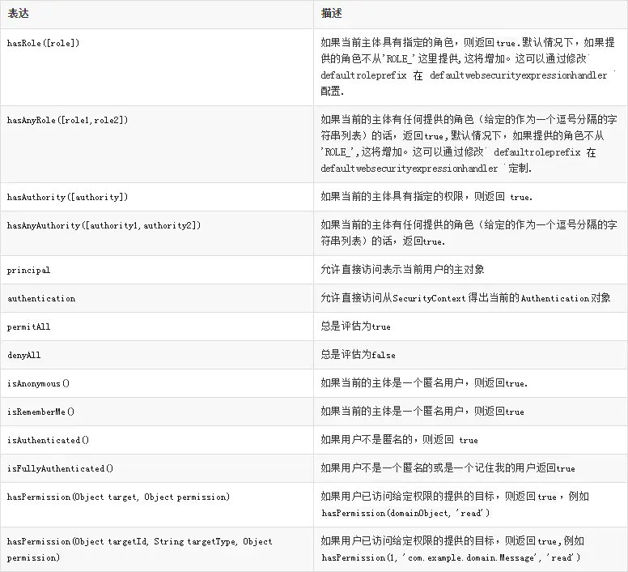

<!-- START doctoc generated TOC please keep comment here to allow auto update -->
<!-- DON'T EDIT THIS SECTION, INSTEAD RE-RUN doctoc TO UPDATE -->


- [Spring的核心](#spring%E7%9A%84%E6%A0%B8%E5%BF%83)
- [装配bean](#%E8%A3%85%E9%85%8Dbean)
  - [自动装配bean](#%E8%87%AA%E5%8A%A8%E8%A3%85%E9%85%8Dbean)
    - [验证自动装配](#%E9%AA%8C%E8%AF%81%E8%87%AA%E5%8A%A8%E8%A3%85%E9%85%8D)
  - [通过Java代码装配bean](#%E9%80%9A%E8%BF%87java%E4%BB%A3%E7%A0%81%E8%A3%85%E9%85%8Dbean)
  - [通过xml装配bean](#%E9%80%9A%E8%BF%87xml%E8%A3%85%E9%85%8Dbean)
    - [构造器注入](#%E6%9E%84%E9%80%A0%E5%99%A8%E6%B3%A8%E5%85%A5)
    - [属性注入](#%E5%B1%9E%E6%80%A7%E6%B3%A8%E5%85%A5)
  - [混合配置](#%E6%B7%B7%E5%90%88%E9%85%8D%E7%BD%AE)
    - [在JavaConfig中引用xml配置](#%E5%9C%A8javaconfig%E4%B8%AD%E5%BC%95%E7%94%A8xml%E9%85%8D%E7%BD%AE)
    - [在xml配置中引用JavaConfig](#%E5%9C%A8xml%E9%85%8D%E7%BD%AE%E4%B8%AD%E5%BC%95%E7%94%A8javaconfig)
- [高级装配](#%E9%AB%98%E7%BA%A7%E8%A3%85%E9%85%8D)
  - [自动装配的歧义性](#%E8%87%AA%E5%8A%A8%E8%A3%85%E9%85%8D%E7%9A%84%E6%AD%A7%E4%B9%89%E6%80%A7)
    - [标识首选的bean](#%E6%A0%87%E8%AF%86%E9%A6%96%E9%80%89%E7%9A%84bean)
    - [限定自动装配的bean](#%E9%99%90%E5%AE%9A%E8%87%AA%E5%8A%A8%E8%A3%85%E9%85%8D%E7%9A%84bean)
    - [创建自定义的限定符](#%E5%88%9B%E5%BB%BA%E8%87%AA%E5%AE%9A%E4%B9%89%E7%9A%84%E9%99%90%E5%AE%9A%E7%AC%A6)
  - [bean的作用域](#bean%E7%9A%84%E4%BD%9C%E7%94%A8%E5%9F%9F)
  - [运行时值注入](#%E8%BF%90%E8%A1%8C%E6%97%B6%E5%80%BC%E6%B3%A8%E5%85%A5)
    - [注入外部的值](#%E6%B3%A8%E5%85%A5%E5%A4%96%E9%83%A8%E7%9A%84%E5%80%BC)
    - [使用Spring表达式语言进行装配](#%E4%BD%BF%E7%94%A8spring%E8%A1%A8%E8%BE%BE%E5%BC%8F%E8%AF%AD%E8%A8%80%E8%BF%9B%E8%A1%8C%E8%A3%85%E9%85%8D)
- [面向切面](#%E9%9D%A2%E5%90%91%E5%88%87%E9%9D%A2)
  - [AOP术语](#aop%E6%9C%AF%E8%AF%AD)
  - [Spring对aop的支持](#spring%E5%AF%B9aop%E7%9A%84%E6%94%AF%E6%8C%81)
  - [通过切面选择连接点](#%E9%80%9A%E8%BF%87%E5%88%87%E9%9D%A2%E9%80%89%E6%8B%A9%E8%BF%9E%E6%8E%A5%E7%82%B9)
  - [使用注解创建切面](#%E4%BD%BF%E7%94%A8%E6%B3%A8%E8%A7%A3%E5%88%9B%E5%BB%BA%E5%88%87%E9%9D%A2)
    - [定义切面](#%E5%AE%9A%E4%B9%89%E5%88%87%E9%9D%A2)
    - [创建环绕通知](#%E5%88%9B%E5%BB%BA%E7%8E%AF%E7%BB%95%E9%80%9A%E7%9F%A5)
    - [处理通知中的参数](#%E5%A4%84%E7%90%86%E9%80%9A%E7%9F%A5%E4%B8%AD%E7%9A%84%E5%8F%82%E6%95%B0)
    - [通过注解引入新功能](#%E9%80%9A%E8%BF%87%E6%B3%A8%E8%A7%A3%E5%BC%95%E5%85%A5%E6%96%B0%E5%8A%9F%E8%83%BD)
  - [在xml中声明切面](#%E5%9C%A8xml%E4%B8%AD%E5%A3%B0%E6%98%8E%E5%88%87%E9%9D%A2)
    - [声明通知](#%E5%A3%B0%E6%98%8E%E9%80%9A%E7%9F%A5)
    - [创建环绕通知](#%E5%88%9B%E5%BB%BA%E7%8E%AF%E7%BB%95%E9%80%9A%E7%9F%A5-1)
    - [为通知传递参数](#%E4%B8%BA%E9%80%9A%E7%9F%A5%E4%BC%A0%E9%80%92%E5%8F%82%E6%95%B0)
    - [通过切面引入新的功能](#%E9%80%9A%E8%BF%87%E5%88%87%E9%9D%A2%E5%BC%95%E5%85%A5%E6%96%B0%E7%9A%84%E5%8A%9F%E8%83%BD)
  - [注入AspectJ切面](#%E6%B3%A8%E5%85%A5aspectj%E5%88%87%E9%9D%A2)
- [后端中的 Spring](#%E5%90%8E%E7%AB%AF%E4%B8%AD%E7%9A%84-spring)
  - [数据访问模板化](#%E6%95%B0%E6%8D%AE%E8%AE%BF%E9%97%AE%E6%A8%A1%E6%9D%BF%E5%8C%96)
  - [配置数据源](#%E9%85%8D%E7%BD%AE%E6%95%B0%E6%8D%AE%E6%BA%90)
  - [在 Spring 中集成 Hibernate](#%E5%9C%A8-spring-%E4%B8%AD%E9%9B%86%E6%88%90-hibernate)
  - [Spring 与 Java 持久化  API](#spring-%E4%B8%8E-java-%E6%8C%81%E4%B9%85%E5%8C%96--api)
    - [配置实体管理器工厂](#%E9%85%8D%E7%BD%AE%E5%AE%9E%E4%BD%93%E7%AE%A1%E7%90%86%E5%99%A8%E5%B7%A5%E5%8E%82)
    - [编写 JPA Repository](#%E7%BC%96%E5%86%99-jpa-repository)
  - [借助 Spring Data 实现自动化的 JPA Repository](#%E5%80%9F%E5%8A%A9-spring-data-%E5%AE%9E%E7%8E%B0%E8%87%AA%E5%8A%A8%E5%8C%96%E7%9A%84-jpa-repository)
    - [Spring Data JPA 的核心接口](#spring-data-jpa-%E7%9A%84%E6%A0%B8%E5%BF%83%E6%8E%A5%E5%8F%A3)
    - [定义数据访问层](#%E5%AE%9A%E4%B9%89%E6%95%B0%E6%8D%AE%E8%AE%BF%E9%97%AE%E5%B1%82)
    - [定义查询方法](#%E5%AE%9A%E4%B9%89%E6%9F%A5%E8%AF%A2%E6%96%B9%E6%B3%95)
    - [混合自定义的功能](#%E6%B7%B7%E5%90%88%E8%87%AA%E5%AE%9A%E4%B9%89%E7%9A%84%E5%8A%9F%E8%83%BD)
- [Spring Security](#spring-security)
  - [基于内存的用户存储](#%E5%9F%BA%E4%BA%8E%E5%86%85%E5%AD%98%E7%9A%84%E7%94%A8%E6%88%B7%E5%AD%98%E5%82%A8)
  - [基于数据库表进行认证](#%E5%9F%BA%E4%BA%8E%E6%95%B0%E6%8D%AE%E5%BA%93%E8%A1%A8%E8%BF%9B%E8%A1%8C%E8%AE%A4%E8%AF%81)
  - [拦截请求](#%E6%8B%A6%E6%88%AA%E8%AF%B7%E6%B1%82)
  - [使用Spring表达式进行安全保护](#%E4%BD%BF%E7%94%A8spring%E8%A1%A8%E8%BE%BE%E5%BC%8F%E8%BF%9B%E8%A1%8C%E5%AE%89%E5%85%A8%E4%BF%9D%E6%8A%A4)
  - [安全通道](#%E5%AE%89%E5%85%A8%E9%80%9A%E9%81%93)
  - [认证用户](#%E8%AE%A4%E8%AF%81%E7%94%A8%E6%88%B7)
  - [方法级别安全](#%E6%96%B9%E6%B3%95%E7%BA%A7%E5%88%AB%E5%AE%89%E5%85%A8)
    - [@Secured](#secured)
    - [@RolesAllowed](#rolesallowed)
    - [使用表达式实现方法级别的安全性](#%E4%BD%BF%E7%94%A8%E8%A1%A8%E8%BE%BE%E5%BC%8F%E5%AE%9E%E7%8E%B0%E6%96%B9%E6%B3%95%E7%BA%A7%E5%88%AB%E7%9A%84%E5%AE%89%E5%85%A8%E6%80%A7)

<!-- END doctoc generated TOC please keep comment here to allow auto update -->

## Spring的核心

相对于EJB(Enterprise JaveBean)，Spring提供了更加轻量级和简单的编程模型。

Spring可以简化Java开发：1.基于pojo的轻量级和最小侵入式编程；2.通过依赖注入和面向接口实现松耦合；3.基于切面和惯例进行声明式编程；4.通过切面和模板减少样板式代码。

1. 非侵入编程

很多框架通过强迫应用继承它们的类或实现它们的接口从而导致应用与框架绑死。Spring竭力避免自身API与应用代码的耦合。Spring不会强迫你实现Spring规范的接口或继承Spring规范的类。

2. 依赖注入

假如两个类相互协作完成特定的业务，按照传统的做法，每个对象负责管理与自己相互协作的对象的引用，这会导致高度耦合。

```java
public class Knight {
    private RescueQuest quest;
    
    public Knight() {
        this.quest = new RescueQuest(); //勇士只能进行救援工作
    }
    
    public void embarkOnQuest() {
        quest.embark();
    }
}
```

通过DI，对象无需自行创建或管理它们的依赖关系，依赖关系将被自动注入到对象当中。对象只通过接口来表明依赖关系，可以传入不同的具体实现。

```java
public class Knight {
    private Quest quest;
    
    //通过构造器注入依赖，可以传入任何Quest接口的实现类，如RescueQuest，SlayDragonQuest等
    public Knight(Quest quest) {
        this.quest = quest;
    }
    
    public void embarkOnQuest() {
        quest.embark();
    }
}
```

3. 面向切面编程

aop允许你将遍布应用各处的功能（日志，事务管理）分离出来形成可重用的组件。


4. 模板技术

编程中会遇到许多样板式代码，如使用JDBC访问数据库查询数据时，首先需要创建数据库连接（Connection），然后再创建一个语句对象（PrepareStatement），然后进行查询，可能需要处理SQL异常，最后关闭数据库连接、语句和结果集。Spring通过模板封装来消除样板式代码。Spring的JDBCTemplate可以避免传统的JDBC样板代码。


## 装配bean

Spring bean装配机制：1.自动装配；2.使用spring基于Java的配置(JavaConfig)；3.xml配置。

我们应当尽可能使用自动装配的机制，显式配置越少越好。当自动装配行不通时，如使用第三方库的组件装配到应用，则需采用显式装配的方式，此时推荐使用类型安全并且比xml更为强大的JavaConfig。只有当需要使用便利的xml命名空间，并且在JavaConfig中没有同样的实现时，才应该使用xml。

### 自动装配bean

实现自动装配bean 需要两点：1.开启组件扫描；2.给bean加自动装配的注解。

```java
public interface CD {
    public void play();
}

@Component("cd")
public class EasonCD implements CD {
    private String song = "Ten years";
    private String singer = "Eason";

    @Override
    public void play() {
        System.out.println("singer--" + singer + " sings " + song);
    }
}
```

@Component表明该类会作为组件类，并告知Spring为这个类创建bean。@Component("cd")可以为bean命名，没有配置默认是类名首字母小写。@Named注解与@Component作用类似。

CDPlayer类中，在构造器上加了注解@Autowired，表明当Spring创建CDPlayer bean的时候，会通过这个构造器进行实例化并传入一个类型为CD的bean。@Inject注解和@Autowired作用类似。

```java
import org.springframework.beans.factory.annotation.Autowired;
import org.springframework.stereotype.Component;

/**
 * @Autowired，通过byType的形式自动装配，可以用在属性，构造器和setter方法上
 * required属性设为false，没有符合条件的bean也不会抛异常
 */
@Component
public class CDPlayer implements MediaPlayer {
    private CD cd;

    @Autowired
    public CDPlayer(CD cd) {
        this.cd = cd;
    }

    @Override
    public void play() {
        cd.play();
    }
}
```

组件扫描默认不启动，需要显式配置一下Spring，开启组件扫描。通过@ComponentScan注解启动了组件扫描，扫描包下是否有@Component标注的类，若有，则会在Spring中自动为其创建bean。

```java
import org.springframework.context.annotation.ComponentScan;
import org.springframework.context.annotation.Configuration;

/**
 * @Configuration用于定义配置类。该类应该包含Spring应用上下文如何创建bean的细节。
 * 通过@ComponentScan注解启动了组件扫描
 * 配置basePackages则扫描指定的包，没配置则默认扫描当前包
 * 配置basePackageClasses则通过扫描配置的类所在的包
 */
@Configuration
//@ComponentScan(basePackages = {"com.tyson.pojo", "com.tyson.service"})
@ComponentScan(basePackageClasses = {EasonCD.class})
public class CDPlayerConfig {
}
```

#### 验证自动装配

```java
import com.tyson.config.CDPlayerConfig;
import org.junit.Assert;
import org.junit.Test;
import org.junit.runner.RunWith;
import org.springframework.beans.factory.annotation.Autowired;
import org.springframework.test.context.ContextConfiguration;
import org.springframework.test.context.junit4.SpringJUnit4ClassRunner;

/**
 * @RunWith(SpringJUnit4ClassRunner.class)在测试开始时自动创建Spring应用上下文
 */
@RunWith(SpringJUnit4ClassRunner.class)
@ContextConfiguration(classes = {CDPlayerConfig.class}) //开启组件扫描
public class CDPlayerTest {
    @Autowired
    private CD cd;
    @Autowired
    private MediaPlayer player;

    @Test
    public void cdShouldNotBeNull() {
        Assert.assertNotNull(cd);
    }

    @Test
    public void play() {
        player.play();
    }
}
```

也可以在applicationContext.xml使用\<context:component-scan/>来启动组件扫描。

```xml
<beans xmlns="http://www.springframework.org/schema/beans"
       xmlns:c="http://www.springframework.org/schema/c"
       xmlns:xsi="http://www.w3.org/2001/XMLSchema-instance"
       xmlns:context="http://www.springframework.org/schema/context"
       xsi:schemaLocation="http://www.springframework.org/schema/beans
        http://www.springframework.org/schema/beans/spring-beans.xsd
        http://www.springframework.org/schema/context
        http://www.springframework.org/schema/context/spring-context.xsd">
    
    <!--使用context需要在xml文件头部引入context命名空间-->
    <context:component-scan base-package="com.tyson.pojo"/>
</beans>
```

测试代码。

```java
import org.junit.Assert;
import org.junit.Test;
import org.junit.runner.RunWith;
import org.springframework.beans.factory.annotation.Autowired;
import org.springframework.test.context.ContextConfiguration;
import org.springframework.test.context.junit4.SpringJUnit4ClassRunner;


/**
 * @RunWith(SpringJUnit4ClassRunner.class)在测试开始时自动创建Spring应用上下文
 */
@RunWith(SpringJUnit4ClassRunner.class)
//@ContextConfiguration(classes = {CDPlayerConfig.class}) //开启组件扫描
@ContextConfiguration(locations = {"classpath:applicationContext.xml"}) //开启组件扫描
public class CDPlayerTest {
    @Autowired
    private CD cd;
    @Autowired
    private MediaPlayer player;

    @Test
    public void cdShouldNotBeNull() {
        Assert.assertNotNull(cd);
    }

    @Test
    public void play() {
        player.play();
    }
}
```

### 通过Java代码装配bean

有些情况下无法使用自动装配，如要将第三方类库的组件装配到我们的应用，便无法使用自动装配。下面使用JavaConfig显式配置Spring。（JavaConfig是配置代码，应该放在单独的包中，与其他应用程序逻辑分离开。）

CDPlayerConfig配置类

```java
import com.tyson.pojo.CD;
import com.tyson.pojo.CDPlayer;
import com.tyson.pojo.EasonCD;
import org.springframework.context.annotation.Bean;
import org.springframework.context.annotation.Configuration;

/**
 * @Configuration用于定义配置类，可替换xml配置文件。该类应该包含Spring应用上下文如何创建bean的细节。
 */
@Configuration
public class CDPlayerConfig {
    @Bean(name = "easonCD")  //@Bean告诉spring将对象注册到spring容器
    public CD easonCD() {
        return new EasonCD();
    }

    /**
     * 推荐这种方式，不要求将CD声明到同一个配置文件
     * CD可以采用各种方式创建（自动扫描、配置类、JavaConfig），Spring都能将其传入到配置方法中
     */
    @Bean(name = "cdPlayer")
    public CDPlayer cdPlayer(CD cd) {
        return new CDPlayer(cd);
    }

/*    @Bean(name = "cdPlayer")
    public CDPlayer cdPlayer() {
        return new CDPlayer(easonCD());
    }*/
}
```

通过AnnotationConfigApplicationContext从Java配置类加载Spring应用上下文。

```java
//AnnotationConfigApplicationContext：从一个或多个基于Java的配置类加载Spring应用上下文
@Test
public void play() {
    ApplicationContext cxt = new AnnotationConfigApplicationContext(CDPlayerConfig.class);
    CDPlayer cdPlayer = (CDPlayer)cxt.getBean("cdPlayer");
    cdPlayer.play();
}
```

### 通过xml装配bean

#### 构造器注入

借助构造器注入初始化bean有两种方式：constructor-arg元素或者Spring3.0引入的c-命名空间。

1. 将引用注入构造器。

EasonCD.java

```java
public class EasonCD implements CD {
    @Override
    public void play() {
        System.out.println("haha");
    }
}
```

CDPlayer.java

```java
import org.springframework.beans.factory.annotation.Autowired;

public class CDPlayer implements MediaPlayer {
    private CD cd;

    /**
     * 构造器注入
     */
    public CDPlayer(CD cd) {
        this.cd = cd;
    }

    @Override
    public void play() {
        cd.play();
    }
}
```

applicationContext.xml使用构造器注入创建bean。

```xml
<?xml version="1.0" encoding="UTF-8"?>
<beans xmlns="http://www.springframework.org/schema/beans"
       xmlns:c="http://www.springframework.org/schema/c"
       xmlns:xsi="http://www.w3.org/2001/XMLSchema-instance"
       xsi:schemaLocation="http://www.springframework.org/schema/beans
        http://www.springframework.org/schema/beans/spring-beans.xsd">

    <!--使用默认构造器创建bean-->
    <bean id="cd" class="com.tyson.pojo.EasonCD"/>
    <!--借助构造器注入初始化bean，使用constructor-arg元素或者Spring3.0引入的c-命名空间-->
    <!--方式1-->
    <!--<bean id="cdPlayer" class="com.tyson.pojo.CDPlayer">
        <constructor-arg ref="cd"/>
    </bean>-->
    <!--方式2，更为简练，c命名空间需先引入c命名空间-->
    <!--<bean id="cdPlayer" class="com.tyson.pojo.CDPlayer" c:cd-ref="cd"/>-->
    <!--使用索引识别构造器参数-->
    <bean id="cdPlayer" class="com.tyson.pojo.CDPlayer" c:_0-ref="cd"/>
</beans>
```

测试类

```java
/**
 * AnnotationConfigApplicationContext：从一个或多个基于Java的配置类加载Spring应用上下文
 * ClassPathXmlApplicationContext：从类路径上的一个或多个xml配置文件中加载Spring应用上下文
 */
@Test
public void play() {
    ApplicationContext cxt = new ClassPathXmlApplicationContext("applicationContext.xml");
    CDPlayer cdPlayer = (CDPlayer)cxt.getBean("cdPlayer");
    cdPlayer.play();
}
```

c-命名空间元素组成如下图，可以看到使用了构造器参数。


也可以使用索引识别构造器参数。

```xml
<bean id="cdPlayer" class="com.tyson.pojo.CDPlayer" c:_0-ref="cd"/>
```

2. 将字面量注入构造器

```java
public class PuthCD implements CD {
    private String song;
    private String note;

    public PuthCD(String song, String note) {
        this.song = song;
        this.note = note;
    }

    @Override
    public void play() {
        System.out.println("Puth sings \"" + song + "\"");
    }
}
```

利用constructor-arg元素的value进字面量注入构造器。

```xml
<!--将字面量注入构造器-->
<bean id="puthCD" class="com.tyson.pojo.PuthCD">
    <constructor-arg value="we don't talk anymore"/>
    <constructor-arg value="emmm"/>
</bean>
```

也可以使用c-空间。

```xml
<!--将字面量注入构造器方式1-->
<!--    <bean id="puthCD" class="com.tyson.pojo.PuthCD">
        <constructor-arg value="we don't talk anymore"/>
        <constructor-arg value="emmm"/>
    </bean>-->
<!--将字面量注入构造器方式2-->
<!--    <bean id="puthCD" class="com.tyson.pojo.PuthCD"
        c:song="we don't talk anymore"
        c:note="emmm"/>-->
<bean id="puthCD" class="com.tyson.pojo.PuthCD"
      c:_0="we don't talk anymore"
      c:_1="emmm"/>
```

测试类

```java
@Test
public void puthPlay() {
    ApplicationContext cxt = new ClassPathXmlApplicationContext("applicationContext.xml");
    PuthCD puthCD = (PuthCD)cxt.getBean("puthCD");
    puthCD.play();
}
```

3. 装配集合

```java
public class EuropeCD implements CD {
    private String name;
    private List<String> singers;

    public EuropeCD(String name, List<String> singers) {
        this.name = name;
        this.singers = singers;
    }

    @Override
    public void play() {
        System.out.println(name);
        singers.forEach(singer -> {
            System.out.print(singer + ", ");
        });
    }
}
```

使用list元素装配集合。这里c-命名空间没有响应的实现，只能用constructor-arg元素。

```xml
<bean id="europeCD" class="com.tyson.pojo.EuropeCD">
    <constructor-arg value="europe singers"/>
    <constructor-arg>
        <list>
            <!--list里面也可以用ref元素引用其他bean-->
            <value>断眉</value>
            <value>梦龙</value>
            <value>西域男孩</value>
            <value>一体共和</value>
        </list>
    </constructor-arg>
</bean>
```

#### 属性注入

除了可以通过构造器注入初始化bean以外，也可以通过属性注入初始化bean。通过属性注入，则类中不能有带参数的构造器，或者要显式声明无参的构造器。

1. 将引用注入属性中

```java
import org.springframework.beans.factory.annotation.Autowired;

public class CDPlayer implements MediaPlayer {
    private CD cd;

    /**
     *属性注入
     */
    public void setCd(CD cd) {
        this.cd = cd;
    }

    @Override
    public void play() {
        cd.play();
    }
}
```

applicationContext.xml中进行属性注入创建bean。有两种方式，使用property元素或者p-命名空间。

```xml
<?xml version="1.0" encoding="UTF-8"?>
<beans xmlns="http://www.springframework.org/schema/beans"
       xmlns:c="http://www.springframework.org/schema/c"
       xmlns:p="http://www.springframework.org/schema/p"
       xmlns:xsi="http://www.w3.org/2001/XMLSchema-instance"
       xsi:schemaLocation="http://www.springframework.org/schema/beans
        http://www.springframework.org/schema/beans/spring-beans.xsd">
    <!--属性注入-->
    <!--    <bean id="cdPlayer" class="com.tyson.pojo.CDPlayer">
            <property name="cd" ref="cd"/>
        </bean>-->
    <!--使用p-命名空间，需要先在xml文件头部引入p命名空间-->
    <bean id="cdPlayer" class="com.tyson.pojo.CDPlayer"
          p:cd-ref="cd"/>
</beans>
```

p命名空间元素组成如下：


2. 将字面量和集合注入属性中

EuropeCD.java

```java
import java.util.List;

public class EuropeCD implements CD {
    private String name;
    private List<String> singers;

    //属性注入
    public void setName(String name) {
        this.name = name;
    }

    //属性注入
    public void setSingers(List<String> singers) {
        this.singers = singers;
    }

    @Override
    public void play() {
        System.out.println(name);
        singers.forEach(singer -> {
            System.out.print(singer + ", ");
        });
    }
}
```

applicationContext.xml

```xml
<?xml version="1.0" encoding="UTF-8"?>
<beans xmlns="http://www.springframework.org/schema/beans"
       xmlns:c="http://www.springframework.org/schema/c"
       xmlns:p="http://www.springframework.org/schema/p"
       xmlns:util="http://www.springframework.org/schema/util"
       xmlns:xsi="http://www.w3.org/2001/XMLSchema-instance"
       xsi:schemaLocation="http://www.springframework.org/schema/beans
        http://www.springframework.org/schema/beans/spring-beans.xsd
        http://www.springframework.org/schema/util
        http://www.springframework.org/schema/util/spring-util.xsd">
    
	<!--注入字面量和集合到属性-->
    <!--<bean id="europeCD" class="com.tyson.pojo.EuropeCD">
                <property name="name" value="Europer singers"/>
                <property name="singers">
                    <list>
                        <value>断眉</value>
                        <value>梦龙</value>
                        <value>西域男孩</value>
                        <value>一体共和</value>
                    </list>
                </property>
            </bean>-->
    <!--使用p和util元素，需要先在xml文件头部引入相应命名空间-->
    <bean id="europeCD" class="com.tyson.pojo.EuropeCD"
          p:name="Europer singers"
          p:singers-ref="singers"/>
    <util:list id="singers">
        <value>断眉</value>
        <value>梦龙</value>
        <value>西域男孩</value>
        <value>一体共和</value>
    </util:list>
</beans>
```

引入util命名空间。


### 混合配置

#### 在JavaConfig中引用xml配置

假如CD使用xml配置，CDPlayer使用JavaConfig配置。

```java
import com.tyson.pojo.CD;
import com.tyson.pojo.CDPlayer;
import org.springframework.context.annotation.Bean;
import org.springframework.context.annotation.Configuration;

@Configuration
public class CDPlayerConfig {
    @Bean(name = "cdPlayer")
    public CDPlayer cdPlayer(CD cd) {
        return new CDPlayer(cd);
    }
}
```

装配CD定义在cd-config.xml中。

```xml
<?xml version="1.0" encoding="UTF-8"?>
<beans xmlns="http://www.springframework.org/schema/beans"
       xmlns:c="http://www.springframework.org/schema/c"
       xmlns:p="http://www.springframework.org/schema/p"
       xmlns:util="http://www.springframework.org/schema/util"
       xmlns:xsi="http://www.w3.org/2001/XMLSchema-instance"
       xsi:schemaLocation="http://www.springframework.org/schema/beans
        http://www.springframework.org/schema/beans/spring-beans.xsd
        http://www.springframework.org/schema/util
        http://www.springframework.org/schema/util/spring-util.xsd">

    <!--使用p和util元素，需要先在xml文件头部引入相应的命名空间-->
    <bean id="europeCD" class="com.tyson.pojo.EuropeCD"
          p:name="Europer singers"
          p:singers-ref="singers"/>
    <util:list id="singers">
        <value>断眉</value>
        <value>梦龙</value>
        <value>西域男孩</value>
        <value>一体共和</value>
    </util:list>
</beans>
```

新建一个SoundSystemConfig.java类，通过@Import和@ImportResource引入JavaConfig配置类和xml配置文件。

```java
import org.springframework.context.annotation.Configuration;
import org.springframework.context.annotation.Import;
import org.springframework.context.annotation.ImportResource;

//JavaConfig引用JavaConfig--@Import(CDPlayerConfig.class, CDConfig.class)
@Configuration
@Import(CDPlayerConfig.class)
@ImportResource("classpath:cd-config.xml")
public class SoundSystemConfig {
}
```

测试代码

```java
/**
 * AnnotationConfigApplicationContext：从一个或多个基于Java的配置类加载Spring应用上下文
 * ClassPathXmlApplicationContext：从类路径上的一个或多个xml配置文件中加载Spring应用上下文
 */
@Test
public void javaConfigImportXmlTest() {
    ApplicationContext ctx = new AnnotationConfigApplicationContext(SoundSystemConfig.class);
    CDPlayer player = (CDPlayer) ctx.getBean("cdPlayer");
    player.play();
}
```

#### 在xml配置中引用JavaConfig

假如CDPlayer使用player-config.xml配置，CD使用cd-config.xml配置，则在player-config.xml中需要用import元素引用cd-config文件，从而将CD注入到CDPlayer。

player-config.xml

```xml
<?xml version="1.0" encoding="UTF-8"?>
<beans xmlns="http://www.springframework.org/schema/beans"
       xmlns:c="http://www.springframework.org/schema/c"
       xmlns:p="http://www.springframework.org/schema/p"
       xmlns:util="http://www.springframework.org/schema/util"
       xmlns:xsi="http://www.w3.org/2001/XMLSchema-instance"
       xsi:schemaLocation="http://www.springframework.org/schema/beans
        http://www.springframework.org/schema/beans/spring-beans.xsd
        http://www.springframework.org/schema/util
        http://www.springframework.org/schema/util/spring-util.xsd">

    <!--cd-config.xml中bean的名称为europeCD-->
    <import resource="cd-config.xml"/>
    <bean id="cdPlayer" class="com.tyson.pojo.CDPlayer"
          c:cd-ref="europeCD"/>
</beans>
```

如果CDPlayer使用player-config.xml配置，而CD使用JavaConfig来配置，则需要这样声明bean：

```xml
<?xml version="1.0" encoding="UTF-8"?>
<beans xmlns="http://www.springframework.org/schema/beans"
       xmlns:c="http://www.springframework.org/schema/c"
       xmlns:p="http://www.springframework.org/schema/p"
       xmlns:util="http://www.springframework.org/schema/util"
       xmlns:context="http://www.springframework.org/schema/context"
       xmlns:xsi="http://www.w3.org/2001/XMLSchema-instance"
       xsi:schemaLocation="http://www.springframework.org/schema/beans
        http://www.springframework.org/schema/beans/spring-beans.xsd
        http://www.springframework.org/schema/util
        http://www.springframework.org/schema/util/spring-util.xsd
        http://www.springframework.org/schema/context
        http://www.springframework.org/schema/context/spring-context.xsd">

    <!--引入context命名空间；扫描CDConfig，生成CD bean-->
    <context:component-scan base-package="com.tyson.config"/>
    <!--cd-config.xml中bean的名称为europeCD-->
    <!--<import resource="cd-config.xml"/>-->
    <!--CDConfig中bean的名称为europeCD-->
    <bean class="com.tyson.config.CDConfig"/>
    <bean id="cdPlayer" class="com.tyson.pojo.CDPlayer"
          p:cd-ref="easonCD"/>
</beans>
```

CDConfig.java

```java
import com.tyson.pojo.CD;
import com.tyson.pojo.EasonCD;
import org.springframework.context.annotation.Bean;
import org.springframework.context.annotation.Configuration;

@Configuration
public class CDConfig {
    @Bean(name = "easonCD")
    public CD getCD() {
        return new EasonCD();
    }
}
```

测试代码：

```java
@Test
public void xmlImportJavaConfigTest() {
    ApplicationContext cxt = new ClassPathXmlApplicationContext("player-config.xml");
    CDPlayer player = (CDPlayer) cxt.getBean("cdPlayer");
    player.play();
}
```

也可以使用第三个配置文件，将JavaConfig和xml配置组合起来。

soundSystem-config.xml

```xml
<?xml version="1.0" encoding="UTF-8"?>
<beans xmlns="http://www.springframework.org/schema/beans"
       xmlns:c="http://www.springframework.org/schema/c"
       xmlns:p="http://www.springframework.org/schema/p"
       xmlns:util="http://www.springframework.org/schema/util"
       xmlns:context="http://www.springframework.org/schema/context"
       xmlns:xsi="http://www.w3.org/2001/XMLSchema-instance"
       xsi:schemaLocation="http://www.springframework.org/schema/beans
        http://www.springframework.org/schema/beans/spring-beans.xsd
        http://www.springframework.org/schema/util
        http://www.springframework.org/schema/util/spring-util.xsd
        http://www.springframework.org/schema/context
        http://www.springframework.org/schema/context/spring-context.xsd">

    <!--引入context命名空间；扫描CDConfig，生成CD bean-->
    <context:component-scan base-package="com.tyson.config"/>

    <bean class="com.tyson.config.CDConfig"/>
    <import resource="player-config.xml"/>
</beans>
```

故无论是JavaConfig还是xml配置，都可以先创建一个根配置，在根配置里将多个装配类或者xml文件组合起来，同时可以在根配置打开组件扫描（通过\<context:component-scan/\>或者@ComponentScan）。

## 高级装配

### 自动装配的歧义性

编写Dessert接口，有三个实现Dessert的类：Cake、IceCream和Cookie。假如三个类都使用@Component注解，Spring在进行组件扫描时会为它们创建bean，这时如果Spring试图自动装配setDessert里面的Dessert参数时，这时Spring便不知道该使用哪个bean。

```java
@Autowired
public void setDessert(Dessert dessert) {
    this.dessert = dessert;
}
```

#### 标识首选的bean

通过设置其中某个bean为首选的bean可避免自动装配的歧义性。

定义Bean时使用@Primary注解。

```java
import org.springframework.context.annotation.Primary;
import org.springframework.stereotype.Component;

@Component
@Primary
public class Cookie implements Dessert {
    @Override
    public void make() {
        System.out.println("making cookie...");
    }
}
```

或者在JavaConfig类中使用@Primary注解。

```java
import com.tyson.pojo.Cookie;
import com.tyson.pojo.Dessert;
import org.springframework.context.annotation.Bean;
import org.springframework.context.annotation.ComponentScan;
import org.springframework.context.annotation.Configuration;
import org.springframework.context.annotation.Primary;

@Configuration
public class DessertConfig {
    @Bean
    @Primary
    public Dessert dessert() {
        return new Cookie();
    }
}
```

xml配置使用primary属性。

```xml
<bean id="cookie" class="com.tyson.pojo.Cookie" primary="true"/>
```

#### 限定自动装配的bean

@Primary只能标识一个首选的bean，当首选的bean存在有多个时，这种方法便失效。Spring的限定符可以在可选的bean进行缩小范围，最终使得只有一个bean符合限定条件。

@Qualifier注解是使用限定符的主要方式。它与@Autowired和@Inject协同使用，在注入的时候指定注入哪个bean。

```java
@Autowired
@Qualifier("cookie")
public void setDessert(Dessert dessert) {
    this.dessert = dessert;
}
```

这种方式setDessert方法上所指定的限定符和要注入的bean名称是紧耦合的。如果类名称修改则会导致限定符失效。

#### 创建自定义的限定符

为bean设置自己的限定符。

```java
import org.springframework.beans.factory.annotation.Qualifier;
import org.springframework.stereotype.Component;

@Component
@Qualifier("cold")
public class IceCream implements Dessert {

    @Override
    public void make() {
        System.out.println("making ice cream......");
    }
}
```

在自动装配的地方引入自定义限定符。@Autowired和@Qualifier组合，按byName方式自动装配。

```java
@Autowired
@Qualifier("cold")
public void setDessert(Dessert dessert) {
    this.dessert = dessert;
}
```

当使用JavaConfig装配bean时，@Qualifier可以和@Bean注解一起使用。

```java
import com.tyson.pojo.Cookie;
import com.tyson.pojo.Dessert;
import org.springframework.beans.factory.annotation.Qualifier;
import org.springframework.context.annotation.Bean;
import org.springframework.context.annotation.Configuration;

@Configuration
//@ComponentScan(basePackages = {"com.tyson.pojo"})
public class DessertConfig {
    @Bean
    @Qualifier("cold")
    public Dessert dessert() {
        return new IceCream();
    }
}
```

使用自定义的限定符注解

当有多个Dessert都具有cold特征时，此时需要添加更多的限定符来避免歧义性的问题。

```java
import com.tyson.pojo.Dessert;
import com.tyson.pojo.IceCream;
import org.springframework.beans.factory.annotation.Qualifier;
import org.springframework.context.annotation.Bean;
import org.springframework.context.annotation.Configuration;

@Configuration
public class DessertConfig {
    @Bean
    @Qualifier("cold")
    @Qualifier("creamy")
    public Dessert dessert() {
        return new IceCream();
    }
}
```

然而在一个类上出现多个相同类型的注解是不被允许的，会报编译错误。可以通过创建自定义的限定符注解解决这个问题。下面是自定义@Cold注解的例子：

```java
import org.springframework.beans.factory.annotation.Qualifier;

import java.lang.annotation.*;

@Target({ElementType.FIELD, ElementType.METHOD, ElementType.PARAMETER, ElementType.TYPE, ElementType.CONSTRUCTOR})
@Retention(RetentionPolicy.RUNTIME)
@Qualifier  //具有@Qualifier的特性
public @interface Cold {
}
```

自定义@Creamy注解。

```java
import org.springframework.beans.factory.annotation.Qualifier;

import java.lang.annotation.ElementType;
import java.lang.annotation.Retention;
import java.lang.annotation.RetentionPolicy;
import java.lang.annotation.Target;

@Target({ElementType.FIELD, ElementType.METHOD, ElementType.PARAMETER, ElementType.TYPE, ElementType.CONSTRUCTOR})
@Retention(RetentionPolicy.RUNTIME)
@Qualifier  //具有@Qualifier的特性
public @interface Creamy {
}
```

使用@Cold和@Creamy。

```java
import com.tyson.annotation.Cold;
import com.tyson.annotation.Creamy;
import org.springframework.stereotype.Component;

@Component
@Cold
@Creamy
public class IceCream implements Dessert {

    @Override
    public void make() {
        System.out.println("making ice cream......");
    }
}
```

使用自定义注解更为安全。

### bean的作用域

默认情况下，Spring应用上下文所有的bean都是以单例的形式创建。不管给定的bean注入到其他bean多少次，每次注入的都是同一个实例。

Spring定义了多种定义域：

单例（Singleton）：在整个应用，只创建bean一个实例。

原型（prototype）：每次注入或者通过Spring应用上下文获取的时候，都会创建一个新的bean实例。

会话（session）：在web应用中，为每个会话创建一个bean实例。

请求（request）：在web应用中，为每个请求创建一个bean实例。

单例是默认的作用域，使用@Scope选择其他的作用域，它可以跟@Component和@Bean一起使用。

使用@Scope声明CDPlayer为原型bean。

```java
import org.springframework.beans.factory.annotation.Autowired;
import org.springframework.beans.factory.config.ConfigurableBeanFactory;
import org.springframework.context.annotation.Scope;
import org.springframework.stereotype.Component;

@Component
@Scope(ConfigurableBeanFactory.SCOPE_PROTOTYPE)
public class CDPlayer implements MediaPlayer {
    private CD cd;

    /**
     * 构造器注入
     */
    @Autowired
    public CDPlayer(CD cd) {
        this.cd = cd;
    }

    @Override
    public void play() {
        cd.play();
    }
}
```

在JavaConfig中声明CDPlayer为原型bean。

```java
@Bean(name = "cdPlayer")
@Scope(ConfigurableBeanFactory.SCOPE_PROTOTYPE)
public CDPlayer cdPlayer(CD cd) {
    return new CDPlayer(cd);
}

```

若是通过xml配置bean，可以通过<bean>元素的scope属性设置作用域。

```java
<bean id="cd" class="com.tyson.pojo.EasonCD" scope="prototype"/>
```

### 运行时值注入

依赖注入，是将一个bean引用注入到另一个bean的属性或者构造器参数， 是一个对象和另一个对象进行关联。bean装配是将一个值注入到bean的属性或者构造器参数中。

#### 注入外部的值

使用JavaConfig的方式装配EasonCD bean。通过Environment类获得app.properties定义的属性值。

```java
import com.tyson.pojo.CD;
import com.tyson.pojo.EasonCD;
import org.springframework.beans.factory.annotation.Autowired;
import org.springframework.context.annotation.Bean;
import org.springframework.context.annotation.Configuration;
import org.springframework.context.annotation.PropertySource;
import org.springframework.core.env.Environment;

@Configuration
@PropertySource("classpath:app.properties")
public class PropertySourcesPlaceholderConfig {
    @Autowired
    private Environment env;

    @Bean
    public CD easonCD() {
        return new EasonCD(env.getProperty("song"),
            env.getProperty("singer")
        );
    }
}
```

通过@PropertySource引用了类路径中一个名为app.properties的文件。

```properties
song = ten years
singer = Eason
```

测试代码

```java
@Test
public void test1() {
    ApplicationContext ctx = new AnnotationConfigApplicationContext(PropertySourcesPlaceholderConfig.class);
    CD cd = ctx.getBean("easonCD", CD.class);
    cd.play();
}
```

如果使用组件扫描和自动装配创建bean，可以通过@Value注解引用外部的值。

```java
import org.springframework.beans.factory.annotation.Value;
import org.springframework.context.annotation.PropertySource;
import org.springframework.stereotype.Component;

@Component("easonCD")
@PropertySource("classpath:app.properties")
public class EasonCD implements CD {
    private String song;
    private String singer;

/*    @Bean
    public static PropertySourcesPlaceholderConfigurer placeholderConfigurer() {
        PropertySourcesPlaceholderConfigurer propertySourcesPlaceholderConfigurer = new PropertySourcesPlaceholderConfigurer();
        ClassPathResource classPathResource = new ClassPathResource("app.properties");
        propertySourcesPlaceholderConfigurer.setLocation(classPathResource);
        propertySourcesPlaceholderConfigurer.setLocalOverride(true);
        return propertySourcesPlaceholderConfigurer;
    }*/

    public EasonCD(@Value("${song}") String song,
                        @Value("${singer}") String singer) {
        this.song = song;
        this.singer = singer;
    }

    @Override
    public void play() {
        System.out.println("singer--" + singer + " sings " + song);
    }
}
```

测试代码

```java
@Test
public void test1() {
    ApplicationContext ctx = new AnnotationConfigApplicationContext(CDConfig.class);
    CD cd = ctx.getBean("easonCD", CD.class);
    cd.play();
}
```

使用xml配置的话，Spring的\<context:propertyplaceholder>元素可以为我们生成PropertySourcesPlaceholderConfigurer bean，进而可以使用占位符。

```xml
<?xml version="1.0" encoding="UTF-8"?>
<beans xmlns="http://www.springframework.org/schema/beans"
       xmlns:c="http://www.springframework.org/schema/c"
       xmlns:p="http://www.springframework.org/schema/p"
       xmlns:util="http://www.springframework.org/schema/util"
       xmlns:xsi="http://www.w3.org/2001/XMLSchema-instance"
       xmlns:context="http://www.springframework.org/schema/context"
       xsi:schemaLocation="http://www.springframework.org/schema/beans
        http://www.springframework.org/schema/beans/spring-beans.xsd
        http://www.springframework.org/schema/util
        http://www.springframework.org/schema/util/spring-util.xsd http://www.springframework.org/schema/context http://www.springframework.org/schema/context/spring-context.xsd">

<!--    <bean id="placeHolder" class="org.springframework.beans.factory.config.PropertyPlaceholderConfigurer">
        <property name="locations">
            <list>
                <value>classpath:app.properties</value>
            </list>
        </property>
    </bean>-->

    <bean id="easonCD" class="com.tyson.pojo.EasonCD">
        <property name="song" value="${song}"/>
        <property name="singer" value="${singer}"/>
    </bean>

    <context:property-placeholder location="classpath:app.properties"/>
</beans>
```

解析外部属性可以将值的处理推迟到运行时，但是它的关注点在于根据名称解析来自于Spring Environment和属性源的属性。

> \<context:property-placeholder/\> 只能导入一个 properties 文件，若需要导入多个 properties 文件，则使用下面的方法：

```xml
<bean id="placeHolder" class="org.springframework.beans.factory.config.PropertyPlaceholderConfigurer">
    <property name="locations">
        <list>
            <value>classpath:app.properties</value>
        </list>
    </property>
</bean>
```


#### 使用Spring表达式语言进行装配

Spring3引入了Spring表达式语言SpEL，它在将值装配到bean属性和构造器参数过程中所使用的表达式会在运行时计算得到值。

Spring表达式要放到"#{...}"之中。

```java
public EasonCD(@Value("#{systemProperties['song']}") String song,
               @Value("#{systemProperties['singer']}") String singer) {
    this.song = song;
    this.singer = singer;
}
```

使用xml配置。

```xml
<bean id="easonCD" class="com.tyson.pojo.EasonCD">
    <property name="song" value="#{systemProperties['song']}"/>
    <property name="singer" value="#{systemProperties['singer']}"/>
</bean>
```

## 面向切面

依赖注入实现了对象之间的解耦。AOP可以实现横切关注点和它们所影响的对象之间的解耦。

切面可以帮我们模块化横切关注点。安全就是一个横切关注点，应用中的许多方法都会涉及到安全规则。


横切关注点可以被模块化为特殊的类，这些类称之为切面。这样做有两个好处：每个关注点都集中到一个地方，不会分散到多处代码；服务模块更简洁，因为它们只包含核心功能的代码，而非核心功能的代码被转移到切面了。

### AOP术语


通知（advice）：切面的工作被称为通知。通知定义了切面是什么以及何时使用。除了描述切面要完成的工作，通知还解决了何时执行这个工作的问题，它应该在某个方法被调用之前还是之后调用，或者在方法抛异常的时候才调用。

Spring切面定义了五种类型的通知：前置通知，后置通知，返回通知，异常通知，环绕通知。

连接点（join point）：连接点是应用执行过程中能够插入切面的一个点。这个点可以是调用方法时、抛出异常时、甚至是修改一个字段时。切面代码可以利用这些点插入到应用的正常流程之中，并添加新的行为。

切点（point cut）：匹配通知所要织入的一个或多个连接点，缩小切面所通知的连接点的范围。通常使用明确的类和方法名称，或者利用正则表达式定义所匹配的类和方法名称来指定这些切点。有些AOP框架允许我们创建动态的切点，可以在运行时（通过方法的参数值等）决定是否应用通知。

切面（aspect）：切面是通知和切点的结合，通知和切点共同定义了切面的全部内容。

引入（introduction）：在无需修改原有类的情况下，引入允许我们向类添加新的方法或者属性（新的行为或状态）。

织入（weaving）：织入是把切面应用到目标对象并创建代理对象的过程。切面在指定的连接点被织入到目标对象中。在目标对象的生命周期有多个点可以进行织入：

- 编译期：切面在目标对象编译时被织入。这种方式需要特殊的编译器。Aspect的织入编译器就是以这种方式织入切面的。
- 类加载期：切面在目标对象被加载到JVM时被织入。这种方式需要特殊的类加载器，它可以在目标类被引入应用之前增强目标类的字节码。
- 运行期：切面在应用运行的某个时刻被织入。一般情况下，在织入切面时，AOP容器会为目标对象动态创建一个代理对象。Spring AOP就是以这种方式织入切面的。

### Spring对aop的支持

**Spring提供了4种类型的aop支持：**

1.基于代理的经典Spring aop；2.纯pojo切面（借助Spring aop命名空间，xml配置）；3.@AspectJ注解驱动的切面；4.注入式AspectJ切面（适用于Spring各版本）

Spring aop构建在动态代理基础之上，因此Spring对aop的支持局限在方法拦截。如果应用的aop需求超过了简单的方法调用（构造器或属性拦截），就需要考虑使用AspectJ来实现切面。这种情况下，第四种类型能够帮助我们将值注入到AspectJ驱动的切面中。AspectJ通过特有的aop语言，我们可以获得更为强大和细粒度的控制，以及更丰富的aop工具集。

**Spring在运行时通知对象**

通过在代理类中包裹切面，Spring在运行时将切面织入到Spring管理的bean中。代理类封装了目标类，并拦截被通知方法的调用，执行额外的切面逻辑，并调用目标方法。


### 通过切面选择连接点

在Spring aop中，要使用AspectJ的切点表达式语言来定义切点。Spring仅支持AspectJ切点指示器的一个子集。下表列出Spring AOP支持的AspectJ切点指示器。

| AspectJ指示器 | 描述                                                         |
| ------------- | ------------------------------------------------------------ |
| arg()         | 限制连接点匹配参数为指定类型的执行方法                       |
| @args()       | 限制连接点匹配参数由指定注解标注的执行方法                   |
| execution()   | 用于匹配是连接点的执行方法                                   |
| this()        | 限制连接点匹配AOP代理的bean引用为指定类型的类                |
| target        | 限制连接点匹配目标对象为指定类型的类                         |
| @target()     | 限制连接点匹配特定的执行对象，这些对象对应的类要具有指定类型的注解 |
| within()      | 限制连接点匹配指定的类型                                     |
| @within()     | 限制连接点匹配指定注解所标注的类型（当使用Spring AOP时，方法定义在由指定的注解所标注的类里） |
| @annotation   | 限定匹配带有指定注解的连接点                                 |

在Spring中尝试使用AspectJ其他指示器时，将会抛出IllegalArgument-Exception异常。

**编写切点**

定义一个Performance接口：

```java
public interface Performance {
    public void perform();
}
```

使用AspectJ切点表达式来选择Performance的perform()方法：

```java
execution(* com.tyson.aop.Performance.perform(..))
```

使用execution()指示器选择Performance的perform()方法。


使用within()指示器限制切点范围：


因为“&”在XML中有特殊含义，所以在Spring的XML配置里面描述切点时，我们可以使用and来代替“&&”。同样，or和not可以分别用来代替“||”和“!”。

**在切点中选择bean**

Spring引入了一个新的bean()指示器，它允许我们在切点表达式使用bean的ID作为参数来限定切点只匹配特定的bean。

```java
execution(* com.tyson.aop.Performance.perform(..))
    and bean('drum')
```

在执行Performance的perform()方法时应用通知，当限定bean的ID为drum。

```java
execution(* com.tyson.aop.Performance.perform(..))
    and !bean('drum')
```

### 使用注解创建切面

使用注解创建切面是AspectJ 5引入的关键特性，通过少量的注解便可以把Java类转变为切面。

#### 定义切面

使用aop相关注解需先导入依赖。

```xml
<?xml version="1.0" encoding="UTF-8"?>

<project xmlns="http://maven.apache.org/POM/4.0.0" xmlns:xsi="http://www.w3.org/2001/XMLSchema-instance"
         xsi:schemaLocation="http://maven.apache.org/POM/4.0.0 http://maven.apache.org/xsd/maven-4.0.0.xsd">
    <modelVersion>4.0.0</modelVersion>

    <groupId>com.tyson</groupId>
    <artifactId>SpringDemo</artifactId>
    <version>1.0-SNAPSHOT</version>
    <packaging>war</packaging>

    <name>SpringDemo Maven Webapp</name>
    <!-- FIXME change it to the project's website -->
    <url>http://www.example.com</url>

    <properties>
        <project.build.sourceEncoding>UTF-8</project.build.sourceEncoding>
        <maven.compiler.version>3.5.1</maven.compiler.version>
        <maven.compiler.source>1.8</maven.compiler.source>
        <maven.compiler.target>1.8</maven.compiler.target>
        <project.build.sourceEncoding>UTF-8</project.build.sourceEncoding>
        <spring.version>5.0.5.RELEASE</spring.version>
        <spring-aop.version>4.3.9.RELEASE</spring-aop.version>
        <aspectj-version>1.6.11</aspectj-version>
        <cglib.version>2.1</cglib.version>
        <junit.version>4.12</junit.version>
    </properties>

    <dependencies>
        <!--spring-->
        <!-- Spring Core -->
        <dependency>
            <groupId>org.springframework</groupId>
            <artifactId>spring-core</artifactId>
            <version>${spring.version}</version>
        </dependency>

        <dependency>
            <groupId>org.springframework</groupId>
            <artifactId>spring-test</artifactId>
            <version>${spring.version}</version>
        </dependency>

        <!-- Spring Context -->
        <dependency>
            <groupId>org.springframework</groupId>
            <artifactId>spring-context</artifactId>
            <version>${spring.version}</version>
        </dependency>
        <dependency>
            <groupId>org.springframework</groupId>
            <artifactId>spring-aop</artifactId>
            <version>${spring-aop.version}</version>
        </dependency>
        <dependency>
            <groupId>org.aspectj</groupId>
            <artifactId>aspectjrt</artifactId>
            <version>${aspectj-version}</version>
        </dependency>

        <dependency>
            <groupId>org.aspectj</groupId>
            <artifactId>aspectjweaver</artifactId>
            <version>${aspectj-version}</version>
        </dependency>

        <dependency>
            <groupId>cglib</groupId>
            <artifactId>cglib</artifactId>
            <version>${cglib.version}</version>
        </dependency>
        <dependency>
            <groupId>org.springframework</groupId>
            <artifactId>spring-tx</artifactId>
            <version>${spring.version}</version>
        </dependency>

        <!-- JUnit单元测试工具 -->
        <dependency>
            <groupId>junit</groupId>
            <artifactId>junit</artifactId>
            <version>${junit.version}</version>
        </dependency>
    </dependencies>

    <build>
        <plugins>
            <plugin>
                <groupId>org.apache.maven.plugins</groupId>
                <artifactId>maven-compiler-plugin</artifactId>
                <version>${maven.compiler.version}</version>
                <configuration>
                    <source>${maven.compiler.source}</source>
                    <target>${maven.compiler.target}</target>
                </configuration>
            </plugin>
        </plugins>
    </build>
</project>
```

Audience类定义了一个切面。

```java
import org.aspectj.lang.annotation.*;

@Aspect
public class Audience {
    @Pointcut("execution(* com.tyson.aop.Performance.perform(..))")
    public void performance() {}

    @Before("performance()")
    public void silenceCellPhones() {
        System.out.println("silencing cell phones");
    }

    @Before("performance()")
    public void takeSeats() {
        System.out.println("taking seats");
    }

    @AfterReturning("performance()")
    public void applause() {
        System.out.println("clap clap clap!");
    }

    @AfterThrowing("performance()")
    public void demandRefund() {
        System.out.println("demanding a refund");
    }
}
```

启动自动代理功能。若使用JavaConfig，可以在配置类的类级别使用@EnableAspectJAutoProxy注解启动自动代理。

```java
import org.springframework.context.annotation.Bean;
import org.springframework.context.annotation.Configuration;
import org.springframework.context.annotation.EnableAspectJAutoProxy;

@Configuration
@EnableAspectJAutoProxy
public class ConcertConfig {
    @Bean
    public Audience audience() {
        return new Audience();
    }

    @Bean
    public Performance magicPerformance() {
        return new MagicPerformance();
    }
}
```

若使用xml装配bean，则可以用\<aop:aspectj-autoproxy>元素启动自动代理。concert-config.xml如下：

```xml
<?xml version="1.0" encoding="UTF-8"?>
<beans xmlns="http://www.springframework.org/schema/beans"
       xmlns:aop="http://www.springframework.org/schema/aop"
       xmlns:xsi="http://www.w3.org/2001/XMLSchema-instance"
       xsi:schemaLocation="http://www.springframework.org/schema/beans
        http://www.springframework.org/schema/beans/spring-beans.xsd
        http://www.springframework.org/schema/aop
        http://www.springframework.org/schema/aop/spring-aop.xsd ">

    <bean id="magicPerformance" class="com.tyson.aop.MagicPerformance"/>
    <bean class="com.tyson.aop.Audience"/>
    <aop:aspectj-autoproxy/>
</beans>
```

测试代码：

```java
import org.junit.Test;
import org.springframework.context.ApplicationContext;
import org.springframework.context.annotation.AnnotationConfigApplicationContext;
import org.springframework.context.support.ClassPathXmlApplicationContext;

public class ConcertTest {
    @Test
    public void consertTest() {
        ApplicationContext ctx = new AnnotationConfigApplicationContext(ConcertConfig.class);
        Performance magicPerformance = (Performance) ctx.getBean("magicPerformance");
        magicPerformance.perform();
    }

    @Test
    public void consertTest1() {
        ApplicationContext ctx = new ClassPathXmlApplicationContext("concert-config.xml");
        Performance magicPerformance = (Performance) ctx.getBean("magicPerformance");
        magicPerformance.perform();
    }
}
```

测试结果：

```java
silencing cell phones
taking seats
performing magic...
clap clap clap!
```


#### 创建环绕通知

使用环绕通知重新实现Audience切面。

```java
import org.aspectj.lang.ProceedingJoinPoint;
import org.aspectj.lang.annotation.*;

@Aspect
public class Audience {
    @Pointcut("execution(* com.tyson.aop.Performance.perform(..))")
    public void performance() {}

    @Around("performance()")
    public void watchPerformance(ProceedingJoinPoint joinPoint) {
        try {
            System.out.println("silencing cell phones");
            System.out.println("taking seats");
            //不调用proceed会阻塞对被通知方法performance的调用，也可以多次调用proceed方法
            joinPoint.proceed();
            System.out.println("clap clap clap!");
        } catch (Throwable e) {
            System.out.println("demanding a refund");
        }
    }
}
```

#### 处理通知中的参数

被通知方法含有参数，切面可以访问和使用传给被通知方法的参数。下面使用TrackCounter类记录磁道播放的次数。其中被通知方法playTrack方法有形参trackNum。

```java
import org.aspectj.lang.annotation.Aspect;
import org.aspectj.lang.annotation.Before;
import org.aspectj.lang.annotation.Pointcut;

import java.util.HashMap;
import java.util.Map;

@Aspect
public class TrackCounter {
    private Map<Integer, Integer> trackCounts = new HashMap<>();

    @Pointcut("execution(* com.tyson.pojo.BlankDisc.playTrack(int)) && args(trackNum)")
    public void playTrack(int trackNum) {}

    @Before("playTrack(trackNum)")
    public void countTrack(int trackNum) {
        int currentCount = getTrackCount(trackNum);
        trackCounts.put(trackNum, currentCount + 1);
    }

    public int getTrackCount(int trackNum) {
        return trackCounts.containsKey(trackNum) ? trackCounts.get(trackNum) : 0;
    }
}
```

BlankDisc类：

```java
public class BlankDisc {
    private String title;

    public void setTitle(String title) {
        this.title = title;
    }

    public void playTrack(int trackNum) {
        System.out.println("playing track: " + trackNum);
    }
}
```

TrackCounterConfig开启自动代理，装配BlankDisc和TrackCounter bean。

```java
import com.tyson.pojo.BlankDisc;
import org.springframework.context.annotation.Bean;
import org.springframework.context.annotation.Configuration;
import org.springframework.context.annotation.EnableAspectJAutoProxy;

@Configuration
@EnableAspectJAutoProxy
public class TrackCounterConfig {
    @Bean
    public BlankDisc blankDisc() {
        BlankDisc cd = new BlankDisc();
        cd.setTitle("apple band");

        return cd;
    }

    @Bean
    public TrackCounter trackCounter() {
        return new TrackCounter();
    }
}
```

测试代码：

```java
import com.tyson.pojo.BlankDisc;
import org.junit.Test;
import org.springframework.context.ApplicationContext;
import org.springframework.context.annotation.AnnotationConfigApplicationContext;

public class TrackCounterTest {
    @Test
    public void test() {
        ApplicationContext ctx = new AnnotationConfigApplicationContext(TrackCounterConfig.class);
        BlankDisc blankDisc = (BlankDisc) ctx.getBean("blankDisc");
        TrackCounter counter = (TrackCounter) ctx.getBean("trackCounter");
        blankDisc.playTrack(1);
        blankDisc.playTrack(2);
        blankDisc.playTrack(2);
        System.out.println(counter.getTrackCount(1));
        System.out.println(counter.getTrackCount(2));
    }
}
```

#### 通过注解引入新功能

利用引入的功能，切面可以为Spring bean添加新方法。


假如为Performance实现类引入Encoreable（再次表演）接口。

```java
public interface Encoreable {
    public void performEncore();
}
```

为了实现该功能，我们需要创建一个切面：

```java
import org.aspectj.lang.annotation.Aspect;
import org.aspectj.lang.annotation.DeclareParents;

@Aspect
public class EncoreableIntroducer {
    @DeclareParents(value="com.tyson.aop.Performance+",
                    defaultImpl = DefaultEncoreable.class)
    public static Encoreable encoreable;
}
```

ConcertConfig类如下，当Spring发现一个bean使用了@Aspect注解，Spring就会创建一个代理，在运行时会将调用委托给被代理的bean或者被引入的实现。

```java
import org.springframework.context.annotation.Bean;
import org.springframework.context.annotation.Configuration;
import org.springframework.context.annotation.EnableAspectJAutoProxy;

@Configuration
@EnableAspectJAutoProxy
public class ConcertConfig {
    @Bean
    public Performance magicPerformance() {
        return new MagicPerformance();
    }

    @Bean
    public EncoreableIntroducer encoreableIntroducer() {
        return new EncoreableIntroducer();
    }
}
```

测试代码：

```java
    @Test
    public void consertTest2() {
        ApplicationContext ctx = new AnnotationConfigApplicationContext(ConcertConfig.class);
        Encoreable magicPerformance = ctx.getBean("magicPerformance", Encoreable.class);
        magicPerformance.performEncore();
    }
```

### 在xml中声明切面

在不能为通知类添加注解的时候，就只能使用xml配置。Spring的AOP配置元素如下：

| aop配置元素            | 用途                                                         |
| ---------------------- | ------------------------------------------------------------ |
| \<aop:advisor>         | 定义aop通知器                                                |
| \<aop:aspect>          | 定义aop切面                                                  |
| \<aop:pointcut>        | 定义切点                                                     |
| \<aop:declare-parents> | 以透明的方式为被通知对象引入新的接口                         |
| \<aop:config>          | 顶层的aop配置元素，大多数\<aop:*>配置元素必须包含在\<aop:config>内 |
| \<aop:before>          | 前置通知                                                     |
| \<aop:after>           | 后置通知                                                     |
| \<aop:after-returning> | 返回通知                                                     |
| \<aop:after-throwing>  | 异常通知                                                     |
| \<aop:around>          | 环绕通知                                                     |

重新定义Audience类。

```java
public class Audience {

    public void silenceCellPhones() {
        System.out.println("silencing cell phones");
    }

    public void takeSeats() {
        System.out.println("taking seats");
    }

    public void applause() {
        System.out.println("clap clap clap!");
    }

    public void demandRefund() {
        System.out.println("demanding a refund");
    }
}
```

#### 声明通知

通过xml将无注解的Audience声明为切面。

```xml
<?xml version="1.0" encoding="UTF-8"?>
<beans xmlns="http://www.springframework.org/schema/beans"
       xmlns:aop="http://www.springframework.org/schema/aop"
       xmlns:xsi="http://www.w3.org/2001/XMLSchema-instance"
       xsi:schemaLocation="http://www.springframework.org/schema/beans
        http://www.springframework.org/schema/beans/spring-beans.xsd
        http://www.springframework.org/schema/aop
        http://www.springframework.org/schema/aop/spring-aop.xsd ">

    <!--开启自动代理-->
    <aop:aspectj-autoproxy/>

    <bean id="magicPerformance" class="com.tyson.aop.MagicPerformance"/>
    <bean id="audience" class="com.tyson.aop.Audience"/>

    <aop:config>
        <aop:aspect ref="audience">
            <aop:pointcut id="performance" expression="execution(* com.tyson.aop.Performance.perform(..))"/>
            <aop:before pointcut-ref="performance" method="silenceCellPhones"/>
            <aop:before pointcut-ref="performance" method="takeSeats"/>
            <aop:after-returning pointcut-ref="performance" method="applause"/>
            <aop:after-throwing pointcut-ref="performance" method="demandRefund"/>
        </aop:aspect>
    </aop:config>
</beans>
```

#### 创建环绕通知

```java
import org.aspectj.lang.ProceedingJoinPoint;

public class Audience {
    public void watchPerformance(ProceedingJoinPoint joinPoint) {
        try {
            System.out.println("silencing cell phones");
            System.out.println("taking seating");
            joinPoint.proceed();
            System.out.println("clap clap clap!");
        } catch (Throwable e) {
            System.out.println("demanding a refund");
        }
    }
}
```

声明Audience切面

```xml
<?xml version="1.0" encoding="UTF-8"?>
<beans xmlns="http://www.springframework.org/schema/beans"
       xmlns:aop="http://www.springframework.org/schema/aop"
       xmlns:xsi="http://www.w3.org/2001/XMLSchema-instance"
       xsi:schemaLocation="http://www.springframework.org/schema/beans
        http://www.springframework.org/schema/beans/spring-beans.xsd
        http://www.springframework.org/schema/aop
        http://www.springframework.org/schema/aop/spring-aop.xsd ">

    <!--开启自动代理-->
    <aop:aspectj-autoproxy/>

    <bean id="magicPerformance" class="com.tyson.aop.MagicPerformance"/>
    <bean id="audience" class="com.tyson.aop.Audience"/>

    <aop:config>
        <aop:aspect ref="audience">
            <aop:pointcut id="performance" expression="execution(* com.tyson.aop.Performance.perform(..))"/>
            <aop:around pointcut-ref="performance" method="watchPerformance"/>
        </aop:aspect>
    </aop:config>
</beans>
```

#### 为通知传递参数

同样使用TrackCounter记录磁道播放的次数。无注解的TrackCounter如下：

```java
import java.util.HashMap;
import java.util.Map;

public class TrackCounter {
    private Map<Integer, Integer> trackCounts = new HashMap<>();
    public void countTrack(int trackNum) {
        int currentCount = getTrackCount(trackNum);
        trackCounts.put(trackNum, currentCount + 1);
    }

    public int getTrackCount(int trackNum) {
        return trackCounts.containsKey(trackNum) ? trackCounts.get(trackNum) : 0;
    }
}
```

在xml中将TrackCounter配置为参数化的切面。xml中&符号会被解析成实体的开始，故用and代替。

```xml
<?xml version="1.0" encoding="UTF-8"?>
<beans xmlns="http://www.springframework.org/schema/beans"
       xmlns:aop="http://www.springframework.org/schema/aop"
       xmlns:xsi="http://www.w3.org/2001/XMLSchema-instance"
       xsi:schemaLocation="http://www.springframework.org/schema/beans
        http://www.springframework.org/schema/beans/spring-beans.xsd
        http://www.springframework.org/schema/aop
        http://www.springframework.org/schema/aop/spring-aop.xsd ">

    <!--开启自动代理-->
    <aop:aspectj-autoproxy/>

    <bean id="blankDisc" class="com.tyson.pojo.BlankDisc"/>
    <bean id="trackCounter" class="com.tyson.aop.TrackCounter"/>

    <aop:config>
        <aop:aspect ref="trackCounter">
            <aop:pointcut id="playTrack"
                          expression="execution(* com.tyson.pojo.BlankDisc.playTrack(int)) and args(trackNum)"/>
            <aop:before pointcut-ref="playTrack" method="countTrack"/>
        </aop:aspect>
    </aop:config>

</beans>
```

#### 通过切面引入新的功能

concert-config.xml

```xml
<?xml version="1.0" encoding="UTF-8"?>
<beans xmlns="http://www.springframework.org/schema/beans"
       xmlns:aop="http://www.springframework.org/schema/aop"
       xmlns:xsi="http://www.w3.org/2001/XMLSchema-instance"
       xsi:schemaLocation="http://www.springframework.org/schema/beans
        http://www.springframework.org/schema/beans/spring-beans.xsd
        http://www.springframework.org/schema/aop
        http://www.springframework.org/schema/aop/spring-aop.xsd ">

    <!--开启自动代理-->
    <aop:aspectj-autoproxy/>

    <bean id="magicPerformance" class="com.tyson.aop.MagicPerformance"/>
    <bean id="defaultEncoreable" class="com.tyson.aop.DefaultEncoreable"/>

<!--    <aop:config>
        <aop:aspect>
            <aop:declare-parents types-matching="com.tyson.aop.Performance+"
                                 implement-interface="com.tyson.aop.Encoreable"
                                 default-impl="com.tyson.aop.DefaultEncoreable"/>
        </aop:aspect>
    </aop:config>-->
    <aop:config>
        <aop:aspect>
            <aop:declare-parents types-matching="com.tyson.aop.Performance+"
                                 implement-interface="com.tyson.aop.Encoreable"
                                 delegate-ref="defaultEncoreable"/>
        </aop:aspect>
    </aop:config>
</beans>
```

测试代码：

```java
    @Test
    public void consertTest4() {
        ApplicationContext ctx = new ClassPathXmlApplicationContext("concert-config.xml");
        Encoreable magicPerformance = ctx.getBean("magicPerformance", Encoreable.class);
        magicPerformance.performEncore();
    }
```

### 注入AspectJ切面

Spring AOP是功能比较弱的AOP解决方案，AspectJ提供了Spring AOP所不支持的许多类型的切点。如当我们需要在创建对象时应用通知，使用构造器切点很容易实现，而Spring AOP不支持构造器切点，所以基于代理的Spring  AOP不能把通知应用于对象的创建过程。此时可以使用AspectJ实现。

使用AspectJ实现的表演评论员：

```
package com.tyson.aop;

public aspect CriticAspect {
    public CriticAspect() {}

    pointcut performance() : execution(* com.tyson.aop.Performance.perform(..));

    pointcut construct() : execution(com.tyson.aop.CriticismEngineImpl.new());

    before() : performance() {
        System.out.println("performance构造器调用之前");
    }

    after() : performance() {
        System.out.println("performance构造器调用之后");
    }

    after() returning : performance() {
        System.out.println("criticism: " + criticismEngine.getCriticism());
    }

    private CriticismEngine criticismEngine;

    //注入CriticismEngine
    public void setCriticismEngine(CriticismEngine criticismEngine) {
        this.criticismEngine = criticismEngine;
    }
}
```

CriticismEngine类以及实现类

```java
public class CriticismEngine {
    private String criticism;

    public String getCriticism() {
        return criticism;
    }

    public void setCriticism(String criticism) {
        this.criticism = criticism;
    }
}

public class CriticismEngineImpl extends CriticismEngine {
    private String[] criticismPool;

    @Override
    public String getCriticism() {
        int i = (int) (Math.random() * criticismPool.length);
        return criticismPool[i];
    }

    //Injected
    public void setCriticismPool(String[] criticismPool) {
        this.criticismPool = criticismPool;
    }
}
```

在concert-config.xml中将CriticismEngine bean注入到CritisicAspect。CritisicAspect bean的声明使用了factory-method属性。通常情况下，Spring bean由Spring容器初始化，而Aspect切面是由AspectJ在运行期创建的。在Spring为CriticAspect注入CriticismEngine之前，CriticAspect已经被实例化了。故我们需要一种方式为Spring获得已经由AspectJ创建的CriticAspect实例的句柄，从而可以注入CriticismEngine。AspectJ切面提供了一个静态的aspectOf()方法，该方法返回切面的一个单例。Spring需要通过aspectOf()工厂方法获得切面的引用，然后进行依赖注入。

```xml
<?xml version="1.0" encoding="UTF-8"?>
<beans xmlns="http://www.springframework.org/schema/beans"
       xmlns:aop="http://www.springframework.org/schema/aop"
       xmlns:xsi="http://www.w3.org/2001/XMLSchema-instance"
       xsi:schemaLocation="http://www.springframework.org/schema/beans
        http://www.springframework.org/schema/beans/spring-beans.xsd
        http://www.springframework.org/schema/aop
        http://www.springframework.org/schema/aop/spring-aop.xsd ">

    <!--开启自动代理-->
    <aop:aspectj-autoproxy/>

    <bean id="magicPerformance" class="com.tyson.aop.MagicPerformance"/>
    <bean id="criticismEngine" class="com.tyson.aop.CriticismEngineImpl">
        <property name="criticismPool">
            <list>
                <value>good</value>
                <value>waste time</value>
                <value>enjoy it</value>
                <value>deserve</value>
            </list>
        </property>
    </bean>
    <bean class="com.tyson.aop.CriticAspect" factory-method="aspectOf">
        <property name="criticismEngine" ref="criticismEngine"/>
    </bean>
</beans>
```

测试代码：

```java
    @Test
    public void consertTest5() {
        ApplicationContext ctx = new ClassPathXmlApplicationContext("concert-config.xml");
        MagicPerformance magicPerformance = ctx.getBean("magicPerformance", MagicPerformance.class);
        magicPerformance.perform();
    }
```

测试结果：

```java
performance构造器调用之前
performing magic...
performance构造器调用之后
criticism: deserve
```

## 后端中的 Spring

### 数据访问模板化

Spring 将数据访问过程分为两个部分：模板（template）和回调（callback），Spring 的模板类处理数据访问的固定部分，如事务控制、资源管理和处理异常；应用程序相关的数据访问，如语句、参数绑定以及处理结果集，在回调的实现中处理。

针对不同的持久化平台，Spring 提供了不同的持久化模板。如果直接使用 JDBC，则可以使用 JdbcTemplate。如果想要使用对象关系映射框架，可以使用 JpaTemplate 和 HibernateTemplate。

### 配置数据源

Spring 提供了配置数据源 bean  的多种方式：

- 通过 JDBC 驱动程序定义的数据源
- 通过 JNDI （Java Naming and Directory Interface）查找的数据源
- 连接池的数据源

### 在 Spring 中集成 Hibernate

本节参考自：[spring+springmvc+hibernate 整合](https://www.cnblogs.com/xuezhajun/p/7687230.html)

Hibernate 是开源的持久化框架，不仅提供了基本的对象关系映射，还提供了 ORM 工具的复杂功能，如缓存、延迟加载、预先抓取（eager fetching）等。

引入依赖：

```xml
<dependency>
    <groupId>org.springframework</groupId>
    <artifactId>spring-tx</artifactId>
    <version>${spring.version}</version>
</dependency>

<dependency>
    <groupId>org.springframework</groupId>
    <artifactId>spring-orm</artifactId>
    <version>4.1.7.RELEASE</version>
</dependency>

<!--hibernate-->
<dependency>
    <groupId>org.hibernate</groupId>
    <artifactId>hibernate-core</artifactId>
</dependency>

<!--c3p0-->
<dependency>
    <groupId>c3p0</groupId>
    <artifactId>c3p0</artifactId>
    <version>0.9.1.2</version>
</dependency>

<!--mysql-->
<dependency>
    <groupId>mysql</groupId>
    <artifactId>mysql-connector-java</artifactId>
    <version>5.1.37</version>
</dependency>
```

**声明 Hibernate 的 Session 工厂**

Session 接口提供了基本的数据访问功能，获取 Session 对象的标准方式是借助于 Hibernate SessionFactory 接口的实现类。SessionFactory 主要负责 Hibernate Session 的打开、关闭以及管理。

从Spring 3.1版开始，Spring 提供了三个 SessionFactorybean ：

```Java
org.springframework.orm.hibernate3.LocalSessionFactoryBean
org.springframework.orm.hibernate4.LocalSessionFactoryBean
org.springframework.orm.hibernate3.annotation.AnnotationSessionFactoryBean
```

如果使用高于 Hibernate 3.1版本，低于4.0版本，并且使用 xml 定义映射的话，则需要定义org.springframework.orm.hibernate3.LocalSessionFactoryBean。

如果倾向于使用注解来定义映射的话，并且没有使用 Hibernate 4的话，那么需要使用 AnnotationSessionFactoryBean。

当使用 Hibernate 4时，就应该使用org.springframework.orm.hibernate4.LocalSessionFactoryBean，Spring 3.1引入的这个 SessionFactoryBean 类似于 Hibernate 3中的 LocalSessionFactoryBean 和 AnnotationSessionFactoryBean 的结合体。

datasource.xml 文件如下：

```xml
<?xml version="1.0" encoding="UTF-8"?>
<beans xmlns="http://www.springframework.org/schema/beans"
    xmlns:xsi="http://www.w3.org/2001/XMLSchema-instance"
    xmlns:jee="http://www.springframework.org/schema/jee"
    xmlns:tx="http://www.springframework.org/schema/tx" 
    xmlns:context="http://www.springframework.org/schema/context"
    xmlns:aop="http://www.springframework.org/schema/aop"
    xsi:schemaLocation="
    http://www.springframework.org/schema/aop 
    http://www.springframework.org/schema/aop/spring-aop-3.2.xsd 
    http://www.springframework.org/schema/beans 
    http://www.springframework.org/schema/beans/spring-beans-3.2.xsd 
    http://www.springframework.org/schema/tx 
    http://www.springframework.org/schema/tx/spring-tx-3.2.xsd 
    http://www.springframework.org/schema/jee 
    http://www.springframework.org/schema/jee/spring-jee-3.2.xsd 
    http://www.springframework.org/schema/context 
    http://www.springframework.org/schema/context/spring-context-3.2.xsd">

    <!--配置数据源 这里是使用的是c3p0连接池-->
    <bean id="dataSource" class="com.mchange.v2.c3p0.ComboPooledDataSource" destroy-method="close">
        <property name="driverClass" value="${jdbc.driver}" />  <!--数据库连接驱动-->
        <property name="jdbcUrl" value="${jdbc.url}" />     <!--数据库地址-->
        <property name="user" value="${jdbc.username}" />   <!--用户名-->
        <property name="password" value="${jdbc.password}" />   <!--密码-->
        <property name="maxPoolSize" value="40" />      <!--最大连接数-->
        <property name="minPoolSize" value="1" />       <!--最小连接数-->
        <property name="initialPoolSize" value="10" />      <!--初始化连接池内的数据库连接-->
        <property name="maxIdleTime" value="20" />  <!--最大空闲时间-->
    </bean>

    <!--配置session工厂-->
    <bean id="sessionFactory" class="org.springframework.orm.hibernate4.LocalSessionFactoryBean">
        <property name="dataSource" ref="dataSource" />
        <property name="packagesToScan" value="com.hcoding.demo" />
        <property name="hibernateProperties">
            <props>
                <prop key="hibernate.hbm2ddl.auto">${hibernate.hbm2ddl.auto}</prop> <!--hibernate根据实体自动生成数据库表-->
                <prop key="hibernate.dialect">${hibernate.dialect}</prop>   <!--指定数据库方言-->
                <prop key="hibernate.show_sql">${hibernate.show_sql}</prop>     <!--在控制台显示执行的数据库操作语句-->
                <prop key="hibernate.format_sql">${hibernate.format_sql}</prop>     <!--在控制台显示执行的数据哭操作语句（格式）-->
            </props>
        </property>
    </bean>
    
    <!-- 事务配置 声明式事务-->
    <bean id="transactionManager"
        class="org.springframework.orm.hibernate4.HibernateTransactionManager">
        <property name="sessionFactory" ref="sessionFactory" />
    </bean>
    <!-- 使用annotation定义事务 -->
    <tx:annotation-driven transaction-manager="transactionManager"/>
</beans>
```

datasource.properties 如下：

```properties
#database connection config
jdbc.driver = com.mysql.jdbc.Driver
jdbc.url = jdbc:mysql://localhost:3306/demo?useUnicode=true&characterEncoding=utf-8
jdbc.username = root
jdbc.password = 123456

#hibernate config
hibernate.dialect = org.hibernate.dialect.MySQLDialect
hibernate.show_sql = true
hibernate.format_sql = true
hibernate.hbm2ddl.auto = update
```

 beans.xml 如下：

```xml
<?xml version="1.0" encoding="UTF-8"?>
<beans xmlns="http://www.springframework.org/schema/beans"
    xmlns:xsi="http://www.w3.org/2001/XMLSchema-instance" xmlns:context="http://www.springframework.org/schema/context"
    xmlns:p="http://www.springframework.org/schema/p" xmlns:cache="http://www.springframework.org/schema/cache"
    xsi:schemaLocation="
        http://www.springframework.org/schema/beans 
        http://www.springframework.org/schema/beans/spring-beans-3.0.xsd
        http://www.springframework.org/schema/context 
        http://www.springframework.org/schema/context/spring-context-3.0.xsd
        http://www.springframework.org/schema/cache
        http://www.springframework.org/schema/cache/spring-cache-3.1.xsd">

    <!-- 注解 -->
    <context:annotation-config />
    <!--扫描-->
    <context:component-scan base-package="com.hcoding.demo">
        <context:exclude-filter type="annotation"
            expression="org.springframework.stereotype.Controller" />
    </context:component-scan>
    
    <!-- 导入多个Properties配置文件 -->
    <bean id="propertyConfigurer" class="org.springframework.beans.factory.config.PropertyPlaceholderConfigurer">
        <property name="locations">
            <list>
                <!--要是有多个配置文件，只需在这里继续添加即可 -->
                <value>classpath:datasource.properties</value>        
            </list>
        </property>
    </bean>
    <!-- 加载数据源组件 -->        
    <import resource="classpath:datasource.xml" />
    
</beans>
```

实体类（使用注解来定义映射）：

```java
import java.util.Set;

import javax.persistence.Column;
import javax.persistence.Entity;
import javax.persistence.Id;
import javax.persistence.Table;
import javax.persistence.Transient;

@Entity
@Table(name="people")
public class People {
    
    @Id
    @Column(name="ID")
    private int id;
    
    @Column(name="name")
    private String name;
    
    @Column(name="sex")
    private String sex;
    
    public void setName(String name) {
        this.name = name;
    }
    public String getSex() {
        return sex;
    }
    public void setSex(String sex) {
        this.sex = sex;
    }
    
}
```

### Spring 与 Java 持久化  API

JPA 基于 POJO 的持久化机制。JPA 是一种规范，而 Hibernate 是它的一种实现。除了 Hibernate，还有 EclipseLink，OpenJPA 等可供选择，所以使用 JPA 的一个好处是，可以更换实现而不必改动太多代码。

**导入依赖包**

```xml
<!--spring-->
<dependency>
    <groupId>org.springframework</groupId>
    <artifactId>spring-test</artifactId>
    <version>${spring.version}</version>
</dependency>

<dependency>
    <groupId>org.springframework</groupId>
    <artifactId>spring-context</artifactId>
    <version>${spring.version}</version>
</dependency>

<dependency>
    <groupId>org.springframework</groupId>
    <artifactId>spring-orm</artifactId>
    <version>${spring.version}</version>
</dependency>

<!--对hibernate-core进行封装，实现了标准的JPA-->
<dependency>
    <groupId>org.hibernate</groupId>
    <artifactId>hibernate-entitymanager</artifactId>
    <version>${hibernate.version}</version>
</dependency>
```

在 Spring 中使用 JPA 的第一步是要在 Spring 应用的上下文将实体管理器工厂（entity manager factory）按照 Bean 的形式进行配置。

#### 配置实体管理器工厂

基于 JPA 的应用程序需要通过 EntityManegerFactory 获取 EntityManager 实例。JPA 定义了两种类型的EntityManagerFactory：

- 应用程序管理类型（Application-managed）：当应用程序向实体管理器工厂直接请求实体管理器时，工厂会创建一个实体管理器。在这种模式下，程序要负责打开或关闭实体管理器并在事务中对其进行控制。这种方式的实体管理器适合于不运行在 Java EE 容器中的独立应用程序。
- 容器管理类型（container-managed）：实体管理器由 Java EE 创建和管理。应用程序根本不与实体管理器工厂打交道。相反，实体管理器直接通过注入或 JNDI 来获取。容器负责配置实体管理器工厂。这种类型的实体管理器最适用于 Java EE 容器。

两种实体管理器实现了同一个 EntityManager 接口。这两种实体管理器工厂分别由对应的Spring工厂Bean创建：

- LocalEntityManagerFactoryBean 生成应用程序管理类型的 EntityManager-Factory
- LocalContainerEntityManagerFactoryBean 生成容器管理类型的 Entity-ManagerFactory

**使用容器管理的 EntityManagerFactory**

配置容器管理类型的 EntityManagerFactory：

```java
@Bean
public LocalContainerEntityManagerFactoryBean entityManagerFactory(
    DataSource dataSource, JpaVendorAdapter jpaVendorAdapter) {
    LocalContainerEntityManagerFactoryBean entityManagerFactory = new LocalContainerEntityManagerFactoryBean();
    entityManagerFactory.setDataSource(dataSource);
    entityManagerFactory.setJpaVendorAdapter(jpaVendorAdapter);
    entityManagerFactory.setPackagesToScan("com.tyson.domain");

    return entityManagerFactory;
}
```

LocalContainerEntityManager 的 DataSource 属性 dataSource 可以是 java.sql.DataSource 的任何实现，dataSource 还可以在 persistence.xml 中进行配置，但是这个属性指定的数据源具有更高的优先级。

jpaVendorAdapter 属性用于指定所使用的哪一个厂商的 JPA 实现。Spring提供了多个 JPA 厂商适配器。


- EclipseLinkJpaVendorAdapter
- HibernateJpaVendorAdapter
- OpenJpaVendorAdapter
- TopLinkJpaVendorAdapter

配置容器管理类型的 JPA 完整代码：

```java
import com.mchange.v2.c3p0.ComboPooledDataSource;
import org.springframework.beans.factory.annotation.Autowired;
import org.springframework.context.annotation.Bean;
import org.springframework.context.annotation.ComponentScan;
import org.springframework.context.annotation.Configuration;
import org.springframework.context.annotation.PropertySource;
import org.springframework.core.env.Environment;
import org.springframework.orm.jpa.JpaTransactionManager;
import org.springframework.orm.jpa.JpaVendorAdapter;
import org.springframework.orm.jpa.LocalContainerEntityManagerFactoryBean;
import org.springframework.orm.jpa.vendor.Database;
import org.springframework.orm.jpa.vendor.HibernateJpaVendorAdapter;
import org.springframework.transaction.annotation.EnableTransactionManagement;

import javax.sql.DataSource;
import java.beans.PropertyVetoException;

@Configuration
@ComponentScan(basePackages = {"com.tyson.db"})
@EnableTransactionManagement
@PropertySource(value = "db.properties")
public class JpaConfig {
    @Autowired
    Environment env;

    /**
     * dataSource 注入到entityManagerFactory中，不用在persistence.xml配置数据库信息
     * jpaVendorAdapter 指定所使用的哪一个厂商的 JPA 实现
     * setPackagesToScan 可以在包下查找带有@Entity 注解的类
     * 可以不用使用 persistence.xml（主要作用是识别持久化单元的实体类）
     */
    @Bean
    public LocalContainerEntityManagerFactoryBean entityManagerFactory(
            DataSource dataSource, JpaVendorAdapter jpaVendorAdapter) {
        LocalContainerEntityManagerFactoryBean entityManagerFactory = new LocalContainerEntityManagerFactoryBean();
        entityManagerFactory.setDataSource(dataSource);
        entityManagerFactory.setJpaVendorAdapter(jpaVendorAdapter);
        /**
         *
         */
        entityManagerFactory.setPackagesToScan("com.tyson.domain");

        return entityManagerFactory;
    }

    @Bean
    public DataSource dataSource() {
        ComboPooledDataSource dataSource = new ComboPooledDataSource();
        try {
            dataSource.setUser(env.getProperty("c3p0.user"));
            dataSource.setPassword(env.getProperty("c3p0.password"));
            dataSource.setJdbcUrl(env.getProperty("c3p0.jdbcUrl"));
            dataSource.setDriverClass(env.getProperty("c3p0.driverClass"));
        } catch (PropertyVetoException e) {
            e.printStackTrace();
        }
        return dataSource;
    }

    @Bean
    public JpaVendorAdapter jpaVendorAdapter() {
        HibernateJpaVendorAdapter jpaVendorAdapter = new HibernateJpaVendorAdapter();
        jpaVendorAdapter.setDatabasePlatform("org.hibernate.dialect.MySQL5InnoDBDialect");
        jpaVendorAdapter.setDatabase(Database.MYSQL);
        jpaVendorAdapter.setShowSql(true);
        jpaVendorAdapter.setGenerateDdl(false);

        return jpaVendorAdapter;
    }

    @Bean
    public JpaTransactionManager transactionManager() {
        JpaTransactionManager transactionManager = new JpaTransactionManager();
        transactionManager.setEntityManagerFactory(
                entityManagerFactory(dataSource(), jpaVendorAdapter()).getObject());

        return transactionManager;
    }
    
    /*    @Bean
    public PersistenceAnnotationBeanPostProcessor postProcessor() {
        return new PersistenceAnnotationBeanPostProcessor();
    }*/
    
     /**
     * 给 Repository 添加异常转换功能
     * 捕获平台相关的异常，然后使用 Spring 统一的非检查型异常的形式重新抛出
     */
    @Bean
    public BeanPostProcessor persistenceTranslation() {
        return new PersistenceExceptionTranslationPostProcessor();
    }
}
```

src/main/resources 目录下的 db.properties：

```properties
c3p0.driverClass=com.mysql.jdbc.Driver
c3p0.jdbcUrl=jdbc:mysql://localhost:3306/springdemo?useUnicode=true&characterEncoding=utf-8
c3p0.user=
c3p0.password=

#连接池初始化时创建的连接数
c3p0.initialPoolSize=3  
#连接池保持的最小连接数
c3p0.minPoolSize=3  
#连接池在无空闲连接可用时一次性创建的新数据库连接数,default:3
c3p0.acquireIncrement=3  
#连接池中拥有的最大连接数，如果获得新连接时会使连接总数超过这个值则不会再获取新连接，而是等待其他连接释放，所以这个值有可能会设计地很大,default : 15
c3p0.maxPoolSize=15  
#连接的最大空闲时间，如果超过这个时间，某个数据库连接还没有被使用，则会断开掉这个连接,单位秒
c3p0.maxIdleTime=100  
#连接池在获得新连接失败时重试的次数，如果小于等于0则无限重试直至连接获得成功
c3p0.acquireRetryAttempts=30  
#连接池在获得新连接时的间隔时间
c3p0.acquireRetryDelay=1000  
```

####  编写 JPA Repository

UserRepository 接口代码：

```java
package com.tyson.db.jpa;

import com.tyson.domain.User;

import java.util.List;

public interface UserRepository {
    void saveUser(User user);
    User findById(long id);
    User findByUsername(String username);
    List<User> findAll();
}
```

不使用 Spring 模板的纯 JPA Repository：

```java
package com.tyson.db.jpa;

import com.tyson.db.UserRepository;
import com.tyson.domain.User;
import org.springframework.stereotype.Repository;
import org.springframework.transaction.annotation.Transactional;

import javax.persistence.EntityManager;
import javax.persistence.PersistenceContext;
import java.util.List;

@Repository("jpaUserRepository")
@Transactional
public class JpaUserRepository implements UserRepository {

    @PersistenceContext
    private EntityManager entityManager;

    @Override
    public void saveUser(User user) {
        entityManager.persist(user);
    }

    @Override
    public User findById(long id) {
        return entityManager.find(User.class, id);
    }

    @Override
    public User findByUsername(String username) {
        return (User) entityManager.createQuery("select u from User u where u.username = ? ").setParameter(1, username).getSingleResult();
    }

    @Override
    public List<User> findAll() {
        return entityManager.createQuery("select u from User u").getResultList();
    }
}
```

1. @Repository 可以减少显式配置，通过组件扫描自动创建。JpaTemplate 会捕获平台相关的异常，然后使用 Spring 统一的非检查型异常的形式重新抛出。为了给不使用模板的 Jpa Repository 添加异常转化功能，我们只需在 Spring 应用上下文添加一个 PersistenceExceptionTranslationPostProcessor bean，这是一个 bean 后置处理器，它会在所有拥有@Repository 注解的类上添加一个通知器（advisor），这样就会捕获平台相关的异常并以 Spring 非检查型数据访问异常的形式重新抛出。

2. @Transactional 表明这个 Repository 中的持久化方法是在事务上下文中执行的。不添加@Transactional 注解 会抛异常：javax.persistence.TransactionRequiredException: No transactional EntityManager available。

3. 使用@PersistenceContext 并不会真正注入 EntityManager，它没有把真正的 EntityManager 设置给 Repository，而是给了它一个 EntityManager 的代理。真正的 EntityManager 是与当前事务相关联的那个，如果不存在这样的 EntityManager 的话，就会创建一个新的。这样便能以线程安全的方式使用 EntityManager。

4. @PersistenceContext 并不是 Spring 的注解，它是由 JPA 规范提供的，为了让 Spring 理解这些注解，并注入EntityManager，我们需要配置 Spring 的 PersistenceAnnotationBeanPostProcessor。如果已经使用 \<context:annotation-config\>或者\<context:component-scan>，会自动注册 PersistenceAnnotationBeanPostProcessor bean。否则需要显式注册这个bean。

```java
@Bean
public PersistenceAnnotationBeanPostProcessor postProcessor() {
    return new PersistenceAnnotationBeanPostProcessor();
}
```

实体类 User：

```java
package com.tyson.domain;

import javax.persistence.*;

@Entity
public class User {
    public User() {}

    @Id
    @GeneratedValue(strategy = GenerationType.IDENTITY)
    private Long id;

    @Column(name="username")
    private String username;

    //setter/getter/toString
}
```

测试代码：

```java
import com.tyson.config.JpaConfig;
import com.tyson.db.UserRepository;
import com.tyson.domain.User;
import org.junit.Test;
import org.springframework.context.ApplicationContext;
import org.springframework.context.annotation.AnnotationConfigApplicationContext;

public class JpaTest {
    @Test
    public void test() {
        ApplicationContext ctx = new AnnotationConfigApplicationContext(JpaConfig.class);
        UserRepository userRepository = (UserRepository) ctx.getBean("jpaUserRepository");

        User user = new User();
        user.setUsername("tyson");
        userRepository.saveUser(user);
    }
}
```

### 借助 Spring Data 实现自动化的 JPA Repository

Spring Data JPA 是Spring基于ORM框架、JPA规范封装的一套 JPA 应用框架，可使开发者用极简的代码即可实现对数据的访问和操作。

#### Spring Data JPA 的核心接口

- Repository：最顶层的接口，是一个空的接口，目的是为了统一所有Repository的类型，且能让组件扫描的时候自动识别。
- CrudRepository ：是Repository的子接口，提供CRUD的功能
- PagingAndSortingRepository：是CrudRepository的子接口，添加分页和排序的功能
- JpaRepository：是PagingAndSortingRepository的子接口，增加了一些实用的功能，如批量操作等
- JpaSpecificationExecutor：用来做负责查询的接口
- Specification：是 Spring Data JPA 提供的一个查询规范，Criteria 查询

#### 定义数据访问层

引入依赖：

```xml
<!--spring-->
<dependency>
    <groupId>org.springframework</groupId>
    <artifactId>spring-test</artifactId>
    <version>${spring.version}</version>
</dependency>

<dependency>
    <groupId>org.springframework</groupId>
    <artifactId>spring-context</artifactId>
    <version>${spring.version}</version>
</dependency>

<dependency>
    <groupId>org.springframework</groupId>
    <artifactId>spring-orm</artifactId>
    <version>${spring.version}</version>
</dependency>

<!-- spring data jpa 数据库持久层 -->
<dependency>
    <groupId>org.springframework.data</groupId>
    <artifactId>spring-data-jpa</artifactId>
    <version>${springdatajpa.version}</version>
</dependency>

<!--对hibernate-core进行封装，实现了标准的JPA-->
<dependency>
    <groupId>org.hibernate</groupId>
    <artifactId>hibernate-entitymanager</artifactId>
    <version>${hibernate.vers\ion}</version>
</dependency>
```

只需定义一个继承 JpaRepository 的接口即可：

```java
package com.tyson.db.springdatajpa;

import com.tyson.domain.User;
import org.springframework.data.jpa.repository.JpaRepository;

public interface UserRepository extends JpaRepository<User, Long> {
}
```

继承了 JpaRepository 接口默认已经有了下面的数据访问操作方法：

```java
@NoRepositoryBean
public interface JpaRepository<T, ID extends Serializable> extends PagingAndSortingRepository<T, ID>, QueryByExampleExecutor<T> {
    List<T> findAll();

    List<T> findAll(Sort var1);

    List<T> findAll(Iterable<ID> var1);

    <S extends T> List<S> save(Iterable<S> var1);

    void flush();

    <S extends T> S saveAndFlush(S var1);

    void deleteInBatch(Iterable<T> var1);

    void deleteAllInBatch();

    T getOne(ID var1);

    <S extends T> List<S> findAll(Example<S> var1);

    <S extends T> List<S> findAll(Example<S> var1, Sort var2);
}
```

Spring Data 自动为我们生成 UserRepository 的实现类。我们需要在 Spring 配置中添加一个元素启用 Spring Data JPA。下面使用 xml 配置方式启用Spring Data JPA：

```xml
<?xml version="1.0" encoding="UTF-8"?>
<beans xmlns="http://www.springframework.org/schema/beans"
       xmlns:c="http://www.springframework.org/schema/c"
       xmlns:p="http://www.springframework.org/schema/p"
       xmlns:util="http://www.springframework.org/schema/util"
       xmlns:xsi="http://www.w3.org/2001/XMLSchema-instance" xmlns:jpa="http://www.springframework.org/schema/data/jpa"
       xsi:schemaLocation="http://www.springframework.org/schema/beans
        http://www.springframework.org/schema/beans/spring-beans.xsd
        http://www.springframework.org/schema/util
        http://www.springframework.org/schema/util/spring-util.xsd http://www.springframework.org/schema/data/jpa http://www.springframework.org/schema/data/jpa/spring-jpa.xsd">

    <!--启动Spring Data JPA-->
    <jpa:repositories base-package="com.tyson.db.springdatajpa"/>
    ...
</beans>
```

\<jpa:repositories>元素会扫描它的基础包来查找扩展自 Spring Data JPA Repository 接口的所有接口。如果发现有扩展自 Repository 的接口，它会在应用启动时自动生成该接口的实现类。

也可以使用 Java 配置方式启用 Spring Data JPA：

```java
@Configuration
@EnableJpaRepositories(basePackages = {"com.tyson.db.springdatajpa"})
public class SpringDataJpaConfig {
}
```

UserReposity 扩展了 Repository 接口，当Spring Data 扫描到它后，会为它创建 UserRepository 的实现类，其中包含了继承自 JpaRepository、PagingAndSortingRepository 和 CrudRepository 的18个方法。Repository 的 实现类是在应用启动时生成的，不是在构建时通过代码生成技术生成，也不是在接口调用时才创建的。

#### 定义查询方法

**根据属性名查询**

将 UserRepository 接口修改如下：

```java
import com.tyson.domain.User;
import org.springframework.data.jpa.repository.JpaRepository;

import java.util.List;

public interface UserRepository extends JpaRepository<User, Long> {
    List<User> findByUsername(String username);
    
    //限制结果数量
    public List<User> findFirst10ByUsername(String username);
}
```

通过方法签名已经告诉 Spring Data JPA 怎样实现这个方法了。Repository 方法是由一个动词、一个可选的主题、关键字 By 和一个断言所组成的。


1. Spring Data 允许在方法名中使用四种名词：get/read/find/count。get/read/find是同义的。

2. 如果主题的名称以 Distinct 开头的话，那么返回的结果集不包含重复记录。

3. 断言指定了限制结果集的属性。断言中会有一个或者多个限制条件，并且每个条件可以指定一种比较操作，如果省略比较操作，则默认是相等比较操作。条件中可能包含 IgnoringCase 或者 IgnoresCase.

```java
List<User> findByFirstnameIgnoresCaseOrLastnameIgnoresCase(String first, String last);

List<User> findByFirstnameOrLastnameAllIgnoresCase(String first, String last);
```

4. 在方法名称结尾处添加 OrderBy，实现结果集排序。如果要根据多个属性排序的话，只需将其依序添加到 OrderBy 中即可。下面的代码会根据 Lastname 升序排列，然后根据 Firstname 降序排列。

```java
List<User> readByFirstnameOrLastnameOrderByLastnameAscFirstnameDesc(String first, String last);
```

5. 限制结果数量，如 findFirst10ByUsername。

**排序和分页查询**

```java
//分页
public Page<User> findByUsername(String username, Pageable pageable);

//排序
public List<User> findByUsername(String username, Sort sort);
```

测试代码：

```java
@Test
public void testPage() {
    Page<User> userPage = userRepository.findByUsername(
        "tyson", new PageRequest(0, 10));
    //第0页的十条记录
    List<User> users = userPage.getContent();
    users.forEach(user -> {
        System.out.println(user);
    });
}

@Test
public void testSort() {
    List<User> users = userRepository.findByUsername(
        "tyson", new Sort(Sort.Direction.ASC, "id"));
    users.forEach(user -> {
        System.out.println(user);
    });
}
```

**使用@Query 查询**

当所需的数据无法通过方法名描述时，如查找邮箱地址是不是 QQ 邮箱时，使用findQQMailUser方法不符合 Spring Data 方法命名约定，这时我们可以使用@Query 注解，为 Spring Data 提供要执行的查询。

```java
@Query("select u from User u where u.username like '%teacher%'")
public List<User> findTeacher();

//使用参数索引
@Query("select u from User u where u.username = ?1")
List<User> findByUsername1(String username);

//使用命名参数
@Query("select u from User u where u.username = :username")
List<User> findByUsername2(@Param("username") String username);

//更新查询，Spring Data JPA支持@Modifying、@Query和@Transactional注解组合做更新查询
@Modifying
@Transactional
@Query("update User u set u.username=?2 where u.id=?1")
public int setUsername(Long id, String username);
```

**Specification**

有时我们在查询某个实体的时候，给定的条件是不固定的，这时我们就需要动态构建相应的查询语句，在JPA2.0中我们可以通过Criteria接口查询。在Spring data JPA中相应的接口是JpaSpecificationExecutor，这个接口基本是围绕着Specification 复杂查询接口来定义的。 

（1）定义。接口类需实现 JpaSpecificationExecutor 接口

```java
public interface UserRepository extends JpaRepository<User, Long> , JpaSpecificationExecutor<User> {
}
```

（2）定义 Criteria 查询（Criteria 查询采用面向对象的方式封装查询条件）

```java
import com.tyson.domain.User;
import org.springframework.data.jpa.domain.Specification;

import javax.persistence.criteria.CriteriaBuilder;
import javax.persistence.criteria.CriteriaQuery;
import javax.persistence.criteria.Predicate;
import javax.persistence.criteria.Root;

public class UserSpecification {
    public static Specification<User> userNamedTyson() {
        return new Specification<User>() {
            @Override
            public Predicate toPredicate(Root<User> root, CriteriaQuery<?> criteriaQuery, CriteriaBuilder criteriaBuilder) {
                //假设这是个很复杂的条件
                return criteriaBuilder.equal(root.get("username"), "tyson");
            }
        };
    }
}
```

使用 Root 俩获得需要查询的属性，通过 CriteriaBuilder 构造条件。CriteriaBuilder 包含的条件有：exists、and、or、isTrue、isNull、greaterThan、greaterThanOrEqualTo、between等。

（3）使用。注入 userRepository 的 bean 后：

```java
@Autowired
public UserRepository userRepository;

@Test
public void testSpecification() {
    List<User> users = userRepository.findAll(userNamedTyson());
    users.forEach(user -> {
        System.out.println(user);
    });
}
```

#### 混合自定义的功能

当所需的功能无法用 Spring Data 的方法命名约定来描述，并且无法用@Query 注解来实现，这时我们只能使用较低层级的 JPA 的方法。

当 Spring Data JPA 为 Repository 接口生成实现时，它会查找名字与接口相同，并且添加后缀 Impl 的一个类（本例是 UserRepositoryImpl），如果这个类存在，那么 Spring Data JPA  会将它的方法和 Spring Data JPA 生成的方法合并在一起。

UserRepositoryImpl 实现了 MixUserRepository 接口。

```java
package com.tyson.db.springdatajpa;

import org.springframework.data.jpa.repository.Modifying;
import org.springframework.stereotype.Repository;
import org.springframework.transaction.annotation.Transactional;

import javax.persistence.EntityManager;
import javax.persistence.PersistenceContext;

public class UserRepositoryImpl implements MixUserRepository {

    @PersistenceContext
    EntityManager entityManager;

    /**
      * 假设这是个很复杂的更新操作
      * 更新操作需要使用@Modifying 和 @Transactional 注解
      */
    @Override
    @Modifying
    @Transactional(rollbackFor = Exception.class)
    public int updateUser() {
        String update = "update User user " +
                "set user.username='Bob' " +
                "where user.id=1";

        return entityManager.createQuery(update).executeUpdate();
    }
}
```

我们还需要确保 updateUser 方法被声明在 UserRepository 接口中，让 UserRepository 扩展 MixUserRepository。

```java
package com.tyson.db.springdatajpa;

import com.tyson.domain.User;
import org.springframework.data.jpa.repository.JpaRepository;
import org.springframework.data.jpa.repository.Query;

import java.util.List;

public interface UserRepository extends JpaRepository<User, Long> , MixUserRepository{
    List<User> findByUsername(String username);

    @Query("select u from User u where u.username like '%teacher%'")
    List<User> findTeacher();
}
```

Spring Data 将实现类与接口关联起来是基于接口的名称。Impl 后缀只是默认的做法，如果想到使用其他后缀，只需在配置@EnableJpaReposities 的时候，设置 repositoryImplementationPostfix 属性即可：

```java
@EnableJpaRepositories(basePackages = {"com.tyson.db.springdatajpa"}, repositoryImplementationPostfix = "Helper")
```

如果在 xml 使用 \<jpa:repositories>元素来配置 Spring Data JPA 的话，可以借助 repository-impl-postfix 属性指定后缀：

```
<!--启动Spring Data JPA-->
<jpa:repositories base-package="com.tyson.db.springdatajpa"
repository-impl-postfix="Helper"/>
```

设置成 Helper 后缀的话，则 Spring Data JPA 会查找名为 UserRepositoryHelper 的类，用它来匹配 UserRepository 接口。


## Spring Security

参考：[Spring Security](https://www.jianshu.com/p/e6655328b211)

基于 Spring AOP 和 Servlet 规范中的 Filter 实现的安全框架。它能够在 web 请求级别和方法调用级别处理身份认证和授权。Spring Security 使用了依赖注入和面向切面的技术。

添加依赖：

```xml
        <spring.security.version>3.2.3.RELEASE</spring.security.version>

		<!-- Spring Security -->
        <dependency>
            <groupId>org.springframework.security</groupId>
            <artifactId>spring-security-web</artifactId>
            <version>${spring.security.version}</version>
        </dependency>

        <dependency>
            <groupId>org.springframework.security</groupId>
            <artifactId>spring-security-config</artifactId>
            <version>${spring.security.version}</version>
        </dependency>
```

### 基于内存的用户存储

```java
package com.tyson.config;

import org.springframework.context.annotation.Configuration;
import org.springframework.security.config.annotation.authentication.builders.AuthenticationManagerBuilder;
import org.springframework.security.config.annotation.web.configuration.WebSecurityConfigurerAdapter;
import org.springframework.security.config.annotation.web.servlet.configuration.EnableWebMvcSecurity;

@Configuration
@EnableWebMvcSecurity
public class SecurityConfig extends WebSecurityConfigurerAdapter {
    @Override
    protected void configure(AuthenticationManagerBuilder auth) throws Exception {
        //添加两个用户，密码都是password，一个角色是user，一个有两个角色user和admin
        //roles方法是authorities方法简写形式role("USER")等价于authorities("ROLE_USER")
        auth.inMemoryAuthentication().
                withUser("user").password("password").roles("USER").and().
                withUser("admin").password("password").roles("USER", "ADMIN");
    }
}
```

### 基于数据库表进行认证

```java
@Configuration
@EnableWebMvcSecurity
public class SecurityConfig extends WebSecurityConfigurerAdapter {
    @Autowired
    DataSource dataSource;
    @Override
    protected void configure(AuthenticationManagerBuilder auth) throws Exception {
        //passwordEncoder方法指定一个密码转换器
        auth.jdbcAuthentication()
                .dataSource(dataSource)
                .usersByUsernameQuery(
                        "select username, password from User where username=?"
                ).authoritiesByUsernameQuery(
                        "select username, 'ROLE_USER' from User where username=?"
                ).passwordEncoder((new StandardPasswordEncoder("53cr3t")));
    }
}
```

### 拦截请求

对每个请求进行细粒度安全性控制的关键在于重载configure(HttpSecurity)方法。

```java
  @Override
  protected void configure(HttpSecurity http) throws Exception {
    //具体的访问路径放前面，最不具体的访问路径放最后（anyRequest）
    http
      .authorizeRequests()
        .antMatchers("/").authenticated()
        .antMatchers("/spitter/**", "/spitter/me").authenticated()//指定多个路径
        .antMatchers(HttpMethod.POST, "/spittles").authenticated().hasRole("SPLITTER")//不仅需要认证，还要有SPLITTER角色
        .anyRequest().permitAll();//其他请求无条件允许访问
  }
```

保护请求的配置方法：



###  使用Spring表达式进行安全保护

上表提供的方法都是一维的，如果使用了hasRole() 方法限制特定角色，就无法使用 hasIpAddress() 限制特定的 ip 地址。借助 access() 和 SpEL 表达式可以实现多维的访问限制：

```java
.antMatchers("/splitter/me").access("hasRole('ROLE_SPLITTER') and hasIpAddress('192.168.2.1')")
```


### 安全通道

requiresChannel()方法会为选定的 URL 强制使用 HTTPS。

```java
  @Override
  protected void configure(HttpSecurity http) throws Exception {
    //具体的访问路径放前面，最不具体的访问路径放最后（anyRequest）
    http
      .authorizeRequests()
        .antMatchers("/").authenticated()
        .antMatchers("/spitter/**", "/spitter/me").authenticated()//指定多个路径
        .antMatchers(HttpMethod.POST, "/spittles").authenticated().hasRole("SPLITTER")//不仅需要认证，还要有SPLITTER角色
        .anyRequest().permitAll()//其他请求无条件允许访问
        .and()
        .requiresChannel()
        .antMatchers("/spitter/from").requiresSecure();//需要走HTTPS
  }
```

有些页面不需要通过 HTTPS 传送，如首页（不包含敏感信息），可以声明始终通过 HTTP 传送。此时尽管通过 https 访问首页，也会重定向到 http 通道。

```java
.antMatchers("/").requiresInsecure();
```

### 认证用户

1、启动默认的登录页。

2、自定义登录页

3、拦截/logout请求

4、logout成功后重定向到首页

5、rememberMe 功能，通过在 cookie 存储 一个 token 实现。

```java
        http
                .formLogin()//1
                .loginPage("/login")//2
                .and()
                .logout()//3
                .logoutSuccessUrl("/")//4
                .and()
                .rememberMe()//5
                .tokenRepository(new InMemoryTokenRepositoryImpl())
                .tokenValiditySeconds(2419200)
                .key("spittrKey")
                .and()
                .httpBasic()//6
                .realmName("Spittr")
                .and()
                .authorizeRequests()
                .antMatchers("/").authenticated()
                .antMatchers("/spitter/me").authenticated()
                .antMatchers(HttpMethod.POST, "/spittles").hasRole("SPLITTER")
                .anyRequest().permitAll()
                .and()
                .requiresChannel()
                .antMatchers("/spitter/from").requiresSecure()//需要走HTTPS
                .antMatchers("/").requiresInsecure();
```

### 方法级别安全

Spring Security 使用Spring AOP保护方法调用——借助于对象代理和使用通知，能够确保只有具备适当权限的用户才能访问安全保护的方法。

Spring Security提供了三种不同的安全注解：

- Spring Security自带的@Secured注解；
- JSR-250的@RolesAllowed注解；
- 表达式驱动的注解，包括@PreAuthorize、@PostAuthorize、@PreFilter和@PostFilter。

@Secured和@RolesAllowed方案类似，基于用户所授予的权限限制对方法的访问。@PreFilter/@和ostFilter能够过滤方法返回和传入方法的集合。

#### @Secured

要启用基于注解的方法安全性，关键之处在于要在配置类上使用@EnableGlobalMethodSecurity。

```java
@Configuration
@EnableGlobalMethodSecurity(securedEnabled=true)
public class SecuredConfig extends GlobalMethodSecurityConfiguration {

  @Override
  protected void configure(AuthenticationManagerBuilder auth) throws Exception {
    auth
    .inMemoryAuthentication()
      .withUser("user").password("password").roles("USER");
  }
}
```

GlobalMethodSecurityConfiguration 能够为方法级别的安全性提供更精细的配置。securedEnabled 属性的值为true，将会创建一个切点，Spring Security切面就会包装带有@Secured注解的方法。

用户必须具备ROLE_SPITTER或ROLE_ADMIN权限才能触发addSpittle：

```java
  @Secured({"ROLE_SPITTER", "ROLE_ADMIN"})
  public void addSpittle(Spittle spittle) {
    System.out.println("Method was called successfully");
  }
```

如果方法被没有认证的用户或没有所需权限的用户调用，保护这个方法的切面将抛出一个Spring Security异常（非检查型异常）。

#### @RolesAllowed

开启 @RolesAllowed 注解功能：

```java
@Configuration
@EnableGlobalMethodSecurity(jsr250Enabled=true)
public class JSR250Config extends GlobalMethodSecurityConfiguration {

  @Override
  protected void configure(AuthenticationManagerBuilder auth) throws Exception {
    auth
    .inMemoryAuthentication()
      .withUser("user").password("password").roles("USER");
  }
  
  @Bean
  public SpittleService spitterService() {
    return new JSR250SpittleService();
  }

}
```

@Secured注解的不足之处在于它是Spring特定的注解。如果更倾向于使用Java标准定义的注解，应该考虑使用@RolesAllowed注解。

```java
  @RolesAllowed("ROLE_SPITTER")
  public void addSpittle(Spittle spittle) {
    System.out.println("Method was called successfully");
  }
```

#### 使用表达式实现方法级别的安全性

开启方法调用前后注解：

```java
@Configuration
@EnableGlobalMethodSecurity(prePostEnabled=true)
public class ExpressionSecurityConfig extends GlobalMethodSecurityConfiguration {

  @Override
  protected void configure(AuthenticationManagerBuilder auth) throws Exception {
    auth
    .inMemoryAuthentication()
      .withUser("user").password("password").roles("USER");
  }
  
  @Bean
  public SpittleService spitterService() {
    return new ExpressionSecuredSpittleService();
  }

}
```


方法调用前检查，`#spittle.text.length()`检查传入方法的参数：

```java
  @PreAuthorize("(hasRole('ROLE_SPITTER') and #spittle.text.length() le 140) or hasRole('ROLE_PREMIUM')")
  public void addSpittle(Spittle spittle) {
    System.out.println("Method was called successfully");
  }
```

进入方法以前过滤输入值：

```java
  @PreAuthorize("(hasRole('ROLE_SPITTER', 'ROLE_ADMIN')")
  @PreFilter("hasRole('ROLE_ADMIN')" || "targetObject.spitter.username == principal.name")
  public void addSpittle(Spittle spittle) {
  }
```

@PreFilter注解能够保证传递给deleteSpittles()方法的列表中，只包含当前用户有权限删除的Spittle。targetObject是Spring Security提供的另外一个值，它代表了要进行计算的当前列表元素。