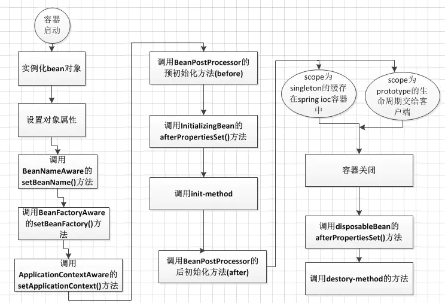

<!-- START doctoc generated TOC please keep comment here to allow auto update -->
<!-- DON'T EDIT THIS SECTION, INSTEAD RE-RUN doctoc TO UPDATE -->


- [AOP](#aop)
  - [静态代理](#%E9%9D%99%E6%80%81%E4%BB%A3%E7%90%86)
  - [动态代理](#%E5%8A%A8%E6%80%81%E4%BB%A3%E7%90%86)
  - [Spring AOP动态代理](#spring-aop%E5%8A%A8%E6%80%81%E4%BB%A3%E7%90%86)
- [IOC](#ioc)
  - [ioc容器](#ioc%E5%AE%B9%E5%99%A8)
  - [BeanDefinition](#beandefinition)
  - [容器初始化](#%E5%AE%B9%E5%99%A8%E5%88%9D%E5%A7%8B%E5%8C%96)
  - [Bean生命周期](#bean%E7%94%9F%E5%91%BD%E5%91%A8%E6%9C%9F)
  - [aware接口](#aware%E6%8E%A5%E5%8F%A3)
  - [BeanFactory和FactoryBean](#beanfactory%E5%92%8Cfactorybean)
- [自动装配](#%E8%87%AA%E5%8A%A8%E8%A3%85%E9%85%8D)
- [bean的作用域](#bean%E7%9A%84%E4%BD%9C%E7%94%A8%E5%9F%9F)
- [设计模式](#%E8%AE%BE%E8%AE%A1%E6%A8%A1%E5%BC%8F)
- [事务](#%E4%BA%8B%E5%8A%A1)
  - [事务传播行为](#%E4%BA%8B%E5%8A%A1%E4%BC%A0%E6%92%AD%E8%A1%8C%E4%B8%BA)

<!-- END doctoc generated TOC please keep comment here to allow auto update -->

## AOP

面向切面编程，作为面向对象的一种补充，用于处理系统中分布于各个模块的横切关注点，比如事务管理、日志、缓存等等。AOP实现的关键在于AOP框架自动创建的AOP代理，AOP代理主要分为静态代理和动态代理。

### 静态代理

静态代理：代理类在编译阶段生成，程序运行前就已经存在，在编译阶段将通知织入Java字节码中。

缺点：因为代理对象需要与目标对象实现一样的接口，所以会有很多代理类。同时，一旦接口增加方法，目标对象与代理对象都要维护。

### 动态代理

动态代理：代理类在程序运行时创建，AOP框架不会去修改字节码，而是在内存中临时生成一个代理对象，在运行期间对业务方法进行增强，不会生成新类。

### Spring AOP动态代理

Spring AOP中的动态代理主要有两种方式：JDK动态代理和CGLIB动态代理。

1. JDK动态代理（生成的代理类实现了接口）。如果目标类实现了接口，Spring AOP会选择使用JDK动态代理目标类。代理类根据目标类实现的接口动态生成，不需要自己编写，生成的动态代理类和目标类都实现相同的接口。JDK动态代理的核心是`InvocationHandler`接口和`Proxy`类。

   缺点：目标类必须有实现的接口。如果某个类没有实现接口，那么这个类就不能用JDK动态代理。

2. CGLIB来动态代理（通过继承）。如果目标类没有实现接口，那么Spring AOP会选择使用CGLIB来动态代理目标类。CGLIB（Code Generation Library）可以在运行时动态生成类的字节码，动态创建目标类的子类对象，在子类对象中增强目标类。

   CGLIB是通过继承的方式做的动态代理，因此如果某个类被标记为`final`，那么它是无法使用CGLIB做动态代理的。

   优点：目标类不需要实现特定的接口，更加灵活。

什么时候采用哪种动态代理？

1. 如果目标对象实现了接口，默认情况下会采用JDK的动态代理实现AOP
2. 如果目标对象实现了接口，可以强制使用CGLIB实现AOP
3. 如果目标对象没有实现了接口，必须采用CGLIB库

区别：

1. jdk动态代理使用jdk中的类Proxy来创建代理对象，它使用反射技术来实现，不需要导入其他依赖。cglib需要引入相关依赖：asm.jar，它使用字节码增强技术来实现。
2. 当目标类实现了接口的时候Spring Aop默认使用jdk动态代理方式来增强方法，没有实现接口的时候使用cglib动态代理方式增强方法。


## IOC

[IOC基础](https://juejin.im/entry/588083111b69e60059034e3d#comment) | [IOC demo](https://juejin.im/post/5b399eb1e51d4553156c0525#heading-3)

IOC：控制反转，由Spring容器管理bean的整个生命周期。通过反射实现对其他对象的控制，包括初始化、创建、销毁等，解放手动创建对象的过程，同时降低类之间的耦合度。

IOC的好处：降低了类之间的耦合，对象创建和初始化交给Spring容器管理，在需要的时候只需向容器进行申请。

DI(依赖注入)：在Spring创建对象的过程中，把对象依赖的属性注入到对象中。有两种方式：构造器注入和属性注入。

### ioc容器

Spring主要有两种ioc容器，实现了BeanFactory接口的简单容器和ApplicationContext高级容器。

- `BeanFactory` ：延迟注入(使用到某个 bean 的时候才会注入),相比于`BeanFactory` 来说会占用更少的内存，程序启动速度更快。BeanFactory提供了最基本的ioc容器的功能（最基本的依赖注入支持）。

- `ApplicationContext` ：容器启动的时候，一次性创建所有 bean 。`ApplicationContext` 扩展了 `BeanFactory` ，除了有`BeanFactory`的功能还有额外更多功能，所以一般开发人员使用`ApplicationContext`会更多。

ApplicationContext 提供了 BeanFactory 没有的新特性：

1. 支持多语言版本；
2. 支持多种途径获取 Bean 定义信息；
3. 支持应用事件，方便管理 Bean；

DefaultListableBeanFactory 实现了 ioc 容器的基本功能，其他 ioc 容器如 XmlBeanFactory 和 ApplicationContext 都是通过持有或扩展 DefaultListableBeanFactory 获得基本的 ioc 容器的功能。 

### BeanDefinition

BeanDefinition 用于管理Spring应用的对象和对象之间的依赖关系，是对象依赖关系的数据抽象。

### 容器初始化

ioc 容器初始化过程：BeanDefinition 的资源定位、加载和注册。

1. 通过文件系统、类路径或 web 容器（XmlWebApplicationContext）扫描解析指定位置的所有文件得到Resources。
2. 将用户定义好的 Bean 表示成 ioc 容器内部的数据结构。
3. 将 BeanDefinition 注册到一个 HashMap。

单例bean的初始化以及依赖注入一般都在容器初始化阶段进行，只有懒加载（lazy-init为true）的单例bean是在应用第一次调用getBean()时进行初始化和依赖注入。

```java
// AbstractApplicationContext
// Instantiate all remaining (non-lazy-init) singletons.
finishBeanFactoryInitialization(beanFactory);
```

多例bean 在容器启动时不实例化，即使设置 lazy-init 为 false 也没用，只有调用了getBean()才进行实例化。

loadBeanDefinitions 采用了模板模式，具体加载 BeanDefinition 的逻辑由各个子类完成。

### Bean生命周期



1.对Bean进行实例化

2.依赖注入，设置属性

3.如果Bean实现了BeanNameAware接口，Spring将Bean实例名称传递给setBeanName()方法
（实现BeanNameAware主要是为了通过Bean的引用来获得Bean的实例名称）

4.如果Bean实现了BeanFactoryAware接口，Spring将调用setBeanDactory(BeanFactory bf)方法并把BeanFactory容器实例作为参数传入。
（实现BeanFactoryAware 主要目的是为了获取Spring容器，如Bean通过Spring容器发布事件等）

5.如果Bean实现了ApplicationContextAware接口，Spring容器将调用setApplicationContext(ApplicationContext ctx)方法，把应用上下文作为参数传入。
(作用与BeanFactory类似都是为了获取Spring容器)

6.如果Bean实现了BeanPostProcess接口，Spring将调用它们的postProcessBeforeInitialization（预初始化）方法
（作用是在Bean实例创建成功后对进行增强处理，如对Bean进行修改，增加某个功能）

7.如果Bean实现了InitializingBean接口，Spring将调用它们的afterPropertiesSet方法，作用与在配置文件中对Bean使用init-method声明初始化的作用一样，都是在Bean的全部属性设置成功后执行的初始化方法。

8.如果Bean实现了BeanPostProcess接口，Spring将调用它们的postProcessAfterInitialization（后初始化）方法
（作用与6的一样，只不过6是在Bean初始化前执行的，而这个是在Bean初始化后执行的，时机不同 )

9.Bean 驻留在应用上下文中给应用使用，直到应用上下文被销毁

10.如果Bean实现了DispostbleBean接口，Spring将调用它的destory方法，作用与在配置文件中对Bean使用destory-method属性的作用一样，都是在Bean实例销毁前执行的方法。

### aware接口

通过 aware 接口实现 Bean直接操作 ioc 容器。

BeanNameAware，在 Bean 中得到它在 ioc 容器中的 Bean 实例的名称。

ApplicationContextAware，可以在 Bean 中得到 Bean 所在的应用上下文，从而直接在 Bean 中使用应用上下文的服务。

ApplicationEventPublisherAware，可以在 Bean 中得到应用上下文的事件发布器，从而可以在 Bean 中发布应用上下文的事件。

### BeanFactory和FactoryBean

BeanFactory：管理Bean的容器，Spring中生成的Bean都是由这个接口的实现来管理的。

FactoryBean：通常是用来创建比较复杂的bean，一般的bean 直接用xml配置即可，但如果一个bean的创建过程中涉及到很多其他的bean 和复杂的逻辑，直接用xml配置比较麻烦，这时可以考虑用FactoryBean。

当配置文件中bean标签的class属性配置的实现类是FactoryBean时，通过 getBean()方法返回的不是FactoryBean本身，而是调用FactoryBean#getObject()方法所返回的对象，相当于FactoryBean#getObject()代理了getBean()方法。如果想得到FactoryBean必须使用 '&' + beanName 的方式获取。

Mybatis 提供了 SqlSessionFactoryBean，可以简化 SqlSessionFactory 的配置：

```java
public class SqlSessionFactoryBean implements FactoryBean<SqlSessionFactory>, InitializingBean, ApplicationListener<ApplicationEvent> {

  private static final Log LOGGER = LogFactory.getLog(SqlSessionFactoryBean.class);

  private Resource configLocation;

  private Configuration configuration;

  private Resource[] mapperLocations;

  private DataSource dataSource;

  private TransactionFactory transactionFactory;

  private Properties configurationProperties;

  private SqlSessionFactoryBuilder sqlSessionFactoryBuilder = new SqlSessionFactoryBuilder();

  private SqlSessionFactory sqlSessionFactory;
  ...
}
```

在 xml 配置 SqlSessionFactoryBean：

```xml
<bean id="tradeSqlSessionFactory" class="org.mybatis.spring.SqlSessionFactoryBean">
    <property name="dataSource" ref="trade" />
    <property name="mapperLocations" value="classpath*:mapper/trade/*Mapper.xml" />
    <property name="configLocation" value="classpath:mybatis-config.xml" />
    <property name="typeAliasesPackage" value="com.bytebeats.mybatis3.domain.trade" />
</bean>
```

Spring 将会在应用启动时创建 `SqlSessionFactory`，并使用 `sqlSessionFactory` 这个名字存储起来。

#### FactoryBean使用

[FactoryBean使用](https://www.cnblogs.com/davidwang456/p/3688250.html)

如果使用传统方式配置下面Car的\<bean>时，Car的每个属性分别对应一个\<property>元素标签。

```java
public   class  Car  {    
       private   int maxSpeed ;    
       private  String brand ;    
       private   double price ; 
}
```

如果用FactoryBean的方式实现就会灵活一些，下例通过逗号分割符的方式一次性地为Car的所有属性指定配置值：

```java
public   class  CarFactoryBean  implements  FactoryBean<Car>  {    
    private  String carInfo ;    
    public  Car getObject ()   throws  Exception  {    
        Car car =  new  Car () ;    
        String []  infos =  carInfo .split ( "," ) ;    
        car.setBrand ( infos [ 0 ]) ;    
        car.setMaxSpeed ( Integer. valueOf ( infos [ 1 ])) ;    
        car.setPrice ( Double. valueOf ( infos [ 2 ])) ;    
        return  car;    
    }    
    public  Class<Car> getObjectType ()   {    
        return  Car. class ;    
    }    
    public   boolean  isSingleton ()   {    
        return   false ;    
    }    
    public  String getCarInfo ()   {    
        return   this . carInfo ;    
    }    
    
    // 接受逗号分割符设置属性信息    
    public   void  setCarInfo ( String carInfo )   {    
        this . carInfocarInfo  = carInfo;    
    }    
}
```

xml 配置 CarFactoryBean：

```xml
<bean id="car" class="com.test.factorybean.CarFactoryBean" carInfo="超级跑车,400,2000000"/> 
```

当调用getBean("car") 时，Spring通过反射机制发现CarFactoryBean实现了FactoryBean的接口，这时Spring容器就调用接口方法CarFactoryBean#getObject()方法返回。如果希望获取CarFactoryBean的实例，则需要在使getBean(beanName) 方法时在beanName前显示的加上 "&" 前缀，例如getBean("&car")。


## 自动装配

Spring的自动装配有三种模式：byType(根据类型)，byName(根据名称)、constructor(根据构造函数)。

byType：找到与依赖类型相同的bean注入到另外的bean中，这个过程需要借助setter注入来完成，因此必须存在set方法，否则注入失败。

当xml文件中存在多个相同类型名称不同的实例Bean时，Spring容器依赖注入仍然会失败，因为存在多种适合的选项，Spring容器无法知道该注入那种，此时我们需要为Spring容器提供帮助，指定注入那个Bean实例。可以通过＜bean＞标签的autowire-candidate设置为false来过滤那些不需要注入的实例Bean

```xml
<bean id="userDao"  class="com.zejian.spring.springIoc.dao.impl.UserDaoImpl" />

<!-- autowire-candidate="false" 过滤该类型 -->
<bean id="userDao2" autowire-candidate="false" class="com.zejian.spring.springIoc.dao.impl.UserDaoImpl" />

<!-- byType 根据类型自动装配userDao-->
<bean id="userService" autowire="byType" class="com.zejian.spring.springIoc.service.impl.UserServiceImpl" />
```

byName：将属性名与bean名称进行匹配，如果找到则注入依赖bean。

```xml
<bean id="userDao"  class="com.zejian.spring.springIoc.dao.impl.UserDaoImpl" />
<bean id="userDao2" class="com.zejian.spring.springIoc.dao.impl.UserDaoImpl" />

<!-- byName 根据名称自动装配，找到UserServiceImpl名为 userDao属性并注入-->
<bean id="userService" autowire="byName" class="com.zejian.spring.springIoc.service.impl.UserServiceImpl" />
```

constructor：存在单个实例则优先按类型进行参数匹配（无论名称是否匹配），当存在多个类型相同实例时，按名称优先匹配，如果没有找到对应名称，则注入失败，此时可以使用autowire-candidate=”false” 过滤来解决。

```xml
<!--只存在userDao2，userDao3 无法成功注入-->
<bean id="userDao2" class="com.zejian.spring.springIoc.dao.impl.UserDaoImpl" />

<bean id="userDao3" class="com.zejian.spring.springIoc.dao.impl.UserDaoImpl" />

<bean id="userService" autowire="constructor" class="com.zejian.spring.springIoc.service.impl.UserServiceImpl" />
```

@Autowired 可以传递了一个required=false的属性，false指明当userDao实例存在就注入不存就忽略，如果为true，就必须注入，若userDao实例不存在，就抛出异常。由于默认情况下@Autowired是按类型匹配的(byType)，如果需要按名称(byName)匹配的话，可以使用@Qualifier注解与@Autowired结合。

```java
public class UserServiceImpl implements UserService {
    //标注成员变量
    @Autowired
    @Qualifier("userDao1")
    private UserDao userDao;   
 }
```

byName模式 xml 配置：

```xml
<!-- 根据@Qualifier("userDao1")自动识别 -->
<bean id="userDao1" class="com.zejian.spring.springIoc.dao.impl.UserDaoImpl" />
<bean id="userDao2" class="com.zejian.spring.springIoc.dao.impl.UserDaoImpl" />

<bean id="userService" class="com.zejian.spring.springIoc.service.impl.UserServiceImpl" />
```

@Resource，默认按 byName模式自动注入。@Resource有两个中重要的属性：name和type。Spring容器对于@Resource注解的name属性解析为bean的名字，type属性则解析为bean的类型。因此使用name属性，则按byName模式的自动注入策略，如果使用type属性则按 byType模式自动注入策略。倘若既不指定name也不指定type属性，Spring容器将通过反射技术默认按byName模式注入。

```java
@Resource(name=“userDao”)
private UserDao  userDao;//用于成员变量

//也可以用于set方法标注
@Resource(name=“userDao”)
public void setUserDao(UserDao userDao) {
   this.userDao= userDao;
}
```

上述两种自动装配的依赖注入并不适合简单值类型，如int、boolean、long、String以及Enum等，对于这些类型，Spring容器也提供了@Value注入的方式。@Value接收一个String的值，该值指定了将要被注入到内置的java类型属性值，Spring 容器会做好类型转换。一般情况下@Value会与properties文件结合使用。

jdbc.properties文件如下：

```properties
jdbc.driver=com.mysql.jdbc.Driver
jdbc.url=jdbc:mysql://127.0.0.1:3306/test?characterEncoding=UTF-8&allowMultiQueries=true
jdbc.username=root
jdbc.password=root
```

利用注解@Value获取jdbc.url和jdbc.username的值，实现如下：

```java
public class UserServiceImpl implements UserService {
    //占位符方式
    @Value("${jdbc.url}")
    private String url;
    //SpEL表达方式，其中代表xml配置文件中的id值configProperties
    @Value("#{configProperties['jdbc.username']}")
    private String userName;

}
```

xml配置文件：

```xml
    <!--基于占位符方式 配置单个properties -->
    <!--<context:property-placeholder location="conf/jdbc.properties"/>-->
    <!--基于占位符方式 配置多个properties -->
    <bean id="propertyConfigurer" class="org.springframework.beans.factory.config.PreferencesPlaceholderConfigurer">
        <property name="location" value="conf/jdbc.properties"/>
    </bean>

    <!--基于SpEL表达式 配置多个properties id值为configProperties 提供java代码中使用 -->
    <bean id="configProperties" class="org.springframework.beans.factory.config.PropertiesFactoryBean">
        <property name="locations">
            <list>
                <value>classpath:/conf/jdbc.properties</value>
            </list>
        </property>
    </bean>
```

### @Autowired和@Resource

@Autowired注解是按照类型（byType）装配依赖对象的,但是存在多个类型⼀致的bean，⽆法通过byT ype注⼊时，就会再使⽤byName来注⼊，如果还是⽆法判断注⼊哪个bean则会UnsatisfiedDependencyException。
@Resource会⾸先按照byName来装配，如果找不到bean，会⾃动byType再找⼀次。

### 声明Bean注解

Spring 容器通过xml的bean标签配置和java注解两种方式声明的Bean对象。Spring的框架中提供了与@Component注解等效的用于声明bean的三个注解，@Repository 用于对DAO实现类进行标注，@Service 用于对Service实现类进行标注，@Controller 用于对Controller实现类进行标注。同时还可以给定一个bean名称，如果没有提供名称，那么默认情况下就是一个简单的类名(第一个字符小写)变成Bean名称。

```java
//@Component 相同效果
@Service
public class AccountServiceImpl implements AccountService {
  @Autowired
  private AccountDao accountDao;
}
```

xml配置 bean：

```xml
<bean id="userService" class="com.zejian.spring.springIoc.service.impl.UserServiceImpl" />
```

### @Bean和@Component

都是使用注解定义 Bean。@Bean 是使用 Java 代码装配 Bean，@Component 是自动装配 Bean。

@Component 注解用在类上，表明一个类会作为组件类，并告知Spring要为这个类创建bean，每个类对应一个 Bean。

@Bean 注解用在方法上，表示这个方法会返回一个 Bean。@Bean 需要在配置类中使用，即类上需要加上@Configuration注解。

```java
@Component
public class Student {
    private String name = "lkm";
 
    public String getName() {
        return name;
    }
}

@Configuration
public class WebSocketConfig {
    @Bean
    public Student student(){
        return new Student();
    }
}
```

@Bean 注解更加灵活。当需要将第三方类装配到 Spring 容器中，因为没办法源代码上添加@Component注解，只能使用@Bean 注解的方式，当然也可以使用 xml 的方式。


## bean的作用域

Spring创建bean默认是单例，每一个Bean的实例只会被创建一次，通过代码获取的bean，都是同一个Bean的实例。可使用＜bean＞标签的scope属性来指定一个Bean的作用域。

```xml
<!-- 作用域：prototype -->
<bean name="accountDao" scope="prototype"     class="com.zejian.spring.springIoc.dao.impl.AccountDaoImpl"/>
```

通过注解来声明作用域：

```java
@Scope("prototype")
public class AccountDaoImpl {
    //......
}
```

当一个Bean被设置为prototype 后Spring就不会对一个bean的整个生命周期负责，容器在创建完一个prototype实例后，将它交给客户端，随后就对该prototype实例不闻不问了。慎用。

一般情况下，对有状态的bean应该使用prototype作用域，而对无状态的bean则应该使用singleton作用域。所谓有状态就是该bean有保存信息的能力，不能共享，否则会造成线程安全问题，而无状态则不保存信息，是线程安全的，可以共享，spring中大部分bean都是Singleton，整个生命周期过程只会存在一个。

request作用域：对于每次HTTP请求到达应用程序，Spring容器会创建一个全新的Request作用域的bean实例，且该bean实例仅在当前HTTP request内有效，整个请求过程也只会使用相同的bean实例，而其他请求HTTP请求则创建新bean的实例，当处理请求结束，request作用域的bean实例将被销毁。

session 作用域：每当创建一个新的HTTP Session时就会创建一个Session作用域的Bean，并该实例bean伴随着会话的结束（session过期）而销毁。


## 设计模式

[spring设计模式](https://blog.csdn.net/caoxiaohong1005/article/details/80039656) | [Springmvc适配器模式](https://blog.csdn.net/u010288264/article/details/53835185)

- 简单工厂：BeanFactory 就是简单工厂模式的体现，根据传入一个唯一标识来获得Bean 对象。

- 工厂方法：FactoryBean 就是典型的工厂方法模式。spring在使用getBean()调用获得该bean时，会自动调用该bean的getObject()方法。每个 Bean 都会对应一个 FactoryBean，如 SqlSessionFactory 对应 SqlSessionFactoryBean。

- 单例：保证一个类仅有一个实例，并提供一个访问它的全局访问点。Spring 创建 Bean 实例默认是单例的。

- 适配器：SpringMVC中的适配器HandlerAdatper。由于 Controller 有不同的实现方式，处理请求的方法不是确定的，如果需要直接调用Controller方法，那么需要调用的时候使用if else来进行判断是哪一种子类然后调用相应的方法。当增加新的 Controller，需要修改原来的逻辑，违反了开闭原则（对修改关闭，对扩展开放）。

  ```java
  if(mappedHandler.getHandler() instanceof MultiActionController){  
     ((MultiActionController)mappedHandler.getHandler()).xxx  
  }else if(mappedHandler.getHandler() instanceof XXX){  
      ...  
  }else if(...){  
     ...  
  }
  ```

  为此，Spring提供了一个适配器接口，每一种 Controller 对应一种 HandlerAdapter 实现类，当请求过来，SpringMVC会根据请求request获取相应的Controller（getHandler方法），然后通过getHandlerAdapter()获取该Controller对应的 HandlerAdapter，最后调用适配器的 handle() 处理请求（实际上调用的是Controller的handleRequest()）。

  添加新的 Controller 时，只需要增加一个适配器类就可以，无需修改原有的逻辑。

  常用的处理器适配器：SimpleControllerHandlerAdapter，HttpRequestHandlerAdapter，AnnotationMethodHandlerAdapter。

  ```java
  // Determine handler for the current request.
  mappedHandler = getHandler(processedRequest);
  
  HandlerAdapter ha = getHandlerAdapter(mappedHandler.getHandler());
  
  // Actually invoke the handler.
  mv = ha.handle(processedRequest, response, mappedHandler.getHandler());
  
  public class HttpRequestHandlerAdapter implements HandlerAdapter {
  
  	@Override
  	public boolean supports(Object handler) {//handler是被适配的对象，这里使用的是对象的适配器模式
  		return (handler instanceof HttpRequestHandler);
  	}
  
  	@Override
  	@Nullable
  	public ModelAndView handle(HttpServletRequest request, HttpServletResponse response, Object handler)
  			throws Exception {
  
  		((HttpRequestHandler) handler).handleRequest(request, response);
  		return null;
  	}
  ```

- 代理：spring 的 aop 使用了动态代理，有两种方式JdkDynamicAopProxy 和Cglib2AopProxy。

- 观察者（observer）：spring 中observer 模式常用的地方是listener 的实现，如ApplicationListener。

- 模板方法（template method）：spring 中的 jdbctemplate。


## 事务

Spring事务机制主要包括 声明式事务和编程式事务。

Spring声明式事务使得我们无需要去处理获得连接、关闭连接、事务提交和回滚等这些操作。

### 事务传播行为

在TransactionDefinition接口中定义了七个事务传播行为：

1. PROPAGATION_REQUIRED 如果存在一个事务，则支持当前事务。如果没有事务则开启一个新的事务。
2. PROPAGATION_SUPPORTS 如果存在一个事务，支持当前事务。如果没有事务，则非事务的执行。
3. PROPAGATION_MANDATORY 如果已经存在一个事务，支持当前事务。如果没有一个活动的事务，则抛出异常`IllegalTransactionStateException`。
4. PROPAGATION_REQUIRES_NEW 总是开启一个新的事务。需要使用JtaTransactionManager作为事务管理器。
5. PROPAGATION_NOT_SUPPORTED 总是非事务地执行，并挂起任何存在的事务。需要使用JtaTransactionManager作为事务管理器。
6. PROPAGATION_NEVER 总是非事务地执行，如果存在一个活动事务，则抛出异常。
7. PROPAGATION_NESTED如果一个活动的事务存在，则运行在一个嵌套的事务中. 如果没有活动事务, 则按TransactionDefinition.PROPAGATION_REQUIRED 属性执行。

**PROPAGATION_NESTED 与PROPAGATION_REQUIRES_NEW的区别:**

使用PROPAGATION_REQUIRES_NEW时，内层事务与外层事务是两个独立的事务。一旦内层事务进行了提交后，外层事务不能对其进行回滚。两个事务互不影响。

使用PROPAGATION_NESTED时，外层事务的回滚可以引起内层事务的回滚。而内层事务的异常并不会导致外层事务的回滚，它是一个真正的嵌套事务。


## 循环依赖

[图解spring循环依赖](https://juejin.im/post/5e927e27f265da47c8012ed9#heading-5) | [循环依赖](https://blog.csdn.net/u010853261/article/details/77940767)

构造器的循环依赖：这种依赖spring是处理不了的，直接抛出BeanCurrentlylnCreationException异常。

单例模式下属性注入的循环依赖：通过“三级缓存”处理循环依赖。 

非单例循环依赖：无法处理。

### 初始化

spring单例对象的初始化大略分为三步：

1. createBeanInstance：实例化，其实也就是调用对象的构造方法实例化对象
2. populateBean：填充属性，这一步主要是多bean的依赖属性进行填充
3. initializeBean：调用spring xml中的init 方法。

this.singletonsCurrentlyInCreation.add(String beanName)将当前正在创建的bean标识符记录在缓存中，如果在将标识符记录到缓存的过程中发现自己已经在缓存中，则说明存在循环依赖，将抛出BeanCurrentlylnCreationException 异常表示循环依赖。创建完成的bean将会从缓存中清除。

### 三级缓存

Spring为了解决单例的循环依赖问题，使用了三级缓存。

singletonObjects：完成了初始化的单例对象map，bean name --> bean instance

earlySingletonObjects ：完成实例化未初始化的单例对象map，bean name --> bean instance

singletonFactories ： 单例对象工厂map，bean name --> ObjectFactory

在调用createBeanInstance进行实例化之后，会调用addSingletonFactory，将单例对象放到singletonFactories中。

```java
protected void addSingletonFactory(String beanName, ObjectFactory<?> singletonFactory) {
    Assert.notNull(singletonFactory, "Singleton factory must not be null");
    synchronized (this.singletonObjects) {
        if (!this.singletonObjects.containsKey(beanName)) {
            this.singletonFactories.put(beanName, singletonFactory);
            this.earlySingletonObjects.remove(beanName);
            this.registeredSingletons.add(beanName);
        }
    }
}
```

假如A的某个field或者setter依赖了B的实例对象，同时B的某个field或者setter依赖了A的实例对象。

1. A首先完成了初始化的第一步，并且将自己添加到singletonFactories中

2. 进行初始化的第二步，发现自己依赖对象B，此时就尝试去get(B)
3. 发现B还没有被实例化，对B进行实例化
4. 然后B在初始化的时候发现自己依赖了对象A，于是尝试get(A)，尝试一级缓存singletonObjects(肯定没有，因为A还没初始化完全)，尝试二级缓存earlySingletonObjects（也没有），尝试三级缓存singletonFactories，由于A通过ObjectFactory将自己提前曝光了，所以B能够通过ObjectFactory.getObject拿到A对象
5. B拿到A对象后顺利完成了初始化阶段1、2、3，完全初始化之后将自己放入到一级缓存singletonObjects中。
6. 此时返回A中，A此时能拿到B的对象顺利完成自己的初始化阶段2、3，最终A也完成了初始化，进去了一级缓存singletonObjects中，由于B拿到了A的对象引用，所以B现在持有的A对象也完成了初始化。

由此看出，属性注入的循环依赖主要是通过singletonFactories来实现的。所以构造器注入的不能循环依赖，因为对象在实例化完成之后，即调用了createBeanInstance之后，才会被添加到singletonFactories中，而对象依赖使用构造器注入的话，不会使用到singletonFactories，循环依赖会抛BeanCurrentlylnCreationException异常。