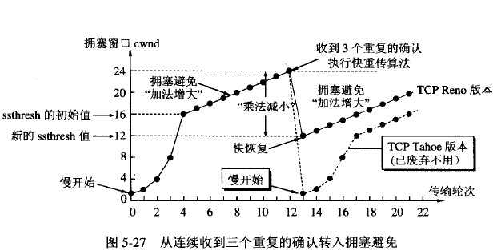
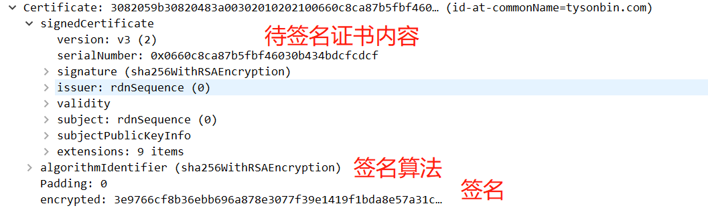
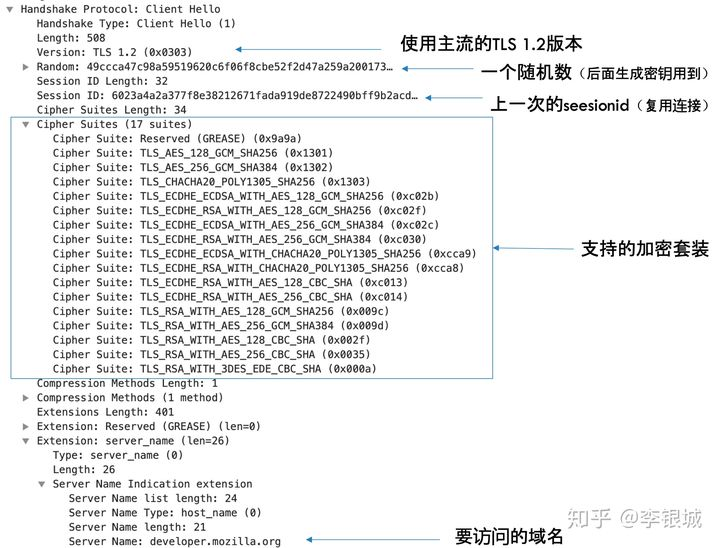
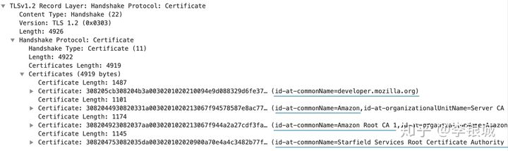

<!-- START doctoc generated TOC please keep comment here to allow auto update -->
<!-- DON'T EDIT THIS SECTION, INSTEAD RE-RUN doctoc TO UPDATE -->

- [三次握手](#%E4%B8%89%E6%AC%A1%E6%8F%A1%E6%89%8B)
- [四次挥手](#%E5%9B%9B%E6%AC%A1%E6%8C%A5%E6%89%8B)
- [滑动窗口](#%E6%BB%91%E5%8A%A8%E7%AA%97%E5%8F%A3)
- [拥塞控制](#%E6%8B%A5%E5%A1%9E%E6%8E%A7%E5%88%B6)
  - [慢开始](#%E6%85%A2%E5%BC%80%E5%A7%8B)
  - [拥塞避免](#%E6%8B%A5%E5%A1%9E%E9%81%BF%E5%85%8D)
  - [快重传](#%E5%BF%AB%E9%87%8D%E4%BC%A0)
  - [快恢复](#%E5%BF%AB%E6%81%A2%E5%A4%8D)
- [TCP和UDP](#tcp%E5%92%8Cudp)
  - [TCP的特点](#tcp%E7%9A%84%E7%89%B9%E7%82%B9)
  - [TCP和UDP区别](#tcp%E5%92%8Cudp%E5%8C%BA%E5%88%AB)
  - [协议](#%E5%8D%8F%E8%AE%AE)
  - [TCP首部](#tcp%E9%A6%96%E9%83%A8)
  - [UDP首部](#udp%E9%A6%96%E9%83%A8)
- [http](#http)
  - [主要特点](#%E4%B8%BB%E8%A6%81%E7%89%B9%E7%82%B9)
  - [http请求](#http%E8%AF%B7%E6%B1%82)
  - [http响应](#http%E5%93%8D%E5%BA%94)
  - [http状态码](#http%E7%8A%B6%E6%80%81%E7%A0%81)
  - [post和get](#post%E5%92%8Cget)
  - [HTTPS](#https)
    - [数字证书](#%E6%95%B0%E5%AD%97%E8%AF%81%E4%B9%A6)
    - [原理](#%E5%8E%9F%E7%90%86)
    - [HTTPS和HTTP的区别](#https%E5%92%8Chttp%E7%9A%84%E5%8C%BA%E5%88%AB)
  - [浏览器中输入URL返回页面过程](#%E6%B5%8F%E8%A7%88%E5%99%A8%E4%B8%AD%E8%BE%93%E5%85%A5url%E8%BF%94%E5%9B%9E%E9%A1%B5%E9%9D%A2%E8%BF%87%E7%A8%8B)
  - [长连接](#%E9%95%BF%E8%BF%9E%E6%8E%A5)
- [网络分层结构](#%E7%BD%91%E7%BB%9C%E5%88%86%E5%B1%82%E7%BB%93%E6%9E%84)
- [DNS解析](#dns%E8%A7%A3%E6%9E%90)
- [加密算法](#%E5%8A%A0%E5%AF%86%E7%AE%97%E6%B3%95)
- [CDN](#cdn)
- [参考资料](#%E5%8F%82%E8%80%83%E8%B5%84%E6%96%99)

<!-- END doctoc generated TOC please keep comment here to allow auto update -->

# 三次握手

1. 第一次握手：客户端A向B发出连接请求报文段（首部的同步位SYN=1，初始序号seq=x），此时客户端A进入SYN-SENT（同步已发送）状态。
2. 第二次握手：B收到连接请求报文段后，如同意建立连接，则向A发送确认（确认报文段中SYN=1，ACK=1，确认号ack=x+1，初始序号seq=y），B进入SYN-RCVD（同步收到）状态；
3. 第三次握手：A收到B的确认后，向B发送确认报文段（ACK=1，确认号ack=y+1，序号seq=x+1）。然后A进入ESTABLISHED。
4. B收到确认报文段，就会进入ESTABLISHED状态，TCP连接成功。

为什么A还要发送一次确认呢？可以二次握手吗？

主要为了防止已失效的连接请求报文段突然又传送到了B，因而产生错误。如A发出连接请求，可能因为网络阻塞原因，A没有收到确认报文，于是A再重传一次连接请求。连接成功，等待数据传输完毕后，就释放了连接。而A发出的第一个连接请求等到连接释放以后的某个时间才到达B，此时B误认为A又发出一次新的连接请求，于是就向A发出确认报文段，同意建立连接，不采用三次握手，只要B发出确认，就建立新的连接了，此时A不理睬B的确认且不发送数据，则B一直等待A发送数据，浪费资源。

# 四次挥手

1. A的应用进程先向其TCP发出连接释放报文段（FIN=1，序号seq=u），并停止再发送数据，主动关闭TCP连接，进入FIN-WAIT-1（终止等待1）状态，等待B的确认。
2. B收到连接释放报文段后即发出确认报文段（ACK=1，确认号ack=u+1，序号seq=v），B进入CLOSE-WAIT（关闭等待）状态，此时的TCP处于半关闭状态，A到B的连接释放。
3. A收到B的确认后，进入FIN-WAIT-2（终止等待2）状态，等待B发出的连接释放报文段。
4. B发送完数据，就会发出连接释放报文段（FIN=1，ACK=1，序号seq=w，确认号ack=u+1），B进入LAST-ACK（最后确认）状态，等待A的确认。
5. A收到B的连接释放报文段后，对此发出确认报文段（ACK=1，seq=u+1，ack=w+1），A进入TIME-WAIT（时间等待）状态。此时TCP未释放掉，需要经过时间等待计时器设置的时间2MSL（最大报文段生存时间）后，A才进入CLOSED状态。B收到A发出的确认报文段后关闭连接，若没收到A发出的确认报文段，B就会重传连接释放报文段。

为什么A在TIME-WAIT状态必须等待2MSL（最大报文段生存时间）的时间？

- 保证A发送的最后一个ACK报文段能够到达B。这个ACK报文段有可能丢失，B收不到这个确认报文，就会超时重传连接释放报文段，然后A可以在2MSL时间内收到这个重传的连接释放报文段，接着A重传一次确认，重新启动2MSL计时器，最后A和B都进入到CLOSED状态，若A在TIME-WAIT状态不等待一段时间，而是发送完ACK报文段后立即释放连接，则无法收到B重传的连接释放报文段，所以不会再发送一次确认报文段，B就无法正常进入到CLOSED状态。
- 防止已失效的连接请求报文段出现在本连接中。A在发送完最后一个ACK报文段后，再经过2MSL，就可以使这个连接所产生的所有报文段都从网络中消失，使下一个新的连接中不会出现旧的连接请求报文段。

为什么连接的时候是三次握手，关闭的时候却是四次握手？

- 因为当Server端收到Client端的SYN连接请求报文后，可以直接发送SYN+ACK报文。其中ACK报文是用来应答的，SYN报文是用来同步的。但是关闭连接时，当Server端收到连接释放报文时，很可能并不会立即关闭SOCKET，所以只能先回复一个ACK报文，告诉Client端，"你发的连接释放报文我收到了"。只有等到Server端所有的报文都发送完了，才能发送连接释放报文，因此不能一起发送。故需要四步握手。

# 滑动窗口

TCP 利用滑动窗口实现流量控制。流量控制是为了控制发送方发送速率，保证接收方来得及接收。 TCP会话的双方都各自维护一个发送窗口和一个接收窗口。接收窗口大小取决于应用、系统、硬件的限制。发送窗口则取决于对端通告的接收窗口。接收方发送的确认报文中的window字段可以用来控制发送方窗口大小，从而影响发送方的发送速率。将接收方的确认报文window字段设置为 0，则发送方不能发送数据。

TCP头包含window字段，16bit位，它代表的是窗口的字节容量，最大为65535。这个字段是接收端告诉发送端自己还有多少缓冲区可以接收数据。于是发送端就可以根据这个接收端的处理能力来发送数据，而不会导致接收端处理不过来。接收窗口的大小是约等于发送窗口的大小。

# 拥塞控制

防止过多的数据注入到网络中。 几种拥塞控制方法：慢开始( slow-start )、拥塞避免( congestion avoidance )、快重传( fast retransmit )和快恢复( fast recovery )。

## 慢开始

把拥塞窗口 cwnd 设置为一个最大报文段MSS的数值。而在每收到一个对新的报文段的确认后，把拥塞窗口增加至多一个MSS的数值。每经过一个传输轮次，拥塞窗口 cwnd 就加倍。 为了防止拥塞窗口cwnd增长过大引起网络拥塞，还需要设置一个慢开始门限ssthresh状态变量。

  当 cwnd < ssthresh 时，使用慢开始算法。

  当 cwnd > ssthresh 时，停止使用慢开始算法而改用拥塞避免算法。

  当 cwnd = ssthresh 时，既可使用慢开始算法，也可使用拥塞控制避免算法。

## 拥塞避免

让拥塞窗口cwnd缓慢地增大，每经过一个往返时间RTT就把发送方的拥塞窗口cwnd加1，而不是加倍。这样拥塞窗口cwnd按线性规律缓慢增长。

无论在慢开始阶段还是在拥塞避免阶段，只要发送方判断网络出现拥塞（其根据就是没有收到确认），就要把慢开始门限ssthresh设置为出现拥塞时的发送 方窗口值的一半（但不能小于2）。然后把拥塞窗口cwnd重新设置为1，执行慢开始算法。这样做的目的就是要迅速减少主机发送到网络中的分组数，使得发生 拥塞的路由器有足够时间把队列中积压的分组处理完毕。

## 快重传

有时个别报文段会在网络中丢失，但实际上网络并未发生拥塞。如果发送方迟迟收不到确认，就会产生超时，就会误认为网络发生了拥塞。这就导致发送方错误地启动慢开始，把拥塞窗口cwnd又设置为1，因而降低了传输效率。

快重传算法可以避免这个问题。快重传算法首先要求接收方每收到一个失序的报文段后就立即发出重复确认，使发送方及早知道有报文段没有到达对方。

发送方只要一连收到三个重复确认就应当立即重传对方尚未收到的报文段，而不必继续等待重传计时器到期。由于发送方尽早重传未被确认的报文段，因此采用快重传后可以使整个网络吞吐量提高约20%。

## 快恢复

当发送方连续收到三个重复确认，就会把慢开始门限ssthresh减半，接着把cwnd值设置为慢开始门限ssthresh减半后的数值，然后开始执行拥塞避免算法，使拥塞窗口缓慢地线性增大。

在采用快恢复算法时，慢开始算法只是在TCP连接建立时和网络出现超时时才使用。 采用这样的拥塞控制方法使得TCP的性能有明显的改进。

# TCP和UDP

TCP：传输控制协议。

UDP：用户数据报协议。

## TCP的特点

- TCP是面向连接的运输层协议
- 每一条TCP连接只能有两个端点(一对一)
- TCP提供可靠交付的服务
- TCP提供全双工通信
- 面向字节流

- TCP可靠传输、流量控制和拥塞控制的实现
TCP的可靠性如何保证：对于收到的请求，给出确认响应。
流量控制:让发送方的发送速率不要太快，要让接收方来得及接收。利用滑动窗口实现流量控制。
拥塞控制:防止过多的数据注入到网络中，这样可以使网络中的路由器或链路不致过载。
TCP可靠传输是因为有: 数据报校验, 失序数据重排序, 丢弃重复数据,应答机制,超时重发,流量控制等原因

## TCP和UDP区别
1. TCP面向连接，UDP是无连接的，即发送数据之前不需要建立连接
2. TCP提供可靠的服务；UDP不保证可靠交付
3. TCP面向字节流，把数据看成一连串无结构的字节流;UDP是面向报文的
4. TCP有拥塞控制；UDP没有拥塞控制，因此网络出现拥塞不会使源主机的发送速率降低（对实时应用很有用，如IP电话，实时视频会议等）
5. 每一条TCP连接只能是点到点的；UDP支持一对一，一对多，多对一和多对多的交互通信
6. TCP首部开销20字节；UDP的首部开销小，只有8个字节

## 协议

TCP对应的协议：
（1）FTP：定义了文件传输协议，使用21端口。
（2）Telnet：用于远程登陆的端口。
（3）SMTP：定义了简单邮件传送协议，25端口。
（4）POP3：它是和SMTP对应，POP3用于接收邮件，110端口。
（5）HTTP协议：是从万维网服务器传输超文本到本地浏览器的传送协议，使用80端口。

UDP对应的协议：
（1）DNS：用于域名解析服务，将域名地址转换为IP地址。DNS用的是53号端口。
（2）SNMP：简单网络管理协议，使用161号端口。
（3）TFTP，Trival File Transfer Protocal，简单文件传输协议，使用端口69。
（4）RIP，路由信息协议。
（5）DHCP，动态主机配置协议。

## TCP首部

## UDP首部

# http

超文本传输协议。

## 主要特点

1. 灵活：HTTP允许传输任意类型的数据。传输的类型由Content-Type加以标记。
2. HTTP 0.9和1.0使用非持续连接：限制每次连接只处理一个请求，服务器处理完客户的请求，并收到客户的应答后，即断开连接。HTTP 1.1支持使用持续连接：一个连接可以处理多个请求，不必为每个请求创建一个新的连接，采用这种方式可以节省传输时间。
3. 无状态：是指服务端对于客户端每次发送的请求都认为它是一个新的请求，上一次会话和下一次会话没有联系；HTTP 协议这种特性有优点也有缺点，优点在于解放了服务器，不会造成不必要连接占用，缺点在于如果后续处理需要前面的信息，则它必须重传，这样可能导致每次连接传送的数据量增大。

## http请求

http请求由请求行、请求头部、空行和请求体四个部分组成。

- 请求行：请求方法，访问的资源URL，使用的HTTP版本；GET和POST是最常见的HTTP方法，除此以外还包括DELETE、HEAD、OPTIONS、PUT、TRACE。
- 请求头包含一些属性，格式为“属性名:属性值”，服务端据此获取客户端的信息，主要有cookie、host、connection、accept-language、accept-encoding、user-agent。
- 请求体：用户的请求数据如用户名，密码等。

## http响应

HTTP响应也由四个部分组成，分别是：状态行、响应头、空行和响应体。

- 状态行：协议版本，状态码及状态描述。
- 响应头：connection、content-type、content-encoding、content-length、set-cookie、Last-Modified，、Cache-Control、Expires。
- 响应体：服务器返回给客户端的内容。

## http状态码

## post和get

GET和POST是HTTP协议中的两种发送请求的方法。GET/POST请求都是TCP连接。

Get方法并没有限制提交的数据长度，HTTP协议规范没有对URL长度进行限制。但是浏览器及服务器可能会对URL长度有限制。

POST方法没有对请求体长度进行限制，但是服务端可以对POST数据大小进行限制，比如tomcat默认限制2M。可以修改conf/server.xml：`maxPostSize=0`，取消POST的大小限制。

post和get请求的区别：

- GET请求参数通过URL传递，POST的参数放在请求体中。
- GET产生一个TCP数据包；POST产生两个TCP数据包。对于GET方式的请求，浏览器会把请求头和请求体一并发送出去；而对于POST，浏览器先发送请求头，服务器响应100 continue，浏览器再发送请求体。
- GET请求会被浏览器主动缓存，而POST不会，除非手动设置。
- GET请求只能进行url编码，而POST支持多种编码方式。
- GET请求参数会被完整保留在浏览器历史记录里，而POST中的参数不会被保留。

## HTTPS

HTTP协议以明文方式发送内容，不提供任何方式的数据加密，因此，HTTP协议不适合传输一些敏感信息，比如：信用卡号、密码等支付信息。而HTTPS协议是由SSL+HTTP协议构建的可进行身份认证（非对称加密）、加密传输（对称加密）的网络协议。SSL作用在应用层和运输层之间，在TCP之上建立起一个安全通道，确保数据传输安全。在 SSL 层完成身份认证、加解密操作。

### 数字证书

服务端可以向证书颁发机构CA申请证书，以避免中间人攻击（防止证书被篡改）。证书包含三部分内容：tbsCertificate（to be signed certificate）待签名证书内容、证书签名算法和CA给的签名（使用证书签名算法对tbsCertificate进行哈希运算得到哈希值，CA会用它的私钥对此哈希值进行签名，并放在签名部分）。签名是为了验证身份。

服务端把证书传输给浏览器，浏览器从证书里取公钥。证书可以证明该公钥对应该网站。

数字签名的制作过程：

1. CA使用证书签名算法对证书内容（待签名证书内容）进行hash。
2. 对hash后的值用CA自己的私钥加密，得到数字签名。

浏览器验证过程：

1. 拿到证书，得到证书内容、证书签名算法和数字签名。
2. 用CA机构的公钥对数字签名解密（由于是浏览器信任的机构，所以浏览器会保存它的公钥）。
3. 用证书里的签名算法对证书内容进行hash。
4. 比较解密后的数字签名和对证书内容hash后的哈希值，相等则表明证书可信。

### 原理

首先是TCP三次握手，然后客户端（浏览器）发起一个HTTPS连接建立请求，客户端先发一个Client Hello的包，然后服务端响应一个Server Hello，接着再给客户端发送它的证书，然后双方经过密钥交换，最后使用交换的密钥加解密数据。

1. 协商加密算法 。在Client Hello里面客户端会告知服务端自己当前的一些信息，包括客户端要使用的TLS版本，支持的加密套装，要访问的域名，给服务端生成的一个随机数（Nonce）等。需要提前告知服务器想要访问的域名以便服务器发送相应的域名的证书过来。

   

2. 服务端在Server Hello里面会做一些响应，告诉客户端服务端选中的加密套装。

   

3. 接着服务给客户端发来了4个证书。第二个证书是第一个证书的签发机构（CA）的证书，它是Amazon，也就是说Amazon会用它的私钥给[http://developer.mozilla.org](https://link.zhihu.com/?target=http%3A//developer.mozilla.org)进行签名。依此类推，第三个证书会给第二个证书签名，第四个证书会给第三个证书签名，并且我们可以看到第四个证书是一个根（Root）证书。

   

4. 客户端使用证书的认证机构CA公开发布的RSA公钥对该证书进行验证。

5. 验证通过之后，浏览器和服务器通过密钥交换算法产生共享的对称密钥。

6. 开始传输数据，使用同一个对称密钥来加解密。

   

### HTTPS和HTTP的区别

1. http是超文本传输协议，信息是明文传输，https则是具有安全性的ssl加密传输协议。
2. http和https用的端口不一样，前者是80，后者是443。
3. https协议需要到ca机构申请证书，一般免费证书较少，因而需要一定费用。

## 浏览器中输入URL返回页面过程

1. 解析域名，找到主机IP。
2. 浏览器利用IP直接与网站主机通信，三次握手。
3. 浏览器向主机发起一个HTTP-GET报文请求。
4. 服务器响应请求，发回网页内容。
5. 浏览器解析网页内容。

## 长连接

HTTP长连接，指的是复用TCP连接。多个HTTP请求可以复用同一个TCP连接，这就节省了TCP连接建立和断开的消耗。长连接在HTTP1.0时是实验性扩展，HTTP1.1默认设置connection:keep-alive，使用长连接。设置为connection:close可以关闭长连接。客户端和服务器的HTTP首部的Connection都要设置为keep-alive，才能支持长连接。

长连接的过期时间可以通过Keep-Alive: timeout=20或者max=xxx（max表示这个长连接最多接收xxx次请求就断开）设置。

长连接数据传输完成的标志：

- 判断传输数据是否达到了`Content-Length`指示的大小；4
- 分块传输（chunked）没有`Content-Length`，这时候就要根据chunked编码来判断，chunked编码的数据在最后有一个空chunked块，表明本次传输数据结束。

# 网络分层结构

计算机网络七层模型：应用层、表示层、会话层、传输层、网络层、数据链路层、物理层。

- 应用层的任务是通过应用进程之间的交互来完成特定的网络作用，常见的应用层协议有域名系统DNS，HTTP协议等。

- 表示层的主要作用是数据的表示、安全、压缩。可确保一个系统的应用层所发送的信息可以被另一个系统的应用层读取。
- 会话层的主要作用是建立通信链接，保持会话过程通信链接的畅通，同步两个节点之间的对话，决定通信是否被中断以及通信中断时决定从何处重新发送。。

- 传输层的主要作用是负责向两台主机进程之间的通信提供数据传输服务。传输层的协议主要有传输控制协议TCP和用户数据协议UDP。

- 网络层的主要作用是选择合适的网间路由和交换结点，确保数据及时送达。常见的协议有IP协议。

- 数据链路层的作用是在物理层提供比特流服务的基础上，建立相邻结点之间的数据链路，通过差错控制提供数据帧（Frame）在信道上无差错的传输，并进行各电路上的动作系列。 常见的协议有SDLC、HDLC、PPP等。

- 物理层的主要作用是实现相邻计算机结点之间比特流的透明传输，并尽量屏蔽掉具体传输介质和物理设备的差异。

# DNS解析

1. 浏览器搜索自己的DNS缓存（维护一张域名与IP地址的对应表）
2. 若没有，则搜索操作系统中的DNS缓存和hosts文件
3. 若没有，则操作系统将域名发送至本地域名服务器，本地域名服务器查询自己的DNS缓存，查找成功则返回结果，否则通过递归或者迭代的查询方式依次向根域名服务器、顶级域名服务器、权限域名服务器发起查询请求，最终返回IP地址给本地域名服务器
4. 本地域名服务器将得到的IP地址返回给操作系统，同时自己也将IP地址缓存起来
5. 操作系统将 IP 地址返回给浏览器，同时自己也将IP地址缓存起来
6. 浏览器得到域名对应的IP地址

# 加密算法

对称加密：通信双方使用相同的密钥进行加密。特点是加密速度快，但是缺点是需要保护好密钥，如果密钥泄露的话，那么加密就会被别人破解。常见的对称加密有AES，DES算法。

非对称加密：它需要生成两个密钥：公钥和私钥。公钥是公开的，任何人都可以获得，而私钥是私人保管的。我们提交代码到github的时候，就可以使用SSH key：在本地生成私钥和公钥，私钥放在本地`.ssh`目录中，公钥放在github网站上，这样每次提交代码，就不用输入用户名和密码了，github会根据网站上存储的公钥来识别我们的身份。公钥负责加密，私钥负责解密；或者，私钥负责加密，公钥负责解密。这种加密算法安全性更高，但是计算量相比对称加密大很多，加密和解密都很慢。常见的非对称算法有RSA。

对称加密和非对称加密需要搭配使用更主要的原因是：

1. 对称加密：两边需要使用相同的密钥，需要使用一种安全的方式交换密钥，单纯使用对称加密，无法实现密钥交换。
2. 非对称加密：只使用非对称加密是可以满足安全性要求的，但是由于非对称加密的计算耗时高于对称加密的2-3个数量级（相同安全加密级别），所以才先使用非对称交换密钥，之后再使用对称加密通信。

# CDN

CDN用户访问流程：

1.用户向浏览器输入www.web.com这个域名，浏览器第一次发现本地没有dns缓存，则向网站的DNS服务器请求；

2.网站的DNS域名解析器设置了CNAME，指向了www.web.51cdn.com，请求指向了CDN网络中的智能DNS负载均衡系统；

3.智能DNS负载均衡系统解析域名，把对用户响应速度最快的IP节点返回给用户；

4.用户向该IP节点（CDN服务器）发出请求；

5.由于是第一次访问，CDN服务器会向原web站点请求，并缓存内容；

6.请求结果发给用户。

最简单的CDN网络有一个负责全局负载均衡的DNS和各节点一台Cache，即可运行。DNS支持根据用户源IP地址解析不同的IP，实现就近访问CDN服务器。为了保证高可用性等，需要监视各节点的流量、健康状况等。一个节点的单台Cache承载数量不够时，才需要多台Cache，多台Cache同时 工作，才需要负载均衡器，使Cache群协同工作。

# 参考资料

计算机网络，谢希仁

[拥塞控制](https://www.cnblogs.com/losbyday/p/5847041.html)

[常见http状态码](https://www.cnblogs.com/zt123123/p/8327706.html)

[浏览器中输入URL到返回页面的全过程](https://www.cnblogs.com/jiaosq/p/5841366.html)

[HTTPS原理](https://zhuanlan.zhihu.com/p/75461564)